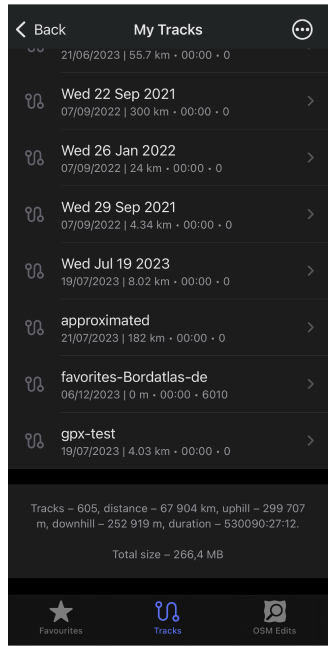
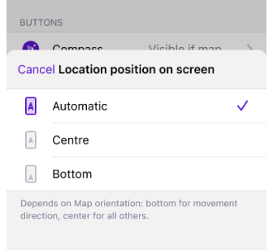

import Tabs from '@theme/Tabs';
import TabItem from '@theme/TabItem';
import AndroidStore from '@site/src/components/buttons/AndroidStore.mdx';
import AppleStore from '@site/src/components/buttons/AppleStore.mdx';
import LinksTelegram from '@site/src/components/_linksTelegram.mdx';
import LinksSocial from '@site/src/components/_linksSocialNetworks.mdx';
import Translate from '@site/src/components/Translate.js';
import InfoIncompleteArticle from '@site/src/components/_infoIncompleteArticle.mdx';
import ProFeature from '@site/src/components/buttons/ProFeature.mdx';

Hello OsmAnd users!  

We're thrilled to unveil version 4.9 for iOS, packed with features that take navigation to a new level. From an upgraded compass to intuitive brand name searches, this update enhances both usability and performance. Whether you’re exploring the city, navigating off-road, or simply checking your track statistics, this release ensures you have everything you need at your fingertips.

[🔄   **Update Now!**](https://itunes.apple.com/us/app/osmand-maps-travel-navigate/id934850257)

Download the update on the AppStore today and explore new quick actions, map improvements, and much more. Thank you for your continued trust in OsmAnd!

Happy exploring!

<!--truncate-->

## What's new

- [Updated Compass Behavior](#new-compass-behavior). Modified the interaction with the compass button. <!-- Now a single tap turns the map to the North, and a double tap switches the map orientation. -->
- [Search by Brand Name](#search-by-brand-names). Now you can search for POIs using popular brand names.
- [Redesigned Graphs Improved](#redesign-graphs). Improved appearance, preventing Y-axis label overlap with the graph. 
- [Folder statistics tracks](#total-track-statistics). The overall statistics are now displayed at the bottom of the list in each of the track folders.
- [Map mode follows app theme](#updates-for-map-mode-menu). Introduced a new map mode parameter that now corresponds to the app's light or dark theme settings.
- [Grouped tags with translations](#grouped-tags). All tag translations are now conveniently grouped in the context menu.
- [Location icon appearance](#profile-appearance-redesign). Improved the appearance of my location icon and added new visual elements to the settings.
- [Quick Action feature](#quick-action-update). Added the ability to change the *Location position on screen* with a new quick action.
- [CarPlay improvements](#carplay-improvements). Resolved issues with navigation widget updates. <!--Resolved issues with navigation widget updates after recalculations and adjusted arrow sizes in the turn widget.-->
- [Optional updates](#optional-updates). Additional updates and refinement for this release.

## New Compass Behavior

The compass button has been updated to provide more intuitive and user-friendly functionality. These improvements make the compass easier to use, help you navigate better, and optimize map orientation control during navigation.

[Compass button](https://osmand.net/docs/user/map/interact-with-map/#map-orientation-and-compass): 

- **Single tap**. Reorients the map *to the North* in all map orientation modes. If the map is in the *Compass direction* mode, it rotates for one moment and then returns to the dynamic orientation of this mode.
- **Double tap**. Switch between map orientation modes, such as following the GPS direction or rotating with the device. *Until this update, you could switch modes using Single tap*.
- **Long tap**. Opens a handy list with the names of all map orientation modes, allowing you to select the one you prefer.

## Search by Brand Names

We are pleased to introduce a new [brand search](https://osmand.net/docs/user/search/search-poi#how-to-use) feature in OsmAnd that will allow you to find your favorite places faster. You can now filter POIs by specific brands, making it faster to find what you are looking for.  

Whether you are interested to find your favorite coffee shop, hotel, or reliable supermarket, this update makes discovering nearby locations from your favorite brands easier. Enjoy a personalized and efficient search and optimize your travels with OsmAnd.

## Redesign Graphs

Elevation graphs have been redesigned to prevent overlapping labels.

## Total Track Statistics

The [overall statistics](https://osmand.net/docs/user/personal/tracks/manage-tracks#folder-statistics) are now displayed at the bottom of the list in each of the track folders.

## Updates for Map Mode Menu

Added the new [Map mode](https://osmand.net/docs/user/map/vector-maps#map-mode). The map is displayed in light or dark theme according to the mode selected from the list of suggested ones.

## Grouped Tags

POI's tag with any traslations have a single item on the [Context menu](https://osmand.net/docs/user/map/map-context-menu#details).

## Profile Appearance Redesign

The [appearance of profiles](https://osmand.net/docs/user/personal/profiles/#my-location-appearance) has been improved to make them more interesting, recognizable, and usable. 
<!-- 
The update includes:
- New icon and color selection components.
- Redesign of the location icon selection map.
- Default 3D icons.-->
- Added visual elements for the Resting and Navigation positions below the my location icon:

  - **View angle**. Displays a cone-shaped area that shows the direction you are currently facing.  
  Status: *Off*, &nbsp;*Resting position*, &nbsp;*Navigation position*, &nbsp;*Rest & navigation position*.  

  - **Location radius**. Shows a circular area around your icon, representing the accuracy of your current location.  
  Status: *Off*, &nbsp;*Resting position*, &nbsp;*Navigation position*, &nbsp;*Rest & navigation position*.  

##  Quick Action Updates

### Location position screen

Added the ability to create a Quick Action button to change the [Location position on screen](https://osmand.net/docs/user/widgets/quick-action#settings). The setting allows you to enable or disable the display of the previously selected My Location cursor position on the map.

_Menu → Configure screen → Custom buttons → + → Add button → Add action → Settings → Location position on screen_

### Switch between Terrain styles

In this release, we have added the ability to switch between terrain color palettes, similar to switching between layers. This can be done using the Quick Actions tool.

_Menu → Configure screen → Custom buttons → + → Add button → Add action → Configure map → Terrain color scheme_

## CarPlay improvements

<!--
Resolved an issue that caused the main navigation widget to not refresh after a route recalculation, and fixed the size of the arrows in the next turn widget. -->

- Switch [Navigation to first Car profile](https://github.com/osmandapp/OsmAnd-iOS/issues/3957) when connected to CarPlay,
- [Opening hours for POIs](https://github.com/osmandapp/OsmAnd-iOS/issues/3961),

## Downloading dialog

New Downloading dialog was added for Maps & Resources and Context menus, First start screen.

## Show along the route

## Optional Updates

- fixed bug with a [small arrow](https://github.com/osmandapp/OsmAnd-iOS/issues/3964) in Second next turn widget - CarPlay,
- fixed [wrong speedometer height](https://github.com/osmandapp/OsmAnd-iOS/issues/3958) - CarPlay,
- fixed bug with [visible track](https://github.com/osmandapp/OsmAnd-iOS/issues/3982) in My Places after removing,
- fixed bug with [copy coordinates](https://github.com/osmandapp/OsmAnd-iOS/issues/4045),
- renamed "Difficulty classification" > ["Hiking trails difficulty grade"](https://osmand.net/docs/user/map/routes#hiking-trails-difficulty-grade).

- Fixed a bug that caused POI category to be missing in the context menu. 
- Fixed a problem with [automatic language detection](https://github.com/osmandapp/OsmAnd-iOS/issues/3727) of voice prompts. 
- Fixed a crash in boat profile route parameters.

## Engage with OsmAnd: Share, Suggest, and Connect

If you have suggestions for improving the iOS version of the app, please get in touch with us. We appreciate and welcome your contribution to the further development of OsmAnd.

- **Follow**: <LinksSocial/>  

- **Join**: <LinksTelegram/>  

- **Get**: 

&nbsp;<AppleStore/>