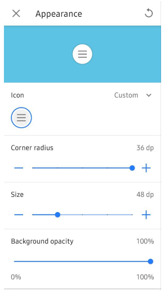

import Tabs from '@theme/Tabs';
import TabItem from '@theme/TabItem';
import AndroidStore from '@site/src/components/buttons/AndroidStore.mdx';
import LinksTelegram from '@site/src/components/_linksTelegram.mdx';
import LinksSocial from '@site/src/components/_linksSocialNetworks.mdx';
import Translate from '@site/src/components/Translate.js';
import InfoIncompleteArticle from '@site/src/components/_infoIncompleteArticle.mdx';
import ProFeature from '@site/src/components/buttons/ProFeature.mdx';
import InfoAndroidOnly from '@site/src/components/_infoAndroidOnly.mdx';

Great news for OsmAnd users!

We are thrilled to announce the release of OsmAnd version 4.9 for Android, packed with powerful updates to make your navigation even smoother. Now available on Google Play, this release includes new features like a customizable Main Navigation widget, full-screen Wikimedia image galleries, and a Vehicle Metrics plugin that lets you monitor your vehicle’s performance via OBD-II. We have also enhanced track management, introduced dirt bike trails, added more quick actions, and ensured a consistent system font across the interface.

Get the update today and explore the latest improvements to elevate your experience. Safe travels! 

[🔄   **Get the Update Today!**](https://play.google.com/store/apps/dev?id=8483587772816822023)  

<!--truncate-->

## What's new

- [Gallery viewer](#wikimedia-gallery-viewer). Full-screen view for Wikimedia images.
- [Vehicle Metrics plugin](#vehicle-metrics). Monitor vehicle performance via OBD-II protocol.
- [Track activities](#gpx-track-activities). Assign and filter tracks by activities.
- [Customizable map buttons](#customizable-map-buttons). Adjust appearance with a precise grid.
- [Widget Context menu](#widget-context-menu).
    - Includes a [Reset average speed](#reset-average-speed) action.
- [Quick Action updates](#lock-screen-feature-for-seamless-navigation). Added new quick action for *touchscreen lock*, *trip recording*, and control the *visibility of OSM Edits*.
- [Dirt Bike trails](#ride-like-a-pro-dirt-bike-trails-now-available). New route layer for off-road biking.
- [Surrounding areas info](#discover-nearby-areas-with-osmand-polygon-info). Displays information about areas around a selected point.
- [Hiking trails difficulty grade](#introducing-hiking-trail-grades). Renamed from *Difficulty classification*.
- [Custom graph display for GPX tracks](#custom-graph-display-for-gpx-tracks). Improved the track graph, allowing you to select any available data type for the graph on the Trip recording screen.
- [Route Guidance widgets](#new-route-guidance-widgets-beta) (Beta). Added a group of widgets to the top and bottom panels for real-time updates on upcoming turns and lane info.
- [Optional updates](#optional-updates). Additional updates and refinements for the release.

## Wikimedia Gallery Viewer

Introducing a full-screen gallery viewer for Wikimedia images in the [map context menu](https://osmand.net/docs/user/map/map-context-menu#online-photos). The image block has been redesigned for easier browsing, allowing you to view and swipe through all images associated with a location.  

A dedicated screen displays a list of all available images, making it easier to explore related media. Tapping on an image opens it in a full-screen mode for a detailed view of the place or POI.

## Vehicle Metrics

The new *Vehicle Metrics* plugin has been added to the [Plugins menu](https://osmand.net/docs/user/plugins/), enabling the monitoring of key vehicle performance data using the [OBD-II protocol](https://en.wikipedia.org/wiki/OBD-II_PIDs). This plugin offers real-time metrics, such as engine speed, fuel consumption, and coolant temperature, with dedicated widgets for easy access to this data.  

Whether you are tracking fuel efficiency or ensuring engine health, the *Vehicle Metrics* plugin brings valuable insights directly to your device.

 

## GPX Track Activities

A new feature allows you to assign **Activity** types (such as hiking or cycling) to your recorded GPX tracks, enhancing track management and organization. You can now easily [filter tracks](https://osmand.net/docs/user/personal/tracks/smart-folder#available-filters) by activity, making it more convenient to organize and analyze your trips. This enhancement streamlines your experience by making sorting and accessing specific activities in your track history far more efficient.

## Customizable Map Buttons

Enhance your map screen with fully customizable [Quick Action and Default buttons](https://osmand.net/docs/user/widgets/quick-action#quick-action-button-appearance), including changes to icon, size, corner radius, and background opacity. Through the new grid layout, you can position buttons precisely for easy access.  

Button appearance settings can be adjusted via *Menu → Configure screen → Custom buttons* or *Default buttons → three-dot menu → Appearance*. Additionally, you can now export and import your custom button configurations, ensuring seamless transitions between devices.

 

## Widget Context Menu

The [Widget Context menu](https://osmand.net/docs/user/widgets/configure-screen#panel-widgets-settings) allows you to manage and configure widgets directly from the map screen, providing *a quick way to organize panels*. You can access this menu by ***long tapping*** on any widget to customize the layout of widgets without leaving the map.

### Reset Average Speed

We have added a convenient [Reset average speed](https://osmand.net/docs/user/widgets/info-widgets#average-speed) action directly in the widget context menu. With just a long tap on the widget, you can instantly reset the average speed value during your trip.  

This feature makes it easier to track real-time performance on the go without navigating through multiple menus, giving you more control over your trip statistics with minimal effort.

  

## Lock Screen Feature for Seamless Navigation

We have added a *Touch screen lock* feature, similar to Garmin devices, allowing you to lock your screen while navigating, preventing accidental taps. This update also brings new quick actions for trip recording and managing the visibility of OSM edits, enhancing your navigation experience.

[New quick actions](https://osmand.net/docs/user/widgets/quick-action#action-types):

- ***Lock/Unlock screen***. This option can be accessed using the Custom buttons:  
*Menu → Configure screen → Custom buttons →* + *→ Add acton →* **Inteface**.  

- ***Trip recording actions***. Start, pause, or finish your trip seamlessly:  
*Menu → Configure screen → Custom buttons →* + *→ Add acton →* **My Places**.  

- ***Show/Hide OSM edits and add an OSM note*** with one tap:  
*Menu → Configure screen → Custom buttons →* + *→ Add acton →* **Configure Map** or **My Places**.

## Ride Like a Pro: Dirt Bike Trails Now Available

We are excited to introduced **Dirt bike trails** to improve your off-road adventures! Now you can activate colored overlays for dirt bike routes, based on the dirtbike, just like mountain biking routes.

- Find it in *Menu → Configure map → Routes → Dirt bike routes*.
- Learn more in our [documentation](https://osmand.net/docs/user/map/routes#dirt-bike-trails).

 

## Discover Nearby Areas with OsmAnd Polygon Info

These updates enhance **Polygon Information** by making data about surrounding areas accessible from the [map context menu](https://osmand.net/docs/user/map/map-context-menu#details) in OsmAnd.  

Now, after a long tap on the map or a single tap a POI, you can view detailed information on nearby polygons, including type and name, sorted by size from smallest to largest. This feature is helpful for quickly identifying geographic or administrative areas within your location.

*To access: Map context menu → Details → [Within](https://osmand.net/docs/user/map/map-context-menu#polygon-information)*.

<!--
## Interactive Access Points

When using OsmAnd, you can now interact with access-related icons such as *Barrier*, *Steps*, or *Gate* directly on the map. A simple tap on these icons will bring up detailed information, including the name of the POI, its type, and the address.  

This functionality enhances quick access to important navigation data for objects on your route, helping you understand restrictions or attributes of paths and roads at a glance. You can explore this via the [map context menu](https://osmand.net/docs/user/map/map-context-menu#overview).

By tapping on icons for *Barrier*, *Steps*, or *Gate*, the context menu reveals additional details, including the name (POI type) and address associated with these features, or displays object type, if a name is not available.

-->

## Introducing Hiking Trail Grades

We have renamed *Difficulty classification* to **Hiking Trails Difficulty Grade** for better clarity and ease of use.  

This feature highlights trail difficulty for mountain routes, using either the SAC or CAI scales, ensuring you are well-prepared for your adventure. Both systems help identify the necessary skills and equipment for safe travel.

Find the setting in *Configure map → Routes → [Hiking trails difficulty grade](https://osmand.net/docs/user/map/routes#hiking-trails-difficulty-grade): SAC or CAI*.

## Custom Graph Display for GPX Tracks

We have enhanced the [graph toggle](https://osmand.net/docs/user/plugins/trip-recording#overview-screen) for recorded tracks, allowing you to select specific data types, such as heart rate or other available options, and display them directly on the graph.  

This update lets you select any available data on the Trip recording screen, making it easier to view critical information during or after your trip, improving your overall analysis of recorded GPX data.

 

## New Route Guidance Widgets (Beta)

We are excited to introduce a new set of route guidance widgets to the [Top/Bottom widget panels](https://osmand.net/docs/user/widgets/configure-screen#top-and-bottom-panels) in OsmAnd's *Configure screen menu*. These widgets give you real-time navigation information, including the distance to the next turn, second next turn, lane guidance, road name, and current street name. Perfect for keeping track of your route at every step of your journey. The widgets are active during navigation, ensuring you never miss a turn!

*Find them in: Menu → Configure screen → Top panel / Bottom panel → Route guidance: Next turn, Second next turn, Lanes*

## Optional updates

- [System font applied](https://github.com/osmandapp/OsmAnd/issues/19123) integrates your device's system font throughout the app interface without additional configuration.
- Fixed [visibility setting](https://github.com/osmandapp/OsmAnd/issues/20488) for terrain slope and hillshade color palettes.
- [Auto-record track](https://github.com/osmandapp/OsmAnd/issues/19905) simplifies navigation by automatically recording your path.
- Improved [Favorite search](https://github.com/osmandapp/OsmAnd/issues/19242) allows you to quickly return to the list of search results.
- Resolved [Y-axis graph display issue](https://github.com/osmandapp/OsmAnd/issues/20076) for improved data clarity.
- Display [Wikipedia overlays](https://github.com/osmandapp/OsmAnd/issues/17944) as separate layer.
- Optimized [Samsung DeX screen sizes](https://github.com/osmandapp/OsmAnd-Issues/issues/2590) for seamless performance.
- Fixed missing [water transport routes](https://github.com/osmandapp/OsmAnd/issues/20251) when selecting stops.
- Correctly save [GPX track names](https://github.com/osmandapp/OsmAnd/issues/20211) for future reference.
- Fixed app crash issues when [deleting track from Smart folder](https://github.com/osmandapp/OsmAnd/issues/20661), and when trying [to apply a filter to a track](https://github.com/osmandapp/OsmAnd/issues/20794).
- Added active [Navigation mode updates](https://github.com/osmandapp/OsmAnd/issues/19168)with Continue navigation in Android Auto's main menu.
- [Remembere 2D/3D settings](https://github.com/osmandapp/OsmAnd/issues/20779) automatically in Android Auto.
- [Added tresholds](https://github.com/osmandapp/OsmAnd/issues/20494#issuecomment-2326033245) for free rotation mode.
- Fixed [keyboard input issue](https://github.com/osmandapp/OsmAnd/issues/20636) affecting [external devices](https://osmand.net/docs/user/map/interact-with-map#external-input-devices).
- Updated [Sun position widget](https://github.com/osmandapp/OsmAnd/issues/20447)to hide the next day's sunrise.
- Resolved [performance slowdowns](https://github.com/osmandapp/OsmAnd/issues/20889) when trying to display a track and colorize it by speed and height.
- Corrected issue where [*None* setting](https://github.com/osmandapp/OsmAnd/issues/20503) for *Analyze by intervals* failed to work.
- Fixed [export list freezes](https://github.com/osmandapp/OsmAnd/issues/20900) to prevent app lag.
- [3D track issue](https://github.com/osmandapp/OsmAnd/issues/20810) now work correctly with path visualization.
- Corrected [RTL coordinate flipping](https://github.com/osmandapp/OsmAnd/issues/20595) for right-to-left language displays.
- Restored [missed sensor data](https://github.com/osmandapp/OsmAnd/issues/17937) for ongoing track recordings.
- [Temperature data](https://github.com/osmandapp/OsmAnd/issues/20829) now visible in the *Analyze on map* graph.
- Added zoom functionality for [route points](https://github.com/osmandapp/OsmAnd/issues/20722) in Plan a Route.

## Engage with OsmAnd: Share, Suggest, and Connect

If you have suggestions for improving the Android version of the app, please get in touch with us. We appreciate and welcome your contribution to the further development of OsmAnd.

- **Follow**: <LinksSocial/>  

- **Join**: <LinksTelegram/>  

- **Get**: &nbsp;<AndroidStore/>