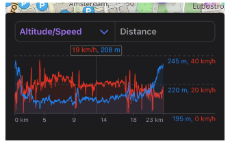

import Tabs from '@theme/Tabs';
import TabItem from '@theme/TabItem';
import AndroidStore from '@site/src/components/buttons/AndroidStore.mdx';
import AppleStore from '@site/src/components/buttons/AppleStore.mdx';
import LinksTelegram from '@site/src/components/_linksTelegram.mdx';
import LinksSocial from '@site/src/components/_linksSocialNetworks.mdx';
import Translate from '@site/src/components/Translate.js';
import InfoIncompleteArticle from '@site/src/components/_infoIncompleteArticle.mdx';
import ProFeature from '@site/src/components/buttons/ProFeature.mdx';

Hello OsmAnd users!  

We're thrilled to unveil version 4.9 for iOS, packed with features that take navigation to a new level. From an upgraded compass to intuitive brand name searches, this update enhances both usability and performance. Whether you’re exploring the city, navigating off-road, or simply checking your track statistics, this release ensures you have everything you need at your fingertips.

[🔄   **Update Now!**](https://itunes.apple.com/us/app/osmand-maps-travel-navigate/id934850257)

Download the update on the AppStore today and explore new quick actions, map improvements, and much more. Thank you for your continued trust in OsmAnd!

Happy exploring!

<!--truncate-->

## What's new

- [Updated Compass Behavior](#new-compass-behavior). Modified the interaction with the compass button. <!-- Now a single tap turns the map to the North, and a double tap switches the map orientation. -->
  - [Locked Map Rotation](#locked-map-rotation) for "North is up" compass position.
- [Search by Brand Name](#search-by-brand-names). Now you can search for POIs using popular brand names.
- [Widget Context menu](#widget-context-menu) for widgets,
- [Redesigned Graphs Improved](#redesign-graphs). Improved appearance, preventing Y-axis label overlap with the graph.
- [Track menu updates](#track-menu-updates)
  - [Folder statistics tracks](#total-tracks-statistics). The overall statistics are now displayed at the bottom of the list in each of the track folders.
  - [Track filters](#tracks-filters-for-search) for quick search.
  - [Sort subfolders](#sort-subfolders) allows to sort all folders and tracks in the present folder.
- [Map mode follows app theme](#updates-for-map-mode-menu). Introduced a new map mode parameter that now corresponds to the app's light or dark theme settings.
- [Grouped tags with translations](#grouped-tags). All tag translations are now conveniently grouped in the context menu.
- [Polygon information](#nearby-areas) is available on the Map Context menu by a long tap on the map or a single tap a POI.
- [Location icon appearance](#profile-appearance-redesign). Improved the appearance of my location icon and added new visual elements to the settings.
- [Quick Action feature](#quick-action-updates). Added the ability to change the *Location position on screen* with a new quick action.
- [CarPlay improvements](#carplay-improvements). Resolved issues with navigation widget updates. <!--Resolved issues with navigation widget updates after recalculations and adjusted arrow sizes in the turn widget.-->
- [Downloading maps dialog](#downloading-dialog) was updated.
- [Shlow along the route](#show-along-the-route) option for Navigation.
- [Optional updates](#optional-updates). Additional updates and refinement for this release.

## New Compass Behavior

The compass button has been updated to provide more intuitive and user-friendly functionality. These improvements make the compass easier to use, help you navigate better, and optimize map orientation control during navigation.

[Compass button](https://osmand.net/docs/user/map/interact-with-map/#map-orientation-and-compass): 

- **Single tap**. Reorients the map *to the North* in all map orientation modes. If the map is in the *Compass direction* mode, it rotates for one moment and then returns to the dynamic orientation of this mode.
- **Double tap**. Switch between map orientation modes, such as following the GPS direction or rotating with the device. *Until this update, you could switch modes using Single tap*.
- **Long tap**. Opens a handy list with the names of all map orientation modes, allowing you to select the one you prefer.

### Locked Map Rotation

We had an [extensive discussion](https://github.com/osmandapp/OsmAnd/issues/17561#issuecomment-1623105410) with our users regarding fixing the map's rotation to always point North when using the compass.

As a result, map rotation is now fixed with North at the top when the compass button is set to the [**North is up**](https://osmand.net/docs/user/widgets/map-buttons#map-orientation-modes) position. In this mode, users can zoom in and out on the map, but rotation is disabled.

## Search by Brand Names

We're excited to introduce a new [brand search](https://osmand.net/docs/user/search/search-poi#how-to-use) feature in OsmAnd, designed to help you find your favorite places more quickly. With this update, you can filter POIs by specific brands, streamlining your search experience.

Whether you're looking for a favorite coffee shop, hotel, or a trusted supermarket, this feature makes discovering nearby locations from your preferred brands effortless. Enjoy a more personalized and efficient search experience to optimize your travels with OsmAnd.

## Widget Context menu

The [Widget Context](https://osmand.net/docs/user/widgets/configure-screen/#panel-widgets-settings) menu enables you to manage and configure widgets directly from the map screen, offering a quick and convenient way to organize panels. Simply **_long-press_** any widget to access this menu and customize your widget layout without leaving the map view.

## Redesign Graphs

Elevation graphs have been redesigned to improve readability: Y-axis labels are now positioned to prevent overlapping with the graph. 

## Track Menu Updates

### Total Tracks Statistics

The [overall tracks statistics](https://osmand.net/docs/user/personal/tracks/manage-tracks#folder-statistics) are now conveniently displayed in the folder footer. These include: `Tracks – 4, distance – 246.6 km, uphill – 325 m, downhill – 456 m, duration – 08:50:35, Total size – 14 MB.`

### Tracks Filters for Search

Added [the filtering in the Tracks tab](https://osmand.net/docs/user/personal/tracks/smart-folder/#search-filter), which is done by searching by several criteria, such as duration, length. 

### Sort Subfolders 

Added [filtering in the Tracks tab](https://osmand.net/docs/user/personal/tracks/manage-tracks#folder-actions), allowing users to search tracks based on various criteria, such as duration and length.

 

## Updates for Map Mode Menu

Introduced a new [Map mode](https://osmand.net/docs/user/map/vector-maps#map-mode), allowing the map to automatically switch between light and dark themes based on the selected mode from the available options.

## Grouped Tags

Consolidated all POI tags with translations into a single item in the [Context menu](https://osmand.net/docs/user/map/map-context-menu#details) including  `name`, `alt name`, `old name`. 

## Nearby Areas

These updates enhance **Polygon Information**, making data about surrounding areas easily accessible from the [Map Context menu](https://osmand.net/docs/user/map/map-context-menu/#details) in OsmAnd.

With a _long tap_ on the map or a _single tap_ on a POI, you can now view detailed information about nearby polygons, including their type and name, sorted by size from smallest to largest. This feature is particularly useful for quickly identifying geographic or administrative areas near your location.

_Map context menu → Details → Within_

## Profile Appearance Redesign

The [appearance of profiles](https://osmand.net/docs/user/personal/profiles/#my-location-appearance) has been improved to make them more interesting, recognizable, and usable. 

The update includes:
- New icon and color selection components.
- Redesign of the location icon selection map.
- Default 3D icons,
- Added visual elements for the Resting and Navigation positions below the my location icon:
  - **View angle**. Displays a cone-shaped area that shows the direction you are currently facing.  
  Status: *Off*, &nbsp;*Resting position*, &nbsp;*Navigation position*, &nbsp;*Rest & navigation position*.  
  - **Location radius**. Shows a circular area around your icon, representing the accuracy of your current location.  
  Status: *Off*, &nbsp;*Resting position*, &nbsp;*Navigation position*, &nbsp;*Rest & navigation position*.  

##  Quick Action Updates

### Location position screen

Added the option to create a Quick Action button for changing the [Location position on screen](https://osmand.net/docs/user/widgets/quick-action#settings). This setting lets you enable or disable the display of the previously selected My Location cursor position on the map.

_Menu → Configure screen → Custom buttons → + → Add button → Add action → Settings → Location position on screen_

### Switch between Terrain styles

In this release, we have added the ability to switch between terrain color palettes, similar to switching between layers. This can be done using the Quick Actions tool.

_Menu → Configure screen → Custom buttons → + → Add button → Add action → Configure map → Terrain color scheme_

### Touch Screen Lock

This release introduces the ability to switch between terrain color palettes, similar to toggling layers. You can easily make these changes using the Quick Actions tool.

This option can be accessed using the Custom buttons:
_Menu → Configure screen → Custom buttons → + → Add acton → Inteface → Lock screen_

## CarPlay improvements

<!--
Resolved an issue that caused the main navigation widget to not refresh after a route recalculation, and fixed the size of the arrows in the next turn widget. -->

- Switched [Navigation to first Car profile](https://github.com/osmandapp/OsmAnd-iOS/issues/3957) when connected to CarPlay,
- Fixed an issue with [opening hours for POIs](https://github.com/osmandapp/OsmAnd-iOS/issues/3961),
- Resolved a bug where [the main navigation widget didn't update](https://github.com/osmandapp/OsmAnd-iOS/issues/3963) after route recalculations,
- Moved "Animate own position" setting from Navigation settings to [General settings](https://osmand.net/docs/user/personal/profiles#other),
- Fixed bug with a [small arrow](https://github.com/osmandapp/OsmAnd-iOS/issues/3964) in Second next turn widget,
- Corrected the [wrong speedometer height](https://github.com/osmandapp/OsmAnd-iOS/issues/3958).

## Downloading dialog

A new downloading dialog has been introduced for _Maps & Resources_, _Context menus_, and the _First start screen_, enhancing usability and providing a more streamlined experience.

## Show Along the Route

The [_"Show along the route"_](https://osmand.net/docs/user/navigation/guidance/map-during-navigation#view-and-select-points) option has been added as a separate item in the _Settings menu_ of Navigation, improving accessibility and customization:

_Menu → Navigation → Settings → Show along the route_

## More

- Renamed "Difficulty classification" to ["Hiking trails difficulty grade"](https://osmand.net/docs/user/map/routes#hiking-trails-difficulty-grade).
- Added [dark icon](https://github.com/osmandapp/OsmAnd-iOS/issues/3893) for iOS 18,
- Consolidated [Hazmat parameters](https://github.com/osmandapp/OsmAnd-iOS/issues/3992) into a single list,
- Added [Dirt bike trails](https://osmand.net/docs/user/map/routes#dirt-bike-trails) in Configure map,
- Introduced [Map Scale mode](https://github.com/osmandapp/OsmAnd-iOS/issues/3967) for [Zoom level](https://osmand.net/docs/user/plugins/development#zoom-level) widget,
- Fixed a bug with [visible track](https://github.com/osmandapp/OsmAnd-iOS/issues/3982) in My Places after being removed,
- Resolved a bug with a [a missing track name](https://github.com/osmandapp/OsmAnd-iOS/issues/4123) for routes,
- Fixed a bug with [copying coordinates](https://github.com/osmandapp/OsmAnd-iOS/issues/4045),
- Fixed a problem with [automatic language detection](https://github.com/osmandapp/OsmAnd-iOS/issues/3727) for voice prompts. 
- Addressed a bug with the [location marker of GPX track](https://github.com/osmandapp/OsmAnd-iOS/issues/4033) using Analyze on map,
- Fixed  an issue [with not saving widget size](https://github.com/osmandapp/OsmAnd-iOS/issues/4137),
- Resolved a bug with a [white position icon](https://github.com/osmandapp/OsmAnd-iOS/issues/3927),
- Corrected [attributes for Sun Position](https://github.com/osmandapp/OsmAnd-iOS/issues/4105) widget,
- Fixed a crash in the [in boat profile](https://github.com/osmandapp/OsmAnd-iOS/issues/3972) route parameters,
- Addressed an issue with [incorrect uphill calculations](https://github.com/osmandapp/OsmAnd-iOS/issues/3865),
- Resolved a bug causing the POI category to be missing in the context menu. 

______________________

If you have suggestions for improving the iOS version of the app, please get in touch with us. We appreciate and welcome your contribution to the further development of OsmAnd.

- **Follow**: <LinksSocial/>  

- **Join**: <LinksTelegram/>  

- **Get**: 

&nbsp;<AppleStore/>