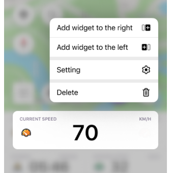

import Tabs from '@theme/Tabs';
import TabItem from '@theme/TabItem';
import AndroidStore from '@site/src/components/buttons/AndroidStore.mdx';
import AppleStore from '@site/src/components/buttons/AppleStore.mdx';
import LinksTelegram from '@site/src/components/_linksTelegram.mdx';
import LinksSocial from '@site/src/components/_linksSocialNetworks.mdx';
import Translate from '@site/src/components/Translate.js';
import InfoIncompleteArticle from '@site/src/components/_infoIncompleteArticle.mdx';
import ProFeature from '@site/src/components/buttons/ProFeature.mdx';

**Hello OsmAnd Users!**  

We are excited to introduce OsmAnd version 4.9 for iOS — a major update designed to elevate your navigation experience. Whether you're navigating urban streets, heading off the beaten path, or analyzing your trip statistics, this release has something for everyone.  

Key highlights include enhanced compass functionality, a streamlined search experience, and improved visuals for tracks and widgets. We've focused on making the app more intuitive and visually appealing, helping you explore with confidence and ease.  

[🔄   **Update Now!**](https://itunes.apple.com/us/app/osmand-maps-travel-navigate/id934850257)  

Upgrade your app today to explore new quick actions, refined map features, and much more. As always, thank you for choosing OsmAnd as your trusted navigation companion.  

Happy exploring!  

<!--truncate-->

## What's new

- [Updated Compass Behavior](#new-compass-behavior). Modified the interaction with the compass button for easier map orientation.
  - [Locked Map Rotation](#locked-map-rotation). Keep *North is up* consistently locked in place.
- [Search by Brand Name](#search-by-brand-names). Locate POIs quickly and intuitively by popular brand names.
- [Widget Context menu](#widget-context-menu). Customizable widget options for greater flexibility.
- [Revamped Graphs](#redesigned-graphs). Enhanced graph visuals prevent overlapping Y-axis labels, ensuring a cleaner display.
- [Track Menu Updates](#track-menu-updates): 
  - [Folder Statistics Tracks](#total-tracks-statistics). View summary statistics for all tracks within a folder.  
  - [Track Filters](#tracks-filters-for-search). Quickly find tracks with new search options.
  - [Sort Subfolders](#sort-subfolders). Organize folders and tracks efficiently.
- [Map Mode Theme Updates](#updates-for-map-mode-menu). Map appearance now matches the app's light or dark theme automatically.
- [Grouped Tags with Translations](#grouped-tags). Easily access translations of tags grouped in the context menu.  
- [Polygon Information Access](#nearby-areas). Access polygon details directly from the map context menu with a long tap or single POI tap.
- [Location Icon Improvements](#profile-appearance-redesign). Redesigned *My Location* icon with enhanced settings.
- [Quick Action Feature](#quick-action-updates). Adjust your *Location position on screen* with a new quick action.
- [CarPlay Updates](#carplay-improvements). Resolved issues with navigation widget updates and refined visuals for turn indicators.
- [Updated Map Download Dialog](#downloading-dialog). A more user-friendly download interface.
- [Show Along the Route](#show-along-the-route). Discover options for displaying information relevant to your route.
- [Optional Updates](#optional-updates). Additional updates and refinement for this release.

## New Compass Behavior

The compass button has been updated to provide more intuitive and user-friendly functionality. These improvements make the compass easier to use, help you navigate better, and optimize map orientation control during navigation.

[Compass button](https://osmand.net/docs/user/map/interact-with-map/#map-orientation-and-compass): 

- **Single tap**. Reorients the map *to the North* regardless of the current orientation mode. In *Compass direction* mode, the map briefly aligns to the North before returning to the dynamic orientation.
- **Double tap**. Cycles through orientation modes, such as GPS direction or device rotation. This function replaces the previous *Single tap* behavior for switching modes.
- **Long tap**. Opens a menu with all map orientation modes, letting you choose your preferred setting.

### Locked Map Rotation

A much-requested feature, [locked map rotation](https://github.com/osmandapp/OsmAnd/issues/17561#issuecomment-1623105410), now ensures the map remains consistently oriented with North at the top when the compass is set to the [**North is up**](https://osmand.net/docs/user/widgets/map-buttons#map-orientation-modes) mode.

In this configuration, map rotation is disabled, but you can still zoom in and out freely. This enhancement is perfect if you prefer a stable reference point while navigating.

## Search by Brand Names

We're excited to introduce a new [brand search](https://osmand.net/docs/user/search/search-poi#how-to-use) feature in OsmAnd, designed to help you find specific places by allowing searches for POIs using brand names.

Whether you're looking for a favorite coffee shop, hotel, or a trusted supermarket, this addition makes locating more efficient. Instead of typing generic categories, you can search directly for brands, personalizing your search results to better fit your needs. This feature not only saves time but also enhances the overall navigation experience.

## Widget Context Menu

The [widget context menu](https://osmand.net/docs/user/widgets/configure-screen/#panel-widgets-settings) empowers you to manage and customize widgets directly from the map screen.  

With a ***long tap*** on any widget, you can access its context menu to adjust settings or reconfigure layouts without navigating away from the map. This streamlined approach keeps your focus on navigation while providing the flexibility to personalize the map screen on the go.

## Redesigned Graphs

Elevation graphs have been redesigned to improve clarity. One significant enhancement is the repositioning of Y-axis labels to eliminate overlap with the graph lines, ensuring all data remains readable at a glance.  

This visual update makes it easier to analyze elevation changes and other graph-based information while planning routes or reviewing tracks. 

## Track Menu Updates

The latest OsmAnd version introduces exciting updates to the Track Menu, making it easier to organize, search, and review your tracks efficiently.

### Total Tracks Statistics

You can now view comprehensive [tracks statistics](https://osmand.net/docs/user/personal/tracks/manage-tracks#folder-statistics) right at the bottom of each folder. These details include:

- Number of tracks
- Total distance
- Uphill and downhill elevation
- Duration
- Overall folder size

For example:  
`Tracks – 4, distance – 246.6 km, uphill – 325 m, downhill – 456 m, duration – 08:50:35, Total size – 14 MB.`  

This feature simplifies keeping track of your activities at a glance!

### Tracks Filters for Search

Finding specific tracks is more convenient than ever with the new [track filters](https://osmand.net/docs/user/personal/tracks/smart-folder/#search-filter). You can filter results based on criteria like duration and length, ensuring you locate the exact track you need.

### Sort Subfolders

 

Improved sorting functionality in the [Tracks tab](https://osmand.net/docs/user/personal/tracks/manage-tracks#folder-actions), now enables you to organize subfolders systematically. Sorting options make it effortless to navigate your tracks, whether grouped by activity, location, or other preferences.

## Updates for Map Mode Menu

The *map mode menu* now includes an [auto-theme switch](https://osmand.net/docs/user/map/vector-maps#map-mode) that adapts to your app’s light or dark mode settings. This ensures that your map view matches the app’s overall theme seamlessly, improving visual consistency and reducing eye strain during night or daytime navigation.

## Grouped Tags

To streamline the [Context menu](https://osmand.net/docs/user/map/map-context-menu#details), all POI tags and translations are now consolidated under a single item. This grouping includes fields such as:

- `name`
- `alt name`
- `old name`

This makes it easier to find relevant information about points of interest without unnecessary clutter.

## Nearby Areas

*Map context menu → Details → Within*

OsmAnd has enhanced **Polygon Information**, making geographic data even more accessible. From the [Map Context menu](https://osmand.net/docs/user/map/map-context-menu/#details), you can view nearby polygons with detailed attributes.  

*How it works:*

- *Long tap* on the map
- *Single tap* on a POI

You’ll see information like polygon type, name, and a size-based sorting from smallest to largest. Whether exploring administrative boundaries or geographic features, this feature ensures you get all the essential details at a glance.

## Profile Appearance Redesign

The [profile appearance](https://osmand.net/docs/user/personal/profiles/#my-location-appearance) has been redesigned for better usability and visual appeal.

*Ket updates*:

- *Customization tools*. New icon and color selection options for profiles.
- *Map redesign*. Improved interface for selecting location icons on the map.
- *Default 3D icons*. Modernized design elements for a fresh look. 
- *Additional visual elements* for the Resting and Navigation positions below the my location icon:
  - **View angle**. Displays a cone-shaped area that shows the direction you are currently facing.  
  Status: *Off*, &nbsp;*Resting position*, &nbsp;*Navigation position*, &nbsp;*Rest & navigation position*.

  - **Location radius**. Shows a circular area around your icon, representing the accuracy of your current location.  
  Status: *Off*, &nbsp;*Resting position*, &nbsp;*Navigation position*, &nbsp;*Rest & navigation position*.  

##  Quick Action Updates

### Location Position on Screen

*Menu → Configure screen → Custom buttons → + → Add button → Add action → Settings → Location position on screen*

A new Quick Action button allows changing the [Location position on screen](https://osmand.net/docs/user/widgets/quick-action#settings). You can enable or disable the display of the previously selected *My Location* cursor position on the map.

### Switch Between Terrain Styles

In this release, we have added the ability to switch between terrain color palettes, similar to switching between layers. This can be done using the Quick Actions tool.  

How to set it up:  
*Menu → Configure screen → Custom buttons → + → Add button → Add action → Configure map → Terrain color scheme*

### Touch Screen Lock

*Menu → Configure screen → Custom buttons → + → Add acton → Inteface → Lock screen*

Added a [Touch Screen Lock](https://osmand.net/docs/user/map/interact-with-map#touch-screen-lock) option in the Quick Actions menu for locking and unlocking the map interface with ease.

## CarPlay Improvements

This release brings several CarPlay enhancements:

- Automatic navigation switch to [the first Car profile](https://github.com/osmandapp/OsmAnd-iOS/issues/3957) upon CarPlay connection.
- Resolved issues with [POI opening hours](https://github.com/osmandapp/OsmAnd-iOS/issues/3961).
- Fixed bugs with:
  - [Navigation widget refresh](https://github.com/osmandapp/OsmAnd-iOS/issues/3963) after route recalculations.
  - [Second next turn widget](https://github.com/osmandapp/OsmAnd-iOS/issues/3964) arrow size.
  - [Speedometer height](https://github.com/osmandapp/OsmAnd-iOS/issues/3958).
- **Animate own position** moved from *Navigation settings* to [General settings](https://osmand.net/docs/user/personal/profiles#other) for better accessibility.

## Downloading dialog

The newly introduced downloading dialog for *Maps & Resources*, *Context menus*, and the *First start screen* improves user experience by streamlining these interactions.

## Show Along the Route

The [Show along the route](https://osmand.net/docs/user/navigation/guidance/map-during-navigation#view-and-select-points) option is now a dedicated item in the Navigation Settings Menu for easier customization.  

How to access:  
*Menu → Navigation → Settings → Show along the route*

## Optional Updates

This release includes several additional improvements and fixes:

- Renamed *Difficulty classification* to [*Hiking trails difficulty grade*](https://osmand.net/docs/user/map/routes#hiking-trails-difficulty-grade).
- Added a [dark icon](https://github.com/osmandapp/OsmAnd-iOS/issues/3893) for iOS 18.
- Consolidated [Hazmat parameters](https://github.com/osmandapp/OsmAnd-iOS/issues/3992) into a single list.
- Added support for [Dirt bike trails](https://osmand.net/docs/user/map/routes#dirt-bike-trails) in Configure map.
- Introduced a [Map Scale mode](https://github.com/osmandapp/OsmAnd-iOS/issues/3967) for [Zoom level](https://osmand.net/docs/user/plugins/development#zoom-level) widget.
- Fixed bugs and improved stability:
  - Resolved a bug with [visible tracks](https://github.com/osmandapp/OsmAnd-iOS/issues/3982) being removed in *My Places*.
  - Addressed an issue with [missing track name](https://github.com/osmandapp/OsmAnd-iOS/issues/4123) for routes.
  - Fixed a bug related to [copying coordinates](https://github.com/osmandapp/OsmAnd-iOS/issues/4045).
  - Corrected [automatic language detection](https://github.com/osmandapp/OsmAnd-iOS/issues/3727) for voice prompts. 
  - Fixed an issue with the [location marker](https://github.com/osmandapp/OsmAnd-iOS/issues/4033) of GPX tracks using Analyze on map.
  - Resolved a bug with not [saving widget size](https://github.com/osmandapp/OsmAnd-iOS/issues/4137).
  - Fixed a problem with the [white position icon](https://github.com/osmandapp/OsmAnd-iOS/issues/3927).
  - Corrected [attributes for the Sun Position widget](https://github.com/osmandapp/OsmAnd-iOS/issues/4105).
  - Fixed a crash in the [boat profile route parameters](https://github.com/osmandapp/OsmAnd-iOS/issues/3972).
  - Addressed an issue with [incorrect uphill calculations](https://github.com/osmandapp/OsmAnd-iOS/issues/3865).
  - Resolved a bug causing the POI category to be missing in the context menu. 

______________________

If you have suggestions for improving the iOS version of the app, please get in touch with us. We appreciate and welcome your contribution to the further development of OsmAnd.

- **Follow**: <LinksSocial/>  

- **Join**: <LinksTelegram/>  

- **Get**: 

&nbsp;<AppleStore/>
