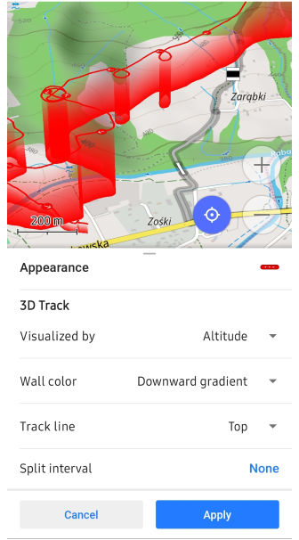

import Tabs from '@theme/Tabs';
import TabItem from '@theme/TabItem';
import AndroidStore from '@site/src/components/buttons/AndroidStore.mdx';
import AppleStore from '@site/src/components/buttons/AppleStore.mdx';
import LinksTelegram from '@site/src/components/_linksTelegram.mdx';
import LinksSocial from '@site/src/components/_linksSocialNetworks.mdx';
import Translate from '@site/src/components/Translate.js';
import InfoIncompleteArticle from '@site/src/components/_infoIncompleteArticle.mdx';
import ProFeature from '@site/src/components/buttons/ProFeature.mdx';
import InfoAndroidOnly from '@site/src/components/_infoAndroidOnly.mdx';

As we step into 2025, we’re excited to share our goals for the upcoming year. Building on the progress made in 2024, we are committed to improving OsmAnd and delivering new features that enhance your navigation experience.  

<!--truncate-->

## **2025 New Year Resolutions**  

### **1. Navigation & Routing Enhancements**  
- Improve routing accuracy with better real-time traffic data.  
- Introduce smarter route planning based on AI-powered suggestions.  
- Enhance multi-stop navigation and route optimization for longer trips.  

### **2. Offline Capabilities Expansion**  
- Refine offline search and improve POI management.  
- Expand offline map data coverage and streamline updates.  
- Enable seamless offline-device synchronization.  

### **3. User Experience & Interface Upgrades**  
- Redesign the app interface for more intuitive navigation.  
- Offer customizable dashboards and widgets for real-time trip monitoring.  
- Optimize accessibility features for a more inclusive user experience.  

### **4. Community & Open-Source Development**  
- Strengthen collaboration with developers and contributors.  
- Introduce new tools for easier code contributions and localization.  
- Host community events and development workshops.  

### **5. Eco-Friendly Navigation**  
- Expand eco-routing features to include carbon tracking.  
- Promote sustainable travel options through smarter route suggestions.  

### **6. Platform-Specific Goals**  

**iOS**:  
- Improve iOS-specific features like widget updates and CarPlay integration.  

**Android**:  
- Introduce advanced navigation settings and route customization options.  

**Web**:  
- Expand OsmAnd Web with new online route planning and collaborative tools.  

---

## **2024 Achievements**  

Let’s take a look at what was in the original 2024 resolutions list which nearly doesn’t cover all features implemented in 2024 by major releases * [4.7](https://osmand.net/blog/osmand-ios-4-7-released), [4.8](https://osmand.net/blog/osmand-ios-4-8-released), [4.9](https://osmand.net/blog/osmand-ios-4-9-released) **(iOS)**; [4.7](https://osmand.net/blog/osmand-android-4-7-released), [4.8](https://osmand.net/blog/osmand-android-4-8-released), [4.9](https://osmand.net/blog/osmand-android-4-9-released) **(Android)**, [1.01](https://osmand.net/blog/osmand-web-1-01-released/) Map **Web**. 

[Resolutions 2024](https://osmand.net/blog/ny-resolutions-2024):

* ✔️ Quick action & Widgets: Add & configure custom buttons (Android/iOS) and defaul buttons (Android), map quick actions to external keyboards (Android).
* ✔️ New Maps: menu redesign (Android/iOS), weather antimation (Android/iOS), the USA Government maps plugin (Android/iOS), Dirt bike trails (Android/iOS)
* ✔️ Routing & Navigation: fast routing (Android/iOS), large navigation widget beta (Android), speedometer widget (Androir/iOS), autozoom/ auto-tilt (Android/iOS).
* ✔️ Photos: explore wikimedia images (Web), wikimedia gallery viewer (Web/Android)
* ✔️ More: docs updates, app performance 

### **iOS**  

OsmAnd iOS got 3 major releases with more than <a href="https://github.com/osmandapp/OsmAnd-iOS/milestones?state=closed">200 public features and issues</a> closed on Github.

#### [4.7](https://osmand.net/blog/osmand-ios-4-7-released) * April 19, 2024

| Glide ratio widgets | 3D track visualization   |
|-----|------|
| | |

- [Redesign the Tracks menu](https://osmand.net/blog/osmand-ios-4-7-released#redesign-tracks-menu)
- [Added 3D visualization for tracks](https://osmand.net/blog/osmand-ios-4-7-released#3d-visualization)
- [External sensors data on tracks for analyzing on the map](https://osmand.net/blog/osmand-ios-4-7-released#external-sensors-data-for-analize-on-map)
- [New the Sun position widget](https://osmand.net/blog/osmand-ios-4-7-released#sun-position-widget)
- [Introduced Glide ratio widgets](https://osmand.net/blog/osmand-ios-4-7-released#glide-ratio-widget)
- [Round up numbers for distance information in navigation widgets](https://osmand.net/blog/osmand-ios-4-7-released#round-up-numbers-in-navigation-widgets)
- [OsmAnd Cloud updates: restoring from Trash, ability to delete account](https://osmand.net/blog/osmand-ios-4-7-released#osmand-cloud-updates)
- [App language for Basemap](https://osmand.net/blog/osmand-ios-4-7-released#app-language-for-basemap)

#### [4.8](https://osmand.net/blog/osmand-ios-4-8-released) * August 22, 2024

| Weather animation | Smooth Transitions  |
|-----|------|
| | |

- [New Speedometer widget](https://osmand.net/blog/osmand-ios-4-8-released#speedometer-widget)
- [Turn-by-turn instructions to the route details](https://osmand.net/blog/osmand-ios-4-8-released#turn-by-turn-instructions)
- [Added road side indicator information](https://osmand.net/blog/osmand-ios-4-8-released#roadside-indicator)
- [Updated Quick Actions tool](https://osmand.net/blog/osmand-ios-4-8-released#quick-actions-tool-update)
- [Custom buttons](https://osmand.net/blog/osmand-ios-4-8-released#custom-buttons)
- [3D My Location Icons](https://osmand.net/blog/osmand-ios-4-8-released#3d-my-location-icons)
- [Color palette for Terrain](https://osmand.net/blog/osmand-ios-4-8-released#color-palettes)
- [Weather animations and new design](https://osmand.net/blog/osmand-ios-4-8-released#weather-tool-improvements)
- [Smooth transitions when zooming in 3D mode](https://osmand.net/blog/osmand-ios-4-8-released#smooth-transitions)

#### [4.9](https://osmand.net/blog/osmand-ios-4-9-released) * December 23, 2024

| Touch screen lock button | Widget Context menu  |
|-----|------|
| | |

- [New Compass button behavior](https://osmand.net/blog/osmand-ios-4-9-released#new-compass-behavior)
- [Search by Brand Names](https://osmand.net/blog/osmand-ios-4-9-released#search-by-brand-names)
- [Widget Context menu](https://osmand.net/blog/osmand-ios-4-9-released#widget-context-menu)
- [Redesigned Graphs](https://osmand.net/blog/osmand-ios-4-9-released#redesigned-graphs)
- [Track Menu Updates](https://osmand.net/blog/osmand-ios-4-9-released#track-menu-updates): 
- [Map Mode Theme Updates](https://osmand.net/blog/osmand-ios-4-9-released#updates-for-map-mode-menu)
- [Profile Appearance Redesign](https://osmand.net/blog/osmand-ios-4-9-released#profile-appearance-redesign)
- [Touch Screen Lock button and any Quick actions updates](#quick-action-updates)
- [Show Along the Route](https://osmand.net/blog/osmand-ios-4-9-released#show-along-the-route)

### **Android**  
 
OsmAnd Android got 3 major releases with more than <a href="https://github.com/osmandapp/Osmand/milestones?state=closed">800 public features and issues</a> closed on Github.

#### [4.7](https://osmand.net/blog/osmand-android-4-7-released) * April 16, 2024

| Speedometer | 3D track visualization  |
|-----|------|
| | |

- [Fast offline routing](#enhanced-offline-navigation)
- [Navigation settings for Developers](#navigation-settings-for-developers)
- [Speedometer](#speedometer)
- [Round up numbers in navigation widgets](#round-up-numbers)
- [Custom Quick Action Buttons](#custom-buttons)
- [Vertical exaggeration for Terrain](#vertical-exaggeration)
- [3D tracks visualization](#3d-track-visualization)
- [Redesign graphs of tracks and route](#redesign-graphs)
- [Tracks menu updated](#tracks-menu)

#### [4.8](https://osmand.net/blog/osmand-android-4-8-released) * July 26, 2024

| Altitude Color scheme | Weather animation  |
|-----|------|
| | |

- [Altitude of Terrain Color Scheme](https://osmand.net/blog/osmand-android-4-8-released#altitude-of-terrain-color-scheme)
- [Color schemes for terrain, tracks, and routes](https://osmand.net/blog/osmand-android-4-8-released#color-schemes)
- [Profile appearance redesign](https://osmand.net/blog/osmand-android-4-8-released#profile-appearance-redesign)
- [3D My Location Icons](https://osmand.net/blog/osmand-android-4-8-released#3d-my-location-icons)
- [Quick Actions Tool Update](https://osmand.net/blog/osmand-android-4-8-released#quick-actions-tool-update)
- [Weather Tool Improvements](https://osmand.net/blog/osmand-android-4-8-released#weather-tool-improvements)
- [Update Attach to the roads](https://osmand.net/blog/osmand-android-4-8-released#update-attach-to-the-roads)
- [More Favorite Icons](https://osmand.net/blog/osmand-android-4-8-released#more-favorite-icons)
- [Water category of POIs](https://osmand.net/blog/osmand-android-4-8-released#water-category-of-pois).
- [Compass Button Updates](https://osmand.net/blog/osmand-android-4-8-released#compass-button-updates).
- [Optional updates](https://osmand.net/blog/osmand-android-4-8-released#optional-updates).

#### [4.9](https://osmand.net/blog/osmand-android-4-9-released) * November 19, 2024

| Wikimedia Gallery viewer | Vehicle metrics: OBD-II   |
|-----|------|
| | |

- [Wikimedia Gallery Viewer](https://osmand.net/blog/osmand-android-4-9-released#wikimedia-gallery-viewer)
- [Vehicle Metrics plugin](https://osmand.net/blog/osmand-android-4-9-released#vehicle-metrics)
- [GPX Track Activities](https://osmand.net/blog/osmand-android-4-9-released#gpx-track-activities)
- [Customizable map buttons](https://osmand.net/blog/osmand-android-4-9-released#customizable-map-buttons)
- [Widget Context menu](https://osmand.net/blog/osmand-android-4-9-released#widget-context-menu)
- [Lock Screen button and Quick Action updates](https://osmand.net/blog/osmand-android-4-9-released#lock-screen-feature-for-seamless-navigation)
- [Dirt Bike trails](https://osmand.net/blog/osmand-android-4-9-released#ride-like-a-pro-dirt-bike-trails-now-available)
- [Surrounding areas info](https://osmand.net/blog/osmand-android-4-9-released#discover-nearby-areas-with-osmand-polygon-info)
- [Custom graph display for recorded GPX tracks](https://osmand.net/blog/osmand-android-4-9-released#custom-graph-display-for-gpx-tracks)

### **Web**  

OsmAnd Web got 1 major release with more than <a href="https://github.com/osmandapp/OsmAnd-iOS/milestones?state=closed">50 public features and issues</a> closed on Github.

#### [1.01](https://osmand.net/blog/osmand-web-1-01-released) * September 23, 2024

| Explore | 
|-----|
| |

- [Default System Language](https://osmand.net/blog/osmand-web-1-01-released/#system-language)
- [New Map Context Menu](https://osmand.net/blog/osmand-web-1-01-released/#new-map-context-menu)
- [Map Search Options](https://osmand.net/blog/osmand-web-1-01-released/#explore-map-menu)
- [Photo Gallery for POIs](https://osmand.net/blog/osmand-web-1-01-released/#poi-photo-gallery)

---

## **Summary**  

Looking ahead, we are excited about the future and committed to making OsmAnd the best navigation app for everyone. Thank you for your trust, feedback, and continued support throughout 2024. Together, let’s make 2025 another year of progress and success!  

**Happy New Year 2025!**  
— Victor Shcherb & OsmAnd Team*

*For more details, check out our past resolutions and achievements:*  
- [2024 New Year Resolutions](https://osmand.net/blog/ny-resolutions-2024/)  
- [2023 New Year Resolutions](https://osmand.net/blog/ny-resolutions-2023/)  

_________________

<LinksSocial/>
<LinksTelegram/>
<AndroidStore/>