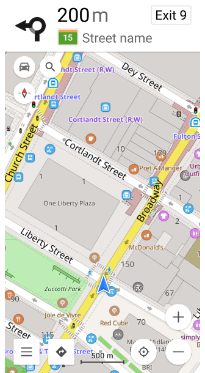
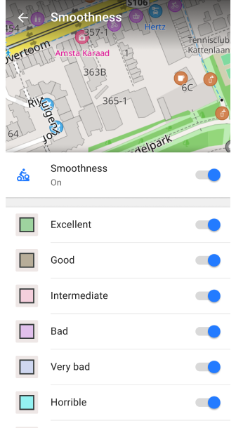
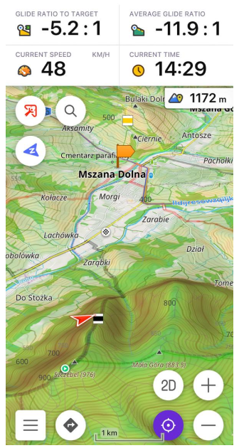
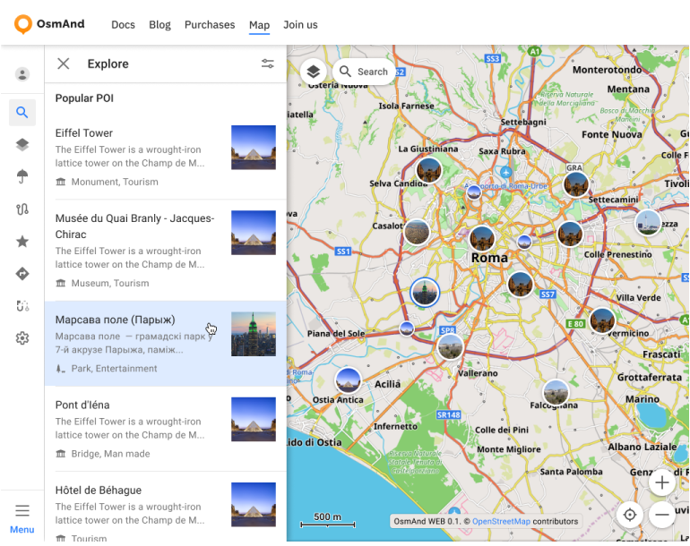

import Tabs from '@theme/Tabs';
import TabItem from '@theme/TabItem';
import AndroidStore from '@site/src/components/buttons/AndroidStore.mdx';
import AppleStore from '@site/src/components/buttons/AppleStore.mdx';
import LinksTelegram from '@site/src/components/_linksTelegram.mdx';
import LinksSocial from '@site/src/components/_linksSocialNetworks.mdx';
import Translate from '@site/src/components/Translate.js';
import InfoIncompleteArticle from '@site/src/components/_infoIncompleteArticle.mdx';
import ProFeature from '@site/src/components/buttons/ProFeature.mdx';
import InfoAndroidOnly from '@site/src/components/_infoAndroidOnly.mdx';

Happy New Year from OsmAnd!

As we step into 2025, we celebrate the tradition of reflecting on our journey and sharing our vision for the year ahead. This marks the seventh time we’ve come together to outline our milestones and aspirations, driven by our unwavering commitment to making your navigation smarter, simpler, and more reliable.

2024 was a transformative year, filled with advancements that enhanced the OsmAnd experience for millions of users worldwide. Looking forward, 2025 promises even more innovative features, improved usability, and solutions designed with you in mind.

Ready to see how we’re planning to shape the future of navigation? Let’s dive in.

<!--truncate-->

## 2025 New Year Resolutions

At OsmAnd, every year begins with fresh goals and an unwavering commitment to innovation. Here's a glimpse of what's ahead for 2025.

### Main Navigation Widgets

 

*Your routes, your way*. We're introducing new navigation widgets to keep you on track. These customizable tools will streamline your journeys, keeping everything you need within easy reach.

### Configure Map with Map Legend
 

Have you ever wondered what every map symbol stands for? With our new map legend tool, you can effortlessly configure and understand layers, tailoring your view for any adventure.

### Extended Route Details

Gain deeper insights into your journey with expanded route details. Get an insight into time, distance, or alternative transportation options so you can make smarter decisions.

### Smartwatches

At OsmAnd, each year brings exciting advancements in external device connectivity. In 2023, we introduced external sensor support. In 2024, it was the OBD-II protocol. Now, for 2025, we’re thrilled to announce smartwatch integration!

With this new feature, you’ll be able to browse and record tracks or view simple navigation instructions directly on your wrist.

### Explore popular places

In 2025, we plan to add the Explore Popular Places feature on Android and iOS, as well as an improved photo gallery for POIs.

 
### 3D Buildings

*A new dimension of exploration*. Experience richer, more immersive navigation with detailed 3D building representations on your maps.

### Share Favorites / GPX / Location

*Stay connected and share the adventure*. Share GPX files, favorite locations, or real-time routes with your friends and family directly from OsmAnd.

### And More to Come!

Our journey doesn’t stop here. In 2025, expect:

- A feature-complete web version of OsmAnd [Explore](https://osmand.net/map).
- Weather information along your route.
- Automatic cloud synchronization for seamless data sharing. 
- Alternative routes.
- Smarter route planning with advanced options
- New and improved widgets for ultimate customization. 

## 2024: A Year of Transformation

In 2024, OsmAnd reached new milestones that reshaped the way you navigate the world. Here’s a glimpse of how we turned resolutions into reality, bringing innovation and usability to every corner of our app.

[4.7](https://osmand.net/blog/osmand-ios-4-7-released), [4.8](https://osmand.net/blog/osmand-ios-4-8-released), [4.9](https://osmand.net/blog/osmand-ios-4-9-released) **(iOS)**; [4.7](https://osmand.net/blog/osmand-android-4-7-released), [4.8](https://osmand.net/blog/osmand-android-4-8-released), [4.9](https://osmand.net/blog/osmand-android-4-9-released) **(Android)**, [1.01](https://osmand.net/blog/osmand-web-1-01-released/) Map **Web**.

[Resolutions 2024](https://osmand.net/blog/ny-resolutions-2024):

- ✔️ **Customizable quick actions and widgets**. Effortlessly tailor your navigation tools. Custom and default buttons, quick actions for the external keyboard - each feature is designed to meet your unique needs.
- ✔️ **Enhanced map visualizations**. Experience the world in greater detail with redesigned menus, weather animations, and specialized maps like dirt bike trails.
- ✔️ **Smarter Routing and Navigation**. With features like fast offline routing, auto-zoom, and new widgets, your journeys have never been smoother or more efficient.
- ✔️ **Visual Exploration with Photos**. Dive into rich visual content with Wikimedia gallery viewers for both web and Android.

### iOS

The three major updates ([4.7](#47---april-19-2024), [4.8](#48---august-22-2024), [4.9](#49---december-23-2024)) introduced more than <a href="https://github.com/osmandapp/OsmAnd-iOS/milestones?state=closed">200 features and improvements</a> to iOS.

#### [4.7](https://osmand.net/blog/osmand-ios-4-7-released) - April 19, 2024

| Glide ratio widgets | 3D track visualization   |
|-----|------|
| | |

- [Redesign the tracks menu.](https://osmand.net/blog/osmand-ios-4-7-released#redesign-tracks-menu)
- [Added 3D visualization for tracks.](https://osmand.net/blog/osmand-ios-4-7-released#3d-visualization)
- [External sensors data on tracks for analyzing on the map.](https://osmand.net/blog/osmand-ios-4-7-released#external-sensors-data-for-analize-on-map)
- [New the Sun Position widget.](https://osmand.net/blog/osmand-ios-4-7-released#sun-position-widget)
- [Introduced Glide Ratio widgets.](https://osmand.net/blog/osmand-ios-4-7-released#glide-ratio-widget)
- [Round up numbers for distance information in navigation widgets.](https://osmand.net/blog/osmand-ios-4-7-released#round-up-numbers-in-navigation-widgets)
- [OsmAnd Cloud updates: restoring from Trash, ability to delete account.](https://osmand.net/blog/osmand-ios-4-7-released#osmand-cloud-updates)
- [App language for base map.](https://osmand.net/blog/osmand-ios-4-7-released#app-language-for-basemap)

#### [4.8](https://osmand.net/blog/osmand-ios-4-8-released) - August 22, 2024

| Weather animation | Smooth Transitions  |
|-----|------|
| | |

- [New Speedometer widget.](https://osmand.net/blog/osmand-ios-4-8-released#speedometer-widget)
- [Turn-by-turn instructions to the route details.](https://osmand.net/blog/osmand-ios-4-8-released#turn-by-turn-instructions)
- [Added road side indicator information.](https://osmand.net/blog/osmand-ios-4-8-released#roadside-indicator)
- [Updated Quick Actions tool.](https://osmand.net/blog/osmand-ios-4-8-released#quick-actions-tool-update)
- [Custom buttons.](https://osmand.net/blog/osmand-ios-4-8-released#custom-buttons)
- [3D My Location icons.](https://osmand.net/blog/osmand-ios-4-8-released#3d-my-location-icons)
- [Color palette for Terrain.](https://osmand.net/blog/osmand-ios-4-8-released#color-palettes)
- [Weather animations and new design.](https://osmand.net/blog/osmand-ios-4-8-released#weather-tool-improvements)
- [Smooth transitions when zooming in 3D mode.](https://osmand.net/blog/osmand-ios-4-8-released#smooth-transitions)

#### [4.9](https://osmand.net/blog/osmand-ios-4-9-released) - December 23, 2024

| Touch screen lock button | Widget Context menu  |
|-----|------|
| | |

- [New ompass button behavior.](https://osmand.net/blog/osmand-ios-4-9-released#new-compass-behavior)
- [Search by Brand Names.](https://osmand.net/blog/osmand-ios-4-9-released#search-by-brand-names)
- [Widget Context menu.](https://osmand.net/blog/osmand-ios-4-9-released#widget-context-menu)
- [Redesigned graphs.](https://osmand.net/blog/osmand-ios-4-9-released#redesigned-graphs)
- [Track menu updates.](https://osmand.net/blog/osmand-ios-4-9-released#track-menu-updates)
- [Map mode theme updates.](https://osmand.net/blog/osmand-ios-4-9-released#updates-for-map-mode-menu)
- [Profile appearance redesign.](https://osmand.net/blog/osmand-ios-4-9-released#profile-appearance-redesign)
- [Touch Screen Lock button and any Quick Actions updates.](https://osmand.net/blog/osmand-ios-4-9-released#quick-action-updates)
- [Show Along the Route.](https://osmand.net/blog/osmand-ios-4-9-released#show-along-the-route)

### Android 

Android users received revolutionary improvements in three updates ([4.7](#47---april-16-2024), [4.8](#48---july-26-2024), [4.9](#49---november-19-2024)) that introduced more than <a href="https://github.com/osmandapp/Osmand/milestones?state=closed">800 features and improvements</a>.

#### [4.7](https://osmand.net/blog/osmand-android-4-7-released) - April 16, 2024

| Speedometer | 3D track visualization  |
|-----|------|
| | |

- [Fast offline routing.](https://osmand.net/blog/osmand-android-4-7-released#enhanced-offline-navigation)
- [Navigation settings for Developers.](https://osmand.net/blog/osmand-android-4-7-released#navigation-settings-for-developers)
- [Speedometer widget.](https://osmand.net/blog/osmand-android-4-7-released#speedometer)
- [Round up numbers in navigation widgets.](https://osmand.net/blog/osmand-android-4-7-released#round-up-numbers)
- [Custom Quick Action buttons.](https://osmand.net/blog/osmand-android-4-7-released#custom-buttons)
- [Vertical exaggeration for Terrain.](https://osmand.net/blog/osmand-android-4-7-released#vertical-exaggeration)
- [3D tracks visualization.](https://osmand.net/blog/osmand-android-4-7-released#3d-track-visualization)
- [Redesign graphs of tracks and route.](https://osmand.net/blog/osmand-android-4-7-released#redesign-graphs)
- [Tracks menu updated.](https://osmand.net/blog/osmand-android-4-7-released#tracks-menu)

#### [4.8](https://osmand.net/blog/osmand-android-4-8-released) - July 26, 2024

| Altitude Color scheme | Weather animation  |
|-----|------|
| | |

- [Altitude of Terrain color scheme.](https://osmand.net/blog/osmand-android-4-8-released#altitude-of-terrain-color-scheme)
- [Color schemes for terrain, tracks, and routes.](https://osmand.net/blog/osmand-android-4-8-released#color-schemes)
- [Profile appearance redesign.](https://osmand.net/blog/osmand-android-4-8-released#profile-appearance-redesign)
- [3D My Location icons.](https://osmand.net/blog/osmand-android-4-8-released#3d-my-location-icons)
- [Quick Actions tool update.](https://osmand.net/blog/osmand-android-4-8-released#quick-actions-tool-update)
- [Weather tool improvements.](https://osmand.net/blog/osmand-android-4-8-released#weather-tool-improvements)
- [Update Attach to the Roads.](https://osmand.net/blog/osmand-android-4-8-released#update-attach-to-the-roads)
- [More Favorite icons.](https://osmand.net/blog/osmand-android-4-8-released#more-favorite-icons)
- [Water category of POIs.](https://osmand.net/blog/osmand-android-4-8-released#water-category-of-pois).
- [Compass button updates.](https://osmand.net/blog/osmand-android-4-8-released#compass-button-updates).
- [Optional updates.](https://osmand.net/blog/osmand-android-4-8-released#optional-updates).

#### [4.9](https://osmand.net/blog/osmand-android-4-9-released) - November 19, 2024

| Wikimedia Gallery viewer | Vehicle metrics: OBD-II   |
|-----|------|
| | |

- [Wikimedia gallery viewer.](https://osmand.net/blog/osmand-android-4-9-released#wikimedia-gallery-viewer)
- [Vehicle Metrics plugin.](https://osmand.net/blog/osmand-android-4-9-released#vehicle-metrics)
- [GPX track Activities.](https://osmand.net/blog/osmand-android-4-9-released#gpx-track-activities)
- [Customizable map buttons.](https://osmand.net/blog/osmand-android-4-9-released#customizable-map-buttons)
- [Widget Context menu.](https://osmand.net/blog/osmand-android-4-9-released#widget-context-menu)
- [Lock Screen button and Quick Action updates.](https://osmand.net/blog/osmand-android-4-9-released#lock-screen-feature-for-seamless-navigation)
- [Dirt Bike trails.](https://osmand.net/blog/osmand-android-4-9-released#ride-like-a-pro-dirt-bike-trails-now-available)
- [Surrounding areas info.](https://osmand.net/blog/osmand-android-4-9-released#discover-nearby-areas-with-osmand-polygon-info)
- [Custom graph display for recorded GPX tracks.](https://osmand.net/blog/osmand-android-4-9-released#custom-graph-display-for-gpx-tracks)

### Web

Our first major web update ([1.01](#101---september-23-2024)) with over <a href="https://github.com/osmandapp/OsmAnd-iOS/milestones?state=closed">50 public features and issues</a> brings advanced tools to your browser

#### [1.01](https://osmand.net/blog/osmand-web-1-01-released) - September 23, 2024

| Explore |
|-----|
| |

- [Default system language.](https://osmand.net/blog/osmand-web-1-01-released/#system-language)
- [New Map Context menu.](https://osmand.net/blog/osmand-web-1-01-released/#new-map-context-menu)
- [Map Search options.](https://osmand.net/blog/osmand-web-1-01-released/#explore-map-menu)
- [Photo Gallery for POIs.](https://osmand.net/blog/osmand-web-1-01-released/#poi-photo-gallery)

---

## Summary

Looking ahead, we are excited about the future and committed to make OsmAnd the best navigation app for everyone. Thank you for your trust, feedback, and continued support throughout 2024. Together, let’s make 2025 another year of progress and success!  

**Happy New Year 2025!**  

*Victor Shcherb & OsmAnd Team*

_________________

*For more details, check out our past resolutions and achievements:*

- [2024 New Year Resolutions](https://osmand.net/blog/ny-resolutions-2024/)  
- [2023 New Year Resolutions](https://osmand.net/blog/ny-resolutions-2023/)  

_________________

Please feel free to contact us. We appreciate and welcome every contribution you make to the further development of OsmAnd.

- **Follow**: <LinksSocial/>  

- **Join**: <LinksTelegram/>  

- **Get**: &nbsp;<AndroidStore/>  

    <AppleStore/>

