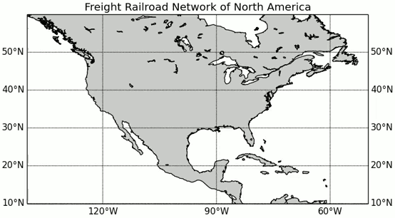

import Tabs from '@theme/Tabs';
import TabItem from '@theme/TabItem';
import AndroidStore from '@site/src/components/buttons/AndroidStore.mdx';
import AppleStore from '@site/src/components/buttons/AppleStore.mdx';
import LinksTelegram from '@site/src/components/_linksTelegram.mdx';
import LinksSocial from '@site/src/components/_linksSocialNetworks.mdx';
import Translate from '@site/src/components/Translate.js';
import InfoIncompleteArticle from '@site/src/components/_infoIncompleteArticle.mdx';
import ProFeature from '@site/src/components/buttons/ProFeature.mdx';
import InfoAndroidOnly from '@site/src/components/_infoAndroidOnly.mdx';

In our increasingly connected world, reliable and efficient navigation is crucial, especially when traveling in areas without stable internet coverage. Many users face common frustrations with offline navigation, such as slow route calculations, excessive battery usage, and overly complicated routes. Recognizing these challenges, OsmAnd has developed a solution designed specifically to improve offline routing performance. **Highway Hierarchy (HH) Routing** is a fast and smart approach that prioritizes major roads and reduces calculation time.  

In this article, we will explore what HH Routing is, how it works in OsmAnd, and why it's a major improvement over traditional routing methods.  

<!--truncate-->

## What is Highway Hierarchy (HH) Routing

[Highway Hierarchy (HH) routing](https://en.wikipedia.org/wiki/Road_hierarchy) is an advanced method to calculate routes more efficiently by categorizing roads according to their importance. Instead of examining every possible path with equal weight, **HH routing first focuses on primary and major arterial roads before considering smaller local streets**.  

This approach speeds up the route calculation process, which is especially valuable offline when resources are limited. It also improves route accuracy by prioritizing the most logical and efficient paths.

## How Does HH Routing Work in OsmAnd

OsmAnd uses a structured approach to implement HH routing, combining monthly data updates with an efficient routing process centered on checkpoints.  

1. **Monthly data preparation**  
    Each month, the OsmAnd team generates updated HH routing data that reflects recent changes to road networks. These updates are typically available become available to users around **the 5th of every month**.  

2. **Integration into offline maps**  
    The updated routing data is integrated directly into OsmAnd's offline maps (OBF format). Users access them simply by refreshing or updating their offline maps regularly. No extra downloads or internet connection are required.

3. **Utilizing checkpoints for efficiency**  
    HH routing uses strategically placed **checkpoints**, predefined key locations on the map, such as city exits, major intersections, or important highway junctions, to break the route into simplified segments.  

    *How it works:*

    - OsmAnd identifies the closest checkpoint to your starting point.
    - The route is calculated segment-by-segment, from one checkpoint to the next.
    - Finally, OsmAnd refines the route to guide you precisely to your intended destination.

## HH Routing vs. Traditional Routing

To understand the benefits of Highway Hierarchy (HH) Routing, it helps to know how it differs from traditional routing methods, such as graph-based routing (e.g., A*, Dijkstra's algorithms).  

#### Traditional Graph-Based Routing

|[A* Classic](https://en.wikipedia.org/wiki/A*_search_algorithm) is searching for a path between Washington, D.C., and Los Angeles.|
|:---|
||

Traditional routing methods typically consider every possible path equally. These methods perform exhaustive searches, evaluating countless road segments to find the shortest route.  

*Key characteristics:*

- Calculates all available paths.
- High accuracy, ideal for small areas or short routes.
- Requires more processing power and time.

#### Highway Hierarchy (HH) Routing

In contrast, HH routing relies on a pre-organized road network hierarchy, prioritizing major routes over minor ones.  

*Key characteristics:*

- Focus primarily on main roads and checkpoints.
- Optimized for long-distance and offline navigation.
- Uses less memory and battery for faster results.

#### Brief Comparison

| Feature | Traditional Routing | HH Routing |  
|---------|--------------------------|----------------------|  
| **Calculation approach** | Scans all possible paths | Hierarchical + checkpoint-based |
| **Performance (Long Distances)** | Slower and resource-intensive | Faster and resource-efficient |
| **Ideal Use** | Short-distance, detailed urban trips | Long-distance, offline navigation |

## HH Routing Engines in OsmAnd

Behind the simplicity of fast, offline navigation is OsmAnd’s carefully engineered support for Highway Hierarchy (HH) routing. While most users don’t need to know the technical details, a few choices under the hood can make a noticeable difference, especially on large maps or lower-powered devices.  

*OsmAnd provides two internal implementations of HH routing:*

- **HH x Java** – The standard engine, reliable and broadly compatible.
- **HH x C++** – A faster, memory-efficient engine designed for larger maps and high-performance needs.

Both use the same routing logic, but the C++ version delivers noticeably quicker results and smoother performance, particularly for long routes or when switching between maps.

> You can select your preferred routing engine in *Menu → Settings → Profile → Navigation settings → Route parameters → Development*.

## Benefits of HH Routing

While the technical foundation of HH routing is powerful, its true value lies in the real benefits it delivers to users. Here’s how it helps in real-world use:

- **Faster navigation start times**. HH routing calculates routes in seconds, even across countries. Thanks to its simplified structure, you spend less time waiting and more time moving.

- **Fully offline functionality**. Since OsmAnd preloads all routing data into offline maps, you can enjoy full navigation capabilities without needing a network connection.

- **Reduced battery and memory usage**. Because it processes fewer calculations, HH routing uses less CPU power and memory. This means longer battery life and smoother performance, even on older devices.

- **Accurate and practical routes**. By prioritizing practical paths, HH routing produces routes that not only reach your destination quickly but also make practical sense. You’re less likely to be sent down unnecessary backroads or inefficient shortcuts.

In short, HH routing in OsmAnd combines performance, precision, and offline independence in one powerful navigation system, bringing a noticeable upgrade to how you move through the world.

## How to Activate and Optimize HH Routing

To take full advantage of HH routing, it is important to keep your offline maps up to date. OsmAnd releases updated routing data at the beginning of each month.

- To [update your maps](https://osmand.net/docs/user/personal/maps-resources#updates), go to *Menu → Maps & Resources → Updates*.
- To [select routing type](https://osmand.net/docs/user/navigation/guidance/navigation-settings#development-settings), go to *Menu → Settings → app profile → Navigation settings → Route parameters → Development → Routing type (Android) / Routing algorithm (iOS)*

## Real-World Examples

To showcase the performance advantages of HH routing, we’ve prepared several real-world test cases that compare **HH x C++ Fast Routing** to **Traditional A* 2-phase Routing**. These examples demonstrate significant improvements in route calculation time and responsiveness.

<!--
***Test route:***

- **Start:** [48.73829, 13.41383](https://osmand.net/map/?pin=48.738262,13.413754#18/48.73823/13.41362)
- **Finish:** [47.94505, 7.73573](https://osmand.net/map/?pin=47.945066,7.735711#19/47.94500/7.73592)
- **OsmAnd Web Preview:** [View Route](https://osmand.net/map/navigate/?start=48.738290,13.413830&end=47.945050,7.735730&profile=car#7/48.611/11.530)

| [HH x C++ Fast Routing](https://osmand.net/docs/user/navigation/guidance/navigation-settings#development-settings) | [Traditional Routing A*2-phase](https://osmand.net/docs/user/navigation/guidance/navigation-settings#development-settings)  |
|------------|----------------------|
| Calculation time: **13 sec**| Calculation time: **36 sec** |
|  |  |

***Baltimore to Atlanta***:

- **Start:** [39.296098, -76.602457](https://osmand.net/map/?pin=48.738262,13.413754#18/48.73823/13.41362)
- **Finish:** [33.751570, -84.410984](https://osmand.net/map/?pin=47.945066,7.735711#19/47.94500/7.73592)
- **OsmAnd Web Preview:** [View Route](https://osmand.net/map/navigate/?start=39.296098,-76.602457&end=33.751570,-84.410984&profile=car#7/36.695/-82.227)

| [HH x C++ Fast Routing](https://osmand.net/docs/user/navigation/guidance/navigation-settings#development-settings) | [Traditional Routing A*2-phase](https://osmand.net/docs/user/navigation/guidance/navigation-settings#development-settings)  |
|------------|----------------------|
| Calculation time: **29 sec**| Calculation time: **180 sec** |
|  |  |

***Praha to Stuttgart***:

- **Start:** [50.099568, 14.400652](https://osmand.net/map/?pin=48.738262,13.413754#18/48.73823/13.41362)
- **Finish:** [48.806807, 9.231252](https://osmand.net/map/?pin=47.945066,7.735711#19/47.94500/7.73592)
- **OsmAnd Web Preview:** [View Route](https://osmand.net/map/navigate/?start=50.099570,14.400650&end=48.806810,9.231250&profile=car#8/49.490/10.857)

| [HH x C++ Fast Routing](https://osmand.net/docs/user/navigation/guidance/navigation-settings#development-settings) | [Traditional Routing A*2-phase](https://osmand.net/docs/user/navigation/guidance/navigation-settings#development-settings)  |
|------------|----------------------|
| Calculation time: **15 sec**| Calculation time: **53 sec** |
|  |  |
-->

### Test Case 1: USA – Baltimore to Atlanta

- **Start:** [39.296098, -76.602457](https://osmand.net/map/?pin=48.738262,13.413754#18/48.73823/13.41362)
- **Finish:** [33.751570, -84.410984](https://osmand.net/map/?pin=47.945066,7.735711#19/47.94500/7.73592)
- **OsmAnd Web Preview:** [View Route](https://osmand.net/map/navigate/?start=39.296098,-76.602457&end=33.751570,-84.410984&profile=car#7/36.695/-82.227)
- **HH x C++ Fast Routing** - Calculation time: **29 sec**
- **Traditional Routing A*2-phase** - Calculation time: **180 sec**

**1.** HH x C++ Fast Routing (29 sec)  

<iframe width="320" height="569" src="https://www.youtube.com/embed/xIFq9DtceaM" title="HH routing example: Baltimore to Atlanta" frameborder="0" allow="accelerometer; autoplay; clipboard-write; encrypted-media; gyroscope; picture-in-picture; web-share" referrerpolicy="strict-origin-when-cross-origin" allowfullscreen></iframe>

 

 

**2.** Traditional Routing A*2-phase (180 sec)  

<iframe width="507" height="569" src="https://www.youtube.com/embed/J7kjeCbQef8" title="A2 routing example: Baltimore to Atlanta" frameborder="0" allow="accelerometer; autoplay; clipboard-write; encrypted-media; gyroscope; picture-in-picture; web-share" referrerpolicy="strict-origin-when-cross-origin" allowfullscreen></iframe>

### Test Case 2: Czech Republic to Germany – Praha to Stuttgart

- **Start:** [50.099568, 14.400652](https://osmand.net/map/?pin=48.738262,13.413754#18/48.73823/13.41362)
- **Finish:** [48.806807, 9.231252](https://osmand.net/map/?pin=47.945066,7.735711#19/47.94500/7.73592)
- **OsmAnd Web Preview:** [View Route](https://osmand.net/map/navigate/?start=50.099570,14.400650&end=48.806810,9.231250&profile=car#8/49.490/10.857)
- **HH x C++ Fast Routing** - Calculation time: **15 sec**
- **Traditional Routing A*2-phase** - Calculation time: **53 sec**

**1.** HH x C++ Fast Routing (15 sec)

<iframe width="320" height="569" src="https://www.youtube.com/embed/r2rDHcO_4yE" title="HH routing example: Praha to Stuttgart" frameborder="0" allow="accelerometer; autoplay; clipboard-write; encrypted-media; gyroscope; picture-in-picture; web-share" referrerpolicy="strict-origin-when-cross-origin" allowfullscreen></iframe>

 

 

**2.** Traditional Routing A*2-phase (53 sec)

<iframe width="320" height="569" src="https://www.youtube.com/embed/0BzE8tkC5ek" title="A2 routing example: Praha to Stuttgart" frameborder="0" allow="accelerometer; autoplay; clipboard-write; encrypted-media; gyroscope; picture-in-picture; web-share" referrerpolicy="strict-origin-when-cross-origin" allowfullscreen></iframe>

### Key Takeaways

- **HH x C++ Routing consistently delivers 2–6x faster** route calculation times than traditional methods.
- The performance gain is especially noticeable on **long-distance, cross-regional routes**.
- Faster routing also results in a **smoother user experience**, particularly in offline mode where processing power may be limited.

## Frequently Asked Questions (FAQ)

- **Do I need an internet connection to use HH routing?**

    No. HH routing is fully offline. OsmAnd preloads all necessary routing data into your offline maps, so no network connection is required for route calculation or navigation.

- **What happens if my maps are outdated?**

    Outdated maps may contain routing data that is incompatible with the latest HH engine. To avoid errors or incorrect routes, it’s important to keep all maps updated—especially when using HH routing. Updated routing data is usually available by the **5th of each month**.

- **Can I use HH routing for all types of navigation (car, bike, pedestrian)?**

    Yes. OsmAnd generates HH routing data for multiple profiles, including car, cycling, and pedestrian navigation. You can select the preferred routing engine individually for each profile.

- **What’s the difference between HH x Java and HH x C++?**

    - **HH x Java**: The default Java-based engine, compatible with most devices.
    - **HH x C++**: A faster, more memory-efficient version recommended for large maps, long-distance routes, and better performance on modern devices.

    > *OsmAnd recommends using **HH x C++** when available for best results.*

- **Is HH routing available on both Android and iOS?**

    Yes, but with some differences:

    - **Android** users can choose between several routing engines, including HH x Java and HH x C++.
    - **iOS** users currently have access to the **Highway Hierarchies** option integrated into their routing algorithm settings.

- **Can I combine HH routing with other OsmAnd features like turn-by-turn guidance and GPX recording?**

    Absolutely. HH routing works seamlessly with OsmAnd’s core features such as:

    - Turn-by-turn voice guidance
    - Route planning
    - Track recording
    - Offline map display and overlays

If your question isn’t listed here, check out the [Navigation Settings article](https://osmand.net/docs/user/navigation/guidance/navigation-settings).

## Conclusion

Highway Hierarchy (HH) routing represents a major advancement in how OsmAnd delivers offline navigation. By intelligently organizing the road network into a hierarchy and relying on pre-calculated checkpoints, HH routing reduces route calculation time and resource consumption without compromising accuracy.

### Ready to Try HH Routing?

To experience the full benefits:

- **Update your offline maps** to get the latest routing data.
- **Enable HH x C++ routing** in your profile settings (or "Highway Hierarchies" on iOS).
- **Plan your next route** and enjoy significantly faster calculation times.

For additional guidance:

- <LinksTelegram/>  

- <LinksSocial/>

- <AndroidStore/>  

     

    <AppleStore/>

---

Thank you for using OsmAnd. We’re constantly working to improve your navigation tools, and HH routing is just one of many steps toward a smarter offline future.
