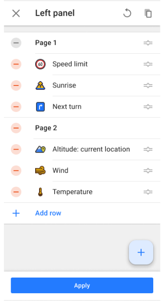
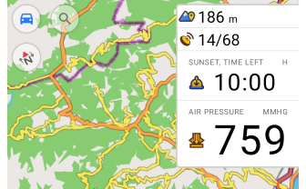
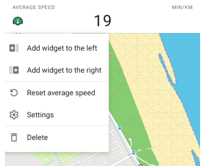
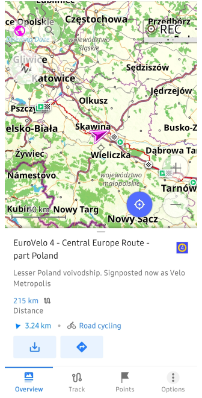
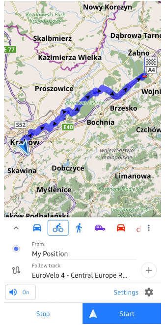
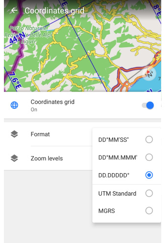
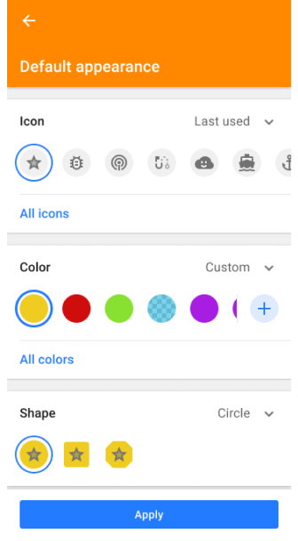

import Tabs from '@theme/Tabs';
import TabItem from '@theme/TabItem';
import AndroidStore from '@site/src/components/buttons/AndroidStore.mdx';
import LinksTelegram from '@site/src/components/_linksTelegram.mdx';
import LinksSocial from '@site/src/components/_linksSocialNetworks.mdx';
import Translate from '@site/src/components/Translate.js';
import InfoIncompleteArticle from '@site/src/components/_infoIncompleteArticle.mdx';
import ProFeature from '@site/src/components/buttons/ProFeature.mdx';
import InfoAndroidOnly from '@site/src/components/_infoAndroidOnly.mdx';

Exciting news!  

We’re happy to announce the release of **OsmAnd 5.0** for Android, now available for download. The update introduces a series of new and improved features that enhance your navigation experience, streamline widget configuration, and make discovering more intuitive than ever.

[🔄   **Get the Update Today!**](https://play.google.com/store/apps/dev?id=8483587772816822023)

In this version, enjoy enhanced widgets, including new Route Information and Route Maneuvers options, resizable widgets for side panels, and a new Explore mode to discover nearby POIs.  

Update now to explore the latest improvements and enhance your OsmAnd experience. Thank you for using OsmAnd. Safe travels!  

<!--truncate-->

## What's new

- [New main navigation widget combines turn arrow and navigation instructions](#route-maneuvers-widgets-set)
- [Current route info widget: displays ETA, arrival time, and distance](#new-route-information-widget)
- [Redesigned the Configure screen for widgets](#redesigned-configure-screen)
- [New option to select widget size for left and right panels](#resizable-widgets-for-side-panels)
- [Reset action for the Average speed widget](#reset-option-for-the-average-speed-widget)
- [Discover Top-Ranked POIs with the New Explore Mode](#explore-mode-discover-popular-places)
- [Wikidata Integration in Map Data (Popular Places - Wikipedia)](#popular-places-wikipedia)
- [Improved searching OSM routes and choosing it for navigation](#all-osm-routes--now-searchable)
- [Detailed information on Ski Slopes and MTB Trails](#ski-slopes-and-mtb-trails-information)
- [Added Coordinates Grid with geographical coordinates](#coordinates-grid-overlay)
- [Crags and climbing areas on the map](#climbing-areas-and-crags)
- [Detailed information for linear objects](#detailed-information-for-linear-objects)
- [Mountain peak heights in feet](#mountain-peak-heights-in-feet)
- [Prominent peaks now discoverable via map and search](#prominent-peaks-now-discoverable)
- [USA address search with TIGER data](#usa-address-search-with-tiger-data)
- [Changing UX for Intermediate destinations in Waypoints](#interactions-with-intermediate-destinations)
- [Added ability to change and set the default appearance for favorite groups](#flexible-appearance-settings-for-favorite-groups)
- [Android Auto improvements](#android-auto-improvements)
- [AIS Vessel Tracking plugin (nautical navigation)](#ais-vessel-tracking-plugin)

- [Optional updates](#optional-updates). Additional updates and refinements for the release.

## Route Guidance Widgets Set

The new **Route Guidance widget** combines essential navigation details into a single, compact display, providing **real-time navigation instructions**, helping you stay on track throughout your journey. These widgets are **active during navigation**, ensuring you never miss a turn.  

Key improvements:

- **All-in-one navigation view** — Integrates the *distance to the first and next turn, turn arrow, road name, road number with a shield, current street name, exit number*, and *lane information* in one widget.
- **Available for top and bottom widget panels.**

Find them in:  
*Menu → Configure screen → **Top panel / Bottom panel** → Route guidance: Next turn, Second next turn, Lanes*

Learn more:  
[Route Guidance Widget](https://osmand.net/docs/user/widgets/nav-widgets#route-guidance)

## New Route Information Widget

The **Route Information widget** provides a clear overview of your journey by displaying *ETA (Estimated Time of Arrival), remaining travel time, and distance to the destination* in a compact format. Designed for real-time navigation, it ensures you have the most relevant travel details at a glance.  

Key features:

- **Display priority settings** — Select between *Destination first (default)* or *Intermediate first* to prioritize the most relevant route information.  
- **Available for top and bottom widget panels** for flexible placement.  
- **Quick access to Start/Stop Navigation panel** — Tap the *arrow button* to open navigation controls.  

Find it in:  
*Menu → Configure screen → **Top panel / Bottom panel** → Route information*  

Learn more:  
[Navigation Points Widget](https://osmand.net/docs/user/widgets/nav-widgets#navigation-points)
[Start/Stop Navigation Panel](https://osmand.net/docs/user/navigation/setup/route-navigation#start--stop-navigation)

## Redesigned Configure Screen

    

The widget **Configure screen** has undergone a major redesign to enhance usability and streamline the process of adding, customizing, and organizing widgets.

Key changes:

- **Add widget screen**:
   - Widgets and widget groups are **sorted alphabetically** (A-Z).  
   - **Search** functionality works for both widget names and groups.
- **Panels** — Removed *Available widgets* and *Actions* groups for a cleaner interface.
- **Widget groups** - Removed group icon and Add button, widgets are added separately, improved widget list.
- **Widget settings** - All widget settings are now grouped together for easier management.

This redesign ensures a **consistent experience** across Android and iOS, allowing for seamless configuration and management of widgets.  

Learn more:  
[Widget Configure Screen](https://osmand.net/docs/user/widgets/configure-screen)

## Resizable Widgets for Side Panels

You can now customize the **size of widgets** in the **left and right panels**, just like in the top and bottom ones. This update offers greater flexibility in *configuring the map screen*. Choose from *small, medium*, or *large* sizes to customize your screen layout.

Key improvements:

- **Independent resizing** for left and right panels.  
- **Consistent widget scaling** across all panel positions.  
- **Optimized screen space** for navigation and stats.

These options can be accessed through the *Configure Screen* menu for widget management or by performing a *long tap* on the widget directly on the map screen.

Learn more:  
[Widget Settings](https://osmand.net/docs/user/widgets/configure-screen#widget-settings)

## Reset Option for the Average Speed Widget

You can now **reset the average speed** directly from the *widget’s context menu*. This update adds a **Reset** action, allowing you to start fresh measurements without restarting navigation.  

What’s new:

- **Context menu option** to reset average speed via *long tap* on the widget on the map screen.  
- **Reset action added to the widget settings** in the *Configure Screen* menu for quick access.  

Learn more:  
[Average Speed Widget](https://osmand.net/docs/user/widgets/info-widgets/#average-speed)  
[Configure Screen](https://osmand.net/docs/user/widgets/configure-screen#widget-settings)

## Explore Mode: Discover Popular Places

The **Explore** mode has been introduced, replacing the *History* tab, making it easier than ever to discover *top-ranked points of interest (POIs)*. Now, you can explore nearby POIs, view their *photos* on the map, and easily access your *Recently visited* locations — all within the new **Explore** tab. This update makes finding interesting places faster and more convenient.

Key features:

- **Explore nearby POIs** — Discover *popular places* and *top-ranked POIs* based on *popularity*, with helpful *photos* displayed on the map and in the search results.
- **Recently visited** - Access your *recently visited (history) places* within the **Explore** tab for quick navigation back to previously explored locations.
- **Wikipedia integration** - *Wikipedia entries* are combined with POI details, allowing you to view detailed information, including photos and descriptions for each location.

How to use:  
Go to *Menu → Search → Explore* to start discovering nearby POIs and view your recently visited places.

Learn more:  
[Search All Locations](https://osmand.net/docs/user/search/search-all)

## Popular Places (Wikipedia)

The **Wikipedia POIs** feature is integrated under the new **Popular places (Wikipedia)** setting in the Configure map menu. This update provides expanded settings for Wikipedia content, giving you more control over your experience.

Key features:

- **Image previews** - You can now *view photos* for POIs directly on the map with the *Show image previews* setting.
- **Offline and Online Mode** - View *Wikipedia POIs* without downloading the map data by using the online mode.

How to use:

- Enable the **Wikipedia plugin** to access wikidata on the map and its settings in the Configure map menu.
- Go to *Menu → Configure map → Popular places (Wikipedia)* to adjust settings for image previews, language preferences, and data sources.

Learn more:  
[Wikipedia Plugin](https://osmand.net/docs/user/plugins/wikipedia)  

## All OSM Routes – Now Searchable

    

You can now **search and navigate all OSM routes** directly in OsmAnd — including **hiking, cycling, mountain biking (MTB)**, and other recreational route types. This update greatly improves *route discovery*, allowing you to easily find and follow existing paths mapped in OpenStreetMap.  

Key features:

- **Search by route type and name** — Find routes by name or filter by categories like *Hiking, Cycling, MTB*, and more.  
- **Route overview in search result** — See *route name, icon, total distance*, and *distance to the nearest point* before selecting it.  
- **Start navigation or download GPX** — Tap a route to open it and either start navigation or *download it as a GPX file*.  

How to use:

- Go to *Menu → Search → Categories → Routes*  
- Use filters to narrow down results by activity type  
- Select a route *→* tap **Navigate** or **Download**  

For more details, visit:  
[How to Use Global Search](https://osmand.net/docs/user/search/search-all#how-to-use)  
[OSM Routes Overview](https://osmand.net/docs/user/map/routes)  
[POI Search by Categories](https://osmand.net/docs/user/search/search-poi#poi-search-by-categories)  
[GPX Navigation](https://osmand.net/docs/user/navigation/setup/gpx-navigation)

<!--
 
-->

## Ski Slopes and MTB Trails Information

  

You can now **select ski slopes and MTB trails directly on the map** to access more detailed information. This feature enhances the context menu with key data such as *difficulty level, trail length, terrain type*, and more, making it easier to plan your outdoor activities.

Simply tap the *ski slopes* or *MTB routes* to quickly view information and get started with your adventure.

Learn more:  
[Map Context Menu](https://osmand.net/docs/user/map/map-context-menu)

## Coordinates Grid Overlay

The **Coordinates Grid** feature allows you to overlay a grid with **geographical coordinates** on the map, providing a precise location reference for geospatial navigation.  

Key features:

- **Multiple coordinate formats** — Choose from DD°MM′SS″, DD.DDDDD°, DD°MM.MMM′, or `UTM`.  
- **Adjustable zoom levels** — Grid lines appear dynamically between *zoom levels 2 – 22*, adapting to the map scale.  
- Uses default coordinate settings from *Menu → Settings → App profiles → General settings → Units & formats*.  

Find it in: *Menu → Configure Map → Show → Coordinates Grid*  

Learn more:  
[Coordinates Grid](https://osmand.net/docs/user/map/vector-maps#coordinates-grid)

## Climbing Areas and Crags

Now you can explore **climbing areas and crags** directly on the map. These locations provide essential details such as elevation, rock type, and number of climbing routes.  

Use *Search → POI → Climbing* to quickly find climbing spots and plan your approach with OsmAnd’s navigation tools.  

For more details, visit:  
[Climbing routes on the map](https://osmand.net/docs/user/map/routes/#climbing-routes)  
[Climbing area and crag details](https://osmand.net/docs/user/map/map-context-menu/#climbing-area-and-crag-details)

## Detailed Information for Linear Objects

You can now interact with **barriers, steps, gates, benches, and other access-related icons** directly on the map. A simple tap on these objects opens a *context menu* with detailed information, such as the object type, name (if available), and address.  

This improvement provides *quick access to navigation-relevant data*, helping you better understand path restrictions and road attributes at a glance.  

Explore more:  
[Linear object details in the Map Context Menu](https://osmand.net/docs/user/map/map-context-menu/#linear-object)

## Mountain Peak Heights in Feet

In this update, **mountain peak heights** are now displayed in **feet** for users who prefer *imperial units*. This improvement ensures elevation markers on the map align with your chosen *units of length* setting.

Key improvements:

- **Height display in feet** — Mountain peak elevations are now shown in feet as well.  
- **Profile-dependent units** — The display of heights in *meters or feet* depends on the selected Units & Formats profile settings.

This feature allows for a clearer and more accurate view of elevations when navigating mountainous areas, ensuring users in countries that use imperial units can easily understand peak heights.  

Learn more:  
[Map Context Menu](https://osmand.net/docs/user/map/map-context-menu)

## Prominent Peaks Now Discoverable  

You can now **discover prominent peaks** directly on the map and through search. This update adds [notable mountain peaks](https://en.wikipedia.org/wiki/Ultra-prominent_peak) to the basemap, allowing you to easily find their names, elevations, and additional details through the map's context menu or search functionality.

Simply tap on the *peak icons* on the map, or use the *Search → Mountain Peaks* to quickly locate and explore key mountain summits.

Learn more:  
[Map Context Menu](https://osmand.net/docs/user/map/map-context-menu)

## USA Address Search with TIGER Data

The **TIGER** (Topologically Integrated Geographic Encoding and Referencing) data for US address search is now integrated into OsmAnd. This update improves the accuracy of *street names, house numbers* and *address formatting*, and enhances  *geocoding* algorithms for better recognition of road names, abbreviations and postal structures.  

Key improvements:

- **Expanded coverage** of rural and urban addresses.  
- **More precise house number placement** for improved routing.  
- **Better handling of alternative street names and abbreviations**.  

Learn more:  
[US address search and TIGER data – technical details](https://docs.osmand.net/docs/technical/algorithms/trace-address-search-issues/#us-address-search-and-tiger-data)  
[US address search – user guide](https://docs.osmand.net/docs/user/search/search-address/#us-address-search-and-tiger-data)

## Interactions with Intermediate Destinations

Managing **intermediate destinations** in waypoints is now more convenient. The update refines the **selection and modification** process, making adjustments faster and more intuitive.  

Key changes:

- **Simplified waypoint selection** when modifying a route.  
- **Consistent UI behavior** for better usability.  
- **Improved responsiveness** when interacting with waypoints.

Learn more:  
[Intermediate destinations – user guide](https://osmand.net/docs/user/navigation/setup/route-navigation#intermediate-destinations)

## Flexible Appearance Settings for Favorite Groups

Now you can **separately customize** the *icon, color*, and *shape* for each group of favorites without resetting all attributes. And then override the settings for existing points in the folder, only new favorites, or apply to all. This allows you to visually organize your saved locations more precisely.  

Learn more:  
[Change Group Appearance](https://osmand.net/docs/user/personal/favorites/#change-group-appearance)

## Android Auto Improvements

Navigation with **Android Auto** is now more informative and route-aware, thanks to two key improvements.  

What’s new:

- **ETA and Distance to next waypoint** — During active navigation, the *estimated arrival time* and *distance are now shown for the next intermediate destination*, not just the final one. This helps you better track progress on multi-stop routes.  
- **Full destination name on preview field** — When reviewing your route before starting, the *entire destination name* is now visible on the route preview field, ensuring clarity when selecting from saved or searched locations.  

These updates improve *situational awareness and route transparency* when using OsmAnd with Android Auto.  

Learn more:  
[ETA to Next Stop](https://osmand.net/docs/user/navigation/auto-car#eta-next-stop)  
[Start Navigation with Android Auto](https://osmand.net/docs/user/navigation/auto-car#start-navigation)

## AIS Vessel Tracking Plugin

The **AIS Vessel Tracker** plugin allows you to display **real-time AIS (Automatic Identification System) vessel positions** on the map. This feature is essential for maritime navigation, providing details about nearby ships, including their type, speed, and route.  

Key features:

- **Live vessel tracking** — Ships update based on *real-time speed and course*.  
- **Detailed vessel info** — Tap on a vessel to see *ship name, MMSI, IMO number, type, dimensions, heading, speed, and ETA*.  
- **Configurable AIS data sources** — Connect via *external AIS receivers* or *network-based AIS servers*.  
- **AIS symbols and alerts** — Supports standard *AIS vessel icons, safety messages, and maneuvering indicators*.  

Find it in: *Menu → Plugins → AIS Vessel Tracker*  

Learn more:  
[AIS Vessel Tracker Plugin](https://osmand.net/docs/user/plugins/ais-tracker)

## Optional updates

- Added [Hebrew TTS](https://osmand.net/docs/user/navigation/guidance/voice-navigation#voice-prompt-language) for navigation.
- Fixed issues:
  - The languages [Serbian latin](https://github.com/osmandapp/OsmAnd/issues/21480) (Latin for Serbia, Bosnia and Herzegovina and Crna Gora) now work.
  - When using [Download All](https://github.com/osmandapp/OsmAnd/issues/21741) in OsmAnd Cloud, progress did not complete at 100%.
  - OsmAnd Cloud - [Sync now](https://github.com/osmandapp/OsmAnd/issues/22017) tracks did not work.
  - Zoom level and My Location [buttons were hidden](https://github.com/osmandapp/OsmAnd/issues/21369) once context menu is open.
  - Quick Action: [Add waypoint](https://github.com/osmandapp/OsmAnd/issues/20102) option did not permit position selection.
  - [Crash](https://github.com/osmandapp/OsmAnd/issues/22033) when tapping a POI with an image.
  - [Incorrect behavior of Avoid roads](https://github.com/osmandapp/OsmAnd/issues/21828) after map update.
  - Smart Folder: Bugs and UI improvements.
  - Bug with [Direct-to-point projection](https://github.com/osmandapp/OsmAnd/issues/21588) was fixed.

## Engage with OsmAnd: Share, Suggest, and Connect

If you have suggestions for improving the Android version of the app, please get in touch with us. We appreciate and welcome your contribution to the further development of OsmAnd.

__________________________________________________________

- **Follow**: <LinksSocial/>  

- **Join**: <LinksTelegram/>  

- **Get**: &nbsp;<AndroidStore/>
