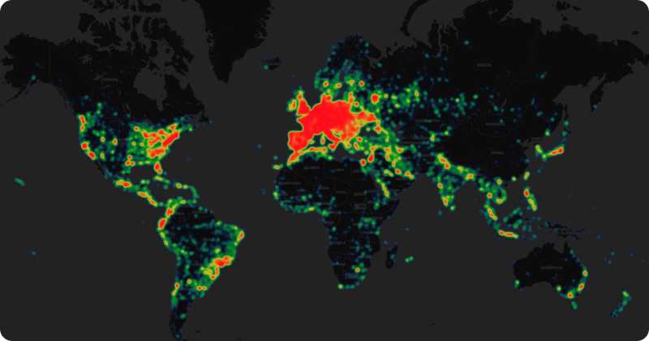
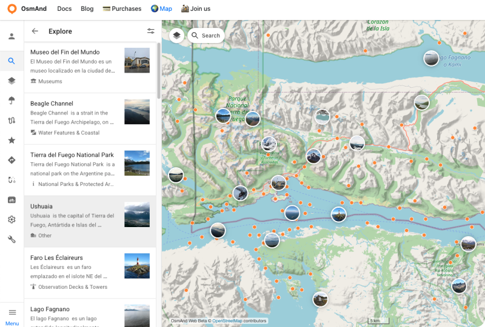

import Tabs from '@theme/Tabs';
import TabItem from '@theme/TabItem';
import AndroidStore from '@site/src/components/buttons/AndroidStore.mdx';
import AppleStore from '@site/src/components/buttons/AppleStore.mdx';
import LinksTelegram from '@site/src/components/_linksTelegram.mdx';
import LinksSocial from '@site/src/components/_linksSocialNetworks.mdx';
import Translate from '@site/src/components/Translate.js';
import InfoIncompleteArticle from '@site/src/components/_infoIncompleteArticle.mdx';
import ProFeature from '@site/src/components/buttons/ProFeature.mdx';
import InfoAndroidOnly from '@site/src/components/_infoAndroidOnly.mdx';

OsmAnd is about to turn 15, and as we approach this milestone, we’d like to share the results of our journey so far.  
First and foremost, we want to thank our users — your feedback has been incredibly valuable and continues to shape our development.  
From the beginning, **OsmAnd has been powered by the [OpenStreetMap](https://www.openstreetmap.org/) (OSM) project** — a global, collaborative initiative to create a free and editable map of the world.   
Thanks to this incredible community, OsmAnd is more than just a navigation app — it's a powerful tool for offline maps, route planning, outdoor exploration, and global travel, built entirely on **open data**.

<!--truncate-->

Over the past 15 years, we’ve released more than **35 updates** for the Android version — and over **25 updates** for iOS since its launch. This year, we introduced **OsmAnd 5.0**, a major step forward for both platforms.

We also launched the [**OsmAnd Web**](https://osmand.net/map) version, which has become an essential part of the OsmAnd ecosystem. All platforms are now seamlessly connected, allowing users to back up data, plan routes, and manage content effortlessly across devices.

Today, we’re proud to share these global stats:

- **2.5 million** monthly active users (MAU) across all platforms  
- Over **100,000** daily active users (DAU)  
- More than **20 million installs** worldwide  

Take a look at active users from the last 30 days — OsmAnd is used across every corner of the globe, and your engagement continues to inspire us.  

In the past 30 days alone, OsmAnd was installed more than **150,000 times**, with the top 12 countries leading the way:  
🇩🇪 Germany, 🇫🇷 France, 🇺🇸 USA, 🇪🇸 Spain, 🇮🇹 Italy, 🇵🇱 Poland, 🇺🇦 Ukraine, 🇮🇳 India, 🇳🇱 Netherlands, 🇸🇦 Saudi Arabia, 🇬🇧 United Kingdom, and 🇧🇷 Brazil.

We’re always listening to your feedback. One of the biggest improvements we made recently is **cross-platform purchase support**, even for **Maps+** and older purchases.  
👉 [Learn how it works](https://osmand.net/docs/user/purchases/cross)

Please keep sharing your ideas and suggestions — and we’ll keep building features for you, like [**Popular Places**](https://osmand.net/docs/user/map/popular_places/) and many more to come.

Whether you’ve been with us from the beginning or just joined recently — thank you for being part of the OsmAnd journey.  
Together, we’re shaping the future of open, offline, and privacy-respecting navigation.

Stay tuned — and happy exploring! 🌍

