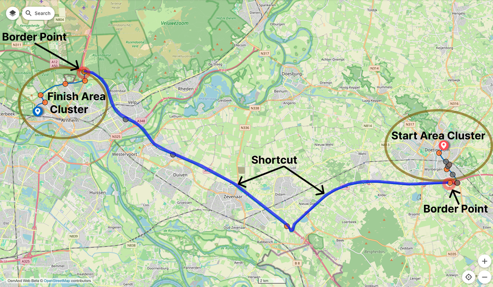

import Tabs from '@theme/Tabs';
import TabItem from '@theme/TabItem';
import AllStores from '@site/src/components/buttons/AllStores.mdx';
import AppleStore from '@site/src/components/buttons/AppleStore.mdx';
import LinksTelegram from '@site/src/components/_linksTelegram.mdx';
import LinksSocial from '@site/src/components/_linksSocialNetworks.mdx';
import Translate from '@site/src/components/Translate.js';
import InfoIncompleteArticle from '@site/src/components/_infoIncompleteArticle.mdx';
import ProFeature from '@site/src/components/buttons/ProFeature.mdx';
import InfoAndroidOnly from '@site/src/components/_infoAndroidOnly.mdx';

# OsmAnd: 100x Faster Offline Routing

Offline navigation is a lifeline for travelers, adventurers, and everyday commuters. We demand speed, accuracy, and the flexibility to tailor routes to our specific needs. For years, OsmAnd has championed powerful, feature-rich offline maps that fit in your pocket. But as maps grew more detailed and user demands for complex routing increased, our trusty [A* algorithm](https://en.wikipedia.org/wiki/A*_search_algorithm), despite its flexibility, started hitting a performance wall. How could we deliver a **100x speed boost** without bloating map sizes or sacrificing the deep customization our users love?

<!--truncate-->

The answer: **OsmAnd's custom-built Highway Hierarchy (HH) Routing.** This isn't your standard routing engine; it's a ground-up redesign, meticulously engineered to overcome the unique challenges of providing advanced navigation on compact, offline-first map data.

- **Start:** [48.73829, 13.41383](https://osmand.net/map/?pin=48.738262,13.413754#18/48.73823/13.41362)
- **Finish:** [47.94505, 7.73573](https://osmand.net/map/?pin=47.945066,7.735711#19/47.94500/7.73592)
- **OsmAnd Web Preview:** [View Route](https://osmand.net/map/navigate/?start=48.738290,13.413830&end=47.945050,7.735730&profile=car#7/48.611/11.530)

| [HH x C++ Fast Routing](https://osmand.net/docs/user/navigation/guidance/navigation-settings#development-settings) | [Traditional Routing A*2-phase](https://osmand.net/docs/user/navigation/guidance/navigation-settings#development-settings)  |
|------------|----------------------|
| Calculation time: **13 sec**| Calculation time: **36 sec** |
|  |  |

## Why Standard Solutions Failed

OsmAnd has always been about putting you in control. Our original [A* routing engine](https://en.wikipedia.org/wiki/A*_search_algorithm), configurable via [`routing.xml`](https://github.com/osmandapp/OsmAnd-resources/blob/master/routing/routing.xml), offered immense power. You could define intricate profiles, avoid specific road types, and truly personalize your journey. With maps optimized for minimal storage (the entire planet's car data for our new HH-routing is around a mere 800MB!), OsmAnd was a lean, mean navigating machine.

However, this flexibility came at a cost for complex routes:
* **The A* Wall:** Calculating a 200-300km car route (or even shorter bicycle/pedestrian paths) could mean visiting over a million road segments, taking 10-20 seconds. For longer trips, this wait could become frustrating.

We explored standard advanced algorithms like [Contraction Hierarchies (CH)](https://en.wikipedia.org/wiki/Contraction_hierarchies), known for their speed. But they presented their own set of deal-breakers for OsmAnd:
* **Flexibility Clash:** CH typically pre-calculates optimal paths. Supporting OsmAnd's 10+ routing parameters (leading to over 1024 combinations per profile!) would be impossible with standard CH.
* **Storage Nightmare:** A CH car profile for a region can be massive (e.g., OSRM's Europe is tens of GBs, their global car profile around 200GB for just one profile). Our goal was to keep *all* profiles and parameters for the *entire planet* well under 20GB.
* **Regional Map Dilemma:** Users download individual countries or regions. CH usually requires processing the entire road network globally, which doesn't align with OsmAnd's flexible map management.
* **Update Impracticality:** The extensive pre-processing for CH makes it unsuitable for frequent updates, let alone OsmAnd’s goal of supporting near real-time changes through hourly map updates.

The challenge was clear: achieve a quantum leap in speed while preserving extreme flexibility, minimal storage, regional map support, and dynamic update capabilities. Standard Highway Hierarchies were a starting point, but we needed something more – a uniquely OsmAnd solution.

## Secret Sauce #1: Two-Level Routing

The core of OsmAnd's HH-Routing is an elegant two-level hierarchy built upon "area clusters."

* **Area Clusters:** The map is intelligently segmented into numerous small regions or clusters.
* **Border Points:** Each cluster has a limited number of defined "border points" – these are the gateways in and out of the cluster.
* **Shortcuts:** For common scenarios, we pre-calculate the travel time/distance (the "shortcut") between border points *within the same cluster* and also to border points of *immediately adjacent* clusters.

This map illustrates the OsmAnd routing concept. [The route](https://osmand.net/map/navigate/?start=51.989532,5.878372&end=51.967962,6.296539&profile=car#11/51.9993/5.9824) starts in the Start Area Cluster (Doetinchem), moves to the nearest Border Point, and continues through precomputed Shortcuts across intermediate clusters. It then enters the Finish Area Cluster (Arnhem) via another border point and finishes using local roads. This method speeds up routing by combining local search with efficient inter-cluster shortcuts.

The real magic, our **Secret Sauce #1**, lies in *how* these border points are selected. Naive approaches quickly fail:
* Randomly selecting border points or using simple geometric divisions (squares/hexagons) results in too many border points per cluster (50-80). This leads to a shortcut explosion (N*(N-1)/2 shortcuts), making the files large and and calculations slow.
* We even tried building hierarchies with 2-3 levels, but the number of shortcuts grew too fast for higher levels if we generated a full graph inside each cluster.

**The "Parking Lot" Insight:**
Imagine a vast shopping mall parking lot with thousands of individual parking spots and internal lanes (representing road segments within a cluster). No matter how complex it is inside, there are usually only a few key exits to the main roads. Our goal was to identify these natural "exits" for each map cluster. For instance, the complex road network around Amsterdam Airport Schiphol ([see on OpenStreetMap](https://www.openstreetmap.org/#map=17/52.321360/4.766226)) has many internal roads but limited primary access points.

We wanted a scenario where, say, 5 well-placed border points could efficiently represent an area with 5,000 internal points and 10,000 road edges. This would reduce those 10,000 edges to just 5\*4/2 = 10 shortcuts for routing *through* that cluster at a high level – an incredible 1:1000 point ratio and a 30x reduction in edges to consider for the high-level path!

**The Algorithm: Ford-Fulkerson to Find the Bottlenecks**
To find these crucial border points, we employed a clever technique based on the [Ford-Fulkerson algorithm](https://en.wikipedia.org/wiki/Ford%E2%80%93Fulkerson_algorithm). By simulating "flooding" roads with traffic from random start/end points, we could identify the natural bottlenecks – the "minimum cut" in graph theory terms. These bottlenecks became our border points.

**Universality is Key:**
Crucially, this distribution of border points is **agnostic of routing speed profiles**. It’s based only on whether a road is *passable* or not. This means the *same set of clusters and border points* can be used for all car routing profiles (default, shortest, fuel-efficient) and all bicycle profiles (default, prefer flat terrain, etc.). Only the *travel time/cost values* of the shortcuts between these points change based on the profile. This is a massive factor in keeping storage down – **map data only increased by about 0.5% per profile** to store this HH-Routing structure!

Just look at the numbers for processing the entire planet for a car profile:
* Original OSM: ~2.07 billion points, ~2.42 billion edges
* Resulting HH structure: ~3 million border points, ~541,000 clusters
* Estimated shortcuts: ~91 million (a manageable number for global routing)

## How OsmAnd Builds Routes

So, how does OsmAnd use this structure to calculate your route at lightning speed? It's a multi-step process:

**A. Preprocessing (Done by OsmAnd when new maps are prepared):**
1.  **Cluster & Border Point Definition:** The map is divided into clusters, and border points are identified using the Ford-Fulkerson based method.
2.  **Shortcut Pre-calculation:** For the most commonly used speed profiles, the travel costs (time/distance) for shortcuts between border points within each cluster are pre-calculated and stored. (Each border point effectively has an "entry" and "exit" aspect for directed travel).

**B. User Route Request (Query Time - this is what happens on your device):**

1.  **Step 1: Connect to the Hierarchy (Your Local Area):**
    * OsmAnd identifies the clusters containing your start and target points.
    * It then uses the standard [Dijkstra algorithm](https://en.wikipedia.org/wiki/Dijkstra%27s_algorithm) on the *detailed local map* within your start cluster to find the best paths from your actual start location to *all* border points of that starting cluster.
    * The same is done for your target point within its own cluster (finding paths from all its border points to your actual destination).
    * This is quick because it's operating on a very small, localized part of the map.

2.  **Step 2: Route on the Abstract Graph (The "Highway" Part):**
    * Now, OsmAnd performs another Dijkstra search, but this time on the much smaller "base graph." This graph consists *only* of the border points and the pre-calculated shortcut values between them.
    * This step rapidly finds the optimal sequence of border points and shortcuts to get from your start cluster's periphery to your target cluster's periphery. It's incredibly fast because it's ignoring all the tiny roads *within* intermediate clusters.

3.  **Step 3: Refine with Detailed Shortcuts (Applying Secret Sauce #2):**
    * The result from Step 2 is a high-level route – a sequence of shortcuts connecting border points.
    * Now, for *each* shortcut in this sequence, OsmAnd runs its highly optimized A* algorithm on the *detailed map*, but **strictly limited to the small area of the cluster that shortcut belongs to.**
    * For example, a 500km route might be broken down into ~100 such shortcuts. If each A* shortcut calculation explores 100-1000 detailed road segments, the total detailed segments visited by A* might be around 10,000-50,000. Compare this to the 1,000,000+ segments the old A* might have needed for the entire route!

This combination – localized Dijkstra, super-fast abstract graph traversal, and highly localized A* refinement – is what delivers the **100x speedup**.

## Secret Sauce #2: Adaptive Routing

Speed is fantastic, but not if it means sacrificing the features OsmAnd users rely on. This is where our **Secret Sauce #2** comes into play – ensuring HH-Routing remains incredibly flexible and dynamic:

* **Full Parameter Support:** Because the final shortcut refinement (Step 3 above) uses A* on detailed maps *within each cluster*, all your specified parameters are naturally incorporated:
    * Avoiding specific road types or toll roads.
    * Adding penalties or preferences for certain roads.
    * Following all the nuanced rules in your custom [`routing.xml`](https://github.com/osmandapp/OsmAnd-resources/blob/master/routing/routing.xml) profiles.
* **Handling Live Updates & Dynamic Changes:** What if a bridge is closed due to a [live map update](https://osmand.net/docs/user/personal/maps-resources#osmand-live) you just downloaded?
    * If the A* calculation for a shortcut (in Step 3) finds it's now impassable, or if its actual detailed cost is significantly different (e.g., >20%) from the pre-calculated shortcut value:
        * **Option 1:** The system can update the cost of that specific shortcut in the base graph and quickly re-run the Dijkstra search (Step 2) on the abstract graph to find an alternative high-level path.
        * **Option 2:** For very localized changes, it might even re-evaluate all shortcuts within that one affected cluster.
    * Minor road updates (like those in map data that might be a few months old if you're using maps from different regions) usually result in negligible cost differences for shortcuts, so the pre-calculated values remain effective.
* **Graceful Fallback for Extreme Customization:**
    * What if you create a truly unique routing profile that's wildly different from the common ones for which shortcuts were pre-calculated? The system is smart. If it detects that too many shortcuts (~50, for example) need on-the-fly recalculation and deviate significantly, it might determine that falling back to the original, comprehensive A* algorithm for the *entire route* would actually be faster than doing many small, heavily modified A* calculations.
    * Users can also manually [switch to the "A*" routing engine in settings](https://osmand.net/docs/user/navigation/guidance/navigation-settings#development-settings) if they know their profile is highly experimental or unique.

## Real Benefits for OsmAnd Users

This complex engineering translates into tangible benefits:

* **Blazing Speed:** The 100x average improvement means route calculations, especially for longer journeys, are now dramatically faster.
* **Tiny Footprint:** Our HH-Routing data adds only **0.5% to 1%** to OsmAnd's already incredibly compact map sizes. The entire planet's car routing data is around 800MB!
* **Full Customization Power:** All the beloved flexibility of [`routing.xml`](https://github.com/osmandapp/OsmAnd-resources/blob/master/routing/routing.xml) and detailed routing parameters is retained.
* **Works with Regional Maps:** Download only the countries you need. HH-Routing seamlessly calculates routes across the borders of your downloaded map files (as long as they are compatible, see limitations). Clusters that overlap a region's boundary are included within that region's data.
* **Supports Frequent Updates:** The architecture is designed to work with [OsmAnd’s hourly map updates](https://osmand.net/docs/user/personal/maps-resources#osmand-live), allowing routing to adapt to fresh road information.
* **Future-Proof:** This structure makes it much easier to implement features like alternative route suggestions based on these key border points.

## Important Routing Notes

No system is perfect, and OsmAnd's HH-Routing has a few considerations:

* **Highly Divergent Profiles:** For routing configurations that are not pre-calculated as common scenarios and whose costs vary too much from default configurations, the original [A* algorithm](https://en.wikipedia.org/wiki/A*_search_algorithm) might still be faster (and is often used as an automatic fallback).
* **Map Version Synchronicity (Important!):** For HH-Routing to work correctly when a route crosses multiple map files (e.g., different countries or regions), [**all those map files MUST be from the same generation date**](https://osmand.net/docs/user/personal/maps-resources#updates) (i.e., downloaded from OsmAnd around the same time, based on the same underlying OpenStreetMap data version and pre-calculation run).
    * If you try to route from a map of France updated in May with a map of Germany updated in April, HH-Routing may not be compatible across the border. You would need to update all relevant maps to the same version.
    * This doesn't mean all maps must be *brand new*, just *from the same batch/pre-calculation period*.
* **Map Release Schedule:** The intensive preprocessing required to generate all these routing profiles for the entire planet takes about 2-3 days. This means new map updates are now typically released around the 5th of each month, instead of the 2nd.

## Smart Engineering Delivers

OsmAnd's HH-Routing is more than just an algorithm; it's a testament to innovative problem-solving. It’s a carefully engineered system born from the need to overcome specific, demanding constraints: the desire for blazing speed, minimal storage, complete routing flexibility, regional map support, and adaptability to fresh data.

By cleverly identifying crucial "bottleneck" border points, creating a universal two-level hierarchy, and dynamically refining routes with our optimized A* engine, we've managed to deliver a vastly superior navigation experience. It's a win for every OsmAnd user who relies on fast, dependable, and customizable offline navigation.

---

### Join the Conversation!

We're excited about what HH-Routing brings to OsmAnd!
* Have you experienced the new routing speed?
* What are your go-to custom routing settings that you're glad are still supported?
* Share your thoughts, experiences, and any questions in the comments below or on our community forums!

---

For additional guidance:

- **Follow**: <LinksSocial/>  

- **Join**: <LinksTelegram/>  

- **Get**: &nbsp;<AllStores/>

 