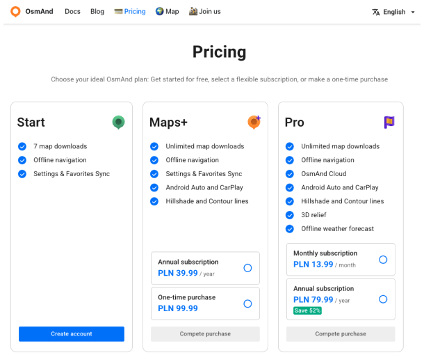
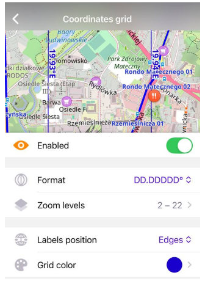

import Tabs from '@theme/Tabs';
import TabItem from '@theme/TabItem';
import AndroidStore from '@site/src/components/buttons/AndroidStore.mdx';
import AppleStore from '@site/src/components/buttons/AppleStore.mdx';
import LinksTelegram from '@site/src/components/_linksTelegram.mdx';
import LinksSocial from '@site/src/components/_linksSocialNetworks.mdx';
import Translate from '@site/src/components/Translate.js';
import InfoIncompleteArticle from '@site/src/components/_infoIncompleteArticle.mdx';
import ProFeature from '@site/src/components/buttons/ProFeature.mdx';

OsmAnd 5.1 for iOS is out now!

We’re excited to bring you the latest update — **OsmAnd 5.1** is now available on the App Store. This version includes interface improvements, easier widget configuration, and new features to make exploring even more intuitive.

[🔄 **Update Now**](https://itunes.apple.com/us/app/osmand-maps-travel-navigate/id934850257)

Download the update and enjoy a better, smoother OsmAnd experience.  
Thanks for being with us — safe travels!

<!--truncate-->

## What's new

• Added support for [web and cross-platform](#cross-platform-purchases) purchases  
• New [Route information](#new-route-information-widget) widget  
• Widgets on the Left & Right panels now include a [height option](#widgets-on-the-left--right-panels)   
• Added a [rename action](#rename-action-for-favorite-groups) for Favorite groups.  
• Added ["Unit of Volume" and "Fuel Tank Capacity"](#unit-of-volume-and-fuel-tank-capacity) options.  
• Added a ["Coordinates Grid"](#coordinates-grid-overlay) overlay.  
• Added the ability to assign [activities to tracks](#assign-activities-to-tracks)  
• Improved [the appearance menu of Favorites](#changing-appearance-of-favorites)  
• [Bug fixes](#bug-fixes)  

### Cross-Platform Purchases

Maps+ and OsmAnd Pro purchases can now be used [across different platforms](https://osmand.net/docs/user/purchases#cross-platform-purchases), including Android, iOS, and the OsmAnd website. This means you can buy a subscription on one platform and use it on another without any additional cost.

Now, you can buy OsmAnd products on [the OsmAnd website](https://osmand.net/docs/user/purchases/web) and use them on your Android or iOS devices, and vice versa. This feature is available for all OsmAnd products, including Maps+ and OsmAnd Pro.

### New Route Information Widget

New [Route information](https://osmand.net/docs/user/widgets/nav-widgets#route-information) widget displays the estimated arrival time, remaining travel time, and distance for the current route. This widget provides essential navigation information at a glance, making it easier to plan your journey and stay informed about your progress.

_Menu → Configure screen → Top panel/Bottom panel → Add widget → Navigation Points → Route information_

### Widgets on the Left & Right Panels

Widgets on the [Left & Right panels](https://osmand.net/docs/user/widgets/configure-screen#panels-customization) include a height option, allowing you to customize the size of the widgets to better fit your preferences and screen layout. This change improves the usability of the widgets and makes them more adaptable to different screen sizes.

### Rename Action for Favorite Groups

You can now [rename Favorite groups](https://osmand.net/docs/user/personal/favorites#favorite-group-actions) directly from the Favorites menu. This feature allows you to organize your favorites more effectively and quickly access the locations you need.

 

### Unit of Volume and Fuel Tank Capacity

The ["Unit of Volume"](https://osmand.net/docs/user/personal/profiles#other) and ["Fuel Tank Capacity"](https://osmand.net/docs/user/navigation/guidance/navigation-settings#vehicle-parameters) options have been added to the settings, allowing you to customize how these measurements are displayed in the app. This change enhances the usability of OsmAnd for users who prefer specific units of measurement.

_Menu → Settings → App profiles → General settings → Units & Formats → Unit of volume_

_Menu → Settings → App profiles → Navigation settings → Vehicle parameters → Fuel tank capacity_

### Coordinates Grid Overlay

A new ["Coordinates Grid" overlay](https://osmand.net/docs/user/map/vector-maps/#coordinates-grid) has been added, providing a visual reference for coordinates on the map. This feature is useful for users who need precise location information and enhances the overall map experience.

_Configure map → Show on map → Coordinates grid_

 

### Assign Activities to Tracks

You can now assign [activities to tracks](https://osmand.net/docs/user/map/tracks/track-context-menu#track-information-activity), allowing you to categorize and organize your recorded tracks more effectively. This feature is particularly useful for users who engage in multiple activities, such as hiking, cycling, or running, and want to keep their tracks organized by activity type.

### Changing Appearance of Favorites

We redesigned [the appearance menu](https://osmand.net/docs/user/personal/favorites#favorite-point) of Favorites, allowing you to customize the look of your favorite locations. You can now choose from various icons and colors to make your favorites more visually appealing and easier to identify.

### Bug fixes

- [OsmAnd does not follow the track.](https://github.com/osmandapp/OsmAnd-iOS/issues/4412)
- [Apple CarPlay Navigation stopped working after switching apps.](https://github.com/osmandapp/OsmAnd-iOS/issues/4442)
- [Broken address search.](https://github.com/osmandapp/OsmAnd-iOS/issues/4598)
- [App crashes in CarPlay when starting navigation.](https://github.com/osmandapp/OsmAnd-iOS/issues/4605)
- [Рage in Maps and Resources does not update after downloading a map.](https://github.com/osmandapp/OsmAnd-iOS/issues/4301)
- [Default profile loses POI overlay settings after restarting the app](https://github.com/osmandapp/OsmAnd-iOS/issues/4455)
- [Endless spinner rotation in Maps & Recouces search.](https://github.com/osmandapp/OsmAnd-iOS/issues/4395)
- [Weather: measurement units cannot be changed from Plugin settings (except Wind animation).](https://github.com/osmandapp/OsmAnd-iOS/issues/4413)
- [Synchronization of the route line when creating a track with the current profile.](https://github.com/osmandapp/OsmAnd-iOS/issues/4392)
- [Some unused not expected values are supported.](https://github.com/osmandapp/OsmAnd/issues/22103)
- [Clear POI search (separate places of worship).](https://github.com/osmandapp/OsmAnd/issues/21972)
- [waterway=flowline missing in data, boat routing broken.](https://github.com/osmandapp/OsmAnd/issues/22512)
- [Show protected areas in Topo Map style.](https://github.com/osmandapp/OsmAnd/issues/22168)
- [Overlapping Contour lines in China.](https://github.com/osmandapp/OsmAnd/issues/22434)
- [Contour line errors on Parallel / Meridian boundaries.](https://github.com/osmandapp/OsmAnd/issues/21738)

_______________________

If you have suggestions for improving the iOS version of the app, please get in touch with us. We appreciate and welcome your contribution to the further development of OsmAnd.

______________________
- **Follow**: <LinksSocial/>  

- **Join**: <LinksTelegram/>  

- **Get**: 

&nbsp;<AppleStore/>