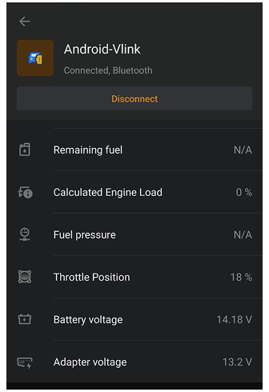
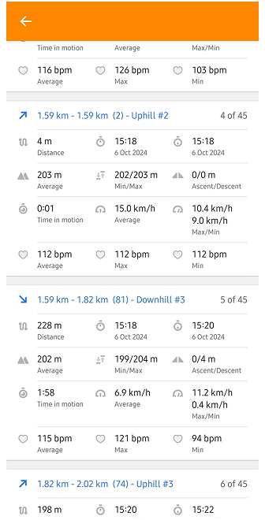
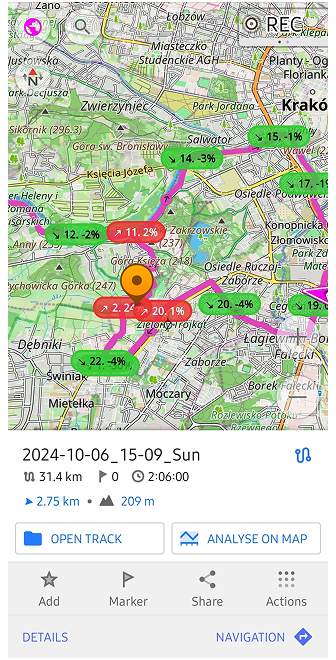
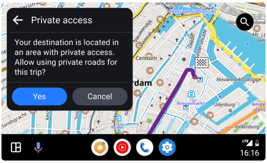
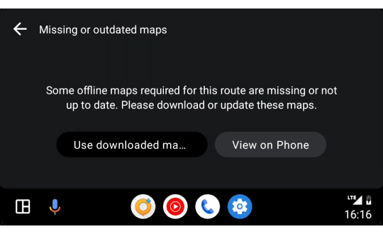
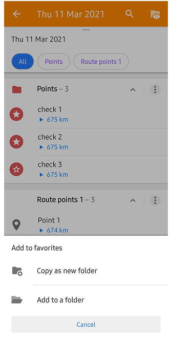
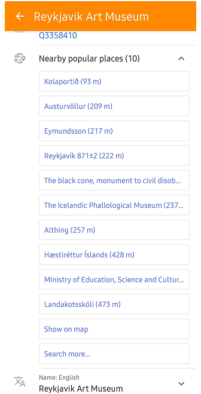
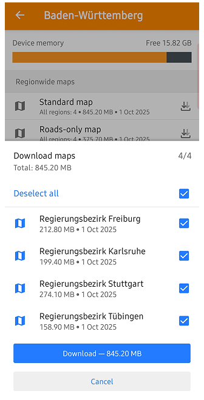

import Tabs from '@theme/Tabs';
import TabItem from '@theme/TabItem';
import AndroidStore from '@site/src/components/buttons/AndroidStore.mdx';
import LinksTelegram from '@site/src/components/_linksTelegram.mdx';
import LinksSocial from '@site/src/components/_linksSocialNetworks.mdx';
import Translate from '@site/src/components/Translate.js';
import InfoIncompleteArticle from '@site/src/components/_infoIncompleteArticle.mdx';
import ProFeature from '@site/src/components/buttons/ProFeature.mdx';
import InfoAndroidOnly from '@site/src/components/_infoAndroidOnly.mdx';

The new Android update is here! 

We've improved the interface, made settings easier to manage, and added new features to make your everyday navigation with OsmAnd even more smooth and enjoyable.

[🔄   **Update Now!**](https://play.google.com/store/apps/dev?id=8483587772816822023)

Thanks for using OsmAnd — safe travels! 

<!--truncate-->

## What's new

- New "Marine" nautical map style with extensive customization options
- Added street and city details to search results
- New Trip Recording widgets: Max Speed, Average Slope, and improved Uphill/Downhill
- Improved map rendering speed
- Enhanced connectivity with OBDII BLE adapters
- Added heart rate metrics to "Analyze by Interval"
- Added duration display for planned tracks
- Added the ability to set altitude units separately from distance 
- Improved map orientation quick action with selectable compass modes
- Android Auto: Pre-navigation alerts for missing maps and private roads
- Fixed an issue with incorrect size parameters for the Radius Ruler widget
- Added inverted screen orientations
- Improved the UI for specifying truck metrics

## New Nautical Map Style

""Marine" is a new nautical map style designed for maritime navigation. 

## Search Improvements

Search results now include street and city details, making it easier to find specific locations.

## New Trip Recording Widgets

New widgets for Trip Recording include Max Speed, Average Slope, and an improved Uphill/Downhill widget that now shows total ascent and descent.

## Map Rendering Speed

We have optimized the map rendering engine (OpenGL) to improve performance, especially on devices with lower specifications.

## Improved OBDII Connectivity

- [OBDII BLE adapters](https://github.com/osmandapp/OsmAnd/issues/21441) can be connected to OsmAnd.

- [OsmAnd reconnects automatically](https://github.com/osmandapp/OsmAnd/issues/23370) to OBDII adapters.

### Battery and Adapter Voltage

[Added battery and adapter voltage display](https://github.com/osmandapp/OsmAnd/issues/23196) when connected to an OBDII adapter.

## Improvements for "Analyze by Interval"

### Added Heart Rate Metrics

If your GPX track contains info about heart rate, you can now monitor your heart rate during activities with the "Analyze by Interval" feature. You can see your average, maximum, and minimum heart rate for each interval and for the entire track.

### Added Downhills/Uphills Analyze

Now, you can split your track for [analyzing downhills, uphills and flats](https://osmand.net/docs/user/map/tracks/track-context-menu#split-by-uphill-downhill) segments. 

 

## Duration Display for Planned Tracks

Planned tracks now display the estimated duration, helping users better plan their trips.

## Altitude Units Setting

Users can now set altitude units (meters or feet) separately from distance units in the settings.

## Map Orientation Quick Action

The map orientation quick action has been improved, allowing users to select between different compass modes.

## Android Auto Enhancements

Now dialogues show about missing maps and private roads before starting navigation like in the mobile app.

 

## Inverted Screen Orientations

Added support for inverted screen orientations, allowing users to use the app in various device orientations.

## Improved UI for Truck Metrics

The user interface for specifying truck metrics has been improved for better usability.

## Other Improvements and Bug Fixes

### Updates copying Waypoints

Added [option](https://osmand.net/docs/user/map/tracks/track-context-menu?current-os=android#actions-with-groups) to copy waypoints between different Favorites folders or create new ones.

### Improved Plan a Route Tool

Added the ability to add POI / Favorite as a via point directly from the map when using the ["Plan a Route" tool](https://osmand.net/docs/user/plan-route/create-route).

### Popular Places for Point Context Menu

The context menu for POIs and Favorites now includes a "Popular Places" section, making it easier to find and navigate to frequently visited locations.

### Improved Actions for Audio Note 

The [stop record action](https://github.com/osmandapp/OsmAnd/issues/22683) for audio notes have been added with external device, and the ability to start-stop record audio notes only with external device.

### Improved UI for Multiregion Download

The UI for downloading multiple regions has been improved for better usability and fixing issue with routing for large files. For example, Baden-Wurttemberg in Germany can be downloaded as multiple regions with 4 files instead of one large file: _Regierungsbezirk Stuttgart, Regierungsbezirk Karlsruhe, Regierungsbezirk Freiburg, Regierungsbezirk Tübingen_.

### Bug fixes

- Fixed [wrong radius location](https://github.com/osmandapp/OsmAnd/issues/23302) for Android Auto;
- Fixed issues with [not updated ETA](https://github.com/osmandapp/OsmAnd/issues/23558) while not moving;
- Fixed [crash while adding OSM Note](https://github.com/osmandapp/OsmAnd/issues/23577);
- Fixed [issue with Track appearance synchronization](https://github.com/osmandapp/OsmAnd/issues/21928) with Cloud;

<!--

- Fixed issue with [Plugin "Trip recording"](https://github.com/osmandapp/OsmAnd/issues/23027): "Auto-split recordings after gap" parameter disabled

-->

_______________________

If you have suggestions for improving the Android version of the app, please get in touch with us. We appreciate and welcome your contribution to the further development of OsmAnd.

__________________________________________________________

- **Follow**: <LinksSocial/>  

- **Join**: <LinksTelegram/>  

- **Get**: &nbsp;<AndroidStore/>