import Tabs from '@theme/Tabs';
import TabItem from '@theme/TabItem';
import AndroidStore from '@site/src/components/buttons/AndroidStore.mdx';
import LinksTelegram from '@site/src/components/_linksTelegram.mdx';
import LinksSocial from '@site/src/components/_linksSocialNetworks.mdx';
import Translate from '@site/src/components/Translate.js';
import InfoIncompleteArticle from '@site/src/components/_infoIncompleteArticle.mdx';
import ProFeature from '@site/src/components/buttons/ProFeature.mdx';
import InfoAndroidOnly from '@site/src/components/_infoAndroidOnly.mdx';

The new Android update is here! 

We've improved the interface, made settings easier to manage, and added new features to make your everyday navigation with OsmAnd even more smooth and enjoyable.

[🔄   **Update Now!**](https://play.google.com/store/apps/dev?id=8483587772816822023)

Thanks for using OsmAnd — safe travels! 

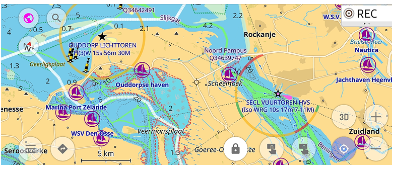

<!--truncate-->

## What's new

- New ["Marine" nautical map style](#new-marine-map-style) with extensive customization options;
- Added [street and city details to search results](#search-improvements);
- New [Trip Recording widgets](#new-trip-recording-widgets): Max Speed, Average Slope, and improved Uphill/Downhill;
- Improved [map rendering speed](#map-rendering-speed);
- Base [automatic sync to OsmAnd Cloud](#base-autosync-to-cloud);
- Improved [OBDII BLE connectivity](#obdii-ble-connectivity);
- Updates of ["Analyze by Interval" feature](#analyze-by-interval-feature);
- Improved [Plan a Route tool](#improved-plan-a-route-tool);
- Added the ability to set [altitude units](#altitude-units) separately from distance units;
- Improved [map orientation quick action](#map-orientation-quick-action) with selectable compass modes;
- [Android Auto enhancements](#android-auto-enhancements);
- [Inverted screen orientations](#inverted-screen-orientations);
- Improved UI for adding [truck metrics in Truck profile settings](#improved-ui-for-truck-metrics);
- More parameters for [route showing on the map](#more-parameters-for-routes);
- [Other improvements](#other-improvements);
- [Bug fixes](#bug-fixes);

## New Nautical Map Style

["Marine"](https://osmand.net/docs/user/map/vector-maps#marine) is a new nautical map style designed for maritime navigation. This style displays [light characteristics](https://wiki.openstreetmap.org/wiki/Seamarks/Lights), [sectorial lights](https://wiki.openstreetmap.org/wiki/Seamarks/Sectored_and_Directional_Lights), and other maritime features. The Map Configure menu after enabling "Marine" style has additional options for customization in the "Other map attributes" section.

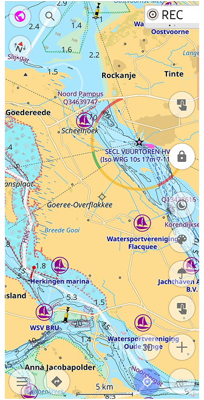 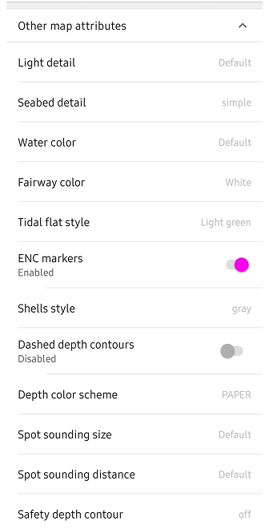

## Search Improvements

[Search results](https://osmand.net/docs/user/search/search-all) now include city info and address details, making it easier to find specific locations.

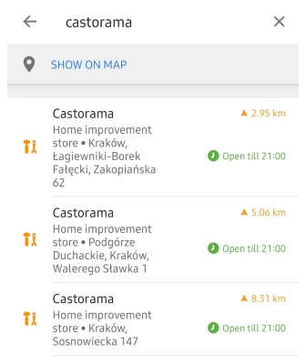 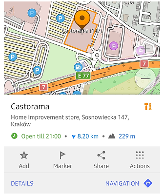

## New Trip Recording Widgets

New widgets for [Trip Recording](https://osmand.net/docs/user/plugins/trip-recording#widgets) include Max Speed, Average Slope, and an improved Uphill/Downhill widget that now shows total ascent and descent:

- Average Slope widget displays average slope for the last downhill or uphill section of the recorded track (can be set in settings or by tap to the widget).

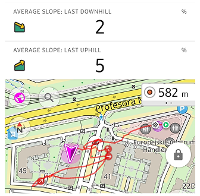

- Max Speed widget shows the maximum speed reached during the recording. Tap to switch between the overall max speed and the max speed of the last uphill or downhill (or choose modes in settings).

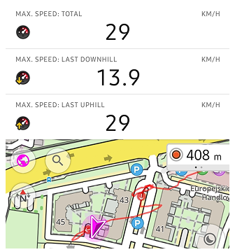

- Improved [Uphill/Downhill widgets](https://osmand.net/docs/user/plugins/trip-recording#duration-uphill-downhill), now its can show or the sum of all ascents/descents, or the last ascent/descent of the currently recorded trip.

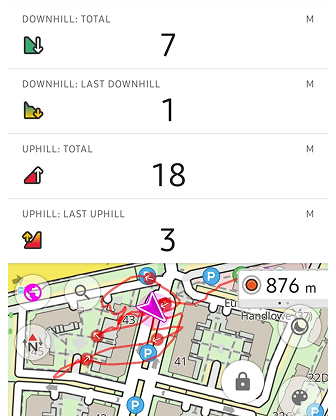

- [Distance widget](https://osmand.net/docs/user/plugins/trip-recording?current-os=android#distance-start-stop) shows total distance of the recorded track, with modes to view the distance of the last ascent and descent.

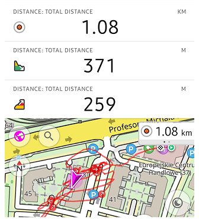

## Map Rendering Speed

We have optimized the [map rendering engine (OpenGL)](https://osmand.net/docs/user/personal/global-settings#map-rendering-engine) to improve performance for rendering maps and map elements, resulting in a smoother experience when navigating and interacting with the map.

## Base Autosync to Cloud

OsmAnd now supports base [automatic synchronization of your settings and data to the OsmAnd cloud](https://osmand.net/docs/user/personal/osmand-cloud), ensuring that your data is always backed up and accessible from any device.

_Menu → Settings → OsmAnd Cloud → ⚙️ → Auto-backup_

## Improved OBDII Connectivity

- [OBDII BLE adapters](https://github.com/osmandapp/OsmAnd/issues/21441) can be connected to OsmAnd.

- [OsmAnd reconnects automatically](https://github.com/osmandapp/OsmAnd/issues/23370) to OBDII adapters.

### Battery and Adapter Voltage

[Added battery and adapter voltage display](https://github.com/osmandapp/OsmAnd/issues/23196) when connected to an OBDII adapter.

### US Parameters for Fuel Consumption

Added [US parameters](https://github.com/osmandapp/OsmAnd/issues/22816) for fuel consumption, allowing users to view fuel efficiency in US gallons per hour, US gallons per 100 miles, and Kilometers per US gallons. 

And for [Remaining fuel](https://osmand.net/docs/user/widgets/info-widgets#vehicle-metrics-widgets): Volume (US gallons)

## Improvements for "Analyze by Interval"

### Added Heart Rate Metrics

If your GPX track contains info about heart rate, you can now monitor your heart rate during activities with the "Analyze by Interval" feature. You can see your average, maximum, and minimum heart rate for each interval and for the entire track.

### Added Downhills/Uphills Analyze

Now, you can split your track for [analyzing downhills, uphills and flats](https://osmand.net/docs/user/map/tracks/track-context-menu#split-by-uphill-downhill) segments. 

 

## Improved Plan a Route Tool

- Added the ability to add POI / Favorite as a via point directly from the map when using the ["Plan a Route" tool](https://osmand.net/docs/user/plan-route/create-route).

- Show duration for the entire route in the Graph section.

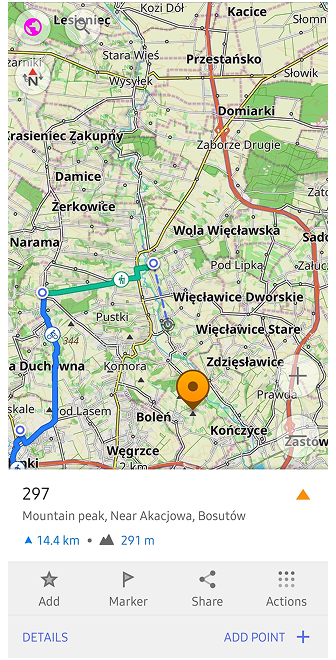 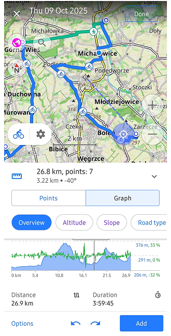

## Altitude Units Setting

Users can now set [altitude units (meters or feet)](https://osmand.net/docs/user/personal/profiles#units--formats) separately from distance units in the settings:

_Menu → Profile Settings → General Settings → Units & formats → Altitude (Meters or Feet)_

## Map Orientation Quick Action

[The map orientation quick action](https://osmand.net/docs/user/widgets/quick-action#settings) has been improved, allowing users to select between different compass modes: _Manually rotated, Movement direction, Compass direction, and North is up_.

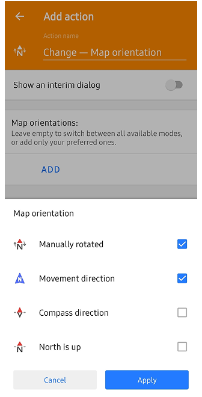

## Android Auto Enhancements

- Now dialogues show about missing maps and private roads before starting navigation like in the mobile app.

 

- Added support for pinch to zoom gesture on the map.

## Inverted Screen Orientations

Added support for inverted screen orientations, allowing users to use the app in [various device orientations](https://osmand.net/docs/user/personal/profiles#appearance):

_OsmAnd menu → Configure profile → General Settings → Screen orientation → Landscape (inverted), Portrait (inverted)_

## Improved UI for Truck Metrics

Now, you can add special truck metrics for Truck profile directly from [the profile settings](https://osmand.net/docs/user/navigation/guidance/vehicle-parameters):

_Menu → Configure profile→ Navigation Settings → Vehicle parameters: Max axle load, Max weight at full load_

## More Parameters for Routes

Now, you can choose more parameters for [routes selection](https://osmand.net/docs/user/map/routes). For example, you can select Hiking routes by OSMC of Regional walking networks.

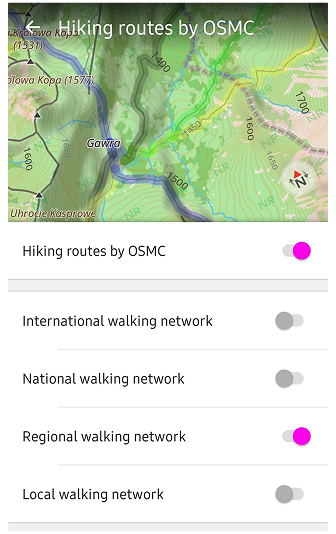

## Other Improvements

### Updates copying Waypoints

Added [option](https://osmand.net/docs/user/map/tracks/track-context-menu?current-os=android#actions-with-groups) to copy waypoints between different Favorites folders or create new ones.

### Popular Places for Point Context Menu

The context menu for POIs and Favorites now includes a "Popular Places" section, making it easier to find and navigate to frequently visited locations.

### Improved Actions for Audio Note 

The [stop record action](https://github.com/osmandapp/OsmAnd/issues/22683) for audio notes have been added with external device, and the ability to start-stop record audio notes only with external device.

### Improved UI for Multiregion Download

The UI for downloading multiple regions has been improved for better usability and fixing issue with routing for large files. For example, Baden-Wurttemberg in Germany can be downloaded as multiple regions with 4 files instead of one large file: _Regierungsbezirk Stuttgart, Regierungsbezirk Karlsruhe, Regierungsbezirk Freiburg, Regierungsbezirk Tübingen_.

### Target Android 15-16 (API level 35)

OsmAnd now targets [Android 15-16](https://developer.android.com/about/versions/15/behavior-changes-15) (API level 35), ensuring compatibility with the latest Android features and improvements.

### Improved Search for US addresses (Tiger)

[The search functionality for US addresses](https://github.com/osmandapp/OsmAnd/issues/22059) using the Tiger dataset has been improved for better accuracy and results.

### Improvements for Ski Slopes and Routes

- Clickable ski slopes and routes on the map have been added, allowing users to easily access information about ski areas.
- Suggest to switch on "Winter and ski" map style when clicking on ski slopes/routes on the Configure map menu.

<!--
### First Implementation of Round Earth Projection

OsmAnd has implemented a round Earth projection for improved map accuracy and representation:
- Choose [Map rendering Engine](https://osmand.net/docs/user/personal/global-settings#map-rendering-engine): OpenGL in settings;
- Enable "Show spherical map" in settings of [OsmAnd development plugin](https://osmand.net/docs/user/plugins/development).

-->

### Update Follow Track Mode

The ["Follow Track"](https://osmand.net/docs/user/navigation/setup/gpx-navigation#follow-track-options) mode has been updated to improve the user experience when navigating along a recorded track with Reverse mode. Now it supports two options: 
- _Original track_: follows the exact track back to the start.
- _Calculate route_: calculates a new, optimized route back to the start.

### New Screen for Add Track Waypoints

A new screen for [adding waypoints](https://osmand.net/docs/user/map/map-context-menu?current-os=android#-add--edit-track-waypoint) to a track has been introduced, allowing users to easily add and manage waypoints while recording a track or for an existing tracks on the map.

### Distance Info for Track Overview

Added distance information for the selected point on the track graph as an additional parameter in the tooltip.

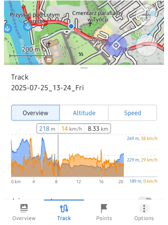

### Added Translations for Help Menu

[Help menu](https://osmand.net/docs/user/start-with/first-steps#offline-help) now includes translations for various languages (“en”, “ar”, “de”, “es”, “fr”, “it”, “nl”, “pl”, “pt”, “tr”, ‘ua’), making it more accessible to users worldwide.

Documentation is displayed in the language set [“For the application”](https://osmand.net/docs/user/start-with/first-steps#how-to-change-app-language) (after changing the language settings, a restart is required).

### More Info for Map Context Menu

Added more information from [OSM data](https://github.com/osmandapp/OsmAnd/issues/20887) to the map context menu for POIs.

## Bug Fixes

- Fixed [wrong radius location](https://github.com/osmandapp/OsmAnd/issues/23302) for Android Auto;
- Fixed issues with [not updated ETA](https://github.com/osmandapp/OsmAnd/issues/23558) while not moving;
- Fixed [crash while adding OSM Note](https://github.com/osmandapp/OsmAnd/issues/23577);
- Fixed [issue with Track appearance synchronization](https://github.com/osmandapp/OsmAnd/issues/21928) with Cloud;
- Fixed bug with [intermitted Map Reset to Current Location](https://github.com/osmandapp/OsmAnd/issues/23495) When Zooming After Searching for a Place;
- Fixed issues with [landscape grid layout](https://github.com/osmandapp/OsmAnd/issues/23431);
- Fixed bug [with importing of large GPX files](https://github.com/osmandapp/OsmAnd/issues/23595) while using OpenGL engine;
- Fixed issue with [missing option to download](https://github.com/osmandapp/OsmAnd/issues/22438) standard map, contour lines map for entire USA;
- Fixed [text color](https://github.com/osmandapp/OsmAnd/issues/22468) for the track appearance legend;

<!--

- Fixed issue with [Plugin "Trip recording"](https://github.com/osmandapp/OsmAnd/issues/23027): "Auto-split recordings after gap" parameter disabled

-->

_______________________

If you have suggestions for improving the Android version of the app, please get in touch with us. We appreciate and welcome your contribution to the further development of OsmAnd.

__________________________________________________________

- **Follow**: <LinksSocial/>  

- **Join**: <LinksTelegram/>  

- **Get**: &nbsp;<AndroidStore/>