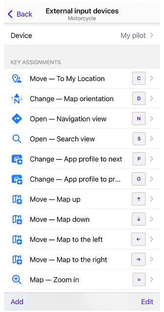
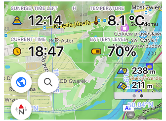
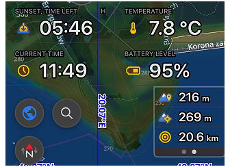
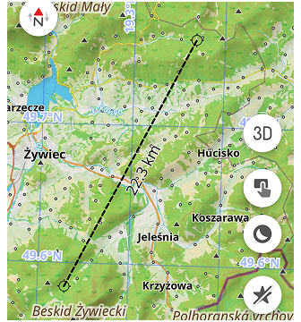
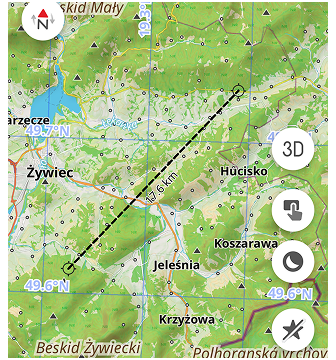
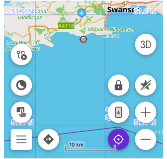
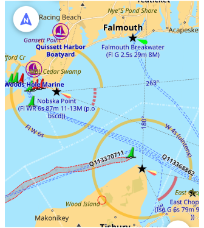

import Tabs from '@theme/Tabs';
import TabItem from '@theme/TabItem';
import AndroidStore from '@site/src/components/buttons/AndroidStore.mdx';
import AppleStore from '@site/src/components/buttons/AppleStore.mdx';
import LinksTelegram from '@site/src/components/_linksTelegram.mdx';
import LinksSocial from '@site/src/components/_linksSocialNetworks.mdx';
import Translate from '@site/src/components/Translate.js';
import InfoIncompleteArticle from '@site/src/components/_infoIncompleteArticle.mdx';
import ProFeature from '@site/src/components/buttons/ProFeature.mdx';

OsmAnd 5.2 for iOS — Now Available!

We're excited to announce the release of OsmAnd 5.2 for iOS! This update delivers powerful customization and clarity improvements. Key features include the new Marine Map Style for nautical navigation, Custom Button Binding for external controllers to map any Quick Action, and enhanced map display with text outlines for all widgets and a precision grid for aligning map buttons. Download now for a smoother, more personalized experience!

[🔄 **Update Now**](https://itunes.apple.com/us/app/osmand-maps-travel-navigate/id934850257)

<!--truncate-->

## What's new

-  Added [custom button binding for external controllers](#custom-button-binding-for-external-controllers), with the ability to assign any Quick Action to a keyboard button; 
-  Added [text outlines](#text-outlines-for-widgets) to all widgets for better visibility; 
-  Added the ability to resize text in [the Distance by tap tool](https://osmand.net/docs/user/widgets/radius-ruler#distance-by-tap);
-  Added a [precision grid](#precision-grid-for-aligning-map-buttons) for aligning your map buttons;
-  Moved [the temperature units](#temperature-units-in-general-settings) selection to General Settings;
-  Added [altitude units setting](#altitude-units-setting);
-  New [Marine map style](#new-marine-map-style);
-  Improved UI for adding [truck metrics in Truck profile settings](#improved-ui-for-truck-metrics);
-  [Other improvements](#other-improvements);
-  [Bug fixes](#bug-fixes);

## Custom button binding for External Controllers

OsmAnd now supports [customizable buttons](https://osmand.net/docs/user/map/interact-with-map#custom-input-device-type) for external controllers. You can assign any [Quick Action](https://osmand.net/docs/user/widgets/quick-action#action-types) to a keyboard button, allowing for a more personalized navigation experience:

_Menu → Settings → Choose Profile → General settings → External input devices → Device → Add_

## Text Outlines for Widgets

All widgets now feature text outlines, enhancing visibility against various map backgrounds.

 

## Resizable Text in Distance Measurement Tool

You can now resize the text in [the Distance by tap tool](https://osmand.net/docs/user/widgets/radius-ruler#distance-by-tap). Two variants are available: Normal and Large, making it easier to read distances on the map.

 

## Precision Grid for Aligning Map Buttons

A new precision grid has been added to help you align your [map buttons](https://osmand.net/docs/user/widgets/quick-action#buttons-on-the-screen) more accurately.

## Temperature Units in General Settings

The temperature units selection has been moved to [General Settings](https://osmand.net/docs/user/personal/profiles#units--formats) for easier access:

_Menu → Settings (Select Profile) → General Settings → Units & formats → Temperature (Device settings, Celsius or Fahrenheit)_

## Altitude Units Setting

Users can now set [altitude units (meters or feet)](https://osmand.net/docs/user/personal/profiles#units--formats) separately from distance units in the settings:

_Menu → Settings (Select Profile) → General Settings → Units & formats → Altitude (Meters or Feet)_

## New Marine Map Style

["Marine"](https://osmand.net/docs/user/map/vector-maps#marine) is a new nautical map style designed for maritime navigation. This style displays [light characteristics](https://wiki.openstreetmap.org/wiki/Seamarks/Lights), [sectorial lights](https://wiki.openstreetmap.org/wiki/Seamarks/Sectored_and_Directional_Lights), and other maritime features. The Map Configure menu after enabling "Marine" style has additional options for customization in the "Other map attributes" section.

## Improved UI for Truck Metrics

Now, you can add special truck metrics for Truck profile directly from [the profile settings](https://osmand.net/docs/user/navigation/guidance/vehicle-parameters#limits):

_Menu → Settings (Track profile)→ Navigation Settings → Vehicle parameters: Max axle load, Max weight at full load_

## Other Improvements

- General [stability](https://github.com/osmandapp/OsmAnd-iOS/issues/4653) and performance improvements on CarPlay;
- Improved [place of Location icon](https://github.com/osmandapp/OsmAnd-iOS/issues/4843) on CarPlay;
- Added [Auto zoom for 3D angle](https://github.com/osmandapp/OsmAnd-iOS/issues/4908);
- Showed [grouped regions](https://github.com/osmandapp/OsmAnd-iOS/issues/4815) for USA, Australia, UK downloads;
- Improved selection of [type colorisation for tracks](https://github.com/osmandapp/OsmAnd-iOS/issues/4646);
- Added setting of enabling Next turn information for [Street name](https://osmand.net/docs/user/widgets/nav-widgets#street-name) widget;
- Added ability [to reconnect to sensor](https://github.com/osmandapp/OsmAnd-iOS/issues/4657) by tapping on the widget;
- Added the [Radius Ruler widget](https://osmand.net/docs/user/widgets/radius-ruler) to [Top and Bottom panels](https://github.com/osmandapp/OsmAnd-iOS/issues/4826);
- Showed [distance on graph slider](https://github.com/osmandapp/OsmAnd-iOS/issues/4877) in the [Track Context menu](https://osmand.net/docs/user/map/tracks/track-context-menu);

## Bug fixes

- Fixed an issue that [prevented some widgets from being move](https://github.com/osmandapp/OsmAnd-iOS/issues/4737);
- Fixed [incorrect distance display](https://github.com/osmandapp/OsmAnd-iOS/issues/4791) in 'Next Turn' widget;
- Fixed bug with [map updates appearing](https://github.com/osmandapp/OsmAnd-iOS/issues/4761) in iCloud Backup;
- Fixed bug with [Update All button](https://github.com/osmandapp/OsmAnd-iOS/issues/4859);
- Fixed bug with [not exporting of tracks appearing](https://github.com/osmandapp/OsmAnd-iOS/issues/4559) to info files in OsmAnd Cloud;
- Fixed [CarPlay switching](https://github.com/osmandapp/OsmAnd-iOS/issues/4912) to the first Driving profile when switching to the Dashboard and back;

_______________________

If you have suggestions for improving the iOS version of the app, please get in touch with us. We appreciate and welcome your contribution to the further development of OsmAnd.

______________________
- **Follow**: <LinksSocial/>  

- **Join**: <LinksTelegram/>  

- **Get**: 

&nbsp;<AppleStore/>