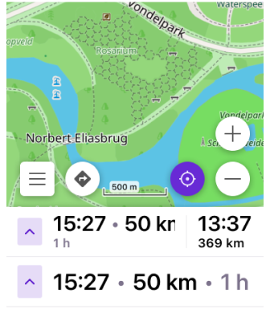

import Tabs from '@theme/Tabs';
import TabItem from '@theme/TabItem';
import AndroidStore from '@site/src/components/buttons/AndroidStore.mdx';
import AppleStore from '@site/src/components/buttons/AppleStore.mdx';
import LinksTelegram from '@site/src/components/_linksTelegram.mdx';
import LinksSocial from '@site/src/components/_linksSocialNetworks.mdx';
import Translate from '@site/src/components/Translate.js';
import InfoIncompleteArticle from '@site/src/components/_infoIncompleteArticle.mdx';
import ProFeature from '@site/src/components/buttons/ProFeature.mdx';
import InfoAndroidOnly from '@site/src/components/_infoAndroidOnly.mdx';

Happy New Year from OsmAnd!

As we welcome 2026, we reflect on an exciting year behind us — one that marked OsmAnd's 15th anniversary and introduced major innovations to our navigation experience. Among the most significant milestones of 2025 was the launch of our new fast offline routing, designed to make your routes smoother, calculations quicker, and travel even more efficient — no internet connection required.

This breakthrough, together with continuous design improvements and enhanced usability, brought OsmAnd to a new level for millions of users worldwide. Now, as we move into 2026, we're ready to build on that foundation, shaping the future of navigation with even smarter, more connected solutions.

The journey continues — and we're thrilled to have you with us.

<!--truncate-->

## 2026 New Year Resolutions

At OsmAnd, every new year brings fresh ideas and an even stronger drive to make navigation smarter, faster, and more intuitive. As we step into 2026, we're excited to continue innovating and delivering a more seamless experience for every traveler.

Here's a glimpse of what's coming next.

## Map

### 3D Buildings

*A new dimension of exploration.*  
Discover maps like never before with detailed 3D building representations that make navigation more immersive and visually engaging. This update also introduces dynamic lighting, rendering realistic sun positions and cast shadows based on the time of day.

### Globe View

 

Experience the world as it truly is — round!  
In 2026, OsmAnd will introduce **Globe View**, allowing you to see the planet from a global perspective and seamlessly plan routes across continents.

### Adjustable Map Style

In 2025, we expanded [route configuration options](https://osmand.net/docs/user/map/routes#display-routes-on-the-map).  
Next in 2026, we're releasing a **Adjustable Map Style** — giving you full control over how your map looks and helping you understand every layer at a glance. Tailor your OsmAnd maps perfectly for your next adventure.

## Routes

### Route Details & Alerts

Gain deeper insights into your journey with expanded route details. We are improving the overview of time, distance, and alternative transportation options so you can make smarter decisions on the fly.

### Alternative routes

We are launching a dedicated tool to generate Alternative Routes and automated Roundtrips. This feature will calculate paths that take into account your specific advanced routing preferences.

### Share your Location & GPX

*Stay connected. Share the adventure.*  

We have already implemented GPX sharing on the Web platform and Autosync with the cloud for Android. The next step is to finalize a solution for sharing data with your friends and family directly from OsmAnd, eliminating the need for 3rd party tools.

### Public GPX Track Collection

In 2025, we added the ability to store extra data in GPX files, such as Keywords & Activity types, which are then provided to the OpenStreetMap website. Now, we are ready to utilize this data to organize tracks by activity and visualize all the publicly available tracks that you have uploaded.

## Miscellaneous

### Manage Favorites & Media

Revamping the Favorites screen has been a goal of ours for quite some time. This year, we are moving forward with a major redesign. Beyond just a fresh look, we are expanding the functionality to handle media attachments and organize locations into smart folders. Our goal is to transform your Favorites into a rich personal travel log.

### Astronomy Plugin

 

We're reaching for the stars — literally.  
A new **Astronomy plugin** will arrive in 2026, letting you identify planets, stars, and constellations right from your map. Explore the night sky as easily as you explore the Earth.

### Smartwatches

In 2025, we laid the groundwork for wearable integration — and now it's coming to life! In 2026, OsmAnd will launch Smartwatch support, allowing you to browse and record tracks, or follow navigation instructions right from your wrist. Compact, convenient, and perfect for explorers on the move. Specific updates include:

- Garmin Connect integration: Seamless trip recording and data syncing.
- Navigation: Turn-by-turn instructions displayed directly on your watch.

### Pricing

To support ongoing development, rising infrastructure costs, and new features planned for this year, subscription and in‑app prices will slightly increase in 2026. This adjustment helps us maintain OsmAnd's high quality, enhance user support, and bring even more value through future updates.

## 2025 Achievements

In 2025, OsmAnd reached new milestones that reshaped the way you navigate the world. Here's a glimpse of how we turned resolutions into reality, bringing innovation and usability to every corner of our app.

[5.0](https://osmand.net/blog/osmand-ios-5-0-released), [5.1](https://osmand.net/blog/osmand-ios-5-1-released), [5.2](https://osmand.net/blog/osmand-ios-5-2-released) **(iOS)**; [5.0](https://osmand.net/blog/osmand-android-5-0-released), [5.1](https://osmand.net/blog/osmand-android-5-1-released), [5.2](https://osmand.net/blog/osmand-android-5-2-released) **(Android)**, [web beta 1.02](https://osmand.net/docs/user/web/) Map **Web**.

[Resolutions 2025](https://osmand.net/blog/ny-resolutions-2025):

- ✔️ **Fast Offline Routing**. The game-changer of 2025 — lightning-fast route calculations for long-distance travel, even without internet.
- ✔️ **Explore Popular Places**. Discover hotspots with improved *Explore* functionality and enhanced POI photo galleries on Android, iOS and Web.
- ✔️ **Main Navigation Widgets**. Customizable tools that keep essential route info at your fingertips for smoother journeys. 
- ✔️ **New and improved widgets**. Trip recording widgets, Route Information Widget, Added text outlines.
<!-- - ✔️ **Extended Route Details**. Deeper insights into time, distance, and alternatives to help you plan smarter.-->
<!-- - ✔️ **Share Favorites, GPX, and Locations**. One-tap sharing of tracks, spots, and live routes to keep adventures connected.-->
- ✔️ **Demo Show spherical map**. Works only with OsmAnd develompent plugin, shows round Earth.
- ✔️ **Automatic Cloud Sync. (Android)** Introduced reliable, background synchronization for OsmAnd Cloud.

### iOS

**OsmAnd iOS: 2025 Feature Overview**

In 2025, OsmAnd for iOS achieved parity with many of its Android counterparts while introducing unique interface improvements and cross-platform synergy.

---

**[OsmAnd 5.0](https://osmand.net/blog/osmand-ios-5-0-released) (April 2025)**
*Focus: Organization and Visual Discovery*

| Wikimedia Gallery Redesign | Polygon Information   |
|-----|------|
| | |

* [**Smart Folders for Tracks:**](https://osmand.net/blog/osmand-ios-5-0-released/#smart-folders-for-automatic-track-organization) Introduced automatic organization for recorded tracks, allowing users to group them by date, activity type, or specific folders.
* [**Wikimedia Gallery Redesign:**](https://osmand.net/blog/osmand-ios-5-0-released/#redesign-image-block-in-context-menu) A new full-screen gallery interface for exploring Wikipedia photos of nearby locations.
* [**Polygon Information:**](https://osmand.net/blog/osmand-ios-5-0-released/#polygon-selection-for-nearby-areas) Enhanced map interaction allowing users to view detailed data for specific areas (polygons) with a long-press.
* [**Favorite Visibility Toggles:**](https://osmand.net/blog/osmand-ios-5-0-released/#toggle-visibility-for-favorite-groups) Users can now quickly hide or show specific favorite groups to declutter the map view.
* [**BLE Sensor Battery Status:**](https://osmand.net/blog/osmand-ios-5-0-released/#battery-status-for-external-sensors) Added the ability to monitor the battery levels of connected Bluetooth Low Energy sensors directly in the app.

---

**[OsmAnd 5.1](https://osmand.net/blog/osmand-ios-5-1-released) (June 2025)**
*Focus: Connectivity and Customization*

| Route Information widget | Coordinates Grid   |
|-----|------|
| | |

* [**Cross-Platform Subscriptions:**](https://osmand.net/blog/osmand-ios-5-1-released/#cross-platform-purchases) A major update enabling **Maps+ and OsmAnd Pro** purchases to be shared seamlessly between iOS, Android, and Web platforms.
* [**New Route Information Widget:**](https://osmand.net/blog/osmand-ios-5-1-released/#new-route-information-widget) A consolidated widget for the top/bottom panels displaying ETA, travel time, and distance to destination.
* [**Side Panel Customization:**](https://osmand.net/blog/osmand-ios-5-1-released/#widgets-on-the-left--right-panels) Added height adjustments for left and right panel widgets, optimizing the layout for iPad and larger iPhones.
* [**Track Activity Assignments:**](https://osmand.net/blog/osmand-ios-5-1-released/#assign-activities-to-tracks) Users can now assign specific activities (e.g., Hiking, Sailing) to tracks during or after recording.
* [**Coordinate Grid:**](https://osmand.net/blog/osmand-ios-5-1-released/#coordinates-grid-overlay) Added a toggleable geographic coordinate grid overlay on the map.

---

**[OsmAnd 5.2](https://osmand.net/blog/osmand-ios-5-2-released) (November 2025)**
*Focus: Specialized Navigation and Precision*

| Grid for Map Buttons | Text Outlines for Widgets  |
|-----|------|
| | |

* [**Marine Map Style:**](https://osmand.net/blog/osmand-ios-5-2-released/#new-marine-map-style) Implementation of a dedicated nautical map with support for depth contours, light sectors, and maritime navigation marks.
* [**Custom Button Binding:**](https://osmand.net/blog/osmand-ios-5-2-released/#custom-button-binding-for-external-controllers) External controllers (keyboards/remotes) can now be mapped to trigger specific "Quick Actions."
* [**Widget Readability:**](https://osmand.net/blog/osmand-ios-5-2-released/#text-outlines-for-widgets) Added text outlines to all widgets to ensure visibility regardless of the underlying map colors or terrain.
* [**Precision Layout Grid:**](https://osmand.net/blog/osmand-ios-5-2-released/#precision-grid-for-aligning-map-buttons) A new UI tool to help users align map buttons and widgets perfectly on their screen.
* [**Independent Altitude Units:**](https://osmand.net/blog/osmand-ios-5-2-released/#altitude-units-setting) Support for choosing altitude units (meters/feet) separately from the primary distance units.

---

### Android 

**OsmAnd Android: 2025 Feature Overview**

In 2025, OsmAnd released three major updates (5.0, 5.1, and 5.2) that significantly enhanced the app's navigation engine, cloud integration, and specialized map styles.

---

**[OsmAnd 5.0](https://osmand.net/blog/osmand-android-5-0-released) (April 2025)**
*Focus: Exploration and Interface Customization*

| Explore Mode | Route Guidance widget  |
|-----|------|
| | |

* [**Explore Mode:**](https://osmand.net/blog/osmand-android-5-0-released/#popular-places-wikipedia) A new discovery tool for top-ranked and nearby Points of Interest (POIs), now featuring photos in the search results.
* [**Comprehensive Route Search:**](https://osmand.net/blog/osmand-android-5-0-released/#all-osm-routes--now-searchable) Integration of all OpenStreetMap (OSM) routes (Hiking, Cycling, MTB) directly into the search and navigation menu.
* **New Navigation Widgets:**
    * [**Combined Widget:**](https://osmand.net/blog/osmand-android-5-0-released/#route-guidance-widgets-set) Displays turn arrows and instructions in a single block for top/bottom panels.
    * [**Current Route Info:**](https://osmand.net/blog/osmand-android-5-0-released/#new-route-information-widget) A consolidated view of ETA, arrival time, and remaining distance.
* [**Resizable Side Panels:**](https://osmand.net/blog/osmand-android-5-0-released/#resizable-widgets-for-side-panels) Added the ability to independently resize widgets on the left and right side panels.
* [**Coordinate Grid:**](https://osmand.net/blog/osmand-android-5-0-released/#coordinates-grid-overlay) Option to display a geographical coordinate grid directly on the map.
* [**Technical Details for Sports:**](https://osmand.net/blog/osmand-android-5-0-released/#ski-slopes-and-mtb-trails-information) Specific technical information is now available for selected ski slopes and MTB trails.

---

**[OsmAnd 5.1](https://osmand.net/blog/osmand-android-5-1-released) (June 2025)**
*Focus: Performance and 15th Anniversary*

| Widget Outline | Uphills/Downhills Analyzer  |
|-----|------|
| | |

* [**Cross-Platform Subscriptions:**](https://osmand.net/blog/osmand-android-5-1-released#cross-platform-purchases) A major update enabling **Maps+ and OsmAnd Pro** purchases to be shared seamlessly between iOS, Android, and Web platforms.
* [**Faster Offline Navigation:**](https://osmand.net/blog/fast-routing/) A major update to the routing engine significantly reduced calculation times for long-distance and complex trips.
* [**Smarter Sensors:**](https://osmand.net/blog/osmand-android-5-1-released/#ble-sensors-battery-level) BLE sensors now show battery level directly in OsmAnd.
* [**Readable Widgets:**](https://osmand.net/blog/osmand-android-5-1-released/#widget-outline) New outlines improve visibility, especially with transparent styles.
* [**Richer Places Info:**](https://osmand.net/blog/osmand-android-5-1-released/#wikipedia--wikivoyage-integration) Expanded Wikipedia and Wikivoyage integration brings more POIs to your maps.

---

**[OsmAnd 5.2](https://osmand.net/blog/osmand-android-5-2-released) (November 2025)**
*Focus: Data Reliability and Nautical Navigation*

| More Parameters for Routes | New Nautical Map Style  |
|-----|------|
| | |

* [**Automatic Cloud Sync:**](https://osmand.net/blog/osmand-android-5-2-released/#base-autosync-to-cloud) Introduced reliable, background synchronization for **OsmAnd Cloud**, ensuring Favorites, Settings, and Profiles are backed up across devices.
* [**Marine Map Style:**](https://osmand.net/blog/osmand-android-5-2-released/#new-nautical-map-style) A dedicated map style for nautical use, featuring high customization for depth, beacons, and navigation aids.
* [**Trip Recording Enhancements:**](https://osmand.net/blog/osmand-android-5-2-released/#new-trip-recording-widgets)
    * New widgets for **Max Speed** and **Average Slope**.
    * Improved **Uphill/Downhill** widget showing total elevation gain/loss.
* [**Enhanced Connectivity:**](https://osmand.net/blog/osmand-android-5-2-released/#obdii-ble-connectivity) Improved **OBD-II BLE** support, including new live data metrics like fuel consumption and adapter voltage.
* [**Search Context:**](https://osmand.net/blog/osmand-android-5-2-released/#search-improvements) Street and city details are now shown directly within the search result list for faster identification.

---

### Web

**What's New: OsmAnd Web ([osmand.net/map](https://osmand.net/map)) - 2025**

The [OsmAnd Web Portal](https://osmand.net/docs/user/web/) has evolved into a full-featured route planner and data manager. Below are the key features added in the latest versions.

___

| Update Navigation UI | 
|-----|
| |

**Core New Features**
* **GPX & Favorite Sharing:** Easily share your data via direct links.
* **Unified UI:** A redesigned sidebar and navigation menu for better accessibility.
* **Wikimedia Photo Gallery:** View site-specific photography for POIs directly in your browser.

___

| Update Navigation UI | 
|-----|
| |

**Navigation & Planning**
* **Advanced Route Planner:** Create complex routes for Car, Bike, or Pedestrian profiles.
* **Cross-Platform Sync:** Favorites and tracks now autosync via OsmAnd Cloud.
* **Weather Layers:** 7-day forecast overlays (Wind, Temp, Rain) with source switching (GFS/ECMWF).

___

| Pricing | 
|-----|
| |

**Account & Subscriptions**
* **Multi-Platform Access:** Use your Android or iOS 'Pro' subscription on the web.
* **Cloud Trash & History:** Manage deleted files and view a chronological list of data changes from all your devices.
* **Direct Purchases:** You can now purchase **Maps+** and **Pro** subscriptions directly via [osmand.net/pricing](https://osmand.net/pricing). These direct purchases are managed via FastSpring and provide instant cross-platform access.

## Summary

Looking ahead, we are excited about the future and committed to make OsmAnd the best navigation app for everyone. Thank you for your trust, feedback, and continued support throughout 2025. Together, let's make 2026 another year of progress and success!  

**Happy New Year 2026!**

*Victor Shcherb & OsmAnd Team*

_________________

*For more details, check out our past resolutions and achievements:*

- [2025 New Year Resolutions](https://osmand.net/blog/ny-resolutions-2025/)  
- [2024 New Year Resolutions](https://osmand.net/blog/ny-resolutions-2024/)  

_________________

Please feel free to contact us. We appreciate and welcome every contribution you make to the further development of OsmAnd.

- **Follow**: <LinksSocial/>  

- **Join**: <LinksTelegram/>  

- **Get**: &nbsp;<AndroidStore/>  

    <AppleStore/>
