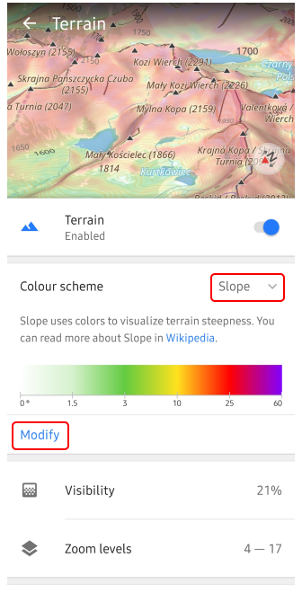
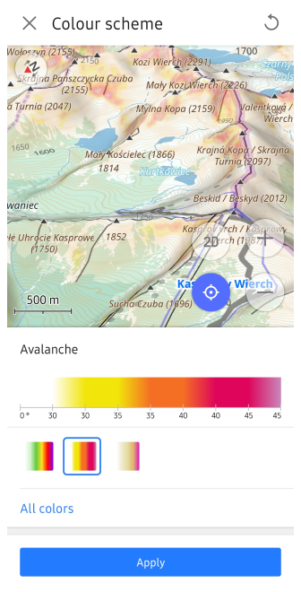
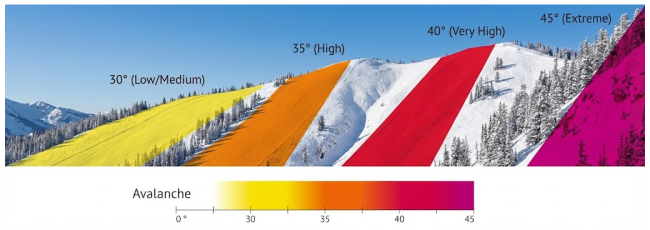

import Tabs from '@theme/Tabs';
import TabItem from '@theme/TabItem';
import AndroidStore from '@site/src/components/buttons/AndroidStore.mdx';
import AppleStore from '@site/src/components/buttons/AppleStore.mdx';
import LinksTelegram from '@site/src/components/_linksTelegram.mdx';
import LinksSocial from '@site/src/components/_linksSocialNetworks.mdx';
import Translate from '@site/src/components/Translate.js';
import InfoIncompleteArticle from '@site/src/components/_infoIncompleteArticle.mdx';
import ProFeature from '@site/src/components/buttons/ProFeature.mdx';

# Avalanche Color Scheme in OsmAnd Topography Plugin

OsmAnd's [Topography plugin](https://osmand.net/docs/user/plugins/topography) offers an **Avalanche color scheme** for the [Slope layer](https://osmand.net/docs/user/plugins/topography#default-color-scheme), coloring terrain by steepness to highlight potential avalanche risks. This visualizes slope angles intuitively for safer backcountry navigation. 

<!-- truncate -->

## How to Enable Avalanche Colors

>Avalanche colors requires the [OsmAnd Pro](https://osmand.net/docs/user/purchases/web#free-and-paid-features) version.

1. **Enable the plugin**: Go to [_Main Menu → Plugins → Topography_](https://osmand.net/docs/user/plugins/topography) (requires OsmAnd Pro).
2. **Download maps**: In [_Menu → Maps & Resources_](https://osmand.net/docs/user/personal/maps-resources#downloads-menu), select Terrain map (3D) for your region under Worldwide or Regions.
3. **Activate layer**: [_Menu → Configure map → Topography → Terrain → Slope_](https://osmand.net/docs/user/map/configure-map-menu#map-layers). Choose Avalanche from _Modify_ button (only OsmAnd Pro).

 

## Who It's For

- Backcountry enthusiasts: Skiers, snowboarders, snowshoers assessing terrain exposure offline.
- Risk-aware adventurers: Pair with daily avalanche forecasts for freeride planning (over 30 deg highlights danger).
- General hikers/bikers: Spot steep sections quickly in any terrain.

**Winter tip**: During winter season, combine with [**Snowmobile**](https://osmand.net/docs/user/map/vector-maps#snowmobile), [**Winter and Ski**](https://osmand.net/docs/user/map/vector-maps#winter-and-ski) map styles and matching [Navigation Profiles](https://osmand.net/docs/user/navigation/routing/ski-routing) for optimal backcountry use.

## Benefits and Tips

The scheme starts transparent (under 30 deg), then gradients to yellow/orange (30-40 deg) and red/purple (over 40-45 deg high-risk), as shown in the legend—focusing colors on risky slopes only. Powered by precise DEM sources including ALOS (JAXA), MERIT DEM, ArcticDEM, and European LiDAR DTMs—for coverage from 70°N to 70°S and beyond.

**Pro tips**:
- Layer with [Contour lines](https://osmand.net/docs/user/plugins/topography#contour-lines) (every 20m) for elevation context.
- Customize palettes via [Modify Color Scheme](https://osmand.net/docs/user/personal/color-palette-schemes#palette-modify) (Pro).
- Performance: Clear cache; enable [OpenGL renderer](https://osmand.net/docs/user/personal/global-settings#map-rendering-engine).

> Stay safe: Colors indicate terrain steepness, not live avalanche risk—combine with forecasts!

______________________________________________

**We appreciate your interest in us and thank you for taking the time to read this article. Join us on social media to keep up to date with the latest news and share your experiences. Your opinion is important to us.**

<LinksSocial/>
<LinksTelegram/>