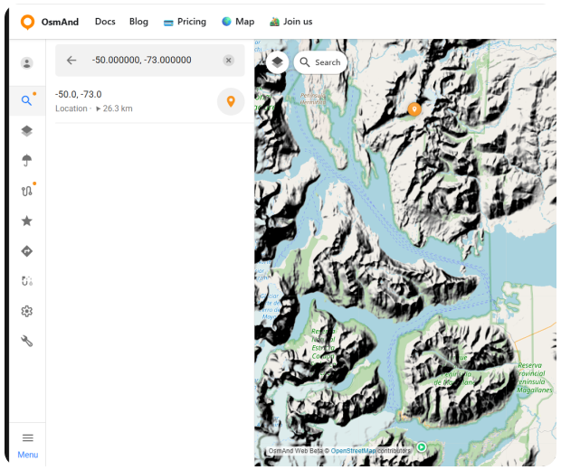
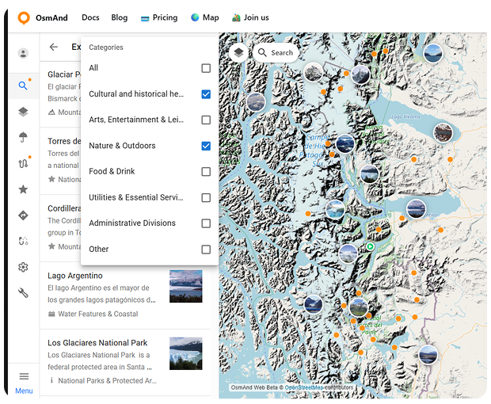
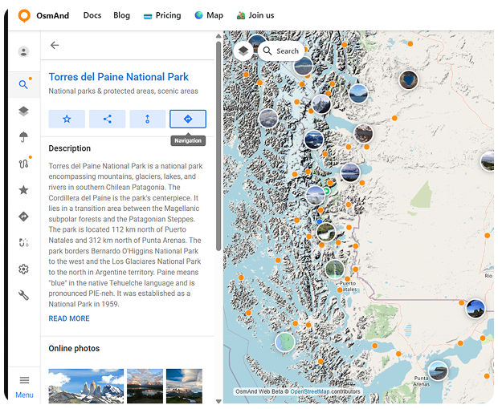

import Tabs from '@theme/Tabs';
import TabItem from '@theme/TabItem';
import AndroidStore from '@site/src/components/buttons/AndroidStore.mdx';
import AppleStore from '@site/src/components/buttons/AppleStore.mdx';
import LinksTelegram from '@site/src/components/_linksTelegram.mdx';
import LinksSocial from '@site/src/components/_linksSocialNetworks.mdx';
import Translate from '@site/src/components/Translate.js';
import InfoIncompleteArticle from '@site/src/components/_infoIncompleteArticle.mdx';
import ProFeature from '@site/src/components/buttons/ProFeature.mdx';

In classic adventure stories, traveling through remote regions meant you had to rely on maps, luck, and intuition. Patagonia — famously portrayed in *"In Search of the Castaways"* — was once a place of uncertainty and long, unpredictable routes. Today, exploring Patagonia can look very different with [OsmAnd Web Explore](https://osmand.net/docs/user/web/web-search#explore). Modern tools make it easy to discover key places, explore what’s nearby, and plan routes across one of the world’s most spectacular regions.

<!-- truncate -->

## Let’s Start with a Search

February is a great time to explore Patagonia — it’s summer in the Southern Hemisphere, with long daylight hours and easier access to remote areas. A quick online search for “Patagonia must-sees” almost always brings up one name: **Los Glaciares National Park** in Argentina — a UNESCO World Heritage site since 1981.

So why not make it the starting point of our journey?

Open OsmAnd Web and tap the Search icon on the map. You can search not only by place name, but also by exact coordinates — a handy option when you know the location but not the name. For this example, enter the coordinates -50.000000, -73.000000. The map instantly centers on this point and places a pin in the heart of Patagonia, near Lago Argentino and the glaciers that give the park its name.

Selecting the location opens the context panel, where you can review the position, copy the coordinates, and use quick actions to keep planning.

## Explore Nearby and Start Navigation

With the map centered on the Los Glaciares area, tap [Explore](https://osmand.net/docs/user/web/web-search#explore). OsmAnd instantly highlights interesting places around you, turning the surrounding landscape into a collection of discoverable spots — viewpoints, lakes, glaciers, mountain ranges, and protected areas.

Each place comes with useful information: a name, category, short description, and often photos. To narrow things down, you can use filters to show only what matters to you — for example, Nature & Outdoors. This makes it easy to move from a broad view of the region to a focused list of places worth adding to your journey. By the way, if you prefer exploring on the go, OsmAnd also offers a similar Explore feature in the mobile app (*Android only*) — see the step-by-step guide [here](https://osmand.net/docs/user/map/popular_places#explore-in-search).

Among the many results, one destination stands out almost immediately: **Torres del Paine National Park** — this time across the border, in Chile. It’s one of Patagonia’s most iconic national parks, and a natural next step for our route.

Selecting Torres del Paine opens the POI context menu, where you can save the park to your Favorites, share a direct link to it, or jump straight into route planning and navigation.

Choose [Navigation](https://osmand.net/docs/user/web/web-navigation), and the selected park becomes your destination point. For the starting point, set **Los Glaciares National Park**. If you want to shape the journey more precisely, you can add [intermediate points](https://osmand.net/docs/user/web/web-navigation#manage-route-points) along the way — useful when you want the route to pass through specific locations, border crossings, or scenic stops.

Next, select the routing profile that fits your plans. OsmAnd recalculates the route instantly, drawing a clear path between these two landmark destinations and showing distance, estimated travel time, and elevation profile.

What once would have required multiple maps and guesswork now becomes a clear, flexible plan — ready to adapt as your adventure unfolds.

## One Route, Multiple Ways to Travel

Patagonia isn’t just about long roads and mountain passes. In Chilean Patagonia, travel often includes water as well — fjords, channels, and scenic ferry routes that cut through dramatic landscapes. One of the most famous examples is the Navimag ferry, which connects **Puerto Montt** and **Puerto Natales**, offering a multi-day journey through Chile’s southern fjords.

When a journey includes different types of terrain and transport, planning everything as a single route can be a challenge. This is where [OsmAnd Web Plan Route](https://osmand.net/docs/user/web/planner) really shines. In the route planner, you can build one continuous track and change the routing profile for individual segments. Drive between towns, switch to a boat profile for ferry crossings, then return to a pedestrian or driving profile for the next part of the journey — all within the same route.

Using the [Change profile](https://osmand.net/docs/user/web/planner#manage-track) option, you decide whether a new profile applies only to the next segments or recalculates the entire route. This makes it easy to adapt your plan as the landscape changes, without starting over.

So, while classic adventures have already been written and have earned their place in history, your own Patagonia story is still ahead of you. With OsmAnd Web Explore and Plan Route, you can turn curiosity into a clear plan: find the places that inspire you, see what’s nearby, and build a route that matches the terrain and the way you travel.

______________________________________________

**We appreciate your interest in us and thank you for taking the time to read this article. Join us on social media to keep up to date with the latest news and share your experiences. Your opinion is important to us.**

<LinksSocial/>
<LinksTelegram/>
