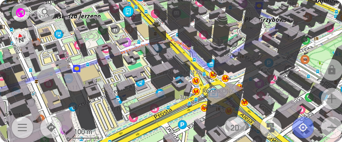

import Tabs from '@theme/Tabs';
import TabItem from '@theme/TabItem';
import AndroidStore from '@site/src/components/buttons/AndroidStore.mdx';
import LinksTelegram from '@site/src/components/_linksTelegram.mdx';
import LinksSocial from '@site/src/components/_linksSocialNetworks.mdx';
import Translate from '@site/src/components/Translate.js';
import InfoIncompleteArticle from '@site/src/components/_infoIncompleteArticle.mdx';
import ProFeature from '@site/src/components/buttons/ProFeature.mdx';
import InfoAndroidOnly from '@site/src/components/_infoAndroidOnly.mdx';

OsmAnd 5.3 for Android drops: Stars align, Earth curves!

Discover the cosmos with the Astronomy plugin's interactive star overlays, rearrange widgets effortlessly with flexible map layouts, marvel at beta 3D buildings and Globe View's spherical Earth, plus smarter track folders, speedy trip widgets, gradient palettes, bike width routing, and bulletproof cloud sync—all to elevate your adventures.

[🔄 **Update Now!**](https://play.google.com/store/apps/dev?id=8483587772816822023)

Thanks for trusting OsmAnd on your epic journeys!

<!--truncate-->

## What's new

- [Astronomy plugin](#astronomy-plugin) with an astronomical overlay that shows the paths of the Sun, planets and stars on the map, with time and date selection and a dedicated activity screen;
- More [flexible layout](#map-screen-layout) for widgets and map buttons;
- [3D buildings (beta)](#3d-buildings);
- [Globe view (beta)](#globe-view);
- Smarter track organization and statistics: Smart Folders can automatically group tracks by period, activity, distance, speed, location and other parameters, with clearer summary statistics for each group;
- Added new [Trip recording widgets](#new-trip-recording-widgets): [Average Speed](#average-speed) and [Moving Time](#moving-time);
- Introduced visual speeding indication to the [Speedometer widget](#speedometer-widget) with tolerance warning and limit-exceed states;
- Added support for creating and editing custom [gradient palettes](#gradient-palettes) for track coloring;
- Bicycle routing now takes [bicycle width](#bicycle-width-parameter) into account;
- [Others improvements and optimizations](#improvements), including better route planning performance, improved map rendering quality, enhanced voice navigation prompts, extended widget customization options, smarter GPX track segmentation, and better search autocomplete;
- [Bug fixes](#bug-fixes).

<!--
- Improved **[OsmAnd Cloud](https://osmand.net/docs/user/personal/osmand-cloud)** section in Settings: backup data, version history and automatic backup settings are now grouped under a single “OsmAnd Cloud” block with clearer names, icons and storage usage information.
- Updated **[Configure map](https://osmand.net/docs/user/map/configure-map-menu)** options for routes and road attributes: a clearer legend, better filters for hiking, cycling and MTB networks, plus more control over which route types and icon overlays are visible on the map.
- New and redesigned elevation and navigation widgets: elevation profiles for routes and GPX tracks, uphil
l/downhill metrics, average grade and more detailed elevation information for trips and navigation.
- **[Android Auto](https://osmand.net/docs/user/navigation/auto-car)** improvements, including extended widget support and better OBD II integration, so key vehicle metrics such as speed and fuel-related data are easier to see on the car screen.
- More flexible layout for widgets and map buttons: improved placement in landscape mode, better control over visibility and appearance, and a layout that reduces overlaps between widgets, buttons and data fields.
- Smarter track organization and statistics: Smart Folders can automatically group tracks by period, activity, distance, speed, location and other parameters, with clearer summary statistics for each group.
- Advanced route and track analysis: new graphs for road type, surface, smoothness, steepness, lanes and maximum speed, together with an option to color tracks using a fixed speed palette.
- Ongoing improvements to accessibility features, including more flexible audio and haptic navigation indications and a richer “look around” experience for visually impaired users.
- Initial groundwork for smartwatch integration, preparing support for viewing navigation information and trip recording data on wearable devices.
-->

## Astronomy Plugin 

[Astronomy plugin](https://osmand.net/docs/user/plugins/astronomy) displays an interactive star sky overlay with stars, constellations, the Sun, the Moon, and planets. It helps you identify celestial objects above your current location, preview their paths for a selected date and time, and plan stargazing sessions using built-in time controls and viewing options.

 

## Map Screen Layout 

The [Map screen layout](https://osmand.net/docs/user/widgets/configure-screen#map-screen-layout) setting allows you to control how widget panels are arranged on the map screen. It helps prevent widgets and buttons from overlapping and improves screen space usage, especially when switching between portrait and landscape orientations.

 

## 3D Buildings 

[3D Buildings](https://osmand.net/docs/user/plugins/topography#3d-buildings) feature displays buildings as volumetric 3D models instead of flat shapes. 

 

## Globe View 

[Globe View](https://osmand.net/docs/user/map/interact-with-map#globe-view) allows you to display the map as a spherical Earth instead of a flat projection. This mode changes the geometry of the map surface and adapts map interaction to spherical navigation. 

## New Trip Recording Widgets 

### Multiple Display Modes 

Some Trip Recording widgets support multiple display modes. They let you switch between overall trip values and metrics for the most recent uphill or downhill section of the currently recorded trip. See the list of available modes [here](https://osmand.net/docs/user/plugins/trip-recording#display-modes).

### Average Speed 

[Average Speed](https://osmand.net/docs/user/plugins/trip-recording#additional-widgets) widget shows the average speed for the currently recorded trip, or the average speed during the last uphill or downhill section, depending on the selected mode. 

### Moving Time 

[Moving Time](https://osmand.net/docs/user/plugins/trip-recording#additional-widgets) widget shows the moving time for the currently recorded trip, or the time for the last uphill and downhill, depending on the selected mode. |

## Speedometer Widget 

[Speedometer widget](https://osmand.net/docs/user/widgets/info-widgets#speedometer) now shows visual speeding alerts with color-coded tolerance and limit-exceed states, including animated transitions when crossing speed thresholds.

## Gradient Palettes 

Tracks colored by Speed, Altitude, or Slope now support customizable [gradient palettes](https://osmand.net/docs/user/map/tracks/appearance#gradient-palettes). Users can create and edit Relative palettes (auto-scaled to track data) or Fixed value palettes (based on absolute numbers), define color steps, and set a separate color for missing data.

## Bicycle Width Parameter 
Cycling profiles now support a [bicycle width parameter](https://osmand.net/docs/user/navigation/guidance/vehicle-parameters#limits). The router takes this value into account to help avoid narrow cycle paths that may not be suitable for wider bicycles.

<!--
## Searching for place

[Place search](https://osmand.net/docs/user/search/) results now display city and street names.

-->

## Improvements

* **Smart GPX Track Grouping ([#22631](https://github.com/osmandapp/OsmAnd/issues/22631))**
    To help users manage large collections of recordings, a new "Smart Folder" system is proposed. This would automatically group tracks by day or month and provide helpful summaries like total distance and average speed for each time period.

* **Enhanced Search Result Details ([#18668](https://github.com/osmandapp/OsmAnd/issues/18668))**
    Searching for common locations will soon be much easier to navigate. By adding the city and street name directly to each search result, users can instantly distinguish between identical POI names without having to click into each one.

* **Improved Track Waypoint Navigation ([#23931](https://github.com/osmandapp/OsmAnd/issues/23931))**
    The development team is refining how we interact with waypoints within a track. A requested update will allow users to tap through a list of waypoints and center the map on each one sequentially without the list menu closing, streamlining the route-review process.

* **Navigation & UI Refinements ([#23755](https://github.com/osmandapp/OsmAnd/issues/23755))**
    Ongoing work in the 5.3 release cycle focuses on cleaning up the user interface and optimizing internal task management. These "under the hood" improvements ensure a more stable and responsive experience across both Android and iOS versions.

* **New Activity Profiles: Running & More ([#22508](https://github.com/osmandapp/OsmAnd/issues/22508))**
    To better cater to diverse outdoor enthusiasts, OsmAnd is looking to expand its profile icons. New dedicated icons for running, sailing, geocaching, and skateboarding are being considered to make profile switching more intuitive.

* **Favorite Multi-Selection Support ([#16917](https://github.com/osmandapp/OsmAnd/issues/16917))**
    Managing "My Places" is becoming much more efficient with the introduction of multi-selection for favorites. This feature will allow users to move, share, or delete multiple saved points at once, bringing favorites in line with the current track management system.

* **Refining the Plugin Concept ([#24363](https://github.com/osmandapp/OsmAnd/issues/24363))**
    The app is undergoing a strategic review of how plugins are presented to the user. The goal is to better distinguish between built-in core features and optional external extensions, making the app’s vast functionality less overwhelming for new users.

- **Fixed GPX Start/Finish icon crashes** [https://github.com/osmandapp/OsmAnd-Issues/issues/3181](https://github.com/osmandapp/OsmAnd-Issues/issues/3181): Complex tracks (>10 points) now disable icons by default to prevent freezes/crashes; heavy tracks (>100 points) force-disable even if previously enabled.

## Bug fixes 

- Fixed [the ability to delete all downloaded maps by country at once](https://github.com/osmandapp/OsmAnd/issues/23641).
- Enhanced [the Popular Places tool by resolving crashes during map zoom interactions](https://github.com/osmandapp/OsmAnd/issues/24287).
- Improved [GPX database maintenance with a new light analysis mode](https://github.com/osmandapp/OsmAnd/issues/24213).
- Corrected [the missing center-point crosshair on the Weather screen](https://github.com/osmandapp/OsmAnd/issues/24467).
- Fixed [UI overlaps where the map scale bar covered the Plan-a-Route tool](https://github.com/osmandapp/OsmAnd/issues/24491).
- Stabilized [Android Auto navigation starts when a destination is set via the phone](https://github.com/osmandapp/OsmAnd/issues/24409).
- Improved [track filtering by fixing a bug where secondary edits to "To" values were ignored](https://github.com/osmandapp/OsmAnd/issues/24336).
- Fixed [UI layout issues where the Plan-a-Route overlay slider was incorrectly centered](https://github.com/osmandapp/OsmAnd/issues/24512).
- Corrected [button overlaps between "Search" and "Close" on tablet layouts](https://github.com/osmandapp/OsmAnd/issues/24503).
- Enhanced [the route start process to reduce user interaction requirements for map inconsistencies](https://github.com/osmandapp/OsmAnd/issues/22987).
- Improved [the "Analyze on map" feature to remember user-selected X and Y axis settings](https://github.com/osmandapp/OsmAnd/issues/23891).
- Fixed [visual offsets occurring in Landscape Mode during route planning sessions](https://github.com/osmandapp/OsmAnd/issues/24433).
- Resolved [empty detail views for generic or untagged buildings in the "Within" menu](https://github.com/osmandapp/OsmAnd/issues/24233).
- Stabilized [application performance by addressing frequent crashes during route creation](https://github.com/osmandapp/OsmAnd/issues/24420).
- Enhanced [Wikipedia integration by adding support for full-screen photo descriptions](https://github.com/osmandapp/OsmAnd/issues/24221).

_______________________

If you have suggestions for improving the Android version of the app, please get in touch with us. We appreciate and welcome your contribution to the further development of OsmAnd.

__________________________________________________________

- **Follow**: <LinksSocial/>  

- **Join**: <LinksTelegram/>  

- **Get**: &nbsp;<AndroidStore/>

