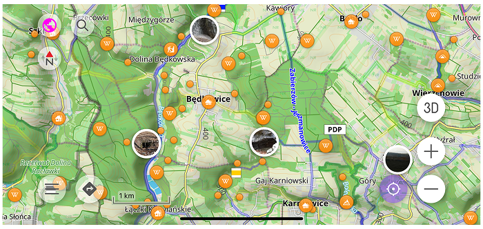

import Tabs from '@theme/Tabs';
import TabItem from '@theme/TabItem';
import AndroidStore from '@site/src/components/buttons/AndroidStore.mdx';
import AppleStore from '@site/src/components/buttons/AppleStore.mdx';
import LinksTelegram from '@site/src/components/_linksTelegram.mdx';
import LinksSocial from '@site/src/components/_linksSocialNetworks.mdx';
import Translate from '@site/src/components/Translate.js';
import InfoIncompleteArticle from '@site/src/components/_infoIncompleteArticle.mdx';
import ProFeature from '@site/src/components/buttons/ProFeature.mdx';

OsmAnd 5.3 for iOS — Now Available!

We are excited to announce the release of OsmAnd 5.3 for iOS! 

[🔄 **Update Now**](https://itunes.apple.com/us/app/osmand-maps-travel-navigate/id934850257)

<!--truncate-->

## What's new

<!--
- [3D buildings](#3d-buildings) with volumetric models and new selection/highlighting functionality;
- [Globe view](#globe-view) allowing you to display the map as a spherical Earth;-->
- Last Uphill / Last Downhill mode for [Trip recording widgets](#new-trip-recording-widgets), with switching between total and last ascent/descent;
- Updated [Distance widget](#multiple-display-modes) with modes for total distance, last uphill distance and last downhill distance;
- Added [Max Speed widget](#max-speed-widget) showing maximum speed for the whole trip or for the most recent uphill/downhill section;
- Added [Average Slope widget](#average-slope-widget) showing the average slope of the latest ascent or descent;
- Added [Moving Time widget](#moving-time-widget) showing the the moving time for the currently recorded trip, or the last uphill and downhill;
- *Show track on map* quick action added to the Trip recording widget group;
- Added *Show/Hide – Weather layers* and *Show/Hide – Wind animation* [quick actions](#weather-quick-actions) in the Configure Map group.
- Introduced visual speeding indication to the [Speedometer widget](#speedometer-widget) with tolerance warning and limit-exceed states;
- [CarPlay Enhancements](#carplay-enhancements);
- [Visibility and appearance](#map-buttons-visibility-and-appearance) controls are available for default and custom map buttons;
- Improvements in route selection and altitude graph integration under the updated rendering scheme;
- Elevation graph widget for navigation, displaying a compact profile along routes or GPX tracks;
- [Popular places](#popular-places) layer updated with POI source selection and optional image previews on the map;
- Enhanced POI search results with consistent city display, refined layout, optional thumbnails and clearer alternative names;
- Default appearance settings for track folders, allowing new tracks to inherit a unified folder style;
- Improved map management with an [Unsupported maps](#unsupported-maps-management) alert and automatic hiding of overlapping region maps;
- [Updates copying Waypoints](#updates-copying-waypoints);
- [Position icon size](#adjustable-position-icon-size) can now be adjusted independently for Resting and Navigation modes;
- [Other improvements and optimizations](#other-improvements), including redesigned graph axis selection and enhanced search results;
- [Bug fixes](#bug-fixes).

<!--
- New Explore section in Search with “Popular places nearby” and improved offline/no-data states.
-->

<!--
## Globe View

[Globe View](https://osmand.net/docs/user/map/interact-with-map#globe-view) allows you to display the map as a spherical Earth instead of a flat projection. This mode changes the geometry of the map surface and adapts map interaction to spherical navigation, providing a more realistic perspective for long-distance browsing.

_**Configure map → Topography → Globe View**_

## 3D Buildings 

[3D Buildings](https://osmand.net/docs/user/plugins/topography#3d-buildings) feature displays buildings as volumetric 3D models instead of flat shapes. 

_**Configure map → Topography → 3D Buildings**_

-->

## New Trip Recording Widgets 

### Multiple Display Modes 

Some Trip Recording widgets support multiple display modes. They let you switch between overall trip values and metrics for the most recent uphill or downhill section of the currently recorded trip. See the list of available modes [here](https://osmand.net/docs/user/plugins/trip-recording#display-modes).

### Max Speed Widget 

[Max Speed widget](https://osmand.net/docs/user/plugins/trip-recording#additional-widgets) shows the maximum speed for the currently recorded trip in the selected mode: *Total (default)*, *Last downhill*, or *Last uphill*.

### Average Slope Widget

[Average Slope widget](https://osmand.net/docs/user/plugins/trip-recording#additional-widgets) displays the average slope for the last uphill or downhill section of the current trip, depending on the selected mode.

### Moving Time Widget

[Moving Time widget](https://osmand.net/docs/user/plugins/trip-recording#additional-widgets) shows the moving time for the currently recorded trip, or the time for the last uphill and downhill, depending on the selected mode.

## Weather Quick Actions 

New quick actions make it easier to control [weather layers](https://osmand.net/docs/user/widgets/quick-action#configure-map) directly from the map. **Show/Hide – Weather layers** works as a master toggle for all active weather layers. When turned off, it hides all currently enabled weather layers. When turned on again, it restores exactly the same set of layers that were active before. **Show/Hide – Wind animation** allows you to quickly enable or disable the wind animation layer independently.

## Speedometer Widget 

[Speedometer widget](https://osmand.net/docs/user/widgets/info-widgets#speedometer) now shows visual speeding alerts with color-coded tolerance and limit-exceed states, including animated transitions when crossing speed thresholds.

## CarPlay Enhancements 

CarPlay features a new [“You have arrived” screen](https://osmand.net/docs/user/navigation/car-play#finish-navigation) with post-arrival actions and smarter disconnect handling (auto-finish near the destination, or pause and resume at low speed).

## Map Buttons: Visibility & Appearance 

Map buttons can now be fully customized. You can control the [visibility](https://osmand.net/docs/user/widgets/configure-screen#button-appearance) and adjust the [appearance](https://osmand.net/docs/user/widgets/map-buttons#map-button-appearance) of both default and custom (Quick Action) buttons.

## Unsupported Maps Management

The [Updates](https://osmand.net/docs/user/personal/maps-resources?current-os=ios#updates-menu) tab now detects unsupported and overlapping region maps. If a map has been deprecated and replaced by smaller regional maps, it appears under a new Unsupported maps section. You can review the list, remove outdated maps individually or use Delete all to clean them up at once (with confirmation). Large overlapping region maps are hidden to prevent duplication and confusion, helping keep your map data organized and up to date.

## Popular Places

The [Popular Places](https://osmand.net/docs/user/map/popular_places/) layer has been significantly updated to provide more control over how you discover points of interest. This feature helps you find the most notable locations in an area, now with improved data source management and visual previews.

_**Configure map → Show on map → Popular places**_

### POI Source Selection
You can now choose between **Online** and **Offline** sources for Popular Places. 
* **Online:** Fetches the most up-to-date popularity data from OsmAnd servers.
* **Offline:** Uses data stored within your downloaded [Wikipedia maps](https://osmand.net/docs/user/map/download-maps#wikipedia-maps), allowing you to discover top sites even without an internet connection.

### Image Previews on Map
To make the map more interactive, you can now enable **image previews**. When this option is toggled on, small thumbnails from Wikipedia appear directly on the map for top-rated locations. This helps you visually identify landmarks and decide where to head next without needing to open the full POI description.

## Updates copying Waypoints 

Added [option](https://osmand.net/docs/user/map/tracks/track-context-menu?current-os=ios#actions-with-groups) to copy waypoints between different Favorites folders or create new ones.

## Adjustable Position Icon Size

You can now resize the [My Location position icon](https://osmand.net/docs/user/personal/profiles?current-os=ios#my-location-appearance)  independently from the app’s text size. Separate size settings are available for Resting and Navigation modes, allowing better visibility while driving. The icon size can be adjusted from 50% to 300%, with 100% set as default.

## Other Improvements

* [**Redesigned Graph Axis Selection**](https://github.com/osmandapp/OsmAnd-iOS/issues/5191)
    The "Analyze on map" tool now features a redesigned axis selection menu, making it easier to compare data types like Heart Rate, Cadence, and Power within your track graphs.
* [**Enhanced Search Result Details**](https://github.com/osmandapp/OsmAnd-iOS/issues/5088)
    POI search results have been improved with consistent city display, optional thumbnails, and a refined layout to help you identify locations at a glance.
* [**Night Mode Consistency**](https://github.com/osmandapp/OsmAnd-iOS/issues/5105)
    Improved visual transitions and background consistency when using Night Mode to ensure all search screens and menus match the active theme.
* [**Updated Map Legend**](https://github.com/osmandapp/OsmAnd-iOS/issues/4594)
    Refined the visibility of road shields and symbols in the Map Legend to reflect the latest rendering scheme improvements.

## Bug fixes 

- Fixed [crash when importing Favorites or tracks from cloud providers like Dropbox](https://github.com/osmandapp/OsmAnd-iOS/issues/5129).
- Resolved [issue where "Show on map" and appearance settings weren't inherited by track folders](https://github.com/osmandapp/OsmAnd-iOS/issues/5235).
- Fixed [incorrect "Distance to destination" values appearing in the CarPlay dashboard](https://github.com/osmandapp/OsmAnd-iOS/issues/5242).
- Improved [GPX recording stability to prevent data loss on app restart](https://github.com/osmandapp/OsmAnd-iOS/issues/5153).
- Fixed [UI overlap where zoom buttons obstructed the Quick Action menu on smaller screens](https://github.com/osmandapp/OsmAnd-iOS/issues/5224).
- Corrected [handling of relation-based POIs on multipolygons](https://github.com/osmandapp/OsmAnd-iOS/issues/5231).
- Restored [tappable behavior for fitness, running, and canoe routes with shields](https://github.com/osmandapp/OsmAnd-iOS/issues/2884).
- Resolved [rendering issues with specific Multipolygon structures](https://github.com/osmandapp/OsmAnd-iOS/issues/5151).

_______________________

If you have suggestions for improving the iOS version of the app, please get in touch with us. We appreciate and welcome your contribution to the further development of OsmAnd.

______________________
- **Follow**: <LinksSocial/>  

- **Join**: <LinksTelegram/>  

- **Get**: 

&nbsp;<AppleStore/>