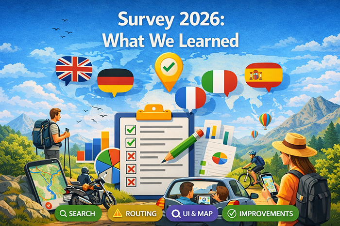

import Tabs from '@theme/Tabs';
import TabItem from '@theme/TabItem';
import AndroidStore from '@site/src/components/buttons/AndroidStore.mdx';
import AppleStore from '@site/src/components/buttons/AppleStore.mdx';
import LinksTelegram from '@site/src/components/_linksTelegram.mdx';
import LinksSocial from '@site/src/components/_linksSocialNetworks.mdx';
import Translate from '@site/src/components/Translate.js';
import InfoIncompleteArticle from '@site/src/components/_infoIncompleteArticle.mdx';
import ProFeature from '@site/src/components/buttons/ProFeature.mdx';

# What We Learned from the OsmAnd User Survey

In the first half of March, we ran a survey to better understand how people use OsmAnd and what they expect from it. At OsmAnd, we often talk about offline maps, route planning, and outdoor navigation. But the most important question is simpler: how do people actually use OsmAnd, and what do they need from it?

To explore that, we collected feedback across five language groups: **English, German, French, Italian, and Spanish**.

The results gave us a clear picture. Users value OsmAnd for its depth, flexibility, and offline capabilities — especially in situations where reliability and preparation matter. At the same time, the survey highlighted areas where the app still creates friction, particularly around usability, search, and routing confidence.

This post shares some of the main themes that appeared across all five surveys.

<!--truncate-->

## Who responded

We received responses from users across five language groups:

| Language | Responses |
|---|---:|
| German | 965 |
| English | 724 |
| French | 294 |
| Spanish | 255 |
| Italian | 250 |

In total, that gave us **2,488 responses**.

Most respondents were already experienced OsmAnd users. In every language group, the majority had used the app for more than a year. This means the feedback mainly came from people who know the product well and use it regularly in real situations.

## What users value most

Across all languages, several themes appeared again and again.

Users consistently described OsmAnd as most valuable for:

- **Offline maps while traveling**
- **Planning routes in advance**
- **Hiking and trekking**
- **Walking and exploring**
- **Cycling**
- **Navigation in remote or rural areas**
- **Recording and following GPX tracks**

This confirms something important: for many people, OsmAnd is not just a general-purpose map app. It is a tool for **prepared travel, outdoor activities, and offline navigation**.

That was especially visible in the strongest use cases by language:

| Language | Most visible traits |
|---|---|
| German | Hiking, walking, cycling, offline travel |
| English | Offline travel, walking, hiking, route planning |
| French | Offline use, route planning, GPX recording, hiking |
| Italian | Hiking, GPX use, motorcycling, route planning |
| Spanish | Route planning, rural navigation, motorcycling, offline use |

Even with those differences, one core idea was shared across all groups: **users rely on OsmAnd when they want control, flexibility, and offline confidence**.

## What users appreciate about OsmAnd

The survey shows that users see OsmAnd as:

- powerful
- flexible
- feature-rich
- useful in remote and offline scenarios
- well suited for outdoor and advanced navigation needs

Many users clearly trust OsmAnd in situations where mainstream navigation apps may not be enough — for example during hiking trips, travel abroad, off-road navigation, or route planning far from a stable connection.

This is one of OsmAnd’s strongest product and brand advantages.

## The main friction points

The feedback was positive overall, but one message came through very clearly:

**Users value OsmAnd’s power, but many find it too complex.**

This theme appeared in all five surveys.

The most common issues mentioned were:

- **Interface complexity**
- **Too many settings or hard-to-find options**
- **Search quality**
- **Routing trust and route quality**
- **Map/data reliability in some cases**
- **Performance or stability problems for some users**
- **Friction in GPX and track workflows**

In other words, the main challenge is not simply a lack of features.

The challenge is that **the value of those features is not always easy to access**.

For many users, OsmAnd feels extremely capable — but sometimes harder to learn or use than it should be.

## A strong product, but with usability pressure

One of the most encouraging findings is that overall loyalty remains strong.

Across all language groups, recommendation scores were high. Users clearly believe in the product. But that does not mean there is no risk.

Many respondents said they had at least occasionally considered using another app because of issues such as complexity, search friction, or routing behavior.

That creates an important tension:

- users respect OsmAnd
- users trust its strengths
- but some still turn to other apps for faster, simpler, or more convenient everyday tasks

This suggests that OsmAnd’s biggest opportunity is not only to add more capabilities, but to make the existing capabilities easier to use with confidence.

## What users use alongside OsmAnd

Many respondents also mentioned using other navigation apps in parallel with OsmAnd. This is not surprising — most people have multiple apps for different purposes.

The reasons were fairly consistent:

| Reason | Typical alternatives |
|---|---|
| Simpler interface and faster everyday use | Google Maps, Organic Maps |
| Real-time traffic and driving convenience | Google Maps, Waze, HERE WeGo |
| Outdoor route discovery and community features | Komoot, Strava, AllTrails, Wikiloc |
| Specialized or backup navigation use | Gaia GPS, Locus Map, Sygic, Maps.me |

This comparison is useful because it shows that OsmAnd is not mainly competing on “how many features it has.” In many cases, it is competing on **clarity, convenience, trust, and speed of everyday use**.

## What differs by language group

Although the overall themes were similar, each language group had its own profile.

### German-speaking users
German-speaking respondents showed the strongest concentration around **hiking, walking, cycling, and offline travel**. This looks like a highly outdoor-oriented group with regular use patterns and strong engagement.

### English-speaking users
English-language responses were the broadest in profile. They combined **offline travel, walking, hiking, route planning, and rural navigation**, showing a wide mix of travel, outdoor, and practical navigation use cases.

### French-speaking users
French-speaking respondents stood out as strong **offline and travel-oriented users**, with high mentions of **route planning, GPX recording, and hiking**. This group reflects a power-user profile that values preparation and track-based workflows.

### Italian-speaking users
Italian-speaking users showed a distinctive mix of **hiking, GPX use, route planning, and motorcycling**. Compared with some other groups, motorcycling was especially visible here.

### Spanish-speaking users
Spanish-speaking respondents stood out most clearly for **route planning, remote-area navigation, motorcycling, and daily car use**. This group appears more road-navigation-oriented than the German or French groups, while still valuing offline and advanced use.

## What all groups have in common

Despite these differences, the common patterns are more important than the differences.

Across all five surveys, users consistently described OsmAnd as:

- a strong offline navigation tool
- especially useful for travel and outdoor scenarios
- more flexible than many mainstream alternatives
- valuable for users who want control over routes and maps

At the same time, all five groups also pointed to similar improvement areas:

- make the interface easier to understand
- make search more reliable
- improve routing trust
- reduce friction in core workflows
- keep the power, but make it easier to use

This consistency across languages is one of the strongest findings in the entire survey.

## What this means for OsmAnd

The survey confirms that OsmAnd already has a clear identity.

Users do not mainly come to OsmAnd because it is the simplest navigation app. They come because it offers something deeper:

- offline confidence
- route control
- outdoor readiness
- map flexibility
- support for advanced use cases

That is a real strength.

At the same time, the survey also shows a clear direction for improvement. Users do not want OsmAnd to become generic or stripped down. They want it to remain powerful — but to feel **clearer, easier, and more trustworthy in everyday use**.

That is an important distinction.

The goal is not to reduce what makes OsmAnd special.  
The goal is to make that value easier to reach.

## Thank you

We are grateful to everyone who took the time to answer the survey.

Your feedback helps us better understand how OsmAnd is used in the real world — across countries, languages, and navigation styles. It also helps us see where the app already delivers strong value, and where the experience still needs work.

Across all five surveys, one message stands out:

**Users trust OsmAnd for its offline power, flexibility, and outdoor capabilities. The biggest opportunity now is to preserve that depth while making the experience simpler and more intuitive.**

_______________________________________________

<LinksSocial/>
<LinksTelegram/>
