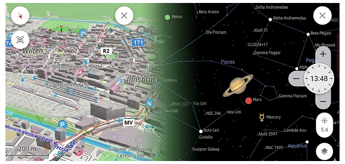
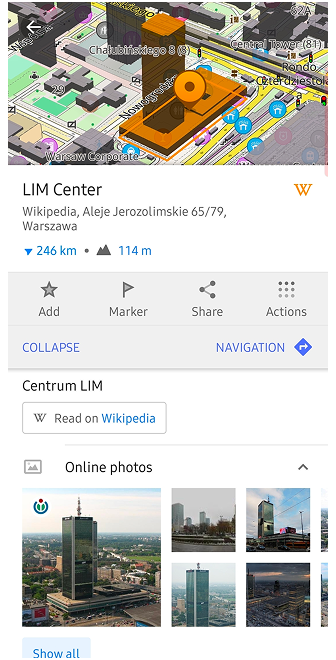
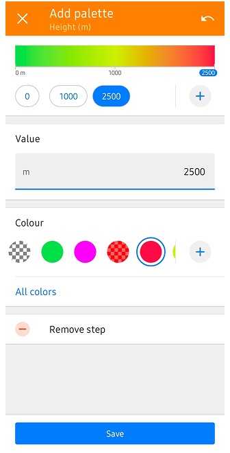

import Tabs from '@theme/Tabs';
import TabItem from '@theme/TabItem';
import AndroidStore from '@site/src/components/buttons/AndroidStore.mdx';
import LinksTelegram from '@site/src/components/_linksTelegram.mdx';
import LinksSocial from '@site/src/components/_linksSocialNetworks.mdx';
import Translate from '@site/src/components/Translate.js';
import InfoIncompleteArticle from '@site/src/components/_infoIncompleteArticle.mdx';
import ProFeature from '@site/src/components/buttons/ProFeature.mdx';
import InfoAndroidOnly from '@site/src/components/_infoAndroidOnly.mdx';

OsmAnd 5.3 for Android drops: Stars align, Earth curves!

Discover the cosmos with the Astronomy plugin's interactive star overlays, rearrange widgets effortlessly with flexible map layouts, marvel at beta 3D buildings and Globe View's spherical Earth, plus smarter track folders, speedy trip widgets, gradient palettes, bike width routing, and bulletproof cloud sync—all to elevate your adventures.

[🔄 **Update Now!**](https://play.google.com/store/apps/dev?id=8483587772816822023)

Thanks for trusting OsmAnd on your epic journeys!

<!--truncate-->

## What's new

- [Astronomy plugin](#astronomy-plugin) with an astronomical overlay that shows the paths of the Sun, planets and stars on the map, with time and date selection and a dedicated activity screen;
- More [flexible layout](#map-screen-layout) for widgets and map buttons;
- [3D buildings](#3d-buildings);
- [Globe view](#globe-view);
- Added new [Trip recording widgets](#new-trip-recording-widgets): [Average Speed](#average-speed) and [Moving Time](#moving-time);
- Introduced visual speeding indication to the [Speedometer widget](#speedometer-widget) with tolerance warning and limit-exceed states;
- Introduced a new [Palette Editor](#palette-editor-for-terrain--track-visualization) for creating and editing custom color schemes for tracks and terrain visualization;
- Bicycle routing now takes [bicycle width](#bicycle-width-parameter);
- [Other improvements and optimizations](#other-improvements), including smart GPX track grouping, enhanced search result details, improved track waypoint navigation, and new activity profiles;
- [Bug fixes](#bug-fixes).

<!--
- Improved **[OsmAnd Cloud](https://osmand.net/docs/user/personal/osmand-cloud)** section in Settings: backup data, version history and automatic backup settings are now grouped under a single “OsmAnd Cloud” block with clearer names, icons and storage usage information.
- Updated **[Configure map](https://osmand.net/docs/user/map/configure-map-menu)** options for routes and road attributes: a clearer legend, better filters for hiking, cycling and MTB networks, plus more control over which route types and icon overlays are visible on the map.
- New and redesigned elevation and navigation widgets: elevation profiles for routes and GPX tracks, uphil
l/downhill metrics, average grade and more detailed elevation information for trips and navigation.
- **[Android Auto](https://osmand.net/docs/user/navigation/auto-car)** improvements, including extended widget support and better OBD II integration, so key vehicle metrics such as speed and fuel-related data are easier to see on the car screen.
- More flexible layout for widgets and map buttons: improved placement in landscape mode, better control over visibility and appearance, and a layout that reduces overlaps between widgets, buttons and data fields.
- Smarter track organization and statistics: Smart Folders can automatically group tracks by period, activity, distance, speed, location and other parameters, with clearer summary statistics for each group.
- Advanced route and track analysis: new graphs for road type, surface, smoothness, steepness, lanes and maximum speed, together with an option to color tracks using a fixed speed palette.
- Ongoing improvements to accessibility features, including more flexible audio and haptic navigation indications and a richer “look around” experience for visually impaired users.
- Initial groundwork for smartwatch integration, preparing support for viewing navigation information and trip recording data on wearable devices.
-->

## Astronomy Plugin 

[Astronomy plugin](https://osmand.net/docs/user/plugins/astronomy) displays an interactive star sky overlay with stars, constellations, the Sun, the Moon, and planets. It helps you identify celestial objects above your current location, preview their paths for a selected date and time, and plan stargazing sessions using built-in time controls and viewing options:

_Plugins → Astronomy_

### Interactive Sky Search
The plugin includes a dedicated **Search** tool specifically for celestial objects. You can browse through categories like the Solar System, Constellations, Stars, and Deep Sky objects. The "Watch now" section highlights objects currently visible from your location, while advanced filters allow you to sort by magnitude (brightness) or upcoming rise/set times.

### Earth Map Integration
To help you orient your observations, you can enable an **Earth Map** view directly beneath the Star map. This feature allows you to relate celestial positions to your real-world geographic surroundings. Additionally, the **AR Star Finding** (Camera mode) uses your device's sensors to overlay the astronomical data onto your live camera feed, making it easy to find exact stars and planets in the real sky.

 

## Map Screen Layout 

The [Map screen layout](https://osmand.net/docs/user/widgets/configure-screen#map-screen-layout) setting allows you to control how widget panels are arranged on the map screen. It helps prevent widgets and buttons from overlapping and improves screen space usage, especially when switching between portrait and landscape orientations.

_OsmAnd menu → Configure screen → ⋮ → Map Screen Layout_

### Panels layouts

[Once you enable Separate layouts](https://osmand.net/docs/user/widgets/configure-screen#panels-layout), you unlock the ability to choose how the top and bottom widget panels interact with the rest of the interface: Wide or Compact. 

_OsmAnd menu → Configure screen → Panels Layout_

## 3D Buildings 

[3D Buildings](https://osmand.net/docs/user/plugins/topography#3d-buildings) feature displays buildings as volumetric 3D models instead of flat shapes. You can now adjust Sun settings (Azimuth and Altitude) to realistically calculate and display shadows based on the sun's position.

_Confgure map → Topography → 3D Buildings_

 

### Selection & Highlighting

As part of our ongoing 3D map improvements, you can now highlight specific buildings on the map. When the [3D buildings option](https://osmand.net/docs/user/plugins/topography#3d-buildings) is enabled, selecting a POI will automatically highlight the corresponding building polygon, making it easier to identify your target in dense urban environments.

## Globe View 

[Globe View](https://osmand.net/docs/user/map/interact-with-map#globe-view) allows you to display the map as a spherical Earth instead of a flat projection. This mode changes the geometry of the map surface and adapts map interaction to spherical navigation. 

_Confgure map → Topography → Globe View_

## New Trip Recording Widgets 

### Multiple Display Modes 

Some Trip Recording widgets support multiple display modes. They let you switch between overall trip values and metrics for the most recent uphill or downhill section of the currently recorded trip. See the list of available modes [here](https://osmand.net/docs/user/plugins/trip-recording#display-modes).

### Average Speed 

[Average Speed](https://osmand.net/docs/user/plugins/trip-recording#additional-widgets) widget shows the average speed for the currently recorded trip, or the average speed during the last uphill or downhill section, depending on the selected mode. 

### Moving Time 

[Moving Time](https://osmand.net/docs/user/plugins/trip-recording#additional-widgets) widget shows the moving time for the currently recorded trip, or the time for the last uphill and downhill, depending on the selected mode. |

## Speedometer Widget 

[Speedometer widget](https://osmand.net/docs/user/widgets/info-widgets#speedometer) now shows visual speeding alerts with color-coded tolerance and limit-exceed states, including animated transitions when crossing speed thresholds.

_Menu → Configure screen → Other → Speedometer_

## Palette Editor for Terrain & Track Visualization

We've introduced a powerful new palette editor that gives you full control over how data is visualized on your map. Whether you are analyzing a GPX track or viewing terrain relief, you can now customize the color transitions to suit your needs.

### Step-by-Step vs. Gradient Modes
The editor now supports two distinct ways to transition between colors:
* **Gradient:** Creates a smooth, continuous transition between colors, providing a fluid visual representation of data changes.
* **Step-by-step:** Allows you to define strict color boundaries. For example, you can set `0–15 km/h` to Yellow and `15.1–30 km/h` to Red. This mode eliminates the gradient, making it easier to identify specific data ranges at a glance.

### For GPX Tracks

_Tracks Context menu → Appearance → Colour → + or All colors_

Tracks colored by Speed, Altitude, or Slope now support [Editor Colour Palettes](https://osmand.net/docs/user/map/tracks/appearance#gradient-palettes). You can create **Relative palettes** (auto-scaled to your specific track data) or **Fixed value palettes** (based on absolute numbers), define custom color steps, and even set a unique color for missing data points.

### For Terrain Coloring

_Configure map → Terrain → Modify → + or All colors_

This same editor has been integrated into [terrain coloring options](https://osmand.net/docs/user/personal/color-palette-schemes#terrain). You can now create your own custom color schemes for Altitude and Slope layers, allowing for a more personalized and readable terrain relief.

## Bicycle Width Parameter 

Cycling profiles now support a [bicycle width parameter](https://osmand.net/docs/user/navigation/guidance/vehicle-parameters#limits). The router takes this value into account to help avoid narrow cycle paths that may not be suitable for wider bicycles.

## Other Improvements

* [**Auto-organize tracks by year, length, activity & more**](https://osmand.net/docs/user/personal/tracks/smart-folder): 
    Managing large collections of recordings is now much simpler with our new "Smart Folder" system. Organize your tracks dynamically by year, activity, or distance to keep your history clean and accessible.   
    The new grouping mechanism allows you to create dynamic groups with any granularity you want. For example, you can group your entire library by Year, then sub-group by Activity type, and finally by Distance (e.g., 0-10km, 10-50km) or Duration. These folders provide helpful summaries, including total distance, duration, and average speed for each specific filtered group.

* [**Enhanced Search Result Details**](https://osmand.net/docs/user/search/search-all):
    Navigating search results for common locations is now more intuitive. By displaying the city and street name directly in the results list, you can instantly distinguish between identical POI names without needing to open each one individually.

* [**Improved Track Waypoint Navigation**](https://osmand.net/docs/user/map/tracks/track-context-menu#points--waypoints):
    We’ve refined how you interact with waypoints within a track. You can now tap through the waypoint list to center the map on each point sequentially. Crucially, the list remains open during this process, allowing for a much faster and more seamless route-review experience.

* [**New POI Share Links**](https://osmand.net/docs/user/map/map-context-menu#share):
    Sharing specific locations has been upgraded to support a new link format (aligned with our Web version). This ensures that when you share a POI, the recipient sees the exact same point and context across different platforms and devices.

* [**Expanded Activity Profile Icons**](https://osmand.net/docs/user/personal/profiles#profile-appearance):
    To better support diverse outdoor activities, we are expanding our library of profile icons. Dedicated new icons for running, sailing, skateboarding, and etc are being added to make switching between your favorite activities more visually intuitive.

* [**Multi-Selection for Favorites**](https://osmand.net/docs/user/personal/favorites#manage-favorites):
    Managing "My Places" is now more efficient with the addition of multi-selection support for Favorites. Just like with tracks, you can now select multiple saved points at once to move them to a different folder, share them, or delete them in bulk.

* [**Refining Plugin Organization**](https://osmand.net/docs/user/troubleshooting/resources#plugins):
    We are restructuring how custom plugins are presented to help users distinguish between core built-in and custom plugins. This reorganization makes the app's extensive functionality more discoverable and less overwhelming for new users.

* [**GPX Start/Finish Icon Optimization**](https://osmand.net/docs/user/map/tracks/appearance#start-and-finish-icons):
    To improve performance and prevent app freezes, we’ve updated how Start/Finish icons are handled for complex tracks. These icons are now disabled by default for tracks with more than 10 points and are force-disabled for very heavy tracks (over 100 points) to ensure a smooth map-viewing experience.

* [**ODB-II Adapter Voltage Widget**](https://osmand.net/docs/user/plugins/vehicle-metrics#widgets):
    For users with OBD2 integration, we've added a new dedicated widget to monitor "Adapter Voltage." This allows you to keep an eye on your vehicle's electrical health directly from the main navigation screen.

* [**OBD-II Vehicle Metrics in Track Graphs**](https://osmand.net/docs/user/map/tracks/#analyze-track-on-map):
    Vehicle data recorded via OBD-II can now be analyzed directly on the Analyze on map graph for tracks. This allows you to visualize parameters such as engine speed, temperature, fuel metrics, and more alongside standard track data.
    
<!--
* [**Pro Features for Track Grouping**](https://github.com/osmandapp/OsmAnd-Issues/issues/3195)
    We’ve expanded the customization options for Smart Folders. While grouping by Activity, Year, and Nearest City remains free for everyone, OsmAnd Pro users can now unlock advanced parameters and adjustable step sizes for track length and duration to perfectly organize their history.    
-->

## Bug fixes 

- Fixed [the ability to delete all downloaded maps by country at once](https://github.com/osmandapp/OsmAnd/issues/23641).
- Enhanced [the Popular Places tool by resolving crashes during map zoom interactions](https://github.com/osmandapp/OsmAnd/issues/24287).
- Improved [GPX database maintenance with a new light analysis mode](https://github.com/osmandapp/OsmAnd/issues/24213).
- Corrected [the missing center-point crosshair on the Weather screen](https://github.com/osmandapp/OsmAnd/issues/24467).
- Fixed [UI overlaps where the map scale bar covered the Plan-a-Route tool](https://github.com/osmandapp/OsmAnd/issues/24491).
- Stabilized [Android Auto navigation starts when a destination is set via the phone](https://github.com/osmandapp/OsmAnd/issues/24409).
- Improved [track filtering by fixing a bug where secondary edits to "To" values were ignored](https://github.com/osmandapp/OsmAnd/issues/24336).
- Fixed [UI layout issues where the Plan-a-Route overlay slider was incorrectly centered](https://github.com/osmandapp/OsmAnd/issues/24512).
- Corrected [button overlaps between "Search" and "Close" on tablet layouts](https://github.com/osmandapp/OsmAnd/issues/24503).
- Enhanced [the route start process to reduce user interaction requirements for map inconsistencies](https://github.com/osmandapp/OsmAnd/issues/22987).
- Improved [the "Analyze on map" feature to remember user-selected X and Y axis settings](https://github.com/osmandapp/OsmAnd/issues/23891).
- Fixed [visual offsets occurring in Landscape Mode during route planning sessions](https://github.com/osmandapp/OsmAnd/issues/24433).
- Resolved [empty detail views for generic or untagged buildings in the "Within" menu](https://github.com/osmandapp/OsmAnd/issues/24233).
- Stabilized [application performance by addressing frequent crashes during route creation](https://github.com/osmandapp/OsmAnd/issues/24420).
- Enhanced [Wikipedia integration by adding support for full-screen photo descriptions](https://github.com/osmandapp/OsmAnd/issues/24221).
- Improved [Android Auto routing stability by ensuring navigation persists when switching apps](https://github.com/osmandapp/OsmAnd/issues/24595).
- Restored [the color scheme preview in the Terrain menu](https://github.com/osmandapp/OsmAnd/issues/24567).
- Corrected [UI insets and layout overlaps for Quick Action buttons after importing settings](https://github.com/osmandapp/OsmAnd/issues/24351).
- Resolved duplicate entries and language-filtering bugs in [the Popular Places](https://osmand.net/docs/user/map/popular_places) feature when using Wikipedia and offline maps.

_______________________

If you have suggestions for improving the Android version of the app, please get in touch with us. We appreciate and welcome your contribution to the further development of OsmAnd.

__________________________________________________________

- **Follow**: <LinksSocial/>  

- **Join**: <LinksTelegram/>  

- **Get**: &nbsp;<AndroidStore/>

