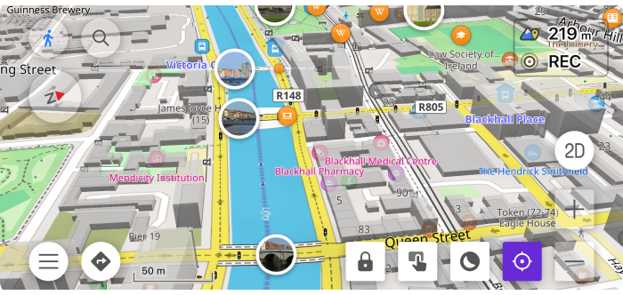
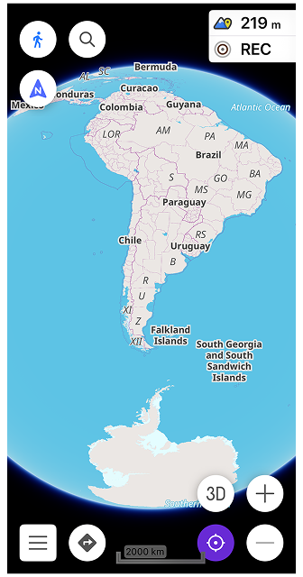
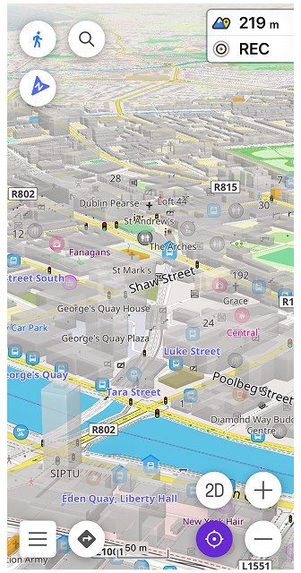
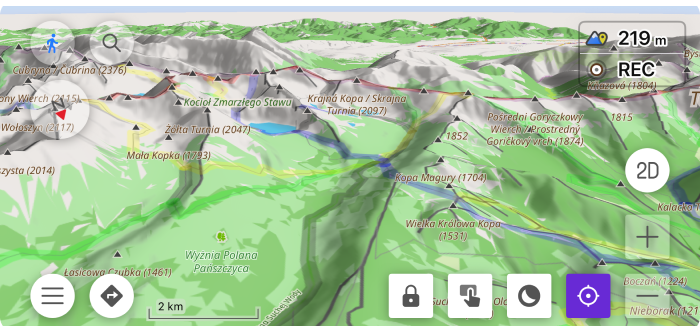
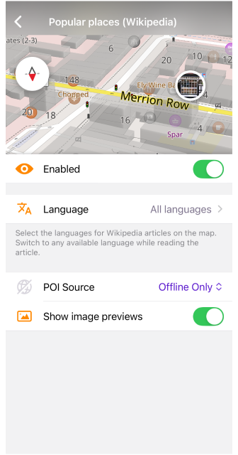
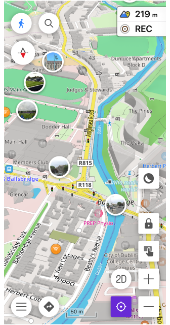

import Tabs from '@theme/Tabs';
import TabItem from '@theme/TabItem';
import AndroidStore from '@site/src/components/buttons/AndroidStore.mdx';
import AppleStore from '@site/src/components/buttons/AppleStore.mdx';
import LinksTelegram from '@site/src/components/_linksTelegram.mdx';
import LinksSocial from '@site/src/components/_linksSocialNetworks.mdx';
import Translate from '@site/src/components/Translate.js';
import InfoIncompleteArticle from '@site/src/components/_infoIncompleteArticle.mdx';
import ProFeature from '@site/src/components/buttons/ProFeature.mdx';

OsmAnd 5.3 for iOS — Now Available!

Get ready to explore a new dimension. This update brings the highly anticipated 3D Buildings and Globe View to your iPhone, alongside a massive overhaul of the Trip Recording widgets. Whether you're navigating city skyscrapers or planning a transcontinental journey, version 5.3 offers more perspective and precision than ever before.

[🔄 **Update Now**](https://itunes.apple.com/us/app/osmand-maps-travel-navigate/id934850257)

{/*truncate*/}

## What's new

- [3D buildings](#3d-buildings) with volumetric models and new selection/highlighting functionality;
- [Globe view](#globe-view) allowing you to display the map as a spherical Earth;
- Introduced visual speeding indication to the [Speedometer widget](#speedometer-widget) with tolerance warning and limit-exceed states;
- [Visibility and appearance](#map-buttons-visibility--appearance) controls are available for map buttons;
- [Position icon size](#adjustable-position-icon-size) can now be adjusted independently for Resting and Navigation modes;
- [New Trip Recording Widgets](#new-trip-recording-widgets): Max Speed and Average Slope; improved Uphill/Downhill;
- [Merge waypoints](#updates-copying-waypoints) into a Favorites folder;
- Added [sharing link to any POI](#share-link-to-any-poi);
- [CarPlay Enhancements](#carplay-enhancements);
-  Improved [connectivity for paired OBD-II adapters](#improved-obd-ii-connectivity);
- [Popular places](#popular-places) layer updated with POI source selection and optional image previews on the map;
- [Other improvements and optimizations](#other-improvements), including redesigned graph axis selection and enhanced search results;
- [Bug fixes](#bug-fixes).

## Globe View

[Globe View](https://osmand.net/docs/user/map/interact-with-map#globe-view) allows you to display the map as a spherical Earth instead of a flat projection. This mode changes the geometry of the map surface and adapts map interaction to spherical navigation, providing a more realistic perspective for long-distance browsing.

_**Configure map → Topography → Globe View**_

## 3D Buildings 

[3D Buildings](https://osmand.net/docs/user/plugins/topography#3d-buildings) feature displays buildings as volumetric 3D models instead of flat shapes. 

_**Configure map → Topography → 3D Buildings**_

## Speedometer Widget 

[Speedometer widget](https://osmand.net/docs/user/widgets/info-widgets#speedometer) now shows visual speeding alerts with color-coded tolerance and limit-exceed states, including animated transitions when crossing speed thresholds.

## Map Buttons: Visibility & Appearance 

Map buttons can now be fully customized. You can control the [visibility](https://osmand.net/docs/user/widgets/configure-screen#button-appearance) and adjust the [appearance](https://osmand.net/docs/user/widgets/map-buttons#map-button-appearance) of both default and custom (Quick Action) buttons.

## Adjustable Position Icon Size

You can now resize the [My Location position icon](https://osmand.net/docs/user/personal/profiles?current-os=ios#my-location-appearance)  independently from the app’s text size. Separate size settings are available for Resting and Navigation modes, allowing better visibility while driving. The icon size can be adjusted from 50% to 300%, with 100% set as default.

## New Trip Recording Widgets

The [Trip Recording plugin](https://osmand.net/docs/user/plugins/trip-recording) has been expanded with smarter widgets that provide deeper insights into your activity, especially for cycling and hiking in hilly terrain.

### Multiple Display Modes 

Many Trip Recording widgets now support [**Multiple Display Modes**](https://osmand.net/docs/user/plugins/trip-recording#display-modes). This allows you to toggle a single widget to show metrics for your overall trip or specifically for your **Last Uphill** or **Last Downhill** section. You can switch modes by tapping the widget or via the widget settings.

### Max Speed Widget 

The [Max Speed widget](https://osmand.net/docs/user/plugins/trip-recording#additional-widgets) displays your peak speed. In its new modes, you can see exactly how fast you went during your most recent descent or climb, helping you analyze performance on specific segments of your track.

### Average Slope Widget

The [Average Slope widget](https://osmand.net/docs/user/plugins/trip-recording#additional-widgets) provides real-time data on the steepness of your current or last completed section. It’s an essential tool for gauging the difficulty of a climb or the intensity of a descent.

### Moving Time Widget

The [Moving Time widget](https://osmand.net/docs/user/plugins/trip-recording#additional-widgets) now tracks your active duration with higher granularity. By switching modes, you can see exactly how much time you spent on your last uphill grind versus your last downhill cruise.

## Updates copying Waypoints 

Added [option](https://osmand.net/docs/user/map/tracks/track-context-menu?current-os=ios#actions-with-groups) to copy waypoints between different Favorites folders or create new ones.

## Share Link to any POI

You can now quickly [share a link](https://osmand.net/docs/user/map/map-context-menu#share) to any Point of Interest (POI) or custom map location. When you select an object on the map, the **Share** action generates a universal `osmand.net` URL. 

This link can be opened by other OsmAnd users to find the exact location on their devices, or viewed in a web browser. 

## Weather Quick Actions 

New quick actions make it easier to control [weather layers](https://osmand.net/docs/user/widgets/quick-action#configure-map) directly from the map. **Show/Hide – Weather layers** works as a master toggle for all active weather layers. When turned off, it hides all currently enabled weather layers. When turned on again, it restores exactly the same set of layers that were active before. **Show/Hide – Wind animation** allows you to quickly enable or disable the wind animation layer independently.

## CarPlay Enhancements

This update brings a more stable and feature-rich experience to your vehicle’s display, addressing key community requests for map appearance and post-arrival actions.

### New "You Have Arrived" Dialog
When you reach your destination, CarPlay now displays a redesigned [post-navigation screen](https://osmand.net/docs/user/navigation/car-play#finish-navigation). Instead of simply ending the trip, you are presented with several convenient actions:
* **Mark as parking position**: Save your current location as a parking spot for easy return later.
* **Find Parking:** Instantly search for nearby parking lots.
* **Recalculate route:** Useful if you need to adjust your route at the last moment.
* **Finish navigation:** Complete the trip and return to the main map.

### Enhanced Map Controls
* **Always Show Dark Map:** You can now force the map to stay in Dark Mode regardless of your car's headlight status or the time of day. This is a highly requested feature for drivers who prefer high-contrast navigation at all times.
* **Smoother Location Icon:** The "My Location" cursor now moves more fluidly across the screen, providing a more natural and precise representation of your vehicle's position.
* **Dashboard Stability:** We've resolved an issue where the map could become unresponsive when viewed in the CarPlay Dashboard (multi-window) mode.

## Improved OBD-II Connectivity

For users who monitor their vehicle's health and performance in real-time, we have significantly [improved the connectivity](https://osmand.net/docs/user/plugins/external-sensors#obd-ii) for paired **OBD-II adapters**.

This update focuses on the stability of the Bluetooth Low Energy (BLE) link between your iOS device and the adapter. The connection is now more resilient to interruptions, ensuring a steady flow of data—such as engine RPM, speed, and fuel consumption—directly into your OsmAnd widgets and GPX logs. 

- **Faster Reconnection:** The app now reconnects more reliably when you return to your vehicle.
- **Data Accuracy:** Improved handling of sensor data packets reduces "frozen" values in your dashboard widgets.

## Popular Places

The [Popular Places](https://osmand.net/docs/user/map/popular_places/) layer has been significantly updated to provide more control over how you discover points of interest. This feature helps you find the most notable locations in an area, now with improved data source management and visual previews.

_**Configure map → Show on map → Popular places (Wikipedia)**_

 

### POI Source Selection
You can now choose between **Online** and **Offline** sources for Popular Places. 
* **Online:** Fetches the most up-to-date popularity data from OsmAnd servers.
* **Offline:** Uses data stored within your downloaded [Wikipedia maps](https://osmand.net/docs/user/map/download-maps#wikipedia-maps), allowing you to discover top sites even without an internet connection.

### Image Previews on Map
To make the map more interactive, you can now enable **image previews**. When this option is toggled on, small thumbnails from Wikipedia appear directly on the map for top-rated locations. This helps you visually identify landmarks and decide where to head next without needing to open the full POI description.

## Unsupported Maps Management

The [Updates](https://osmand.net/docs/user/personal/maps-resources?current-os=ios#updates-menu) tab now detects unsupported and overlapping region maps. If a map has been deprecated and replaced by smaller regional maps, it appears under a new Unsupported maps section. You can review the list, remove outdated maps individually or use Delete all to clean them up at once (with confirmation). Large overlapping region maps are hidden to prevent duplication and confusion, helping keep your map data organized and up to date.

## Other Improvements

* [**Redesigned Graph Axis Selection**](https://github.com/osmandapp/OsmAnd-iOS/issues/5191)
    The "Analyze on map" tool now features a redesigned axis selection menu. This makes it significantly easier to compare diverse data types—such as **Heart Rate, Cadence, and Power**—within your track graphs, providing a clearer picture of your performance.
* [**Enhanced Search Result Details**](https://osmand.net/docs/user/search/search-poi)
    POI search results have been improved with a more consistent city display, optional thumbnails, and a refined layout to help you identify locations at a glance.
* [**Improved Trail and Route Interaction**](https://github.com/osmandapp/OsmAnd-iOS/issues/5129)
    We’ve refined how the map handles taps on trails and hiking/cycling routes. This update ensures that selecting a route directly from the map consistently opens the correct details and highlights the entire path, fixing previous issues where the selection would fail or become unresponsive.
* [**Interactive Fitness & Canoe Route Shields**](https://github.com/osmandapp/OsmAnd-iOS/issues/5129)
    Route shields for specialized activities—including **fitness, running, and canoe routes**—are now fully interactive. Tapping these symbols on the map now correctly opens the route details, bringing them into alignment with the standard behavior for hiking and cycling networks.
* [**Night Mode Consistency**](https://github.com/osmandapp/OsmAnd-iOS/issues/5105)
    Improved the visual consistency of terrain layers (Hillshade and Slope) when using Night Mode, ensuring the map remains readable and easy on the eyes in low-light conditions.
* [**Updated Map Legend**](https://github.com/osmandapp/OsmAnd-iOS/issues/4594)
    Refined the visibility of road shields and symbols in the Map Legend to reflect the latest rendering scheme improvements.

## Bug fixes 

- Fixed [ETA not updating in Navigation widgets](https://github.com/osmandapp/OsmAnd-iOS/issues/5003) while the vehicle is stationary;
- Fixed [crash when importing Favorites or tracks from cloud providers like Dropbox](https://github.com/osmandapp/OsmAnd-iOS/issues/5129).
- Resolved [issue where "Show on map" and appearance settings weren't inherited by track folders](https://github.com/osmandapp/OsmAnd-iOS/issues/5235).
- Fixed [incorrect "Distance to destination" values appearing in the CarPlay dashboard](https://github.com/osmandapp/OsmAnd-iOS/issues/5242).
- Improved [GPX recording stability to prevent data loss on app restart](https://github.com/osmandapp/OsmAnd-iOS/issues/5153).
- Fixed [UI overlap where zoom buttons obstructed the Quick Action menu on smaller screens](https://github.com/osmandapp/OsmAnd-iOS/issues/5224).
- Corrected [handling of relation-based POIs on multipolygons](https://github.com/osmandapp/OsmAnd-iOS/issues/5231).
- Resolved [rendering issues with specific Multipolygon structures](https://github.com/osmandapp/OsmAnd-iOS/issues/5151).
- Resolved [issue where the map failed to refresh after deleting a large GPX track](https://github.com/osmandapp/OsmAnd-iOS/issues/5131);
- Fixed [incorrect elevation data display in the Track Analyzer for short recordings](https://github.com/osmandapp/OsmAnd-iOS/issues/5072);
- Corrected [the "Center on location" behavior in CarPlay when navigating complex junctions](https://github.com/osmandapp/OsmAnd-iOS/issues/5138);
- Fixed [long-standing UI glitch with overlapping labels in the "My Places" menu](https://github.com/osmandapp/OsmAnd-iOS/issues/2433);
- Improved [rendering of coastal lines and water bodies at high zoom levels](https://github.com/osmandapp/OsmAnd-iOS/issues/4727);
- Resolved [crash occurring when opening the "Trip recording" widget settings](https://github.com/osmandapp/OsmAnd-iOS/issues/5168);
- Fixed [issue where custom map style colors were not applied to certain POI icons](https://github.com/osmandapp/OsmAnd-iOS/issues/5187);
- Corrected [voice prompt timing for "Keep Right/Left" maneuvers in roundabouts](https://github.com/osmandapp/OsmAnd-iOS/issues/5196);
- Fixed [visibility of "Avalanche slope" layer when used in combination with Terrain maps](https://github.com/osmandapp/OsmAnd-iOS/issues/5051);
- Resolved [issue where the search bar would lose focus after selecting a category filter](https://github.com/osmandapp/OsmAnd-iOS/issues/2712).

_______________________

If you have suggestions for improving the iOS version of the app, please get in touch with us. We appreciate and welcome your contribution to the further development of OsmAnd.

______________________
- **Follow**: <LinksSocial/>  

- **Join**: <LinksTelegram/>  

- **Get**: 

&nbsp;<AppleStore/>