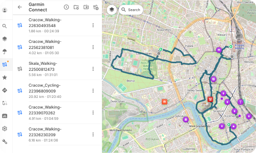
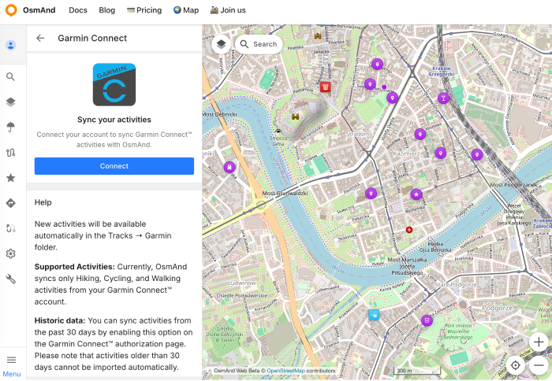
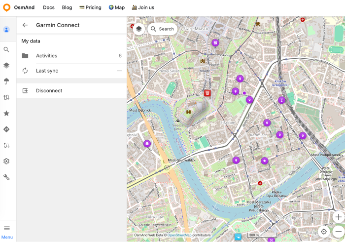
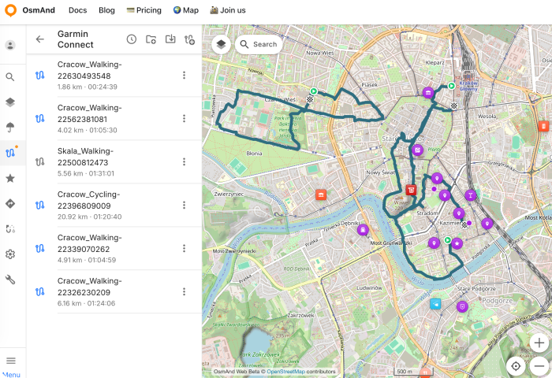

import Tabs from '@theme/Tabs';
import TabItem from '@theme/TabItem';
import AndroidStore from '@site/src/components/buttons/AndroidStore.mdx';
import AppleStore from '@site/src/components/buttons/AppleStore.mdx';
import LinksTelegram from '@site/src/components/_linksTelegram.mdx';
import LinksSocial from '@site/src/components/_linksSocialNetworks.mdx';
import Translate from '@site/src/components/Translate.js';
import InfoIncompleteArticle from '@site/src/components/_infoIncompleteArticle.mdx';
import ProFeature from '@site/src/components/buttons/ProFeature.mdx';

Hello friends!  
We are excited to announce that we are working on a new feature that will allow you to sync your activities from Garmin Connect™ with OsmAnd. This integration will enable you to easily import your Garmin activities into OsmAnd and view them in the Tracks section under a new folder called "Garmin Connect".

With this new feature, you will be able to seamlessly sync your Garmin activities with OsmAnd and have all your outdoor adventures in one place. Whether you're a hiker, cyclist, or walker, you can now easily access your Garmin activities within OsmAnd and use them for navigation, analysis, or sharing with friends.

{/*truncate*/}

## How it works

At first you need to activate in [OsmAnd web](https://osmand.net/docs/user/web/web-cloud#authorization). Then you will need to connect your [Garmin Connect™](https://connect.garmin.com/app/) account with [OsmAnd Web](https://osmand.net/map/account/garmin/). Once connected, OsmAnd will automatically sync your activities from Garmin Connect™ and create a new folder called "Garmin Connect" in the [Tracks section](https://osmand.net/docs/user/web/web-tracks). All your synced activities will be stored in this folder, allowing you to easily access and manage them.

:::info
**Supported Activities**: Currently, OsmAnd syncs only Hiking, Cycling, and Walking activities from your Garmin Connect™ account.
:::

### Connect to Garmin Connect

To connect your Garmin Connect™ account with OsmAnd Web, follow these steps:

- Go to [OsmAnd Web](https://osmand.net/map/account/garmin/) and click on the "Connect" button.

- You will be redirected to the Garmin Connect™ login page. Enter your Garmin Connect™ credentials and authorize OsmAnd to access your Garmin Connect™ account. Here you can choose sharing of Historical data (see details below). Click to "Save" button for continuation.

:::info
**Historic data**: You can sync activities from the past 30 days by enabling this option on the Garmin Connect™ authorization page. Please note that activities older than 30 days cannot be imported automatically.
:::

### Garmin Connect Menu

After successful authorization, you will see the Garmin Connect™ menu in your OsmAnd Web account. Here you can manage your Garmin Connect™ integration, including disconnecting your Garmin Connect™ account if needed. Syncronization button ("Last sync") with last time info is also available here. And "Activities" Folder with all synced activities is available in the [Tracks section](https://osmand.net/docs/user/web/web-tracks) - "Garmin Connect" folder.

### Garmin Connect Activities

All your synced activities from Garmin Connect™ will be stored in the "Garmin Connect" folder in the [Tracks section](https://osmand.net/docs/user/web/web-tracks). 

You can view, analyze, and manage your activities directly within OsmAnd Web. This integration allows you to have all your outdoor adventures in one place, making it easier to track your progress and share your experiences with friends.

"Garmin Connect" track folder will be [synced with OsmAnd mobile app](https://osmand.net/docs/user/personal/osmand-cloud), so you can also access your Garmin activities on the go. This means that you can view your Garmin activities on your mobile device and use them for navigation, analysis, or sharing with friends while you're out exploring.
