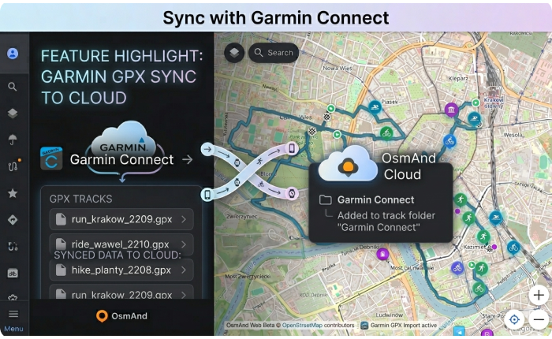
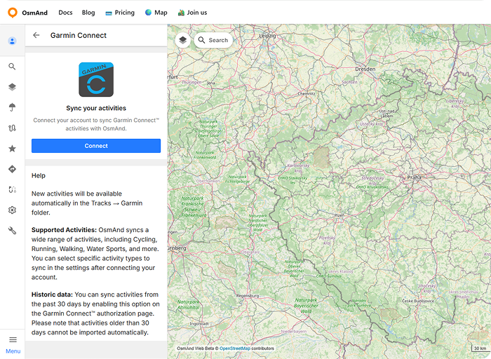
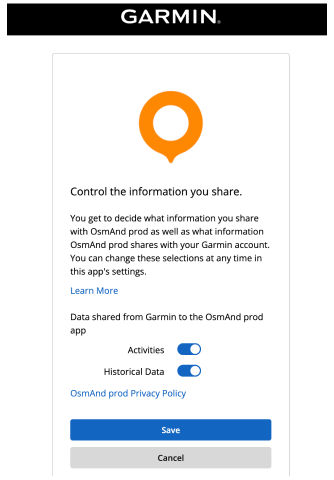
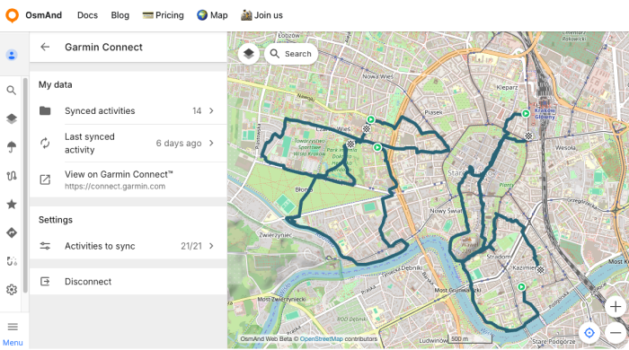
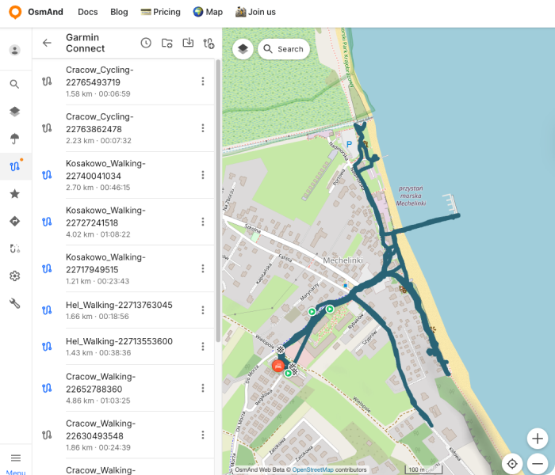
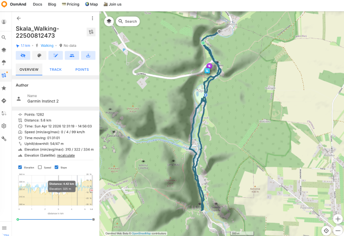
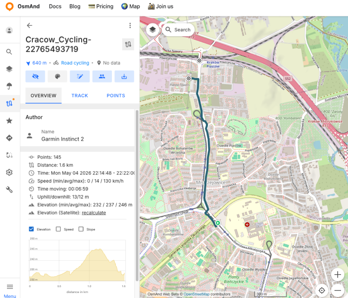
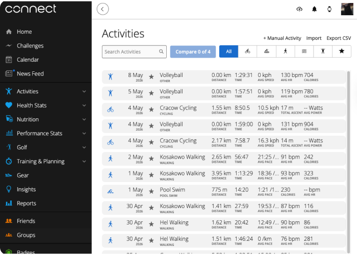
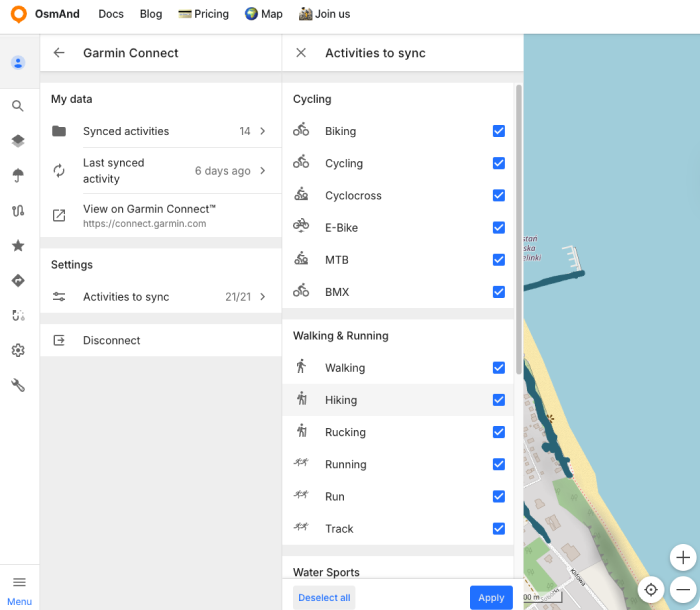

import Tabs from '@theme/Tabs';
import TabItem from '@theme/TabItem';
import AndroidStore from '@site/src/components/buttons/AndroidStore.mdx';
import AppleStore from '@site/src/components/buttons/AppleStore.mdx';
import LinksTelegram from '@site/src/components/_linksTelegram.mdx';
import LinksSocial from '@site/src/components/_linksSocialNetworks.mdx';
import Translate from '@site/src/components/Translate.js';
import InfoIncompleteArticle from '@site/src/components/_infoIncompleteArticle.mdx';
import ProFeature from '@site/src/components/buttons/ProFeature.mdx';

Hello friends!   
We are excited to announce a new feature that allows you to sync your activities from Garmin Connect™ with OsmAnd. This integration, now available for OsmAnd Pro users, enables you to automatically import your Garmin activities and view them in the Tracks section under a new folder called "Garmin Connect." 

You can now easily access your Garmin activities within OsmAnd to use them for navigation, analysis, or sharing. This update makes it simpler to keep all your outdoor adventures in one place and seamlessy integrate your Garmin data with OsmAnd’s mapping tools.

{/*truncate*/}

## How it works

First, you need to sign in to [OsmAnd web](https://osmand.net/docs/user/web/web-cloud#authorization) using an active OsmAnd Pro subscription. Then you will need to connect your [Garmin Connect™](https://connect.garmin.com/app/) account with [OsmAnd Web](https://osmand.net/map/account/garmin/). Once connected, OsmAnd will automatically sync your activities from Garmin Connect™ and create a new folder called "Garmin Connect" in the [Tracks section](https://osmand.net/docs/user/web/web-tracks). All your synced activities will be stored in this folder, allowing you to easily access and manage them.

### Connecting

To connect your Garmin Connect™ account with OsmAnd Web, follow these steps:

Go to [OsmAnd Web Map > OsmAnd Account > Connected Apps](https://osmand.net/map/account/garmin/) and click on the "Connect" button.

You will be redirected to the Garmin Connect™ login page. Enter your Garmin Connect™ credentials and authorize OsmAnd to access your Garmin Connect™ account. Here you can choose sharing of Historical data (_see details below_). Click to "Save" button for continuation.

:::info
**Historic data**: You can sync activities from the past 30 days by enabling this option on the Garmin Connect™ authorization page. Please note that activities older than 30 days cannot be imported automatically.
:::

## Menu

After successful authorization, you will see the Garmin Connect™ menu in your OsmAnd Web account with two section - "My data" and "Settings".  
"My data" section contains ["Synced activities" folder](https://osmand.net/docs/user/web/web-tracks) with all synced activities from Garmin Connect™, button "Last synced" activity, and Button "View on Garmin Connect™" that will redirect to your [Garmin Connect™ account](https://connect.garmin.com/app/activities).  
In "Settings" section you can choose type of activities to sync and the disconnecting button.

### My Data

- All your synced activities from Garmin Connect™ will be stored in the "Garmin Connect" folder in the [Tracks section](https://osmand.net/docs/user/web/web-tracks).

:::info
All new activities from Garmin Connect™ will be automatically synced with OsmAnd Web and added to the "Garmin Connect" folder. If you don't see your new activities in OsmAnd Web, please check that you have [new activities available on your Garmin Connect™ account](https://connect.garmin.com/app/activities). 
:::

You can view, analyze, and manage your activities directly within OsmAnd Web. This integration allows you to have all your outdoor adventures in one place, making it easier to track your progress and share your experiences with friends.

The "Garmin Connect" tracks folder will [be synced with OsmAnd mobile app](https://osmand.net/docs/user/personal/osmand-cloud), so you can also access your Garmin activities on the go. This means that you can view your Garmin activities on your mobile device and use them for navigation, analysis, or sharing with friends while you're out exploring.

- The "Last synced" activity button opens last synced activity from Garmin Connect™ in OsmAnd Web. This allows you to quickly access your most recent activity and view it in detail.

- The "View on Garmin Connect™" button will redirect you to your [Garmin Connect™ account Activities page](https://connect.garmin.com/app/activities), where you can view your activities in more detail and access additional features provided by Garmin Connect™.  
Not all activities from Garmin Connect™ may be synced with OsmAnd Web. Currently, only activites types what you choose in ["Settings" > "Activites to sync"](#settings) section will be synced.

### Settings

Here you can choose which types of activities to sync with OsmAnd Web. Go to "Settings" > "Activities to sync" and select the activity types you want to sync. 

After selecting the activity types, OsmAnd Web will automatically sync only those activities from your Garmin Connect™ account that match the selected types. This allows you to customize your syncing preferences and ensure that only relevant activities are imported into OsmAnd Web.

For disconnecting your Garmin Connect™ account from OsmAnd Web, go to "Settings" > "Disconnect" and click on the "Disconnect" button. This will revoke the access of OsmAnd Web to your Garmin Connect™ account and stop any further syncing of activities.  
Your tracks from Garmin Connect™ will remain in the "Garmin Connect" folder in the [Tracks section](https://osmand.net/docs/user/web/web-tracks) of your OsmAnd Web account, but no new activities will be synced until you reconnect your Garmin Connect™ account.

______________________________________________

**We appreciate your interest in us and thank you for taking the time to read this article. Join us on social media to keep up to date with the latest news and share your experiences. Your opinion is important to us.**

<LinksSocial/>
<LinksTelegram/>