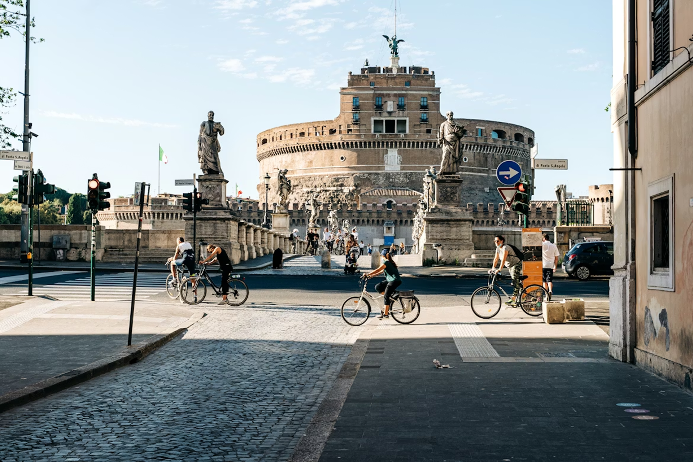
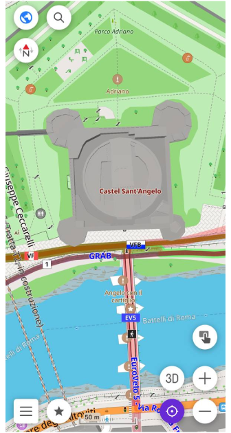
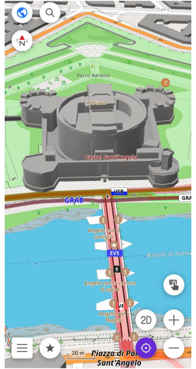
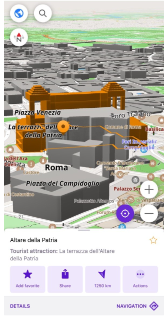
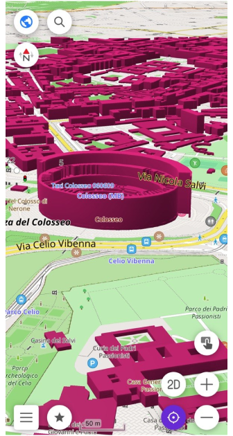

import Tabs from '@theme/Tabs';
import TabItem from '@theme/TabItem';
import AndroidStore from '@site/src/components/buttons/AndroidStore.mdx';
import AppleStore from '@site/src/components/buttons/AppleStore.mdx';
import LinksTelegram from '@site/src/components/_linksTelegram.mdx';
import LinksSocial from '@site/src/components/_linksSocialNetworks.mdx';
import Translate from '@site/src/components/Translate.js';
import InfoIncompleteArticle from '@site/src/components/_infoIncompleteArticle.mdx';
import ProFeature from '@site/src/components/buttons/ProFeature.mdx';

In films like Angels & Demons, Rome never feels flat. The city unfolds through narrow streets, archways, inner courtyards, and massive stone buildings rising above the crowd. You remember not only where the characters go, but the space around them — the height of the facades, the passages through buildings, the way entire streets disappear beneath arches before opening into another square.

But on most digital maps, cities lose that depth. Buildings become flat shapes, reduced to outlines that show where something exists, but not how the city actually feels. For mappers, this is where building data starts to matter.

In OpenStreetMap, buildings can contain far more than a simple outline. Mappers can describe a building's height, the number of floors, where different sections begin, and even passages running through the structure. OsmAnd uses this data to transform flat map geometry into detailed [3D cityscapes](https://osmand.net/docs/user/plugins/topography#3d-buildings). Buildings gain height, complex structures become distinguishable, and streets start to feel closer to the real places they represent.

{/*truncate*/}

Photo by [Gabriella Clare Marino](https://unsplash.com/@gabiontheroad) on [Unsplash](https://unsplash.com/photos/people-riding-bicycle-on-road-near-concrete-building-during-daytime-qCf5ITygm0A)

## How Buildings Become 3D

Every building on an OpenStreetMap-based map starts as a polygon, a flat outline drawn around the footprint of a structure. That outline tells the map where the building is, but nothing about its shape in space.

The transformation begins with a single tag: `building=*`. Once a polygon carries this tag, OsmAnd knows it represents a structure and can extrude it vertically. But without height information, every building gets the same default height — a uniform cityscape that feels more like a model kit than a real place.

This is where height tags change everything. When a mapper adds `height=*` with a value in meters, OsmAnd uses that exact figure to determine how tall to render the building. If the height is not known precisely, `building:levels=*` works as a practical alternative: OsmAnd treats each level as approximately 3 meters, so a five-story building tagged `building:levels=5` renders at around 15 meters. For buildings that don't start at ground level, `min_height=*` defines where the walls begin, useful for elevated sections, overhangs, or structures built above a passageway.

The result is immediate. Buildings stop being identical flat shapes and start reflecting what actually exists: a two-floor residential house next to a nine-floor apartment block, a low market hall beside a tall church tower. The map begins to carry real spatial information.

For Rome specifically, this matters a great deal. The city mixes centuries of architecture at wildly different scales. A single block might contain a Renaissance palazzo, a medieval tower remnant, and a modern addition — all at different heights, all worth mapping accurately.

 

## More Complex Structures

Not every building is a simple box. A cathedral might have a nave, a transept, and a tower, each rising to a different height. The Pantheon in Rome combines a cylindrical rotunda with a colonnaded porch, two distinct volumes at different heights within a single structure. A shopping arcade might combine a low glass atrium with a taller surrounding structure. In OpenStreetMap, these buildings can be mapped using `building:part=*`, which allows a single structure to be broken into sections, each with its own height and shape.

When a building is split into parts, OsmAnd renders each section independently. A part tagged with `height=15` sits lower than a neighboring part tagged with `height=40`, and the result on the map reflects the actual silhouette of the building rather than a single averaged block. For complex structures, this is the difference between a recognizable landmark and a generic shape.

To group parts into a coherent whole, mappers use a `type=building` relation. The relation connects the outer outline of the building with its individual parts, giving OsmAnd the context it needs to render them together correctly. Without this relation, parts and outlines can conflict, producing rendering errors or overlapping geometry.

## Passages Through Buildings

Archways, vaulted passages, and covered walkways that cut through a structure are a common feature of older European cities. On a flat map, a road that disappears beneath a building and reappears on the other side simply looks broken.

The tag `tunnel=building_passage` solves this. Applied to the way passing through a building, it tells OsmAnd that the road or pedestrian path runs beneath the structure rather than being blocked by it. The result is a visible opening in the 3D building model, a gap in the wall through which the street continues.

For mappers, the building outline and the road through it are mapped as separate elements. The way carries `tunnel=building_passage`, the building polygon sits above it, and when both are correctly tagged, the opening is rendered automatically.

## Viewing 3D Buildings in OsmAnd

To enable 3D buildings, go to *Menu → Configure map → Topography → 3D buildings*. Once the option is on, tilt the map by placing two fingers on the screen and swiping up. Buildings appear only at higher zoom levels, where individual structures are distinguishable, and fade in and out smoothly as you zoom or pan.

One detail worth knowing: if a POI or a navigation point falls inside a building, OsmAnd highlights the corresponding structure automatically. This is particularly useful in dense urban areas where a single address can be hard to locate visually. Instead of scanning the block, you see exactly which building you need.

## Adjusting 3D Display

Several settings control how 3D buildings look and perform on the map. [Color](https://osmand.net/docs/user/plugins/topography#appearance) lets you choose between the default map style or a custom color set separately for day and night mode (custom color is a [paid feature](https://osmand.net/docs/user/purchases)). Visibility controls the opacity of buildings using a slider from 10% to 100%, with 50% set by default. Lower values keep roads and labels readable beneath the structures, higher values make buildings more visually dominant.

Both settings open a separate preview screen where you can see the changes on a live map before applying them. If you want to return to the original values, a Reset to default option is available in the app bar.

For [performance](https://osmand.net/docs/user/plugins/topography#performance), two additional options are available. Level of detail switches between Low and High geometry complexity. High detail also enables the fade animation when buildings appear and disappear. View distance controls how far from the camera buildings are rendered, either Near or Far. Using both High and Far improves visual quality but may affect performance and battery usage.

Rome, like any city with centuries of layered architecture, rewards the effort of accurate mapping. When the data is there — heights, parts, passages — the map stops being a diagram and starts feeling like the place itself. Tilt the map, walk the streets, and see what careful mapping looks like from the inside.

______________________________________________

**We appreciate your interest in us and thank you for taking the time to read this article. Join us on social media to keep up to date with the latest news and share your experiences. Your opinion is important to us.**

<LinksSocial/>
<LinksTelegram/>