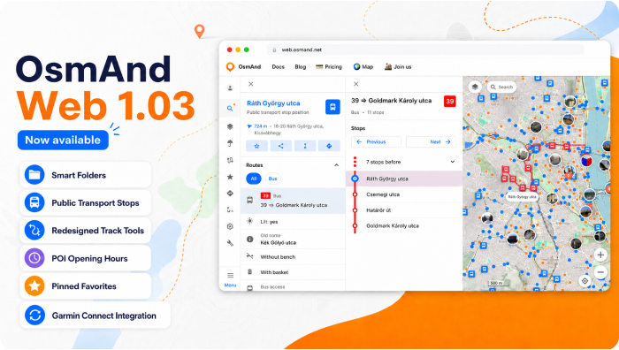

import Tabs from '@theme/Tabs';
import TabItem from '@theme/TabItem';
import AndroidStore from '@site/src/components/buttons/AndroidStore.mdx';
import AppleStore from '@site/src/components/buttons/AppleStore.mdx';
import LinksTelegram from '@site/src/components/_linksTelegram.mdx';
import LinksSocial from '@site/src/components/_linksSocialNetworks.mdx';
import Translate from '@site/src/components/Translate.js';
import InfoIncompleteArticle from '@site/src/components/_infoIncompleteArticle.mdx';
import ProFeature from '@site/src/components/buttons/ProFeature.mdx';

OsmAnd Web 1.03 — Now Available!

We're excited to announce the release of [OsmAnd Web 1.03](https://osmand.net/map). This update introduces Garmin Connect integration for automatic activity sync, a redesigned navigation interface, improved management of personal data with Smart Folders and pinned Favorites, and enhanced track customization with adjustable color and width. It also improves POI information with opening hours displayed directly in the context menu, along with multiple usability improvements and bug fixes across the web map.

Enjoy a smoother and more intuitive OsmAnd Web experience.

<!--truncate-->

## What's new

- Added [Garmin Connect integration](#garmin-connect-integration) for automatic activity sync;
- Added [Smart folders support](#smart-folders-support) for organizing tracks;
- [Public transport stops](#public-transport-stops) are now displayed on the map to help locate nearby transit options;
- Improved [POI context menu](#poi-context-menu-improvements) with richer information and a clearer layout;
- [Redesigned track context menu](#track-panel-redesign);
- Added the ability to [export GPX tracks as simplified files](#export-gpx-as-simplified-track) for easier sharing and smaller file size;
- [Opening hours](#opening-hours) are now displayed directly in the POI context menu when available;
- Added support for [pinned favorite folders](#pinned-favorites-folders) for quicker access to frequently used collections;
- [Redesigned Favorites](#favorites-and-waypoint-editing) and waypoint editing interface with improved appearance customization and folder management;
- Improved [selected object](#selected-object) highlighting on the map with a distinct pin marker and smarter map behavior;
- Improved [Wikimedia metadata handling](#wikimedia-metadata), including better display of author, license, and description for images;
- [Bug fixes](#bug-fixes).

## Garmin Connect Integration {#garmin-connect-integration}

You can now connect your [Garmin Connect](https://osmand.net/docs/user/web/web-cloud#connected-apps) account in the Web Planner and automatically sync your activities with OsmAnd.

Once connected, activities are imported as tracks and stored in a dedicated Garmin Connect folder in the Tracks section. New activities are added automatically after they are recorded in your Garmin account. Imported activities are converted into tracks, and their types are preserved when possible. You can also sync recent activity history during the initial connection.

Read more about it in [our blog article](../2026-05-13-garmin/index.mdx).

## Smart Folders Support {#smart-folders-support}

[Smart Folders](https://osmand.net/docs/user/web/web-tracks#smart-folders) are now supported in the web version, allowing you to view and manage track collections created on mobile devices. Smart Folders are synced via OsmAnd Cloud when Settings synchronization is enabled.

On the web, Smart Folders are displayed in the track list with a distinct star icon for easy identification. The folder content depends on its configuration on the device, and only supported parameters are applied when displaying tracks.

## Track Tools {#track-tools}

Several improvements were introduced to make working with tracks easier and more flexible.

### Track Panel Redesign {#track-panel-redesign}

Redesigned [track panel and context menu](https://osmand.net/docs/user/web/web-map#tracks) with a new top action bar, quick access controls, and tab-based navigation between Overview, Track, and Points.

### Export GPX as Simplified Track {#export-gpx-as-simplified-track}

A new export option allows [downloading GPX tracks](https://osmand.net/docs/user/web/web-navigation#download-and-save) in a simplified format. This helps reduce file size and improves compatibility when sharing tracks with other applications or services.

## Public Transport Stops {#public-transport-stops}

[Public transport stops](https://osmand.net/docs/user/web/web-map#transport-stops) can now be displayed directly on the map. Stop markers indicate locations where public transport routes operate. Selecting a stop opens a context panel with key information and quick actions.

The **Routes** section lists all routes serving the selected stop, including the transport type and route number. Selecting a route opens a detailed view showing the full sequence of stops, with the currently selected stop highlighted on the map.

## POI Context Menu Improvements {#poi-context-menu-improvements}

The POI context menu has been enhanced to display more useful information about locations directly on the map.

### Opening Hours {#opening-hours}

[Opening hours](https://osmand.net/docs/user/web/web-search#poi-details) are now shown directly in the POI context menu when this information is available. The menu also indicates whether a place is currently open or closed.

### Wikimedia Metadata {#wikimedia-metadata}

Photos from Wikimedia sources now display additional information in the [POI photo gallery](https://osmand.net/docs/user/web/web-search#photo-gallery). When opening a photo, users can view details such as the date, author, license information, and a description of the image.

## Pinned Favorite Folders {#pinned-favorites-folders}

Favorite folders can now be pinned so that frequently used folders appear at the top of the list for quicker access. Pinned folders are displayed in a separate section above the rest of the Favorites.

## Favorites and Waypoint Editing {#favorites-and-waypoint-editing}

The [Favorites and waypoint editing workflow](https://osmand.net/docs/user/web/web-favorites#favorites-actions) has been redesigned with a new unified Edit panel. Favorites and track waypoints can now be edited more conveniently, including name, address, description, folder, icon, color, and shape settings.

The updated interface also adds improved appearance preview both in the editor and on the map, categorized icon selection, custom color palettes, dedicated description editing, and easier folder management with support for creating new folders directly from the editor.

## Selected Object {#selected-object}

When an [object on the map](https://osmand.net/docs/user/web/web-map#selected-object) (such as a POI, favorite, or navigation point) is selected, it is now highlighted with a distinct pin marker. Only one object can be selected at a time, and the map scrolls to it only if it is not currently visible on screen.

## Bug fixes {#bug-fixes} 

- [Map jumped away from the selected track](https://github.com/osmandapp/web/issues/1444).
- [Favorites were not displayed when opening folders](https://github.com/osmandapp/web/issues/1435).
- [Scrolling issue in the track list](https://github.com/osmandapp/web/issues/1389).
- [Favorite folders ending with `.gpx` could not be renamed](https://github.com/osmandapp/web/issues/1442).
- [Incorrect statistics calculation for some multi-segment tracks](https://github.com/osmandapp/web/issues/1347).
- [Slow route analysis when building complex routes](https://github.com/osmandapp/web/issues/1080).
- [Crash when importing GPX files with longitude equal to `0.0`](https://github.com/osmandapp/web/issues/1152).
- [Shared track links required a page refresh to open correctly](https://github.com/osmandapp/web/issues/1316).
- [Incorrect geocoding results for some addresses](https://github.com/osmandapp/web/issues/1180).
- [Some Wikimedia photos were not displayed for POIs](https://github.com/osmandapp/OsmAnd/issues/24494).

_______________________

If you have suggestions for improving the Web version, please get in touch with us. We appreciate and welcome your contribution to the further development of OsmAnd.

______________________
- **Follow**: <LinksSocial/>  

- **Join**: <LinksTelegram/>  
