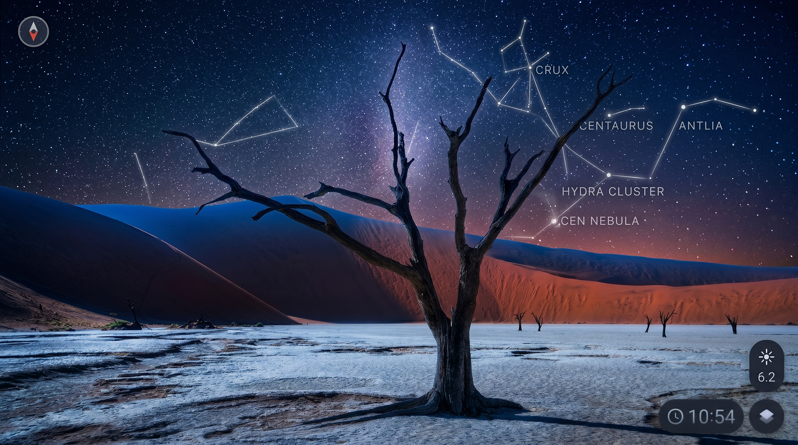
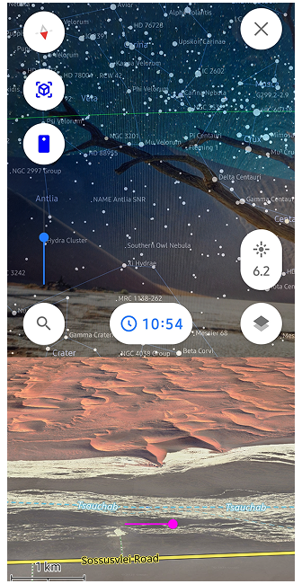
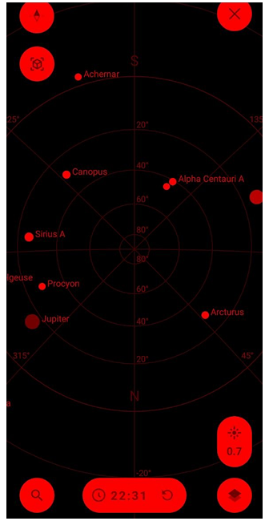
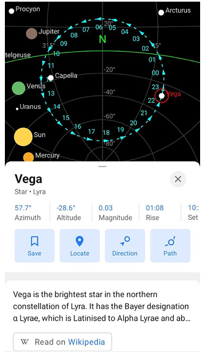
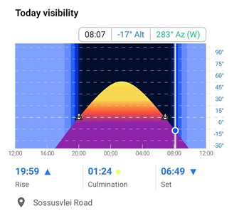
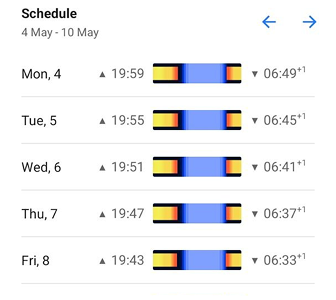
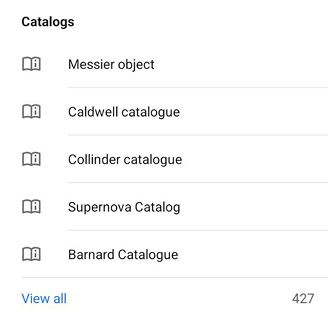
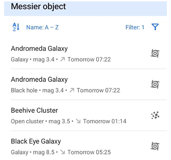

import Tabs from '@theme/Tabs';
import TabItem from '@theme/TabItem';
import AndroidStore from '@site/src/components/buttons/AndroidStore.mdx';
import AppleStore from '@site/src/components/buttons/AppleStore.mdx';
import LinksTelegram from '@site/src/components/_linksTelegram.mdx';
import LinksSocial from '@site/src/components/_linksSocialNetworks.mdx';
import Translate from '@site/src/components/Translate.js';
import InfoIncompleteArticle from '@site/src/components/_infoIncompleteArticle.mdx';
import ProFeature from '@site/src/components/buttons/ProFeature.mdx';
import QuizEmbed from '@site/src/components/QuizEmbed.js';

Far from city lights, the sky looks different. In the Namib Desert, darkness comes quickly and the stars appear all at once, filling the entire horizon. At first, it feels simple. A guide points to a few constellations, maybe a bright planet. You follow along, recognising some shapes. But after a moment, you lose track. There are more stars than you expected, and it is hard to tell them apart.

This is where [OsmAnd Astronomy](https://osmand.net/docs/user/plugins/astronomy) changes the experience. Instead of guessing, you can explore the sky the same way you explore a map — step by step, with clear orientation, useful context, and the ability to plan what to look for next.

{/*truncate*/}

{/*
Photo by [JP Desvigne](https://unsplash.com/@jpdvg) on [Unsplash](https://unsplash.com/photos/EheVP3WhJYk)
*/}

## Orient Yourself in the Sky

Start by opening the Star map in OsmAnd (Astronomy is available as a paid plugin in OsmAnd for Android and is currently not supported on iOS). The screen switches from the Earth map to the sky, showing stars, constellations, planets, and the paths of the Sun and Moon for your current location. The view is aligned with the compass, so you can drag the sky to explore it or enable compass mode and move your phone to follow your direction.

At the bottom of the screen, you can change the time to see how the sky looks later in the night or return to the present moment. If there are too many stars, adjust the magnitude filter to focus on the brightest ones.

To simplify the view further, open [Configure view](https://osmand.net/docs/user/plugins/astronomy#configure-view). Here you can choose what to display — for example, keep Solar system and Constellations visible while hiding Stars or Deep sky objects. You can also switch between 2D and 3D views or turn on the red filter to preserve your night vision while observing.

At this point, the sky stops feeling random. You are no longer just looking at it — you are navigating it.

 

## Find What’s Visible Tonight

Once you understand where you are looking, the next step is deciding what to look for. Tap [Search](https://osmand.net/docs/user/plugins/astronomy#search) on the Star map. Instead of scanning the entire sky, you get a structured list of celestial objects — planets, stars, constellations, and more.

At the top, the Watch now section highlights objects that are visible at your current location and time. It works as a simple guide, showing what is already above the horizon or will be visible tonight. Select any object from the list, and the map centers on it. From there, you can see where it is in the sky and start observing without guessing.

## Get Details About Objects

Pick any point in the sky that catches your eye and tap it. The map highlights it, and a [panel](https://osmand.net/docs/user/plugins/astronomy#context-menu) opens with everything you need to know. Instead of a nameless light, you now see a clear label — a star, a planet, or part of a constellation — along with a few key details. How bright it is, where it sits in the sky, and when it rises or sets. Enough to understand what you are looking at without digging into complex data.

Around the object, a subtle hour ring shows how it moves across the sky throughout the day. It adds a sense of motion, turning a static point into something you can follow.

From here, you can keep it simple or go further — center the object, save it, or use Direction to help you find it in the sky. So, what felt like a random point a moment ago now becomes something you can recognise, track, and return to.

## Choose the Right Moment

Some moments are easier to remember under an open sky. In a place like the Namib Desert, where the horizon is wide and the night is clear, timing matters just as much as location. Not every object is visible all night. Some rise later, others stay low near the horizon, and a few reach their best position only for a short time. Instead of waiting and hoping, you can check this in advance.

Open the [Visibility](https://osmand.net/docs/user/plugins/astronomy#visibility-graph) tab for any object. The graph shows how it moves across the sky over the course of a day, including when it rises, reaches its highest point, and sets. The higher it is above the horizon, the easier it is to see.

If you are planning ahead, switch to the [Schedule](https://osmand.net/docs/user/plugins/astronomy#observation-schedule) tab. It shows how visibility changes over the next days, so you can choose the right evening without guessing. With this, the sky becomes part of the plan. You are not just stepping outside and looking up — you know when to be there.

 

## Follow the Sky in Real Time

Switch to [camera mode](https://osmand.net/docs/user/plugins/astronomy/#ar-star-finding) and lift your phone toward the sky. You see the real sky on your screen with a transparent overlay aligned to your position and direction.

Move your phone slowly across the horizon. As objects enter your field of view, they are highlighted, making them easier to recognise. You are no longer matching shapes or guessing positions — the sky and the map align directly in front of you.

If something feels too faint or difficult to spot, this is where it becomes clearer. Adjust your position slightly, and the object appears exactly where it should be. Tap any highlighted object to see its details.

## Simplify the Sky and Explore Anywhere

As you continue exploring, you may notice that sometimes there is simply too much to see. In dense star fields, it helps to narrow things down. Use [filters](https://osmand.net/docs/user/plugins/astronomy/#sorting-and-filters) in Search to focus only on what matters right now. You can show only objects visible tonight, sort them by brightness, or limit the list to those visible to the naked eye. This turns a long list into a small set of clear options.

If you want to go further, open [Catalogs](https://osmand.net/docs/user/plugins/astronomy/#catalogs) to explore entire groups of objects — from well-known stars to deep sky objects. It is a different way of navigating the sky, more structured and less dependent on chance.

And all of this works even without a connection. The Astronomy plugin uses offline catalogs, so whether you are in the city or far out in the desert, the sky remains fully accessible.

 

## Stargazing Challenge

Ready to test your new stargazing skills? For a deeper dive into all the features, feel free to explore our full [Astronomy Plugin documentation](https://osmand.net/docs/user/plugins/astronomy). Once you are ready, take this quick interactive quiz to see how well you can navigate the night sky!

<QuizEmbed src="/astronomy_quiz_new.html" />

Out there, under a sky like in the Namib Desert, you no longer lose track after the first few constellations. You stay with it a little longer — and start to see more.

______________________________________________

**We appreciate your interest in us and thank you for taking the time to read this article. Join us on social media to keep up to date with the latest news and share your experiences. Your opinion is important to us.**

<LinksSocial/>
<LinksTelegram/>