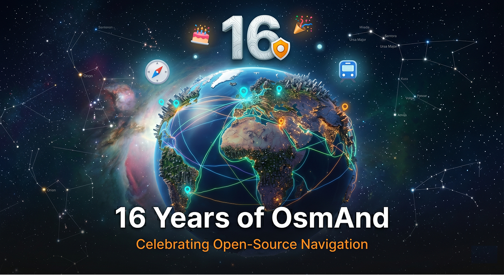

import React, {useEffect, useState} from 'react';
import Tabs from '@theme/Tabs';
import TabItem from '@theme/TabItem';
import AndroidStore from '@site/src/components/buttons/AndroidStore.mdx';
import AllStores from '@site/src/components/buttons/AllStores.mdx';
import LinksTelegram from '@site/src/components/_linksTelegram.mdx';
import LinksSocial from '@site/src/components/_linksSocialNetworks.mdx';
import Translate from '@site/src/components/Translate.js';
import InfoIncompleteArticle from '@site/src/components/_infoIncompleteArticle.mdx';
import ProFeature from '@site/src/components/buttons/ProFeature.mdx';
import AutoHeightIframe from '@site/src/components/AutoHeightIframe.js';

16 Years of OsmAnd! 🎉 Birthday Quiz & Free Pro Access 🚀

{/* truncate */}

<Tabs className="birthday-lang-tabs" groupId="birthday-article-language" queryString="lang" lazy>
<TabItem value="en" label="English" default>

OsmAnd is turning 16! For sixteen years, we have been building an independent, open-source navigation app for people who value offline maps, privacy, and freedom of movement.

From the very beginning, we have stayed true to our principles: no intrusive ads, no third-party data sharing, and no unnecessary tracking. OsmAnd is shaped by its community, contributors, and users around the world — and this anniversary is a moment to celebrate that journey together.

To thank you for being part of OsmAnd, we have prepared a small birthday activity: a quick **16th Birthday Quiz**. Complete the quiz and receive **1 or 3 months of free OsmAnd Pro access**.

The quiz takes about 5 minutes and is designed as a simple, fun way to celebrate OsmAnd’s 16th anniversary.

<AutoHeightIframe src="/birthday_quiz_preview.html?lang=en" />

Thank you for 16 years of mapping, navigating, and exploring the world with us! 🌍✨

Victor Shcherb  
CEO of OsmAnd

</TabItem>
<TabItem value="de" label="Deutsch">

OsmAnd wird 16 Jahre alt! Seit sechzehn Jahren entwickeln wir eine unabhängige Open-Source-Navigations-App für Menschen, die Offline-Karten, Datenschutz und Bewegungsfreiheit schätzen.

Von Anfang an sind wir unseren Grundsätzen treu geblieben: keine aufdringliche Werbung, keine Weitergabe von Daten an Dritte und kein unnötiges Tracking. OsmAnd wird von seiner Community, seinen Mitwirkenden und Nutzern auf der ganzen Welt geprägt — und dieses Jubiläum ist ein Moment, um diesen gemeinsamen Weg zu feiern.

Als Dankeschön dafür, dass Sie Teil von OsmAnd sind, haben wir eine kleine Geburtstagsaktion vorbereitet: ein kurzes **Quiz zum 16. Geburtstag**. Schließen Sie das Quiz ab und erhalten Sie **1 oder 3 Monate kostenlosen Zugang zu OsmAnd Pro**.

Das Quiz dauert etwa 5 Minuten und ist als einfache, unterhaltsame Möglichkeit gedacht, den 16. Geburtstag von OsmAnd zu feiern.

<AutoHeightIframe src="/birthday_quiz_preview.html?lang=de" />

Vielen Dank für 16 Jahre gemeinsames Kartieren, Navigieren und Entdecken der Welt! 🌍✨

Victor Shcherb  
CEO von OsmAnd

</TabItem>
<TabItem value="es" label="Español">

¡OsmAnd cumple 16 años! Durante dieciséis años hemos estado creando una aplicación de navegación independiente y de código abierto para personas que valoran los mapas sin conexión, la privacidad y la libertad de movimiento.

Desde el principio, nos hemos mantenido fieles a nuestros principios: sin anuncios intrusivos, sin compartir datos con terceros y sin rastreo innecesario. OsmAnd está formado por su comunidad, colaboradores y usuarios de todo el mundo, y este aniversario es un momento para celebrar juntos este camino.

Para agradecerte que formes parte de OsmAnd, hemos preparado una pequeña actividad de cumpleaños: un rápido **Quiz del 16.º aniversario**. Completa el quiz y recibe **1 o 3 meses de acceso gratuito a OsmAnd Pro**.

El quiz dura unos 5 minutos y está diseñado como una forma sencilla y divertida de celebrar el 16.º aniversario de OsmAnd.

<AutoHeightIframe src="/birthday_quiz_preview.html?lang=es" />

¡Gracias por 16 años de cartografiar, navegar y explorar el mundo con nosotros! 🌍✨

Victor Shcherb  
CEO de OsmAnd

</TabItem>
<TabItem value="fr" label="Français">

OsmAnd fête ses 16 ans ! Depuis seize ans, nous développons une application de navigation indépendante et open source pour les personnes qui attachent de l’importance aux cartes hors ligne, à la confidentialité et à la liberté de mouvement.

Depuis le début, nous sommes restés fidèles à nos principes : pas de publicités intrusives, pas de partage de données avec des tiers et pas de suivi inutile. OsmAnd est façonné par sa communauté, ses contributeurs et ses utilisateurs dans le monde entier — et cet anniversaire est l’occasion de célébrer ce parcours ensemble.

Pour vous remercier de faire partie d’OsmAnd, nous avons préparé une petite activité d’anniversaire : un rapide **quiz du 16e anniversaire**. Terminez le quiz et recevez **1 ou 3 mois d’accès gratuit à OsmAnd Pro**.

Le quiz prend environ 5 minutes et a été conçu comme une manière simple et amusante de célébrer le 16e anniversaire d’OsmAnd.

<AutoHeightIframe src="/birthday_quiz_preview.html?lang=fr" />

Merci pour ces 16 années passées à cartographier, naviguer et explorer le monde avec nous ! 🌍✨

Victor Shcherb  
CEO d’OsmAnd

</TabItem>
<TabItem value="it" label="Italiano">

OsmAnd compie 16 anni! Da sedici anni sviluppiamo un’app di navigazione indipendente e open source per persone che apprezzano le mappe offline, la privacy e la libertà di movimento.

Fin dall’inizio siamo rimasti fedeli ai nostri principi: niente pubblicità invasive, nessuna condivisione dei dati con terze parti e nessun tracciamento non necessario. OsmAnd è costruito dalla sua community, dai suoi contributori e dagli utenti di tutto il mondo — e questo anniversario è un momento per celebrare insieme questo percorso.

Per ringraziarti di far parte di OsmAnd, abbiamo preparato una piccola attività di compleanno: un rapido **Quiz del 16° anniversario**. Completa il quiz e ricevi **1 o 3 mesi di accesso gratuito a OsmAnd Pro**.

Il quiz richiede circa 5 minuti ed è pensato come un modo semplice e divertente per celebrare il 16° anniversario di OsmAnd.

<AutoHeightIframe src="/birthday_quiz_preview.html?lang=it" />

Grazie per questi 16 anni passati a mappare, navigare ed esplorare il mondo insieme a noi! 🌍✨

Victor Shcherb  
CEO di OsmAnd

</TabItem>
<TabItem value="nl" label="Nederlands">

OsmAnd wordt 16 jaar! Al zestien jaar bouwen we aan een onafhankelijke, open-source navigatie-app voor mensen die offline kaarten, privacy en bewegingsvrijheid belangrijk vinden.

Vanaf het begin zijn we trouw gebleven aan onze principes: geen opdringerige advertenties, geen gegevensdeling met derden en geen onnodige tracking. OsmAnd wordt gevormd door zijn community, bijdragers en gebruikers over de hele wereld — en dit jubileum is een moment om die reis samen te vieren.

Om u te bedanken dat u deel uitmaakt van OsmAnd, hebben we een kleine verjaardagsactiviteit voorbereid: een korte **16e verjaardagsquiz**. Voltooi de quiz en ontvang **1 of 3 maanden gratis toegang tot OsmAnd Pro**.

De quiz duurt ongeveer 5 minuten en is bedoeld als een eenvoudige, leuke manier om het 16-jarig jubileum van OsmAnd te vieren.

<AutoHeightIframe src="/birthday_quiz_preview.html?lang=nl" />

Bedankt voor 16 jaar samen kaarten maken, navigeren en de wereld verkennen! 🌍✨

Victor Shcherb  
CEO van OsmAnd

</TabItem>
<TabItem value="pl" label="Polski">

OsmAnd kończy 16 lat! Od szesnastu lat tworzymy niezależną aplikację nawigacyjną open source dla osób, które cenią mapy offline, prywatność i swobodę poruszania się.

Od samego początku pozostajemy wierni naszym zasadom: bez natrętnych reklam, bez udostępniania danych stronom trzecim i bez niepotrzebnego śledzenia. OsmAnd jest kształtowany przez społeczność, współtwórców i użytkowników z całego świata — a ta rocznica to moment, aby wspólnie świętować tę drogę.

Aby podziękować za bycie częścią OsmAnd, przygotowaliśmy małą urodzinową aktywność: krótki **Quiz z okazji 16. urodzin**. Ukończ quiz i otrzymaj **1 lub 3 miesiące bezpłatnego dostępu do OsmAnd Pro**.

Quiz zajmuje około 5 minut i został przygotowany jako prosty, przyjemny sposób na świętowanie 16. rocznicy OsmAnd.

<AutoHeightIframe src="/birthday_quiz_preview.html?lang=pl" />

Dziękujemy za 16 lat wspólnego mapowania, nawigowania i odkrywania świata! 🌍✨

Victor Shcherb  
CEO OsmAnd

</TabItem>
<TabItem value="pt" label="Português">

O OsmAnd faz 16 anos! Há dezasseis anos que desenvolvemos uma aplicação de navegação independente e open source para pessoas que valorizam mapas offline, privacidade e liberdade de movimento.

Desde o início, mantivemo-nos fiéis aos nossos princípios: sem anúncios intrusivos, sem partilha de dados com terceiros e sem rastreamento desnecessário. O OsmAnd é moldado pela sua comunidade, pelos seus colaboradores e por utilizadores em todo o mundo — e este aniversário é um momento para celebrar este percurso em conjunto.

Para agradecer por fazer parte do OsmAnd, preparámos uma pequena atividade de aniversário: um rápido **Quiz do 16.º aniversário**. Complete o quiz e receba **1 ou 3 meses de acesso gratuito ao OsmAnd Pro**.

O quiz demora cerca de 5 minutos e foi pensado como uma forma simples e divertida de celebrar o 16.º aniversário do OsmAnd.

<AutoHeightIframe src="/birthday_quiz_preview.html?lang=pt" />

Obrigado por 16 anos a mapear, navegar e explorar o mundo connosco! 🌍✨

Victor Shcherb  
CEO do OsmAnd

</TabItem>
<TabItem value="tr" label="Türkçe">

OsmAnd 16 yaşında! On altı yıldır çevrimdışı haritalara, gizliliğe ve hareket özgürlüğüne değer veren insanlar için bağımsız, açık kaynaklı bir navigasyon uygulaması geliştiriyoruz.

En başından beri ilkelerimize bağlı kaldık: rahatsız edici reklamlar yok, üçüncü taraflarla veri paylaşımı yok ve gereksiz takip yok. OsmAnd; topluluğu, katkıda bulunanları ve dünyanın dört bir yanındaki kullanıcıları tarafından şekillendiriliyor — bu yıl dönümü de bu yolculuğu birlikte kutlamak için güzel bir an.

OsmAnd’in bir parçası olduğunuz için teşekkür etmek amacıyla küçük bir doğum günü etkinliği hazırladık: kısa bir **16. Doğum Günü Quiz’i**. Quiz’i tamamlayın ve **1 veya 3 ay ücretsiz OsmAnd Pro erişimi** kazanın.

Quiz yaklaşık 5 dakika sürer ve OsmAnd’in 16. yıl dönümünü kutlamanın basit, eğlenceli bir yolu olarak tasarlanmıştır.

<AutoHeightIframe src="/birthday_quiz_preview.html?lang=tr" />

OsmAnd ile dünyayı haritalandırarak, gezinerek ve keşfederek geçirdiğiniz 16 yıl için teşekkür ederiz! 🌍✨

Victor Shcherb  
OsmAnd CEO’su

</TabItem>
<TabItem value="uk" label="Українська">

OsmAnd виповнюється 16 років! Упродовж шістнадцяти років ми створюємо незалежний open-source застосунок для навігації для людей, які цінують офлайн-карти, приватність і свободу пересування.

Із самого початку ми залишаємося вірними своїм принципам: без нав’язливої реклами, без передавання даних третім сторонам і без зайвого відстеження. OsmAnd формується спільнотою, учасниками проєкту та користувачами з усього світу — і ця річниця є нагодою відсвяткувати цей шлях разом.

Щоб подякувати вам за те, що ви є частиною OsmAnd, ми підготували невелику святкову активність: коротку **вікторину до 16-річчя**. Пройдіть вікторину та отримайте **1 або 3 місяці безкоштовного доступу до OsmAnd Pro**.

Вікторина займає приблизно 5 хвилин і створена як простий та цікавий спосіб відсвяткувати 16-річчя OsmAnd.

<AutoHeightIframe src="/birthday_quiz_preview.html?lang=uk" />

Дякуємо за 16 років картографування, навігації та дослідження світу разом із нами! 🌍✨

Victor Shcherb  
CEO OsmAnd

</TabItem>
<TabItem value="ar" label="العربية">

يحتفل OsmAnd بمرور 16 عامًا! على مدار ستة عشر عامًا، عملنا على تطوير تطبيق ملاحة مستقل ومفتوح المصدر للأشخاص الذين يقدّرون الخرائط دون اتصال، والخصوصية، وحرية الحركة.

منذ البداية، بقينا متمسكين بمبادئنا: لا إعلانات مزعجة، ولا مشاركة للبيانات مع أطراف ثالثة، ولا تتبع غير ضروري. يتشكل OsmAnd بفضل مجتمعه والمساهمين فيه والمستخدمين حول العالم — وهذا الاحتفال هو فرصة للاحتفاء بهذه الرحلة معًا.

شكرًا لكونك جزءًا من OsmAnd. بهذه المناسبة، أعددنا نشاطًا بسيطًا للاحتفال: **اختبار عيد الميلاد السادس عشر**. أكمل الاختبار واحصل على **شهر واحد أو 3 أشهر من الوصول المجاني إلى OsmAnd Pro**.

يستغرق الاختبار حوالي 5 دقائق، وقد صُمم ليكون طريقة بسيطة وممتعة للاحتفال بالذكرى السادسة عشرة لـ OsmAnd.

<AutoHeightIframe src="/birthday_quiz_preview.html?lang=ar" />

شكرًا لكم على 16 عامًا من رسم الخرائط والتنقل واستكشاف العالم معنا! 🌍✨

Victor Shcherb  
CEO of OsmAnd

</TabItem>
</Tabs>

___________________________

<LinksSocial/>
<LinksTelegram/>
<AllStores/>
