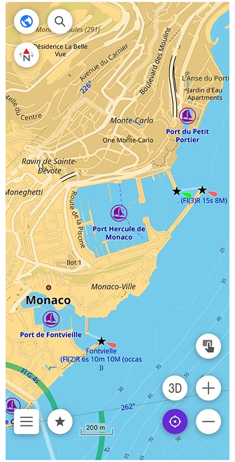
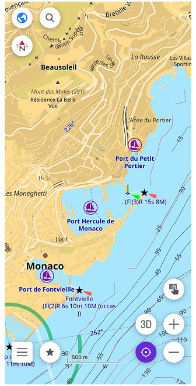
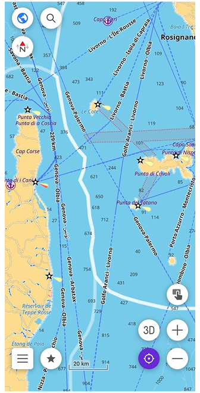
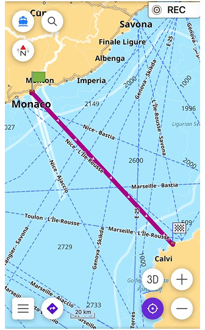

import Tabs from '@theme/Tabs';
import TabItem from '@theme/TabItem';
import AndroidStore from '@site/src/components/buttons/AndroidStore.mdx';
import AppleStore from '@site/src/components/buttons/AppleStore.mdx';
import LinksTelegram from '@site/src/components/_linksTelegram.mdx';
import LinksSocial from '@site/src/components/_linksSocialNetworks.mdx';
import Translate from '@site/src/components/Translate.js';
import InfoIncompleteArticle from '@site/src/components/_infoIncompleteArticle.mdx';
import ProFeature from '@site/src/components/buttons/ProFeature.mdx';

Some trips exist first as an idea. You open a map, find a coastline, and start building something in your head — a route, a few stops, maybe a harbor where you'd want to spend the evening. A principality of your own, even if just for a week.
Principality of Monaco takes that idea literally. In summer the water gets crowded quickly — and what looks like open space from the shore has its own logic underneath. Shallow patches, restricted zones, boats coming and going from every direction. You don't notice any of it until you're already in the middle of it.

A regular map won't tell you any of that. Roads, buildings, points of interest — useful on land, but the moment you're moving on water, the map needs to change completely.

This is what OsmAnd's Nautical Map View is for. Depth data, seabed information, navigation lights, buoys, fairways — the kind of detail that turns a general-purpose app into something you can actually use on the water. Whether you're planning a route along the Côte d'Azur or just trying to find a safe place to anchor for the night, it starts with a different kind of map.

{/*truncate*/}

Photo by [Wyatt Simpson](https://unsplash.com/@wyattsimpson98) on [Unsplash](https://unsplash.com/photos/monacos-harbor-is-filled-with-boats-and-buildings-Y6DirWz6c8w)

## Switch to Nautical View

Port Hercule has that quality of feeling both glamorous and impossibly tight. Yachts moored so close you could step from one deck to another, ferries cutting through the same water, tour boats circling. Once you clear the breakwater and the harbor opens up behind you, the relief is immediate. Open sea, room to breathe, and Corsica somewhere ahead on the horizon.

Before anything else, you need the [Nautical Map View](https://osmand.net/docs/user/plugins/nautical-charts) plugin. Open the Plugins section in the main menu, find it in the list, and enable it. Then download the nautical maps for your region. You'll find them in [Maps & Resources](https://osmand.net/docs/user/personal/maps-resources) under the Nautical maps section.
With that done, open Configure map, find Map style (Map type), and switch to Nautical. Land becomes yellow, shallow water light blue, deeper water progressively darker. The coastline becomes the primary reference line, exactly as it should be when you're navigating by sea.

For open water passages, there's also the Marine style in the same menu. It adds colored sector lights around lighthouses, INT-1 light characteristics for each beacon, and a rendering closer to what you'd find on a professional electronic chart. Both styles are part of the same plugin — switching between them takes seconds depending on whether you're in a harbor or crossing open sea.

 

## Understand Depth and Seabed

The Mediterranean between Monaco and Corsica looks uniform from the surface — deep, open water with nothing obvious to avoid. But the seabed tells a different story. Depth changes quickly near the Ligurian coast, and some areas that appear safe on a general map become more nuanced when you have actual numbers in front of you.

On the nautical map, depth appears in two ways. Depth points are individual numbers scattered across the water, each showing the shallowest measured depth at that exact location — all values in meters. Depth contours connect points of equal depth into lines, giving you a clearer picture of how the seabed rises and falls across a wider area. Together they turn a flat blue surface into something with actual shape.

You can download both separately in Maps & Resources under Nautical maps — depth points by hemisphere, depth contours by region. Once downloaded, they appear on the map automatically.

Below the water, the seabed itself also has a character. Rocky bottom, sand, gravel, silt, coral — each behaves differently for anchoring, and in shallow areas, composition matters. In [Configure map](https://osmand.net/docs/user/map/configure-map-menu), the Seabed detail option controls how much of this is shown. Simple displays the basic seamark symbols. Category adds the type of material. All shows every qualifier the data contains — texture, density, biological classification. For most passages, Simple or Category is enough. All becomes useful when you're choosing where to anchor for the night.

## Spot What Guides You

Open water has its own system of signs. Not road signs or street names — lights, shapes, and colors that tell you where the safe water is, where the channel runs, and what to avoid. Once you know what to look for, the map starts reading differently.

Lighthouses appear on the nautical map as distinct symbols along the coastline. Between Monaco and Corsica, Cap Corse at the northern tip of the island is one of the most prominent marks on this stretch. In Configure map, the Light detail option controls how much information is shown next to each lighthouse or beacon. Simple displays the name and basic light characteristic. Sectors adds the full arc geometry — colored wedges showing exactly which direction each light is visible from.

Buoys mark the edges of channels, isolated dangers, and safe water. Each has a shape, color, and often a light pattern, all encoded as seamark symbols on the map. The full range of buoy types is covered in the [map legend](https://osmand.net/docs/user/map-legend/nautical-map#buyos-and-beacons), and with the Nautical or Marine style active, they appear exactly where they are in the water.

Together, lighthouses and buoys turn the open stretch toward Corsica from a blank blue space into a readable sequence of reference points — each one telling you something specific about where you are and where to go next.

## Plan a Safe Route

Corsica is about 170 kilometers from Monaco — open Mediterranean the whole way, no channels to follow, no mapped waterways to route along. This is where the choice of navigation profile matters.

The [Boat profile](https://osmand.net/docs/user/navigation/routing/boat-navigation) in OsmAnd is designed for rivers, canals, and marked fairways. For open water like this crossing, it's not the right tool — the data simply isn't there. Instead, switch to [Direct-to-point routing](https://osmand.net/docs/user/navigation/routing/direct-to-point-routing). It navigates in a straight line toward your destination without relying on mapped waterways, which is exactly what open sea navigation requires. To enable it, activate the Boat profile in the app settings, then select Direct-to-point as the routing type.

With depth contours visible on the map, the route becomes more than just a line from A to B. You can see where the seabed rises toward the Corsican coast, where shallow areas begin near the approaches to Bastia or Calvi, and adjust your course before you're anywhere near them.

Two additional settings help here. Spot sounding distance controls how frequently depth points appear on the map — a smaller value means more numbers visible at once, useful when approaching a coast. Safety depth contour lets you set a threshold — say 5 meters — and highlights that contour line on the map so it's immediately visible against everything else. The map doesn't make decisions for you, but it gives you what you need to make them yourself.

## From Open Water to a Clear Path

The open sea eventually gives way to the silhouette of the Corsican coast. As you approach the island, the empty spaces on the map shift back into a detailed network of seamarks, safety contours, and harbor lights. Navigation changes from long-range planning to precision tracking, but the tools remain exactly the same.

What makes this system work is that the water is never completely empty of data. The nautical charts in OsmAnd are based on OpenSeaMap, a crowdsourced project where sailors, skippers, and developers from all over the world contribute real-time geographic information. Every beacon, depth contour, and restricted zone is part of a constantly evolving database built by the people who actually use these waters.

When you navigate with OsmAnd, you are not just using a static piece of software — you are looking at a collaborative map that turns the unpredictable surface of the water into a structured, reliable path. 

## Setting Your Own Course

Before you weigh anchor for your next coastal journey, it is worth exploring the finer details of marine navigation. You can discover every map symbol, attribute, and advanced configuration in our full [Nautical Map View](https://osmand.net/docs/user/plugins/nautical-charts) documentation. Once you have studied the charts, try your hand at our interactive quiz to see if you can distinguish a safe fairway from a shallow risk. 

  <iframe 
    src="/nautical_quiz.html" 
    style={{ position: 'absolute', top: '0', left: '0', width: '100%', height: '100%', border: 'none' }}
    allow="fullscreen">
  </iframe>

Out there on the Mediterranean, the water stops being an unpredictable obstacle — it becomes a route you can confidently read and follow.

______________________________________________

**We appreciate your interest in us and thank you for taking the time to read this article. Join us on social media to keep up to date with the latest news and share your experiences. Your opinion is important to us.**

<LinksSocial/>
<LinksTelegram/>