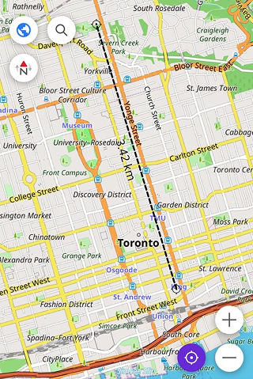
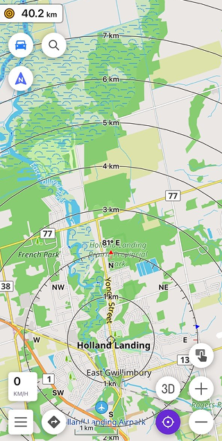
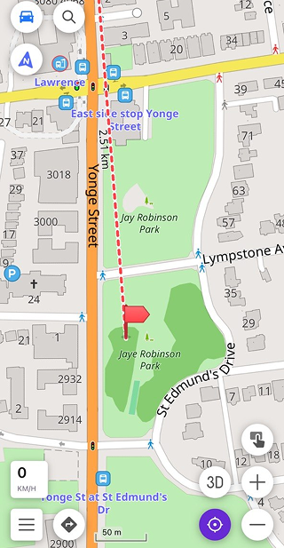

import Tabs from '@theme/Tabs';
import TabItem from '@theme/TabItem';
import AndroidStore from '@site/src/components/buttons/AndroidStore.mdx';
import AppleStore from '@site/src/components/buttons/AppleStore.mdx';
import LinksTelegram from '@site/src/components/_linksTelegram.mdx';
import LinksSocial from '@site/src/components/_linksSocialNetworks.mdx';
import Translate from '@site/src/components/Translate.js';
import InfoIncompleteArticle from '@site/src/components/_infoIncompleteArticle.mdx';
import ProFeature from '@site/src/components/buttons/ProFeature.mdx';
import QuizEmbed from '@site/src/components/QuizEmbed.js';

Running every morning is just what you do. No discussion — just the street and whatever distance feels right that day. Your running partner lives on Yonge Street. So do you. Same street, different ends — and when he suggested a 7 AM run "somewhere in the middle", it sounded simple enough.

Yonge Street is 56 kilometres long. The longest street in the world, according to Guinness. It starts at Lake Ontario and runs straight north through Toronto until it quietly disappears near Holland Landing. "Somewhere in the middle" turned out to be a question neither of you had actually answered. You were both on Yonge Street — technically neighbours — and had absolutely no idea how far apart you were standing.

A few taps in OsmAnd, and the guessing stopped. Distance by tap, radius circles, a straight line to your meeting point — tools that turn a vague sense of scale into something exact.

{/*truncate*/}

Photo by [Getty Images](https://unsplash.com/@gettyimages) on [Unsplash](https://unsplash.com/photos/an-aerial-view-of-toronto-skyline-in-ontario-canada-captured-in-winter-MkXRNrGILqw)

## Distance by Tap: Quick Gestures on the Go

You're three kilometres into the run and there's a park ahead. Is it worth the detour, or is it further than it looks? You don't want to stop, open a route planner, and wait for a calculation. You just want a number. That's exactly what [Distance by Tap](https://osmand.net/docs/user/widgets/configure-screen#distance-by-tap) is for. Enable it in *Menu → Configure screen → Other → Distance by tap*, and the tool is ready whenever you need it .

Tap anywhere on the map and a straight line appears from your current location to that point, with the distance shown right on the line. Tap somewhere else, and the line moves. It stays on screen as you keep going, giving you a live read on how far something is.

For measuring between any two points — say, from a subway entrance to a coffee shop — place two fingers on the map simultaneously. OsmAnd draws the line between those two points and shows the distance between them, independent of where you are.

If the label is hard to read while moving, go to *Menu → Configure screen → Other → Distance by tap → Text size* and switch from Normal to Large. The label becomes 1.5× bigger, with extra spacing added between the line and the text. The change applies instantly. No interruptions to the pace.

## Ruler: A Permanent Scale on Your Screen

Distance by Tap answers a specific question: how far is that point? The [Ruler](https://osmand.net/docs/user/widgets/radius-ruler#ruler) answers a different one: what does distance actually look like on this map right now?

It sits at the bottom of the screen as a thin line segment labeled with its real-world length — 100 meters, 500 feet, whatever fits the current zoom level. No setup needed, no widget to add. It's simply there, adapting quietly as you pan and zoom. Closer in, the scale shrinks to show finer distances. Zoomed out over the whole city, it stretches to represent kilometres.

Running along an unfamiliar stretch of Yonge Street, you glance at the map and see a segment marked 200 m. The next intersection looks about two segments away — roughly 400 metres. So, to change the units between metres and feet, go to *Menu → Configure profile → General settings → Units & formats → Units of length*. The scale updates instantly across the whole map. It's a small thing, permanently useful.

## Radius Ruler: Visualizing Spheres of Reach

Sometimes the question isn't how far a specific point is — it's what's actually reachable from where you're standing.

Enable the widget via *Menu → Configure screen → Widgets → Choose a panel → Add widget → Radius ruler*, and the map fills with concentric circles centred on your location. Each ring is labeled with its distance — 1 km, 2 km, 3 km and so on. The intervals adjust automatically as you zoom in or out.

On a long run down Yonge Street, this changes how you read the map. Instead of measuring point to point, you can see at once which parks, subway stations, or coffee shops fall within a comfortable distance — and which ones don't.

Tap the widget to cycle through three [display modes](https://osmand.net/docs/user/widgets/radius-ruler#radius-ruler-widget) — Hide, Light, and Dark — depending on what works best against the map underneath. For a wider view of the surrounding area, go to Menu → Configure screen → Other → Display position and switch your location from Center to Bottom — this shifts your position lower on the screen and expands the visible radius above you. You can also tilt the map into 3D view with a two-finger swipe up, which gives the circles depth and makes distances easier to read across the landscape.

## Map Markers and Target Line: Tracking Points in Real Time

You've agreed to meet your running partner at Jaye Robinson Park. You drop a [marker on the map](https://osmand.net/docs/user/personal/markers) — a quick long-tap, then add marker and a flag appears at that point. That's your target.

Enable Arrows on the map and Direction line in *Menu → Map markers → Appearance*, and the map connects your current location to the marker with a straight line. As you run, the line updates continuously — the distance to the marker counts down, and the bearing shifts as your angle to the target changes. If the marker moves off screen, an arrow takes over and keeps pointing you in the right direction. 

The Map markers bar widget at the top of the screen shows the distance and direction to your marker at all times — so even when you're zoomed in and the marker isn't visible, you always know how far you are and which way to go. 

## Straight Line Routing: Building Complex Measurement Paths

Today's run has a few more moving parts: starting on Yonge Street, cutting across a park, following a trail that isn't on any road map, finishing somewhere several kilometres away. For that, you need something more structured.

Open *Menu → Plan a route* and select the *Straight line* method. A dashed line connects each point you place, and as you build the route, the points list below shows the distance and azimuth for each segment. You're not following roads — you're drawing directly across the map, which makes [this tool](https://osmand.net/docs/user/plan-route/create-route) particularly useful for off-road areas or anywhere the street network doesn't match where you actually want to go. 

Add points one by one using the pointer at the centre of the screen, then tap Add point. Move the map to position the next point, add it, and the segment builds. Each entry in the points list shows the cumulative distance and the bearing from the previous point — so at any stage you can see not just the total length of your path, but the exact direction of each leg.

When you're done, the route can be saved as a GPX track — a standalone file you can reopen, share, or use for navigation later. What started as a rough measurement exercise becomes a reusable track. 

## From Guesstimate to Exact Numbers

Running 56 kilometres of Yonge Street in one go was never the point. The point was knowing — at any moment, from any spot — exactly how far something is, what falls within reach, and where a route actually leads. Each tool in this article answers a different version of that question. 

Before you head out, take a moment to explore the full documentation — you'll find links to each tool throughout this article. Once you're ready, try the interactive quiz below to see how well you can put it all together.

<QuizEmbed src="/measuring_tools_quiz.html" />

______________________________________________

**We appreciate your interest in us and thank you for taking the time to read this article. Join us on social media to keep up to date with the latest news and share your experiences. Your opinion is important to us.**

<LinksSocial/>
<LinksTelegram/>