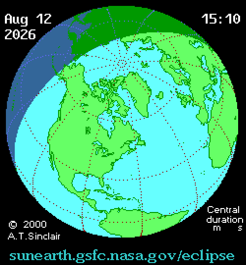
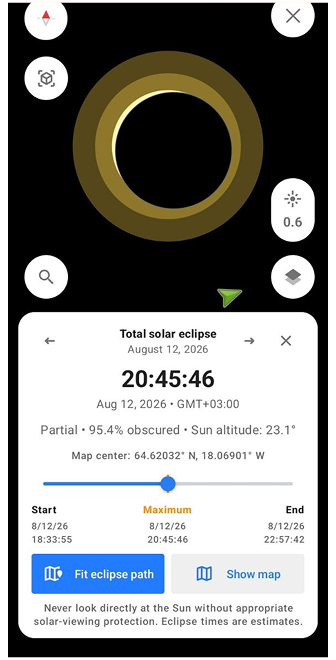
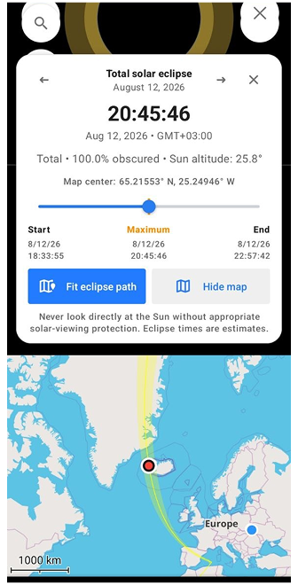
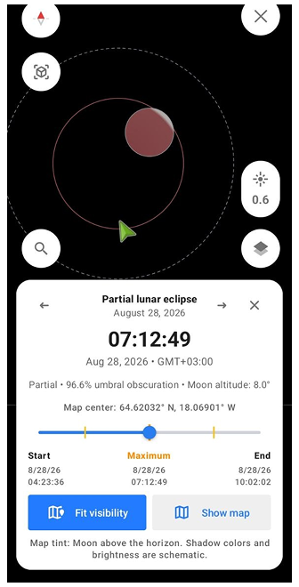
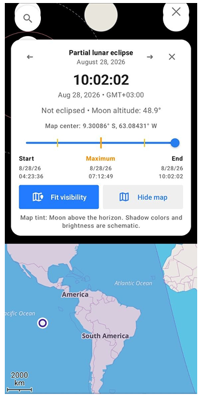

import Tabs from '@theme/Tabs';
import TabItem from '@theme/TabItem';
import AndroidStore from '@site/src/components/buttons/AndroidStore.mdx';
import AppleStore from '@site/src/components/buttons/AppleStore.mdx';
import LinksTelegram from '@site/src/components/_linksTelegram.mdx';
import LinksSocial from '@site/src/components/_linksSocialNetworks.mdx';
import Translate from '@site/src/components/Translate.js';
import InfoIncompleteArticle from '@site/src/components/_infoIncompleteArticle.mdx';
import ProFeature from '@site/src/components/buttons/ProFeature.mdx';

August comes with two alarms on the calendar. On August 12, a total solar eclipse sweeps from the Arctic across Greenland and Iceland, reaching northern Spain and the Balearic Islands just before sunset — the first total solar eclipse visible from mainland Europe since 1999. Sixteen days later, on August 28, a deep partial lunar eclipse covers 96% of the Moon's surface, making it nearly indistinguishable from a total eclipse for anyone watching from the Americas.

Two rare events in the same month. And both of them unusual in their own way. The solar eclipse arcs up and over the North Pole, which means its path runs north-to-south rather than the typical west-to-east sweep. In Spain, the Sun will sit only a few degrees above the horizon during totality — turning the eclipse into something closer to a golden-hour phenomenon than a midday event. The lunar eclipse, meanwhile, stops just short of totality: at its peak, a narrow bright sliver of the Moon remains uncovered, leaving the rest darkened and faintly reddish. 

OsmAnd Astronomy now includes (*Android only*, currently available in [OsmAnd 5.4 beta](https://osmand.net/docs/versions/nightly_versions#android) via Google Play or as a [nightly build](https://download.osmand.net/latest-night-build/OsmAnd-android-full-arm64.apk)) dedicated explorers for both events. You can move through the timeline, check visibility for any location on the planet, and see exactly how each eclipse develops — before either of them actually happens.

{/*truncate*/}

Animation: A.T. Sinclair / [NASA — Public Domain](https://en.wikipedia.org/wiki/Solar_eclipse_of_August_12,_2026#/media/File:SE2026Aug12T.gif)

## Solar Eclipse Explorer

Open the Star Map and tap [Search](https://osmand.net/docs/user/plugins/astronomy#search). Among the standard categories — Solar system, Constellations, Stars — you'll now see two new entries: Solar eclipse and Lunar eclipse. Tap Solar eclipse to open the explorer.

The screen switches to a dark view centred on the Sun, with the Moon's disc moving across it. Below, a card shows the current eclipse: its type, the percentage of the Sun obscured, the Sun's altitude at the selected location, and the exact start, maximum, and end times. A timeline slider lets you move through the event minute by minute and watch how the geometry changes.

Tap Show map to open the flat map below the card. The eclipse shadow appears as a path across the planet — a narrow band of totality with the penumbra spreading outward on both sides. Use Fit eclipse path to zoom to the full shadow on the map, or drag the map to any location to recalculate visibility for that point. The card updates instantly: move to Iceland and it shows totality, move to London and it switches to partial with a different obscuration value.

To switch between eclipses, use the arrows on either side of the eclipse title — Previous and Next — to jump to other solar eclipses and explore their paths across different parts of the world.

 

## Lunar Eclipse Explorer

Tap Lunar eclipse in Search to open the second explorer. The interface works the same way — timeline, location-based card, map layer — but the event itself looks different.

Instead of a shadow crossing the planet, you're watching the Moon move through Earth's own shadow. The explorer renders both zones: the faint outer penumbra and the darker umbra at the centre. Three eclipse types are supported — penumbral, partial, and total — and the timeline marks the contact points P1 through P4, showing exactly when the Moon crosses each boundary.

What's unique here is the visibility layer. Unlike a solar eclipse, which is visible only along a narrow path, a lunar eclipse is visible from the entire night side of Earth at once. Tap Show map and the tinted region shows everywhere the Moon is above the horizon during the event — often half the planet. Drag the map or move the slider to see how that region shifts as the night progresses.

 

## Plan Your Eclipse Observation

In 1504, Christopher Columbus, stranded in Jamaica and facing starvation, consulted an almanac and discovered a total lunar eclipse was coming. He used that knowledge to convince the local people that his god was angry — and when the Moon darkened on schedule, it saved his crew. He had no telescope, no app, and no map. Just a book of predictions and the right timing.

The tools look different now. Before any eclipse, open OsmAnd Astronomy, tap Solar eclipse or Lunar eclipse in Search, and check exactly what you'll see from your location. Move the map, and the card updates instantly — partial or total, obscuration percentage, Sun or Moon altitude, start and end times. Everything Columbus had to calculate by hand, resolved in a single tap.

Use the arrows on the eclipse card to move forward in time — past August, past this year, to any upcoming event. Some eclipses are total, some barely graze the penumbra, some are only visible from the middle of the Pacific. The explorer shows all of them, with the same level of detail for each. If you're planning a trip somewhere and want to know whether an eclipse lines up with your itinerary — or whether you should adjust the itinerary to line up with the eclipse — this is where you find out. Sometimes the sky makes the decision for you.

## Don't Have the Astronomy Plugin Yet?

The sky has two rare events planned for August. As it turns out, so does OsmAnd.

The Astronomy plugin — which includes everything covered in this article — is available with Maps+ and OsmAnd Pro. Until August 5, both are part of the Summer Sale. If you've been on the fence, the timing is hard to ignore. [See what's on offer!](https://osmand.net/pricing)