import Tabs from '@theme/Tabs';
import TabItem from '@theme/TabItem';
import AndroidStore from '@site/src/components/buttons/AndroidStore.mdx';
import LinksTelegram from '@site/src/components/_linksTelegram.mdx';
import LinksSocial from '@site/src/components/_linksSocialNetworks.mdx';
import Translate from '@site/src/components/Translate.js';
import InfoIncompleteArticle from '@site/src/components/_infoIncompleteArticle.mdx';
import ProFeature from '@site/src/components/buttons/ProFeature.mdx';
import InfoAndroidOnly from '@site/src/components/_infoAndroidOnly.mdx';

OsmAnd 5.4 for Android is now available on the Google Play Store. Please update to the latest version to enjoy the new features and improvements.

At this release, we focused on improving the search experience, making it easier to find places and discover objects around a specific location. We also added the ability to attach media files to Favorites and Waypoints, making them more informative and useful for your travels.

[🔄 **Update Now!**](https://play.google.com/store/apps/dev?id=8483587772816822023)

Thanks to all our users for their feedback and suggestions. Your input is invaluable in helping us improve OsmAnd and make it the best navigation app for Android.

{/*truncate*/}

## What's new

- [Refreshed search UI](#refreshed-search-ui): sorting, category filters, cleaner look
- [Attach photos and media to Favorites](#attach-photos-and-media-to-favorites)
- [Favorites](#subgroups-support-and-pinnable-folders-for-favorites): subgroups support and pinnable folders
- [New widgets appearance](#new-widgets-appearance)
- [Roof shapes for 3D Buildings](#updated-3d-buildings)
- [Coordinates](#coordinates-epsg-systems): search, map grid, and POI display now support EPSG and Maidenhead locator
- [Navigation settings improvements](#navigation-settings-improvements)
- [Android Auto updates](#android-auto-updates)
- [Astronomy added solar & lunar eclipses](#astronomy-added-solar--lunar-eclipses)
- [AIS improvements](#ais-improvements)
- [New spatial search](#new-spatial-search) — find places and search around a place
- [Others updates and improvements](#others-updates-and-improvements)
- [Bug fixes](#bug-fixes).

## Refreshed search UI

{/*
https://github.com/osmandapp/OsmAnd/issues/8613
*/}

We introduced a refreshed [**Search interface**](../docs/user/search/search-all#search-explore) designed to make finding places faster and easier.

You can now quickly choose **where to search** — around the **Map Center** or **My Location** — and select how results should be sorted: by **Nearest** or **Relevance**.

It is also easier to narrow down the results by selecting one or multiple **POI categories**, so you can focus only on the places you are interested in.

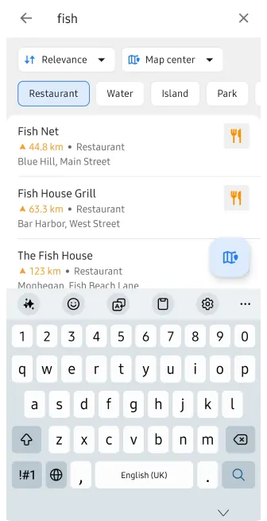 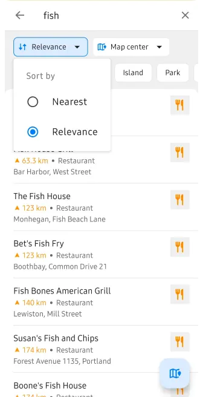

The updated interface makes Search more flexible, easier to understand, and faster to use.

### History search and filtering

The **Search History** menu now gives you more control over what is displayed.

You can filter history by item type and choose one or several categories:

- Tracks
- Locations
- Addresses
- POIs
- Favorites
- Photos
- Destinations

By default, **all history items** are shown.

You can also sort history by:

- **Recent**
- **Nearest**
- **Nearest to Map Center**

An additional **Type** filter lets you display:

- **All**
- **Search**
- **Navigation**

The **History settings** menu also includes an option to **back up your history**, helping you preserve your previous searches and navigation activity, make back up as file or clear all history.

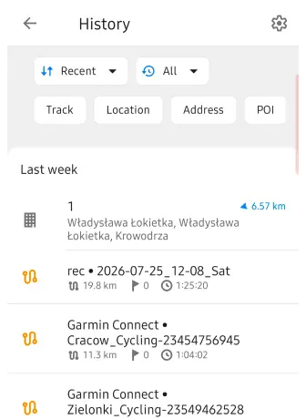 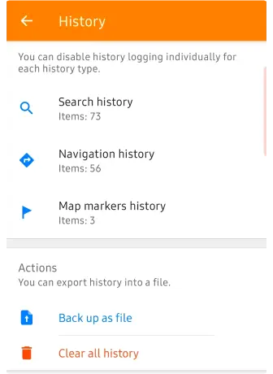

## Attach photos and media to Favorites

{/*
https://github.com/osmandapp/OsmAnd/issues/7125

https://github.com/osmandapp/OsmAnd/issues/14829  Partially implemented

https://github.com/osmandapp/OsmAnd/issues/24313
*/}

We've made **[Favorites](../docs/user/personal/favorites) and [Waypoints](../docs/user/navigation/setup/gpx-navigation#waypoints) more informative** by allowing you to attach media files directly to them.

Similar to the [**Audio/Video Notes**](../docs/user/plugins/audio-video-notes) feature, you can now add photos, videos, and audio notes to a saved Favorite or GPX Waypoint. You can take a new photo, record a video or audio note, or choose existing media from your device.

Attached files are displayed in a new **Media** section directly in the Favorite or Waypoint context menu, so photos and recordings connected to a place are easy to access when you need them.

This makes Favorites and Waypoints useful not only for saving a location, but also for keeping additional visual or audio information connected to that place.

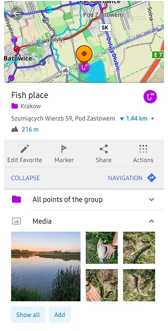 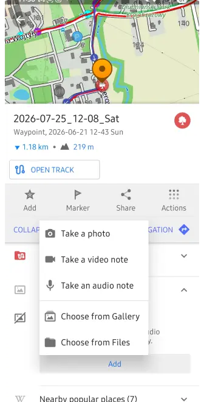

## Subgroups support and pinnable folders for Favorites

{/*
https://github.com/osmandapp/OsmAnd/issues/9967
*/}

Managing large collections of **Favorites** is now much easier.

Favorites can now be organized using [**folders and subfolders**](../docs/user/personal/favorites#bulk-edit--delete), similar to the folder structure already available for Tracks. This allows you to create a clear hierarchy instead of keeping all Favorite groups at the same level.

For example, you can organize places like this:

`Netherlands / Amsterdam / Museums`

or create even deeper folder structures when needed.

In **My Places → Favorites**, folders are displayed separately from individual Favorite points. You can create new folders, rename them, and move Favorites between folders and subfolders.

The full folder path is also shown where it is useful, including the Favorite **context menu**, making it easier to understand where a saved place belongs. For long folder structures, OsmAnd automatically shortens the path while keeping the most important folder names visible.

You can also **pin important folders** for quicker access to the Favorite groups you use most often.

The new hierarchy is supported when moving and exporting Favorites and works with **OsmAnd Cloud synchronization**, while preserving the existing file-based Favorites structure.

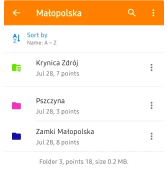

## New widgets appearance

{/*
https://github.com/osmandapp/OsmAnd/issues/25018
*/}

We introduce new [**appearance settings for map widgets**](../docs/user/widgets/configure-screen#widget-panels), giving you more control over how information is displayed on the map.

Instead of configuring widgets only individually, you can now customize the appearance of each widget panel — **Left, Right, Top, and Bottom** — from a dedicated **Appearance** screen.

For each panel, you can adjust:

- **Widget or row size** — Original, Small, Medium, or Large
- **Widget icons** — keep individual settings, show all, or hide all
- **Text and secondary text colors**
- **Background color** — Default, Transparent, or Custom

A live preview shows how the selected settings will look directly while you configure them.

For custom colors, **Day and Night modes can be configured separately**, helping keep widgets readable with different map styles and lighting conditions.

You can also **copy appearance settings** from another widget panel or another profile, making it easier to keep a consistent layout across different OsmAnd profiles.

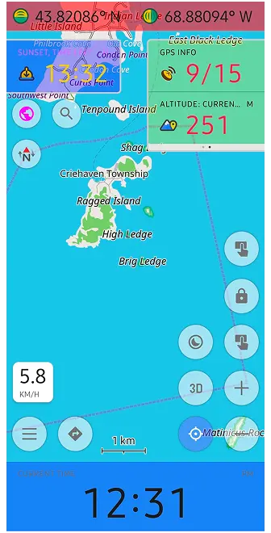

## Updated 3D Buildings

{/*
https://github.com/osmandapp/OsmAnd/issues/14864
*/}

OsmAnd 5.4 brings another major update to [**3D Buildings**](../docs/user/plugins/topography#3d-buildings), making cityscapes more detailed and closer to the real-world geometry stored in OpenStreetMap.

Buildings can now display **different roof shapes** instead of being rendered only as simple flat-topped volumes. When the corresponding roof information is available in OpenStreetMap, OsmAnd uses it to create a more recognizable building silhouette.

Rendering of **complex buildings and building parts** has also been improved. OsmAnd now handles structures divided into multiple `building:part` elements more accurately, including cases where only `building:levels` information is available instead of an explicit height.

We also improved the rendering of buildings created from **relations and multipolygons**, fixing cases where individual sections or lower parts of complex structures could be missing from the 3D model.

These changes make landmarks and detailed urban areas significantly more realistic when exploring the map in 3D.

To enable the feature, go to:

**Menu → Configure map → Topography → 3D buildings**

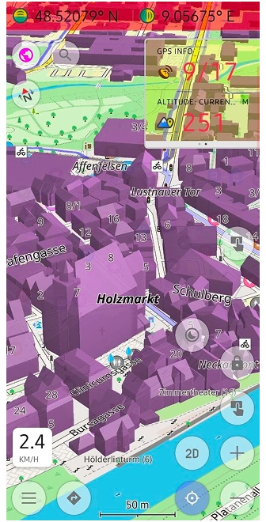

## Coordinates EPSG systems

{/*
https://github.com/osmandapp/OsmAnd/issues/17311
*/}

We expand support for **coordinate systems**, making the app more useful for professional mapping, field work, surveying, amateur radio, and other activities that rely on specific coordinate formats.

You can now use **EPSG coordinate systems** and the **Maidenhead Locator System** across different parts of OsmAnd, including:

- **Coordinate Search**
- **Map Grid**
- **POI and map context information**

In [**Coordinate Search**](../docs/user/search/search-address#coordinates-search), you can select recently used formats or browse the full list of available coordinate systems. You can also quickly find the required system by searching for its **name or EPSG code**.

The **Maidenhead Locator System** is also supported on Android. It represents locations using a compact combination of letters and numbers and is commonly used by amateur radio operators.

Coordinate formats can be configured separately for each OsmAnd profile. You can choose a **Primary coordinate format**, add other formats to the list, reorder them, or remove formats you do not need.

## Navigation settings improvements

{/*
https://github.com/osmandapp/OsmAnd/issues/22987
*/}

OsmAnd 5.4 improves navigation in situations where a route crosses regions with **outdated or inconsistent offline maps**.

Previously, [route calculation](../docs/user/navigation/setup/route-navigation) could be interrupted by several dialogs asking you to update maps or manually continue using the downloaded maps. In some cases, this could even happen during route recalculation while navigation was already active.

Now, OsmAnd can handle these situations more smoothly. If the selected routing method cannot calculate the route correctly, the app can switch to an alternative calculation method and continue navigation without unnecessary interruptions.

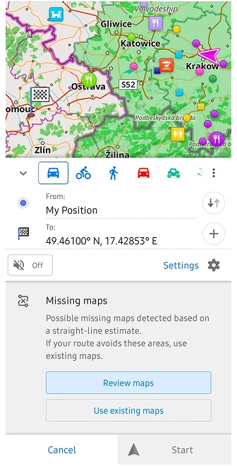 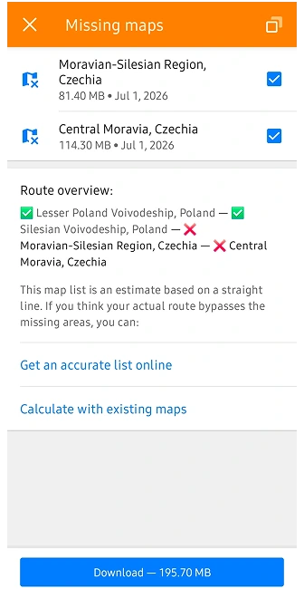

You can also control this behaviour manually in:

**Navigation settings → Route parameters → Route calculation method**

Here, you can choose the preferred routing calculation method depending on your needs.

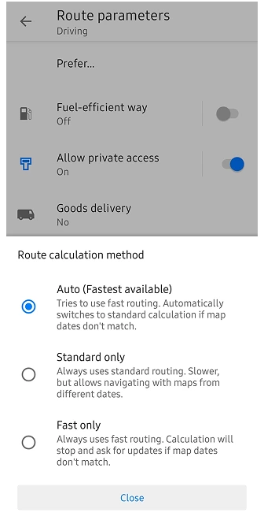

This makes route calculation more reliable when travelling across map borders or when not all downloaded maps were updated at the same time.

## Android Auto updates

OsmAnd 5.4 brings several improvements to [**Android Auto**](../docs/user/navigation/auto-car), making the map, search, and navigation experience more convenient on the car display.

### Separate Map Scale for Android Auto

Android Auto can now use its ful because the phone and the vehicle's display can have very different screen sizes and resolutions. You can adjust the map scale specifically for Android Auto to make roads, labels, and other map elements more comfortable to read on your car screen.

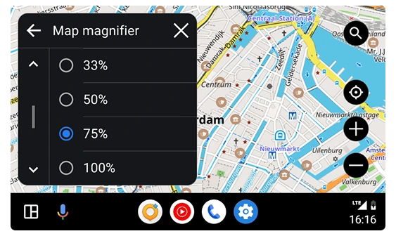

### More Useful Search Results

Search results in Android Auto now show more information at a glance.

For POIs, OsmAnd can display **opening hours in a compact format**, together with distance and address information. This makes it easier to see whether a restaurant, shop, fuel station, or another place is currently open before selecting it as your destination.

Address presentation has also been simplified for nearby POIs, reducing unnecessary information on the limited Android Auto screen.

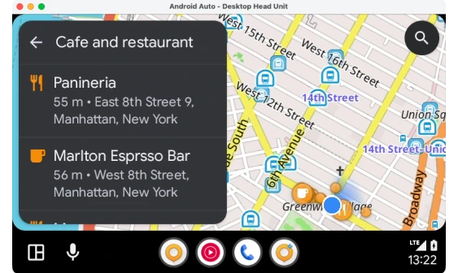

### Improved Navigation Controls

Navigation controls have also been refined. The **X button next to the ETA** now correctly stops the active navigation, making it easier to finish a trip directly from the Android Auto interface.

We also fixed interface issues on the arrival screen, including the duplicated Search button that could appear after reaching a destination.

Together, these changes make Android Auto cleaner and easier to use while keeping important map, search, and navigation information accessible on the road.

## Astronomy added solar & lunar eclipses

{/*
https://github.com/osmandapp/OsmAnd-Issues/issues/3279
*/}

The [**Astronomy plugin**](../docs/user/plugins/astronomy#search) continues to grow in OsmAnd 5.4 with new tools for exploring **solar and lunar eclipses** directly on the Star Map.

### Solar Eclipses

You can now explore solar eclipses around the world and see how an eclipse develops over time.

The new [**Solar Eclipse Explorer**](../docs/user/plugins/astronomy#solar-eclipse) shows the eclipse shadow on the map and provides a timeline that you can move through to see how the event changes. Information is calculated for the selected location, making it possible to check whether and how the eclipse will be visible there.

You can also quickly switch between **previous and next solar eclipses** and explore their paths in different parts of the world.

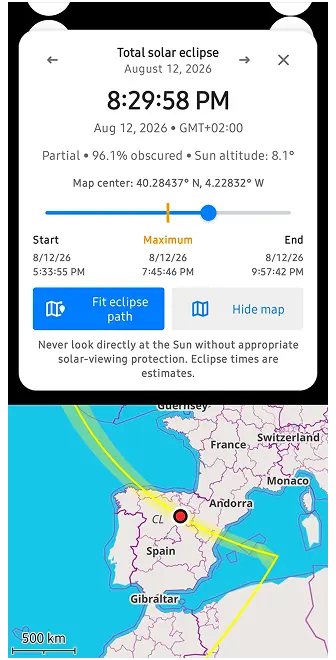 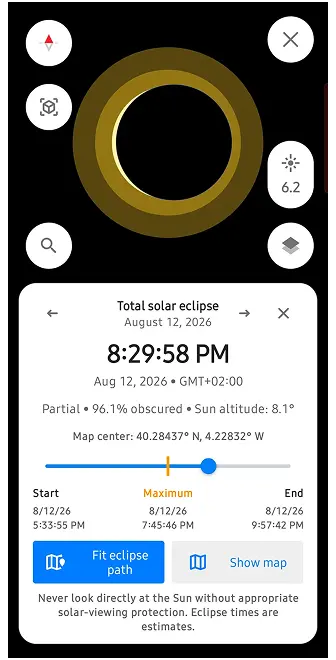 

### Lunar Eclipses

The Star Map now also includes a dedicated [**Lunar Eclipse Explorer**](../docs/user/plugins/astronomy#lunar-eclipse), supporting:

- **Penumbral eclipses**
- **Partial eclipses**
- **Total eclipses**

The eclipse timeline shows the different stages of the event, while the visualization demonstrates how the Moon moves through the Earth's **penumbra and umbra**.

You can check the current eclipse phase, obscuration, Moon altitude, and where the eclipse is visible. A dedicated visibility layer on the map helps show the regions where the Moon is above the horizon during the event.

Together, these additions turn the Astronomy plugin into a useful tool not only for exploring stars and planets, but also for **planning and observing upcoming eclipses**.

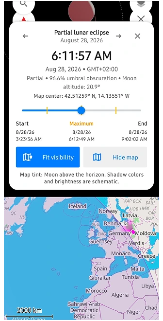 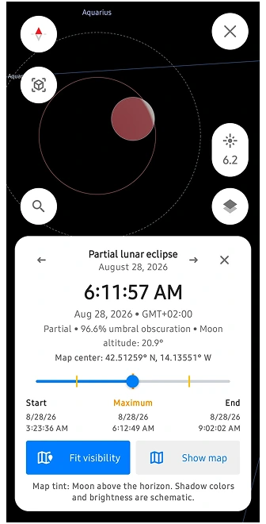 

## AIS improvements

{/*
https://github.com/osmandapp/OsmAnd/issues/23512
*/}

OsmAnd 5.4 brings several improvements to the [**Vessel Tracker (AIS)**](../docs/user/plugins/ais-tracker) plugin, making it easier to configure AIS connections and monitor nearby vessels.

The plugin settings have been reorganized into clearer sections for **Connection**, **Object visibility**, and **Collision avoidance alarms (CPA)**.

You can configure AIS data reception using **TCP or UDP**, with connection information and status displayed directly in the interface.

New **Object visibility** settings give you more control over outdated AIS targets. You can define when a vessel should be marked as outdated and how long it should remain visible on the map after its signal is lost.

The **Collision Avoidance Alarm (CPA)** settings have also been redesigned. You can configure:

- **Warning time (TCPA)** — how far in advance OsmAnd should warn about a potential collision.
- **Closest Point of Approach (CPA)** — the minimum safe distance between your vessel and another AIS target.

When another vessel is predicted to come too close within the configured time, OsmAnd can highlight it as a potential collision risk.

AIS visibility can also be managed as a dedicated map layer through **Configure Map**, making it easier to enable or disable vessel information when needed.

## New spatial search

{/*
https://github.com/osmandapp/OsmAnd/issues/25485

https://github.com/osmandapp/OsmAnd/issues/25331
*/}

> **Experimental feature:** In OsmAnd 5.4, the new spatial search algorithm is available only when the [**OsmAnd Development plugin**](../docs/user/plugins/development) is enabled. This allows us to collect feedback and continue improving the feature before enabling it by default in a future release.

Search in OsmAnd 5.4 has received a major upgrade. A new **spatial search algorithm** makes it easier to find places and discover objects around a specific location.

Previously, search was largely tied to your current location and the way individual words in a query were interpreted. The new approach takes geographical context into account, making combinations such as a **place name + POI**, category, street, or address much easier to understand.

For example, you can find a city or another place first and then search for **cafés, restaurants, hotels, shops, fuel stations, or other POIs around that location**. This is especially useful when planning a trip somewhere else instead of searching only near your current position.

The new search engine also improves how OsmAnd handles more complex queries, including combinations such as **"Hotel Berlin"**, a POI together with a street or city, different street-name formats, translated category names, and other location-based searches.

Under the hood, this is more than an interface update. Our backend team introduced a new search architecture called **Spatial Search by Name**, designed to provide more relevant results and resolve many limitations of the previous search system. Search by supported POI categories has also been optimized for faster results.

## Others updates and improvements

- **More track details in [What's Here](../docs/user/map/map-context-menu#select-gpx-route).** Track information now makes it easier to distinguish between tracks on the map, including identifying the folder where a track is stored.  
  {/*[#24608](https://github.com/osmandapp/OsmAnd/issues/24608)*/}

- **[More icons for profiles.](../docs/user/personal/profiles#profile-appearance)** The profile icon selection has been expanded, giving you more options to visually distinguish profiles for activities such as running and other use cases.  
  {/*[#22508](https://github.com/osmandapp/OsmAnd/issues/22508)*/}

- [**Extended AIDL support for external apps.**](../docs/technical/osmand-api-sdk/#android-osmand-aidl-api) External apps and plugins can now organize their OsmAnd widgets into groups and use custom widget icons, providing more flexibility for third-party integrations.  
  {/*[#24980](https://github.com/osmandapp/OsmAnd/issues/24980)*/}

- [**Correct altitude on Android 16.**](../docs/user/personal/maps-resources#world-maps) Fixed an issue where OsmAnd could display ellipsoidal altitude instead of altitude above mean sea level (MSL) on Android 16 devices.  
  {/*[#25438](https://github.com/osmandapp/OsmAnd/issues/25438)*/}

## Bug fixes 

- Fixed [multiple URLs separated by semicolons being displayed and opened as a single link](https://github.com/osmandapp/OsmAnd/issues/24971).
- Fixed [the **Open on map** action in Travel Guides](https://github.com/osmandapp/OsmAnd/issues/25062).
- Fixed [copying widget panels and layouts from another profile](https://github.com/osmandapp/OsmAnd/issues/25011).
- Improved [performance when opening GPX waypoint descriptions by resolving intermittent UI freezes](https://github.com/osmandapp/OsmAnd/issues/25137).
- Fixed [widgets disappearing from **Analyze on map** after returning to OsmAnd from another app](https://github.com/osmandapp/OsmAnd/issues/24436).
- Fixed [imported multi-segment tracks not appearing immediately after import](https://github.com/osmandapp/OsmAnd/issues/24418).
- Corrected [incorrectly calculated storage size for Favorites and Favorite folders](https://github.com/osmandapp/OsmAnd/issues/24795).
- Fixed [synchronization between elevation, road type, surface, and other graphs in route details](https://github.com/osmandapp/OsmAnd/issues/24712).
- Improved [external sensor widgets by showing the correct disconnected state and resetting values after stopping](https://github.com/osmandapp/OsmAnd/issues/24635).
- Fixed [a visual gap between the current location marker and the route line during navigation](https://github.com/osmandapp/OsmAnd/issues/24802).
- Fixed [Favorite folder colors being reset after an app update](https://github.com/osmandapp/OsmAnd/issues/25028).
- Fixed [deleted Favorites unexpectedly reappearing on the map](https://github.com/osmandapp/OsmAnd/issues/25010).
- Fixed [outdated 3D Terrain maps not appearing in the **Updates** list](https://github.com/osmandapp/OsmAnd/issues/25099).
- Improved [sorting of Favorites by proximity to the selected map area](https://github.com/osmandapp/OsmAnd/issues/24969).
- Fixed [the location marker being hidden or positioned outside the visible map area in Android split-screen mode](https://github.com/osmandapp/OsmAnd/issues/25127).
- Fixed [navigation incorrectly ending after switching to another app and returning to OsmAnd](https://github.com/osmandapp/OsmAnd/issues/24880).
- Improved [navigation stability by fixing a resource leak that could cause crashes during longer trips](https://github.com/osmandapp/OsmAnd/issues/25256).
- Improved [pinned Favorites folder behavior so folder state is preserved correctly after restarting the app](https://github.com/osmandapp/OsmAnd/issues/24791).
- Improved [handling of very large tracks to reduce out-of-memory crashes when working with tracks containing hundreds of thousands of points](https://github.com/osmandapp/OsmAnd/issues/24420).
- Fixed [incorrect 3D track rendering when using **Speed** as the visualization parameter](https://github.com/osmandapp/OsmAnd/issues/24942).

_______________________

If you have suggestions for improving the Android version of the app, please get in touch with us. We appreciate and welcome your contribution to the further development of OsmAnd.

__________________________________________________________

- **Follow**: <LinksSocial/>  

- **Join**: <LinksTelegram/>  

- **Get**: &nbsp;<AndroidStore/>

