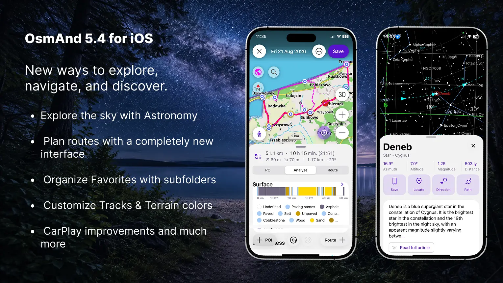
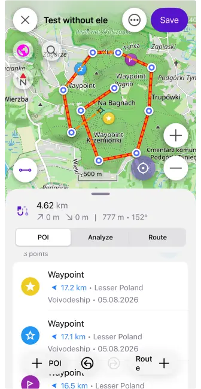
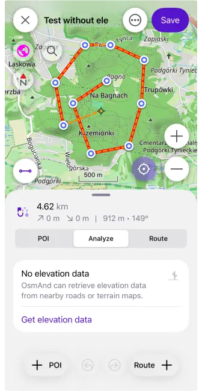
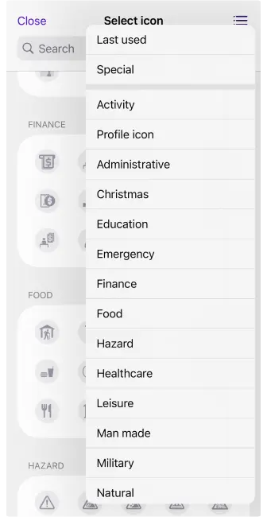
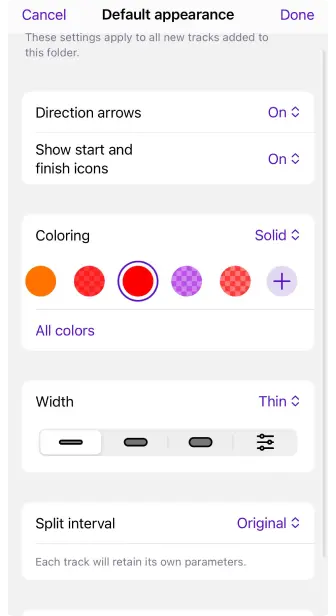
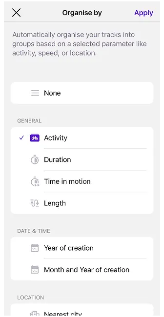
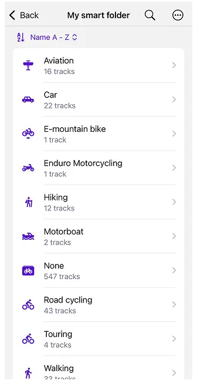
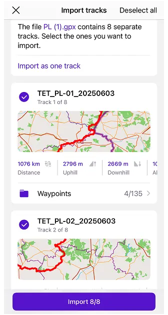
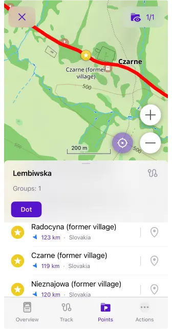

import Tabs from '@theme/Tabs';
import TabItem from '@theme/TabItem';
import AndroidStore from '@site/src/components/buttons/AndroidStore.mdx';
import AppleStore from '@site/src/components/buttons/AppleStore.mdx';
import LinksTelegram from '@site/src/components/_linksTelegram.mdx';
import LinksSocial from '@site/src/components/_linksSocialNetworks.mdx';
import Translate from '@site/src/components/Translate.js';
import InfoIncompleteArticle from '@site/src/components/_infoIncompleteArticle.mdx';
import ProFeature from '@site/src/components/buttons/ProFeature.mdx';

OsmAnd 5.4 for iOS — Now Available!

This update brings a redesigned **My Places** interface, a rebuilt **Plan a Route** tool, the new **Astronomy plugin**, and many other improvements and bug fixes.

[🔄 **Update Now**](https://itunes.apple.com/us/app/osmand-maps-travel-navigate/id934850257)

{/*truncate*/}

## What's new

- [Redesigned "My Places"](#new-my-places-design) — with Favorites subfolders, pinned folders, and quicker actions
- [Rebuilt "Plan a Route"](#updated-plan-a-route-interface) — add route and POI points, and combine different route types
- [New Astronomy plugin](#astronomy-plugin): star map with a detailed database for each object, visibility graphs, and an observation schedule
- Added ["Terrain shadows"](#new-terrain-shadows-visualization) visualization type
- [Edit the color palette for Tracks and Terrain](#color-palette-for-tracks-and-terrain)
- [Full icon selection now available for profiles](#more-icons-for-profiles)
- [CarPlay improvements and bug fixes](#carplay-updates)
- Set [a default appearance for Track folders](#default-appearance-for-track-folders)
- [Auto-organize tracks](#organise-tracks-for-smart-folders) by year, length, activity, and more
- [Split multi-track GPX file](#split-multi-track-gpx-files-on-import) into separate files on import
- [Others updates and improvements](#others-updates-and-improvements)
- [Bug fixes](#bug-fixes).

## New "My Places" design

The [**My Places**](https://osmand.net/docs/user/personal/myplaces) screen has been redesigned with a new segmented interface, making it easier to switch between **Favorites**, **Tracks**, **OSM Edits**, and **Travel Guides**.

* [**Favorites**](https://osmand.net/docs/user/personal/myplaces#favorites) now use a folder-based structure with support for subfolders. Folders are organized into **Pinned**, **Visible**, and **Hidden** sections, and frequently used folders can be pinned to the top. Each folder displays useful statistics, including the number of subfolders and points, modification date, and storage size. New sorting options allow folders and points to be arranged by name, date, or distance.

  Updated action menus provide quicker access to **Show on map**, **Pin or unpin**, **Rename**, **Appearance**, **Share**, **Move**, and **Delete**. Favorites and entire folders can also be added to **Map markers**, a **Track**, or **Navigation**. Selection mode makes it possible to apply actions to multiple folders and points at once.

* [**Tracks**](https://osmand.net/docs/user/personal/myplaces#tracks) provides access to saved, recorded, and imported GPX files from the same redesigned My Places interface, with search, sorting, folder management, statistics, and quick actions for working with individual tracks or multiple selected items.

* [**OSM Edits**](https://osmand.net/docs/user/personal/myplaces#openstreetmap-edits) keeps your OpenStreetMap edits, notes, and uploaded changes in a dedicated section. This tab is available when the **OSM Editing** plugin is enabled.

* [**Travel Guides**](https://osmand.net/docs/user/personal/myplaces#travel-guides) contains bookmarked travel articles and guides, allowing saved travel content to be accessed directly from My Places. The tab appears when multiple guides have been bookmarked.

The new search interface also makes Favorites easier to find by displaying their folder, distance, address, and creation date directly in the results.

|| |
|:--------|:---------|
|| 

## Updated "Plan a Route" interface

The [**Plan a Route**](https://osmand.net/docs/user/plan-route/create-route) tool has been rebuilt with a new interface for creating, editing, and analyzing routes.

Separate **Route +** and **+ POI** actions let you add route points or named waypoints and points of interest. Individual route segments can use different routing types, allowing you to combine, for example, cycling, walking, and straight-line sections within the same track.

The new panel includes three sections:

* **POI** — manage waypoints and points of interest added to the track.
* **Analyze** — view the elevation graph, uphill and downhill values, altitude range, speed statistics, and route composition by road type, steepness, surface, and smoothness.
* **Route** — view and manage route points and segments.

When elevation data is unavailable, it can be calculated using nearby roads or downloaded Terrain maps. The updated route summary also displays distance, estimated travel time, arrival time, elevation gain, and elevation loss.

Quick actions provide access to undo and redo, change segment order, reverse the route, append it to an existing track, save a copy, clear all points, or start navigation directly along the planned track.

## Astronomy plugin

The [**Astronomy plugin**](https://osmand.net/docs/user/plugins/astronomy) is now available on iOS. It provides an interactive Star Map with stars, constellations, the Sun, the Moon, planets, nebulae, star clusters, and other deep-sky objects.

Explore celestial objects using categories, catalogs, and the **Watch now** section. Detailed object information, visibility graphs, daily paths, direction indicators, Favorites, and a weekly observation schedule help you find objects and choose the best time for stargazing.

**Enabled plugin (`Menu → Plugins → Astronomy`) → Menu → Star map**

|| |
|:--------|:---------|
||  |

## New "Terrain shadows" visualization

The new [**Terrain Shadows**](https://osmand.net/docs/user/plugins/topography#terrain-shadows) visualization provides real-time dynamic shading based on 3D terrain geometry. Unlike raster Hillshade maps, the shadows are generated directly on the device and automatically adapt to the current map perspective.

This visualization makes mountains, valleys, ridges, and other terrain features easier to distinguish while maintaining a low impact on performance. **3D Relief** is required and is enabled automatically when Terrain Shadows is selected.

**Menu → Configure Map → Topography → Terrain → Visualization → Terrain Shadows**

## Color palette for Tracks and Terrain

OsmAnd 5.4 for iOS introduces a built-in **Color Palette Editor** for customizing how track data and terrain layers are displayed.

For [**Tracks**](https://osmand.net/docs/user/map/tracks/appearance#color-palette-editor), you can create custom palettes for **Speed**, **Altitude**, and **Slope** coloring. Choose between:

|| |
|:--------|:---------|
||  |
   

Custom palettes are also available for [**Terrain**](https://osmand.net/docs/user/plugins/topography#modify-color-scheme) visualizations. You can modify the color scale used for **Slope** and **Altitude**, assign colors to specific elevation levels or slope percentages, and add or remove value steps. Hillshade uses a fixed shading algorithm and does not support custom palettes.

|| |
|:--------|:---------|
||  |

## More icons for profiles

You can now choose from [the complete collection of OsmAnd icons](https://osmand.net/docs/user/personal/profiles#profile-appearance) when creating or editing a profile. The redesigned icon selector uses grouped categories and includes the same icons available for Favorites, making profiles easier to identify and personalize.

## CarPlay updates

OsmAnd 5.4 includes several fixes and improvements for [**Apple CarPlay**](https://osmand.net/docs/user/navigation/car-play).

The **10-day free CarPlay trial** has been restored after an issue that could prevent it from working correctly in recent releases. New users can once again test CarPlay navigation before purchasing `Maps+` or `OsmAnd Pro`.

Navigation now displays warnings before starting a route when required maps are missing or when private-road access needs confirmation. The update also improves map and route centering, particularly on widescreen displays.

CarPlay appearance settings no longer override the map mode selected in OsmAnd. When **Day** or **Night** mode is selected manually, the map keeps that setting when the CarPlay interface switches between light and dark modes.

## Default appearance for Track folders

You can now set a [**default appearance**](https://osmand.net/docs/user/personal/tracks/manage-tracks) for each Track folder. New tracks added to the folder can automatically use the selected coloring, line width, direction arrows, start and finish icons, and split interval.

The settings can also be applied to all existing tracks in the folder, replacing their individual appearance options.

|| |
|:--------|:---------|
||  |

## Organise tracks for smart folders

**Smart Folders** can now [automatically organize tracks](https://osmand.net/docs/user/personal/tracks/smart-folder#managing-smart-folders) into groups using the new **Organize by** option. Instead of displaying every track in one list, you can group them by activity, creation date, location, distance, speed, altitude, elevation, or recorded sensor data.

Available organization types include:

* **General** — duration, time in motion, length, and activity.
* **Date and time** — year or month of creation.
* **Location** — country or nearest city.
* **Speed** — maximum or average speed.
* **Altitude and elevation** — maximum or average altitude, uphill, and downhill.
* **Sensors** — heart rate, bicycle cadence, bicycle power, temperature, and sensor speed.

For numerical values, you can adjust the grouping interval using **Set step size**. For example, tracks can be divided into distance ranges, altitude intervals, or speed groups. Empty groups are hidden automatically, and each group displays the number of included tracks.

Groups can be sorted alphabetically or, for numerical data, from highest to lowest or lowest to highest. You can also show all tracks from a group on the map or export them together.

|| |
|:--------|:---------|
||  |

## Split Multi-Track GPX Files on Import

When [importing a GPX file containing multiple tracks](https://osmand.net/docs/user/personal/tracks/manage-tracks#import), you can now review and select the individual tracks you want to import. Each selected track is saved separately, making it possible to manage its visibility, appearance, and other settings independently.

You can select a destination folder, import all available tracks as separate files, or use **Import as one track** to keep the original GPX content together.

## Show Track Waypoints on the Map

Track waypoint lists now include a dedicated [**Show on map** button](https://osmand.net/docs/user/map/tracks/track-context-menu#points--waypoints). Tap the pin icon next to a waypoint to center the map on its location without changing the current zoom level.

Tapping the main waypoint area still opens its full context menu.

## Others updates and improvements

OsmAnd 5.4 also includes a range of smaller features and interface improvements:

* Added a [**bicycle width** setting](https://osmand.net/docs/user/navigation/guidance/vehicle-parameters#limits). OsmAnd can now consider the width of your bicycle when calculating routes and avoid cycleways that are too narrow. 

* More track details in [What's Here](https://osmand.net/docs/user/map/map-context-menu#select-gpx-route). Track information now makes it easier to distinguish between tracks on the map, including identifying the folder where a track is stored.

* Added an [**OBD-II adapter voltage widget**](https://osmand.net/docs/user/plugins/vehicle-metrics#metrics-list) that displays the current voltage reported by a connected OBD-II adapter. 

* Added support for [**Roads-only maps**](https://osmand.net/docs/user/personal/maps-resources#free-map-content) on iOS. These smaller maps contain the road network required for navigation and address search without the complete set of regular map details. 

* [Planned tracks](https://osmand.net/docs/user/plan-route/create-route#save-route) now automatically receive an [**activity type**](https://osmand.net/docs/user/map/tracks/track-context-menu#ttrack-activity-type) based on the active profile or selected navigation type. 

* Track lists now display the [**track folder name on the second line**](https://osmand.net/docs/user/personal/tracks/manage-tracks#manage-tracks), making tracks easier to identify in Search, Smart Folders, and Configure Map. 

* Added the [**Pause spoken audio**](https://osmand.net/docs/user/navigation/guidance/voice-navigation#voice-settings) option. Podcasts, audiobooks, and other spoken content can now be paused during navigation instructions instead of playing underneath them. {/*[More details](https://github.com/osmandapp/OsmAnd-iOS/issues/5134).*/}

* Improved performance when adding or managing a [**large number of Favorites**](https://github.com/osmandapp/OsmAnd-iOS/issues/5118), reducing interface freezes and delays. 

* Added the ability to [**share a route using a link**](https://osmand.net/docs/user/navigation/setup/route-details#share--save-actions) making it easier to send a planned route to another user or open it on another device. {/*[More details](https://github.com/osmandapp/OsmAnd-Issues/issues/1860)*/}

* POIs containing [**multiple website links**](https://osmand.net/docs/user/map/map-context-menu#object-info) now display all available URLs, allowing you to choose which one to open. {/*[More details](https://github.com/osmandapp/OsmAnd-iOS/issues/5417).*/}

* Updated the [**Wikipedia action**](https://osmand.net/docs/user/map/map-context-menu#article-description) in the map context menu for easier access to related Wikipedia articles. {/*[More details](https://github.com/osmandapp/OsmAnd-Issues/issues/3215).*/}

* [Added the ability](https://osmand.net/docs/user/search/search-all) to open matching [**Travel Guides directly from Search**](https://osmand.net/docs/user/search/search-all#full-text-search). {/*[More details](https://github.com/osmandapp/OsmAnd-Issues/issues/3212).*/}

* Added an option to hide the **expand button** in [the Route Information widget](https://osmand.net/docs/user/widgets/nav-widgets#route-information) for a cleaner navigation interface. {/*[More details](https://github.com/osmandapp/OsmAnd-iOS/issues/5162).*/}

* Increased the size of [**road shields in the Street Name widget**](https://osmand.net/docs/user/widgets/nav-widgets#route-guidance), improving the readability of route numbers during navigation. {/*[More details](https://github.com/osmandapp/OsmAnd-iOS/issues/5331).*/}

* [Updated turn and lane arrows](https://osmand.net/docs/user/widgets/nav-widgets#route-guidance) to use consistent **stroke thickness** both on the device and in CarPlay. {/*[More details](https://github.com/osmandapp/OsmAnd-iOS/issues/4787).*/}

## Bug fixes 

* Fixed an [app crash on startup when managing more than 1,000 Favorites](https://github.com/osmandapp/OsmAnd-iOS/issues/2988);
* Fixed a [UI freeze after adding a new Favorite to a folder containing many points](https://github.com/osmandapp/OsmAnd-iOS/issues/5118);
* Fixed [incorrect headers displayed above calculated public transport routes](https://github.com/osmandapp/OsmAnd-iOS/issues/5249);
* Fixed the [Compass button icon incorrectly following the iOS system theme instead of the selected map mode](https://github.com/osmandapp/OsmAnd-iOS/issues/5300);
* Fixed an [app freeze when CarPlay switches between Day and Night modes](https://github.com/osmandapp/OsmAnd-iOS/issues/5389);
* Fixed a [language mismatch between POI names displayed on the map and in the context menu](https://github.com/osmandapp/OsmAnd-iOS/issues/5382);
* Fixed an issue where [custom Track and Favorite colors were not included in exports or synchronized through OsmAnd Cloud](https://github.com/osmandapp/OsmAnd-iOS/issues/5368);
* Improved [map and location-marker movement during navigation to prevent periodic stuttering](https://github.com/osmandapp/OsmAnd-iOS/issues/5355);
* Improved the [OsmAnd Cloud synchronization checking speed](https://github.com/osmandapp/OsmAnd-iOS/issues/5359);
* Fixed [incorrect map centering after using the double-tap zoom gesture and then tapping My Location](https://github.com/osmandapp/OsmAnd-iOS/issues/5365);
* Fixed the [position of Online Photos and Street-Level Imagery in the region context menu](https://github.com/osmandapp/OsmAnd-iOS/issues/5336);
* Fixed [distance units being cropped in the Detailed Track Guidance settings for some languages](https://github.com/osmandapp/OsmAnd-iOS/issues/5276).

_______________________

If you have suggestions for improving the iOS version of the app, please get in touch with us. We appreciate and welcome your contribution to the further development of OsmAnd.

______________________
- **Follow**: <LinksSocial/>  

- **Join**: <LinksTelegram/>  

- **Get**: 

&nbsp;<AppleStore/>