import Tabs from '@theme/Tabs';
import TabItem from '@theme/TabItem';
import AndroidStore from '@site/src/components/buttons/AndroidStore.mdx';
import AppleStore from '@site/src/components/buttons/AppleStore.mdx';
import LinksTelegram from '@site/src/components/_linksTelegram.mdx';
import LinksSocial from '@site/src/components/_linksSocialNetworks.mdx';
import Translate from '@site/src/components/Translate.js';
import InfoIncompleteArticle from '@site/src/components/_infoIncompleteArticle.mdx';
import ProFeature from '@site/src/components/buttons/ProFeature.mdx';

You've ridden the Transfagarasan three times now, and the story you tell afterward never changes: good climb, brutal hairpins, freezing at the top. Same three sentences, every time, because that's genuinely all a memory holds onto.

Your phone remembers more. It was recording the whole ride — every meter of elevation, every km/h, the exact spot where you stopped pretending you weren't struggling. None of that shows up in a photo. It shows up in the track, if you know how to ask it the right question.

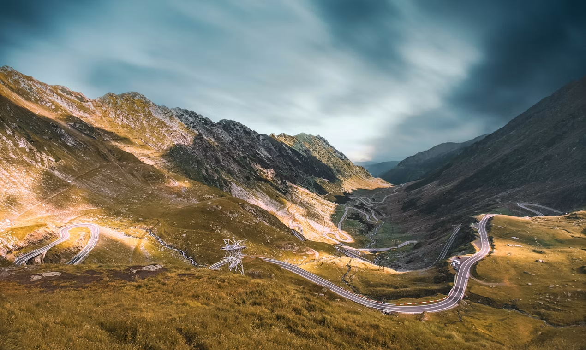

{/*truncate*/}

Photo by [Tiberiu Potec](https://unsplash.com/@wckd_official) on [Unsplash](https://unsplash.com/photos/brown-and-green-mountains-under-blue-sky-during-daytime-Tokc7PKfSGM)

## Giving Color to Your Ride

Standard monochromatic lines on a map tell you where you went, but they remain completely silent about how the ride actually felt. OsmAnd solves this by allowing you to color your tracks using real ride data — Speed, Altitude, or Slope.

Color transforms a flat line into a visual profile of your physical effort. A steep climb up the southern approach of the Fagaras Mountains shifts into warm, intense gradients, while steady valley roads cool down into gentle tones.

However, default track coloring relies on generalized scales that don't always capture the nuances of specific terrain or activity types. To give your map absolute visual accuracy, OsmAnd Pro includes the Color Palette Editor — an advanced tool available with an OsmAnd Pro subscription that gives you complete control over how data thresholds map to visual colors.

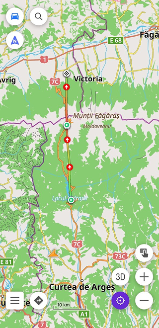 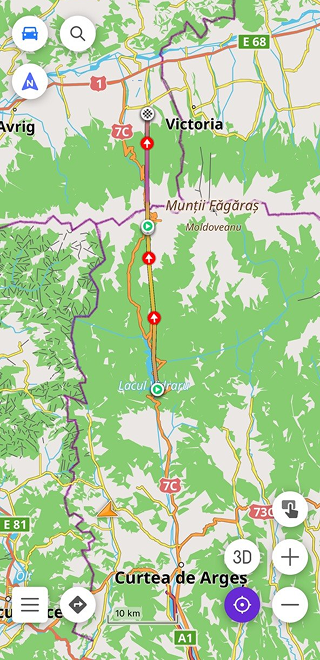 

## Relative vs. Fixed Values: Choosing the Right Scaling

When creating or customizing a palette in the editor, you choose between two fundamentally different ways to interpret data.

Using a Relative palette, colors scale automatically based on the specific track's minimum, average, and maximum values. If your ride spans from 600 meters at the base to 2,034 meters at the Bălea Tunnel summit, the gradient stretches evenly across that exact range. This mode is ideal for isolated rides where you want the highest possible visual contrast across a single trip.

A Fixed Values palette operates differently by assigning colors to specific, absolute numbers, such as 10 km/h, 50 km/h, or exact elevation steps like 600 m, 1,200 m, and 2,000 m. The scale remains constant regardless of which track it is applied to. This approach is essential when comparing multiple rides or setting personal benchmarks, as 2,000 meters of elevation or a 10% slope gradient will always render in the exact same color across every track on your map.

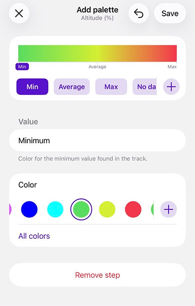 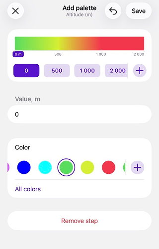

## Working with the Color Palette Editor

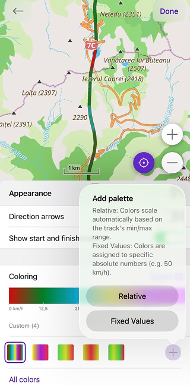 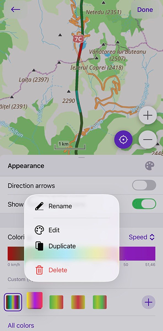

Accessing the editor is seamlessly integrated into your track's appearance settings. Opening the track's [Appearance menu](https://osmand.net/docs/user/map/tracks/appearance), selecting a data-based color mode, and tapping the palette icon opens the All colors screen. Here, tapping the + button allows you to build a new palette in either Relative or Fixed Values format.

The editor provides an intuitive set of tools for fine-tuning your data visuals. At the top of the screen, a live gradient preview reflects your changes in real time as you adjust values. You can add new threshold steps using the + Add step button, assign custom colors, or remove unneeded steps to simplify the scale.

The editor also automatically respects your system profile settings, seamlessly displaying values in metric or imperial units — such as meters, feet, km/h, or mph — without disrupting your underlying color scales.

Mountain terrain frequently introduces data gaps. As you ride through the 900-meter Bălea Tunnel near the summit, GPS reception naturally drops. To handle these moments, the editor includes a dedicated No Data step, letting you assign a distinct, neutral color to track segments where logging was temporarily interrupted.

Managing your personal collection of palettes on the All colors screen is equally simple. Opening the three-dot menu next to any custom palette provides quick options to rename, edit, duplicate, or delete it whenever your preferences change.

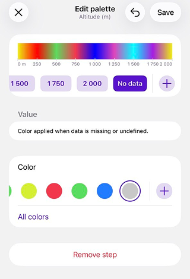 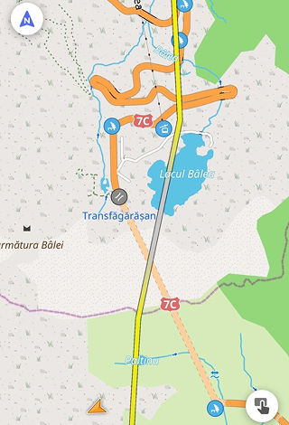

## Harmonizing Track and Terrain Colors

A custom track palette works best when it stands out clearly against the underlying map background. If your elevation track uses deep red shades for high mountain peaks, those segments might blend into intense terrain contour lines or dark relief shading.

OsmAnd allows you to customize map background palettes as well, giving you the flexibility to adjust elevation and slope visualizations under *Menu → Configure map → Terrain → Color scheme* on Android, or *Visualization* on iOS. Selecting complementary terrain color scales keeps your track lines sharp and legible, whether you are navigating dense forest valleys or barren, high-altitude alpine passes. While custom palettes can be applied across various terrain layers, keep in mind that Hillshade relies on a fixed shading algorithm and operates independently of custom palettes.

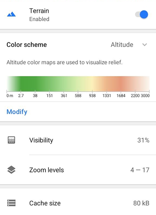 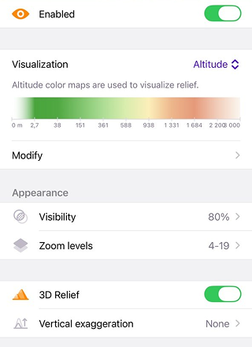

## Customize Your Map Experience

Custom color palettes allow you to turn complex GPX data into clear, meaningful visual stories. Whether you are analyzing steep mountain passes or setting up standardized color scales for daily training routes, full control over your track visuals is right at your fingertips.

This feature is part of our latest release updates. Take a moment to explore our [new release](https://osmand.net/blog/osmand-ios-5-4-released) [blog posts](https://osmand.net/blog/osmand-android-5-4-released) to discover all the new tools, optimizations, and features we've recently added to make your navigation experience even better!

______________________________________________

We appreciate your interest in us and thank you for taking the time to read this article. Join us on social media to keep up to date with the latest news and share your experiences. Your opinion is important to us.

Follow OsmAnd on Facebook, TikTok, X (Twitter), Reddit, and Instagram!

Join us at our groups of Telegram: (OsmAnd News channel), (EN), (IT), (FR), (DE), (UA), (ES), (BR-PT), (PL), (AR), (TR).