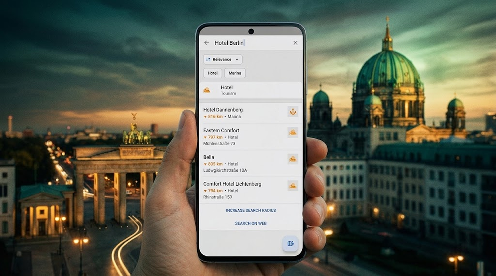

import Tabs from '@theme/Tabs';
import TabItem from '@theme/TabItem';
import AndroidStore from '@site/src/components/buttons/AndroidStore.mdx';
import LinksTelegram from '@site/src/components/_linksTelegram.mdx';
import LinksSocial from '@site/src/components/_linksSocialNetworks.mdx';
import Translate from '@site/src/components/Translate.js';
import InfoIncompleteArticle from '@site/src/components/_infoIncompleteArticle.mdx';
import ProFeature from '@site/src/components/buttons/ProFeature.mdx';
import InfoAndroidOnly from '@site/src/components/_infoAndroidOnly.mdx';

In March 2026, we ran a [survey](https://osmand.net/blog/survey-26) to better understand how people actually use OsmAnd — what they value most, and where the app still gets in their way. We heard back from nearly 2,500 users across five language groups, and one theme came up again and again, regardless of language or region: search quality.

Whether it was struggling to find a specific address, a POI near a place they didn't know well, or a combination like a hotel name paired with a city, many of you told us that search didn't always behave the way you expected it to. We listened and we've been working on it.

This post introduces Spatial Search, a new search engine we've been building from the ground up to address exactly this kind of friction. It's currently available as an experimental feature in OsmAnd 5.4 for Android, and in this article we'll walk you through how it works, what it changes for you, and how you can try it out today.

{/*truncate*/}

## Where the Old Search Fell Short

Until now, search in OsmAnd was largely tied to your current location and to how individual words in a query were interpreted. In practice, this meant the engine looked at the words you typed mostly in isolation, without a strong sense of the geographical relationship between them.

This worked reasonably well for simple queries — a single address, a well-known street name, a nearby POI. But it started to break down with anything more complex:
- Searching for a POI together with a street or a city
- Different street-name formats
- Translated category names
- Combined queries like "Hotel Berlin" — where the engine would often fail to recognize that "Berlin" was meant as a location filter for "Hotel", rather than just another keyword to match

The result: searches that should have been straightforward sometimes returned irrelevant results, missed the right match entirely, or required you to phrase your query in just the right way to get what you were looking for.

This is exactly the kind of friction our survey respondents described — and it's what we set out to fix with a fundamentally different approach to search.

## How the New Spatial Search Works

The new Spatial Search changes where the engine starts: it looks at where things actually are, and how a city, street, building, or café sit relative to one another, before trying to match anything against your query.

That's a real shift under the hood — it's built on a new backend architecture called Spatial Search by Name, designed specifically to interpret queries this way from the ground up.

## Reading Complex Queries Correctly

Take the earlier example, "Hotel Berlin." The old engine had no good way to know that "Berlin" was supposed to narrow down where to look for "Hotel" — it just matched both words against the index and hoped for the best, which often meant scattered or irrelevant results.

Spatial Search reads it differently: "Berlin" becomes the anchor, and "Hotel" gets searched within that context. Same logic applies whether you're combining a POI with a street name, dealing with different street-name formats, or searching in a translated category name — the engine works from how the pieces of your query relate geographically, not from guessing the "right" word order.

## Searching Around a Place, Not Just Around You

Search used to be built around your current position — useful most of the time, but not when you're planning ahead. With Spatial Search, you can find a city or another place first, then look for cafés, restaurants, hotels, shops, or fuel stations around that location instead of your own.

It's a small change that matters a lot when you're planning a trip somewhere you haven't been yet. Pick your destination, then explore what's around it — no need to be there first, or to fake your location just to see what's nearby.

## Faster Results for Supported Categories

Searching by category — things like `pharmacy`, `parking`, or `restaurant` — is one of the most common ways people look for places. In the new engine, this type of search has been specifically optimized, so for popular categories, results now come back noticeably faster than before.

## A New Search Architecture

Spatial Search by Name isn't a tweak to the existing engine — it's a different system, built to solve problems that were hard to patch within the old one.

One example: previously, a search for a place could return both a specific match — say, an exact address — and a generic category result for the same spot, cluttering your results with duplicates. Under the new architecture, once a concrete match is found, related generic results are automatically filtered out, so you see the address itself rather than the address and a redundant "nearby category" entry for the same place.

This kind of fix reflects the deeper shift: the new engine reasons about real objects and their relationships, not just isolated text matches — and that's what makes it possible to clean up issues like this at the source, rather than patching around them.

That's also why we're rolling it out carefully. A change this deep touches how search behaves across the board, so we'd rather test it with real users on real queries before making it the default for everyone.

## How to Enable This Feature

Spatial Search is currently an experimental feature in OsmAnd 5.4 for Android, and it's off by default while we gather feedback. To try it, go to: *[OsmAnd Development plugin](https://osmand.net/docs/user/plugins/development) → Use spatial text search*

Once enabled, it replaces the standard search with the new engine. Since this is still a testing phase, you may run into rough edges — that's expected, and it's exactly what this stage is for. Once we're confident it holds up across different regions and query types, we'll enable it by default.

______________________________________________

We appreciate your interest in us and thank you for taking the time to read this article. Join us on social media to keep up to date with the latest news and share your experiences. Your opinion is important to us.

Follow OsmAnd on Facebook, TikTok, X (Twitter), Reddit, and Instagram!

Join us at our groups of Telegram: (OsmAnd News channel), (EN), (IT), (FR), (DE), (UA), (ES), (BR-PT), (PL), (AR), (TR).