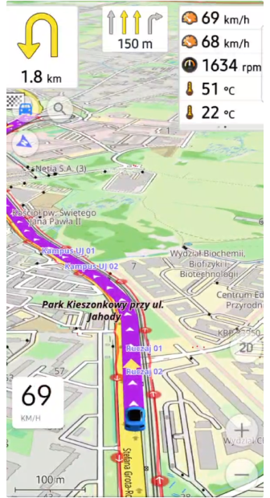

import Tabs from '@theme/Tabs';
import TabItem from '@theme/TabItem';
import AndroidStore from '@site/src/components/buttons/AndroidStore.mdx';
import AppleStore from '@site/src/components/buttons/AppleStore.mdx';
import LinksTelegram from '@site/src/components/_linksTelegram.mdx';
import LinksSocial from '@site/src/components/_linksSocialNetworks.mdx';
import Translate from '@site/src/components/Translate.js';
import InfoIncompleteArticle from '@site/src/components/_infoIncompleteArticle.mdx';
import ProFeature from '@site/src/components/buttons/ProFeature.mdx';
import InfoAndroidOnly from '@site/src/components/_infoAndroidOnly.mdx';  

# Android 4.9 (beta)

Android 4.9 is the latest release that introduces many new features and improvements to the OsmAnd app. This article describes all the key updates that represent meaningful changes for our users.

# Join Beta

OsmAnd releases several Ready-To-Use builds daily, allowing you to track new features and participate in the OsmAnd translation process. You can take part in testing the beta version of OsmAnd using Google Play.

  <a class="button button--active" href="https://play.google.com/apps/testing/net.osmand.plus">OsmAnd+</a>
  <a class="button button--active" href="https://play.google.com/apps/testing/net.osmand">OsmAnd</a>

  

 

# What's new

- [Real-Time Turn & Lane Indicators](#real-time-turn--lane-indicators). Added a group of widgets to the top and bottom panels for real-time updates on upcoming turns and lane info.
- [Gallery viewer](#images-gallery). Full-screen view for Wikimedia images.
- [Vehicle Metrics plugin](#vehicle-metrics). Monitor vehicle performance via OBD-II protocol.
- [Track activities](#gpx-track-activities). Assign and filter tracks by activities.
- [Customizable map buttons](#customizable-map-buttons). Adjust appearance with a precise grid.
- [Widget Context menu](#widget-context-menu).
    - Includes a [Reset average speed](#reset-average-speed) action.
- [Quick Action updates](#new-actions-for-qa). Added new quick action for *touchscreen lock*, *trip recording*, and control the *visibility of OSM Edits*.
- [Dirt Bike trails](#dirt-bike-trails). New route layer for off-road biking.
- [Surrounding areas info](#surrounding-areas). Displays information about areas around a selected point.
- [Terrain colorization visibility](#visibility-parameters-for-terrain). Separated parameters for enhanced control.
- [Interactive access points](#tappable-access-actions). Display access or other road and path attributes with a single tap.
- [Hiking trails difficulty](#hiking-trails). Renamed from *Difficulty classification*.
- [Optional updates](#optional-updates). Additional updates and refinements for the release.

## Real-Time Turn & Lane Indicators

We’re excited to introduce a new set of route guidance widgets to the [Top/Bottom widget panels](https://osmand.net/docs/user/widgets/configure-screen#top-and-bottom-panels) in OsmAnd's *Configure screen menu*. These widgets give you real-time navigation information, including the distance to the next turn, second next turn, lane guidance, road name, and current street name. Perfect for keeping track of your route at every step of your journey. The widgets are active during navigation, ensuring you never miss a turn!

*Find them in: Menu → Configure screen → Top panel / Bottom panel → Route guidance: Next turn, Second next turn, Lanes*

## Images Gallery

Added on [Map Contex menu](../user/map/map-context-menu#online-photos) full-screen gallery viewer for Wikimedia images.

## Vehicle Metrics

The new Plugin - Vehricle Metrics was added to the [Plugins menu](../user/plugins/). It monitors key vehicle metrics using the [OBD-II protocol](https://en.wikipedia.org/wiki/OBD-II_PIDs). New widgets for this data were added too.

 

## GPX Track activities

The new feature of [adding **Activity**](../user/plugins/trip-recording#recording-settings) to a recorded GPX track improves navigation and [track management (filter)](../user/personal/tracks/smart-folder#available-filters). This increases the convenience of working with track recordings.

## Customizable Map buttons

No you can modify [the appearance of Quick Action buttons](../user/widgets/quick-action#quick-action-button-appearance) and Default buttons through the three-dot menu: _Menu → Configure screen → Custom buttons_ or _Default buttons → choose needed buttons → three-dot menu → Appearance_ (chagne icon, corner radius, size, background opacity).

Added [grid for buttons](https://github.com/osmandapp/OsmAnd/issues/19164).

Added Custom buttons to [export/import settings](https://github.com/osmandapp/OsmAnd/issues/20867).

 

## Widget Context Menu

The [**Widget Context menu**](../user/widgets/configure-screen.md#panel-widgets-settings) allows you to manage and configure widgets directly from the map screen, providing *a quick way to organize panels*. You can access this menu by ***long tapping*** on any widget to customize the layout of widgets without leaving the map.

### Reset average speed

Added the "Reset average speed" action of the current value in Widget Context menu.

## New actions for QA

Added [new actions](../user/widgets/quick-action#action-types): 
1. Action for Lock/Unlock screen: _Menu → Configure screen → Custom buttons → + → Add acton → Inteface → Lock screen_
2. Actions for Trip recording: _Menu → Configure screen → Custom buttons → + → Add acton → My Places → Start/Pause - Trip recording, Start new trip segment, Finish Trip recording, Save Recorded Trip & Continue_
3. Action for Show/Hide OSM edits: _Menu → Configure screen → Custom buttons → + → Add acton → My Places → Show/Hide OSM edits_

## Dirt Bike Trails

Added new Route options  - [Dirt bike trails](../user/map/vector-maps#routes): _Menu → Configure map → Routes → Dirt bike routes_ . Read more about [dirtbike tag](https://wiki.openstreetmap.org/wiki/Key:dirtbike:scale).

Upon activation, display a colored route overlay for all paths marked with the dirtbike:scale tag, similar to the approach used for mtb:scale (Mountain bike).

 

## Surrounding areas

Show data information to [Map Context](../user/map/map-context-menu#details) menu about surrounding areas (polygons) after [**long tap**](../user/map/map-context-menu#select-any-point-long-tap) on the map:

_Long tap on the map → Map Context menu → Details → Within_

Sort by polygon size: from small to big. Show polygon type and name.

## Visibility parameters for Terrain

Slope / Hillshade / Altitude have their own independant [Visibility setting](../user/plugins/topography#visibility).

## Tappable access actions

By tapping on _Barrier_, _Steps_, _Gate_ icons in the [Map Сontext menu](../user/map/map-context-menu#overview) now displays the name (POI type) and address:

## Hiking trails

"Difficulty classification" was renamed to "Hiking trails difficulty grade":

_Configure map → Routes → [Hiking trails difficulty grade](../user/map/routes#hiking-trails-difficulty-grade): SAC or CAI_

## Change of graph toggle

Changed [graph toggle](../user/plugins/trip-recording#overview-screen) (Recording track) to give the ability to select any available options for displaying on the graph.

 

## Optional updates

- [System font applied](https://github.com/osmandapp/OsmAnd/issues/19123) integrates your device's system font throughout the app interface without additional configuration.
- [Auto-record track](https://github.com/osmandapp/OsmAnd/issues/19905) simplifies navigation by automatically recording your path.
- Improved [Favorite search](https://github.com/osmandapp/OsmAnd/issues/19242) allows you to quickly return to the list of search results.
- Resolved [Y-axis graph display issue](https://github.com/osmandapp/OsmAnd/issues/20076) for improved data clarity.
- Display [Wikipedia overlays](https://github.com/osmandapp/OsmAnd/issues/17944) as separate layer.
- Optimized [Samsung DeX screen sizes](https://github.com/osmandapp/OsmAnd-Issues/issues/2590) for seamless performance.
- Fixed missing [water transport routes](https://github.com/osmandapp/OsmAnd/issues/20251) when selecting stops.
- Correctly save [GPX track names](https://github.com/osmandapp/OsmAnd/issues/20211) for future reference.
- Fixed app crash issues when [deleting track from Smart folder](https://github.com/osmandapp/OsmAnd/issues/20661), and when trying [to apply a filter to a track](https://github.com/osmandapp/OsmAnd/issues/20794).
- Added active [Navigation mode updates](https://github.com/osmandapp/OsmAnd/issues/19168)with Continue navigation in Android Auto's main menu.
- [Remembere 2D/3D settings](https://github.com/osmandapp/OsmAnd/issues/20779) automatically in Android Auto.
- [Added tresholds](https://github.com/osmandapp/OsmAnd/issues/20494#issuecomment-2326033245) for free rotation mode.
- Fixed [keyboard input issue](https://github.com/osmandapp/OsmAnd/issues/20636) affecting [external devices](https://osmand.net/docs/user/map/interact-with-map#external-input-devices).
- Updated [Sun position widget](https://github.com/osmandapp/OsmAnd/issues/20447)to hide the next day's sunrise.
- Resolved [performance slowdowns](https://github.com/osmandapp/OsmAnd/issues/20889) when trying to display a track and colorize it by speed and height.
- Corrected issue where [*None* setting](https://github.com/osmandapp/OsmAnd/issues/20503) for *Analyze by intervals* failed to work.
- Fixed [export list freezes](https://github.com/osmandapp/OsmAnd/issues/20900) to prevent app lag.
- [3D track issue](https://github.com/osmandapp/OsmAnd/issues/20810) now work correctly with path visualization.
- Corrected [RTL coordinate flipping](https://github.com/osmandapp/OsmAnd/issues/20595) for right-to-left language displays.
- Restored [missed sensor data](https://github.com/osmandapp/OsmAnd/issues/17937) for ongoing track recordings.
- [Temperature data](https://github.com/osmandapp/OsmAnd/issues/20829) now visible in the *Analyze on map* graph.
- Added zoom functionality for [route points](https://github.com/osmandapp/OsmAnd/issues/20722) in Plan a Route.
