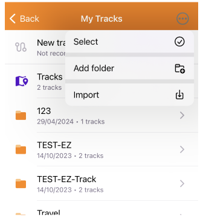

import Tabs from '@theme/Tabs';
import TabItem from '@theme/TabItem';
import AndroidStore from '@site/src/components/buttons/AndroidStore.mdx';
import AppleStore from '@site/src/components/buttons/AppleStore.mdx';
import LinksTelegram from '@site/src/components/_linksTelegram.mdx';
import LinksSocial from '@site/src/components/_linksSocialNetworks.mdx';
import Translate from '@site/src/components/Translate.js';
import InfoIncompleteArticle from '@site/src/components/_infoIncompleteArticle.mdx';
import ProFeature from '@site/src/components/buttons/ProFeature.mdx';

# iOS 4.8

# Join Beta

iOS beta builds (TestFlight) are usually provided weekly (after a Team Sprint demo). They do not contain descriptions and may have continuous versioning. They are assumed to be stable and ready to use.  

<div>
  <a class="button button--active" href="https://testflight.apple.com/join/7poGNCKy">Join TestFlight</a>
</div>

<br/>

# What's new

- New [Speedometer widget](#speedometer-widget) compatible with [CarPlay](#speedometer-for-carplay).
- Added [Turn-by-turn instructions](#turn-by-turn-instructions) to the route details.
- The new [Add action screen](#quick-actions-tool-update) of the Quick Actions tool has been updated.
- Updated the ability to customize the map screen by adding multiple [Quick Action buttons](#custom-buttons).
- Customize the map screen by adding multiple ["Quick Action" buttons](#custom-buttons)
- Improvements new visualization and coloring options for the [3D track view](#3d-track-improvements).
- Added improved [multiselect mode for Tracks](#multiselect-mode-for-tracks).
- [3D options](#3d-my-location-icons) for My location icons.
- Added features for working with custom [Color palette files](#color-palettes) in this release.
- [Weather UI](#weather-tool-improvements) has been updated with layer animations and improved label visibility.
- Added [smooth transitions](#smooth-transitions) when zooming in 3D mode.
- [Location position on screen](#location-position-on-screen) setting has been moved to the Configure screen menu.
- The Route detail menu has been updated with the [road side indicator](#road-side-indicator) information.
- Added a separate [Speed limit navigation alert](#separate-speed-limit-alert) in the navigation settings menu.
- Removed login/password authorization method in [OpenStreetMap Editing plugin](#login-to-openstreetmap).
- [Optional updates](#optional-updates).


## Speedometer widget

 

For this release, a [new speedometer widget](../user/widgets/info-widgets.md#speedometer) has been added. In the widget settings, you can choose from three speedometer sizes, set the speed limit tolerance, and enable warnings.

### Speedometer for CarPlay

 

The [Speedometer widget](../user/navigation/car-play.md#speedometer) has also been added for CarPlay. The Speedometer widget is profile-dependent, so if you change the settings for one profile, they will not be applied to another.


## Turn-by-Turn Instructions

 

[Turn-by-turn information](../user/navigation/setup/route-details.md#turn-by-turn-information) provides detailed instructions for navigating your route. These instructions include information about your movements along the route.


## Quick Actions Tool Update

<<<<<<< HEAD
 
=======
 
>>>>>>> parent of 6cba6c6b (iOS article blog)

The updated **Add Action** screen makes it easier to customize and add [*Quick actions*](../user/widgets/quick-action.md), improving access to important features. You can now find groups of actions, use the search function, and apply other actions to customize the *Quick Actions tool*, contributing to a better user experience.


## Custom Buttons

*Menu → Configure screen → Buttons → Custom buttons → + → Add button*  

<<<<<<< HEAD
  
=======
  
>>>>>>> parent of 6cba6c6b (iOS article blog)

In this update, we have introduced **Custom buttons** in *Configure screen*, a unique type of [Quick action](../user/widgets/quick-action.md#custom-buttons) tool. Now users can create custom action buttons for their device screen.


## 3D Track Improvements

<<<<<<< HEAD

=======

>>>>>>> parent of 6cba6c6b (iOS article blog)

We have improved the [appearance of the 3D track](../user/map/tracks/index.md#3d-track) and added more options for wall colors. Now you can customize wall colors based on _Altitude, Slope, Speed, Heart Rate, Bicycle Cadence, Bicycle Power_, or *Temperature*.


## Multiselect Mode for Tracks

*Menu → My Places → Tracks → &#8230; → Select*  

<<<<<<< HEAD
 
=======
 
>>>>>>> parent of 6cba6c6b (iOS article blog)

[This menu item](https://osmand.net/docs/user/personal/tracks/manage-tracks#three-dot-menu) allows you [to select the folders and routes](https://osmand.net/docs/user/personal/tracks/manage-tracks#selection-mode) required for further management.


## 3D My location Icons

<<<<<<< HEAD

=======

>>>>>>> parent of 6cba6c6b (iOS article blog)

A new 3D view has been added for [My Location](../user/personal/profiles.md#profile-appearance) icons, which improves their visualization on the map. These changes bring the appearance of the icons in alignment with the 3D tilt of the map.   


## Color Palettes

<<<<<<< HEAD
   
=======
   
>>>>>>> parent of 6cba6c6b (iOS article blog)

In this release, new color palette schemes have been added.
- For [routes](../user/navigation/guidance/map-during-navigation.md#color): *Speed, Slope,* and *Elevation (Altitude)*.
- For [terrain](../user/plugins/contour-lines.md#hillshade-slope-and-altitude-layers): *Hillshade, Slope*, and *Altitude*.
- For [weather](../user/plugins/weather.md#weather-layers): *All weather layers*.  

You can add your own color palette files to OsmAnd using the *import/export tool*. To do this, create a TXT file with the required name:
- *Routes*: `route_speed_name.txt`, `route_slope_default.txt`, `route_elevation_default.txt`.
- *Terrain*: `height_altitude_name.txt`, `hillshade_color_name.txt`, `slope_name.txt`.
- *Weather*: `weather_name.txt`.

For example:

```
TXT file named *height_altitude_0-200.txt*

# 0 - 90 degree RGBA
0,46,185,0,191
# yellow 
100,255,222,2,227
# red
200,255,1,1,255
# violet
220,130,1,255,255

```
After moving this TXT file to *..Android/data/net.osmand/files/color-palete/height_altitude_0-200.txt*, a new palette will appear in the Color Scheme menu.  

Color palettes data is available in the [_Maps & Resources_](../user/personal/maps.md#local) menu.

_Menu → Maps & Resources → Local → Colors_

<<<<<<< HEAD

=======

>>>>>>> parent of 6cba6c6b (iOS article blog)


## Weather Tool Improvements

<<<<<<< HEAD

=======

>>>>>>> parent of 6cba6c6b (iOS article blog)

Layer animations and improved labels make the [weather interface](../user/plugins/weather.md) more visual and informative. These changes help you better understand current weather conditions and forecasts. Improved label visibility makes navigating weather data much easier.  

**Improvements**:
- **New weather panel** with an updated user interface.

<!--
Additional **Weather source options**.
  - Tap the ⚙ icon and select [GFS](https://en.wikipedia.org/wiki/Global_Forecast_System) or [ECMWF](https://en.wikipedia.org/wiki/European_Centre_for_Medium-Range_Weather_Forecasts).
-->

- **Weather animation**.
  - After making sure the weather layers are selected, tap the *Play* button on the *Weather* screen.
  
- A **Wind animation layer** has been added.


## Smooth Transitions

Smooth transitions have been added for the map when it is [zoomed in 3D mode](https://github.com/osmandapp/OsmAnd-iOS/issues/3802).


## Location Position on the Screen

*Menu → Configure screen → Other → Location position on screen*  

 

The [Location position on screen](https://osmand.net/docs/user/widgets/configure-screen/#display-position--location-position-on-screen) setting has been moved to the *Configure Screen* menu.


## Road Side Indicator

<<<<<<< HEAD

=======

>>>>>>> parent of 6cba6c6b (iOS article blog)

Added Road side indicator for [Route Details](../user/navigation/setup/route-details.md).  
The angle between the Destination (*Bearing from the last point*) and the last segment (*Bearing to the last 2 points of the route*) is measured and divided into 3 sectors of 120 degrees. 
* `-60 °`&nbsp; &nbsp; to &nbsp; &nbsp;`+60 °`&nbsp; &nbsp; = straight
* `-180 °`&nbsp; &nbsp; to &nbsp; &nbsp;`-60 °`&nbsp; &nbsp; = left
* `60 °`&nbsp; &nbsp; to &nbsp; &nbsp;`180 °`&nbsp; &nbsp; = right


## Separate Speed Limit Alert


The [**Speed limit** screen alert](https://osmand.net/docs/user/navigation/guidance/navigation-settings/#screen-alerts) has been separated from the *Traffic Warnings* screen alert.


## Login to OpenStreetMap


To improve security, the option to authorize with login and password has been removed. As of June 1, 2024, only [the new secure OAuth 2.0 method](https://github.com/osmandapp/OsmAnd-iOS/issues/3736) will be supported.  This authorization method provides a higher level of information security to help protect your data and prevent unauthorized access.

The *Use username and password* button has been removed from: 

- *Login to* screen in the OSM Editing plugin menu.
- Benefits for active OSM contributors. 


## Optional Updates

- [Context menu for tracks](https://github.com/osmandapp/OsmAnd-iOS/issues/3488) in Configure map was added.

- Added [grouping of name-tag](https://github.com/osmandapp/OsmAnd-iOS/issues/3554) for Routes and POI's.

- Added changing of ["Wheel circumference"](https://github.com/osmandapp/OsmAnd-iOS/issues/3503) in BLE [sensor settings](https://osmand.net/docs/user/plugins/external-sensors#sensors-settings).

- Fixed:

  - Broken [Hazmat parameters](https://github.com/osmandapp/OsmAnd-iOS/issues/3761).

  - Bug with [dublicates of Custom Plugins data](https://github.com/osmandapp/OsmAnd-iOS/issues/3739).

  - [Names for bearing widgets](https://github.com/osmandapp/OsmAnd-iOS/issues/3563).

  - [Radius ruler visibility](https://github.com/osmandapp/OsmAnd-iOS/issues/3656) in all widget panels.

  - [The Next Turn and Distance](https://github.com/osmandapp/OsmAnd-iOS/issues/3738) to Destination widgets.

  - Bad visibility of text on [Next turn widget](https://github.com/osmandapp/OsmAnd-iOS/issues/3734) - CarPlay.

  - [Zoom search](https://github.com/osmandapp/OsmAnd-iOS/issues/3569).

  - [Missed subway station icons](https://github.com/osmandapp/OsmAnd-iOS/issues/3711).

  - The [crash while downloading](https://github.com/osmandapp/OsmAnd-iOS/issues/3561) in the background.

  - [Favorite points sizes](https://github.com/osmandapp/OsmAnd-iOS/issues/3641) on Mac OS.

