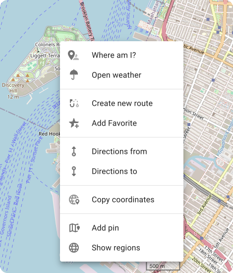

# Web 1.01

Web 1.01 is the latest web version of OsmAnd, which includes new useful features and improvements. This article describes all the main updates of the [Web Route Planner](../user/plan-route/web.md).

## What's new

- Default [system language](#system-language) (under development).
- New [context menu](#map-context-menu) for map settings.
- New options for [map search](#explore-map-menu).
- Update for [POIs context menu](#poi-context-menu).
- POIs [Photo gallery](#photo-gallery).
<!--- Display of [Wikimedia images](#wikimedia-images) on the map (in testing).-->
- Added ability to provide [URLs for different web sections](#more-urls).
- Updated icons for Favorites.
- Added a special banner with information about the OsmAnd mobile version and a link.
- Fixed incorrect precipitation data.
- Fixed user data lag when there is a huge amount of data.

## System Language

OsmAnd Web now adapts to the language settings of your browser. By default, the system will use the language set in your browser preferences:

- *Chrome users*: The priority is set through `chrome://settings/languages`.

If you'd like to manually configure the interface language for OsmAnd Web:

- Go to *Menu panel →* *Settings (*⚙ *icon)* *→ General settings language →* click *Display language* automatically detected to select your preferred language from the list.

## Map Context menu

In this update, we've introduced a new context menu for the map, making it easier to interact with points on the map. To open the menu, simply right-click anywhere on the map. The following actions are available:

- **Where am I** – a quick search for your current location on the map.
- **Open weather** – opens the Weather menu.
- **Create new route** – opens the Plan a route tool with the selected location.
- **Add Favorite** – allow you mark and set a point of interest as a favorite for easy access.
- **Directions from** – sets the start of navigation from the selected point.
- **Directions to** – sets directions to the selected point.
- **Cope coordinates** – allows you to copy the coordinates for external use.
- **Add pin** – allows you to place a pin to mark a location on the map.
- **Show regions** – displays the regions associated with the selected point.

## Explore Map Menu

Our **Explore Map** feature has received a significant upgrade, making it easier to search for places and view points of interest (POIs) with their photos ([wikidata source](https://www.wikidata.org/)) and description directly on the map.  

To get started:

1. Click the 🔍 **Search** menu to open a tab that displays popular *POI categories* and the *Explore* list of sights.
2. The data from the list in the **Explore** section is automatically displayed on the map.
3. To open the entire list of explore areas, click on **Show All** in the *Explore* section.
4. Using the **Filter** option next to *Explore*, you can refine the list by selecting the POI category you are interested in.

### POI Context Menu

Clicking on a POI now brings up an updated context menu that includes:

- POI Name (Category).
- Direction and distance to the POI.
- Detailed description.
- Access to the [Online photo gallery](#photo-gallery) for that POI.

### Photo Gallery

For visual learners, we hasve added an exciting new feature — the POI Photo Gallery. When you select a POI, you wll be able to browse through all available online photos related to that location, giving you a more immersive experience.

<!--
## Wikimedia Images

:::note
This is a test version for developers.
:::

Added the feature to display Wikimedia images on the map.
-->

## More URLs

New URLs for specific sections of the OsmAnd Web service were added, making it even easier to access different tools and functionalities directly. Below are some of the key URLs:

- **Weather**&nbsp; – &nbsp;`osmand.net/map/weather`

- **Account**&nbsp; – &nbsp;`osmand.net/map/account`

- **Configure Map**&nbsp; – &nbsp;`osmand.net/map/configure/`

- **Tracks**&nbsp; – &nbsp;`osmand.net/map/mydata/tracks`

- **Favorites**&nbsp; – &nbsp;`osmand.net/map/mydata/favorites`

- **Navigation**&nbsp; – &nbsp;`osmand.net/map/navigate`

- **Settings**&nbsp; – &nbsp;`osmand.net/map/settings`

- **Plan a Route**&nbsp; - &nbsp;`osmand.net/map/plan`

- For the current [**Explore page**](#explore-map-menu)&nbsp; - &nbsp;`osmand.net/map/search`

***Example***:  
    `https://osmand.net/map/mydata/favorites/#12/40.7452/-74.0326`

## Optional Updates

Along with these new features, we've addressed several important issues:

- *Banner for OsmAnd mobile*. A new [banner](https://github.com/osmandapp/OsmAnd/issues/18825) provides information about the OsmAnd mobile app, including a direct download link.
- *Precipitation data fix*. We corrected the display of [precipitation data](https://github.com/osmandapp/OsmAnd-Issues/issues/2578) to ensure accuracy.
- *User Data Lag Fix*. Improved performance when handling [huge amount of user data](https://github.com/osmandapp/web/issues/384), reducing lag.
- *Zooming Fix*. Resolved issues related to [zooming](https://github.com/osmandapp/web/issues/246) when enabling favorites or tracks.

