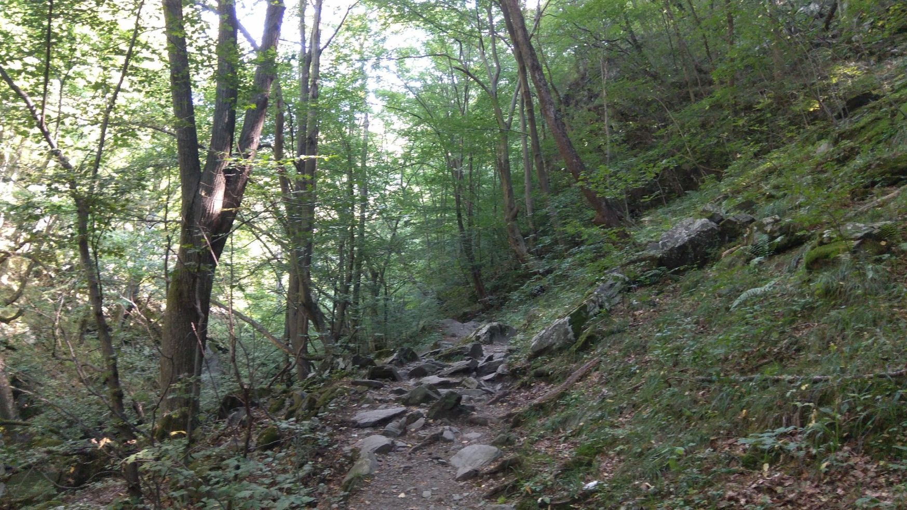

import LinksTelegram from '@site/src/components/_linksTelegram.mdx';
import LinksSocial from '@site/src/components/_linksSocialNetworks.mdx';
import AndroidStore from '@site/src/components/buttons/AndroidStore.mdx';
import AppleStore from '@site/src/components/buttons/AppleStore.mdx';

Hello, Everybody!

The weather recently has been checking our surviving skills. It is without any doubt one of the hottest summers ever! And it does not matter whether You are relaxing in an apartment with air conditioning or chilling somewhere near a river if there is some time on Your hands - here comes a new interview with Filip! Get Yourself comfortable and let’s start!

Walking through shady paths deep in the mysteriously silent woods and reaching perilous and pointy peaks of the mountains... This is how Filip describes his favourite types of traveling, which are hiking and trekking.

<!--truncate-->

So many people struggle to find a navigator that will be compatible with their mobile device and will fully satisfy them. <a href="https://osmand.net/">OsmAnd</a> has put an end to their search - it has versions both for IOS and Android. However, Filip had spent some time searching.

_'I’m an open software enthusiast and I constantly try to avoid corporate and closed “ecosystems”. So, I installed CyanogenMod (now Lineage OS) and F-Droid (the catalog of Free and Open Source Software applications). It was there that I found <a href="https://osmand.net/">OsmAnd</a>. I have never looked for another app ever since!'_

And even though Filip does not remember his first trip, he still recollects looking at a paper map, imagining his route in the mind. Now he has OsmAnd to keep him <a href="https://osmand.net/features/navigation">**on track**</a>! Before every trip, Filip spends some time working on his route. He says that time spent <a href="https://osmand.net/features/trip-planning">**planning**</a> is the essential key to every trip.

_'I really enjoy using  <a href="https://www.youtube.com/watch?v=roMNNJPHDvc"><b>the “elevation" option</b></a>. In the mountains not only does distance matter, but also the amount of time one spends going uphill and downhill. And <a href="https://osmand.net/"><b>OsmAnd</b></a> is great at calculating an estimated time of arrival (ETA); so, I can plan my trips very precisely. How long it will take to travel to the starting point. How much time I'll walk. The right time to go back. Well, every person walks at their own pace and has different needs when it comes to rest. <a href="https://osmand.net/">OsmAnd</a> algorithms for ETA are really well-balanced, though.'_

Filip pointed out that <a href="https://osmand.net/"><b>OsmAnd</b></a> has never let him down, as a result, he has never got lost! That is the ultimate goal - to prevent You from getting lost! And though, traveling is always unpredictable, one’s nerves and time should not be put at any risk.

Rarely does Filip travel longer than two days, so, it is enough for him to have a phone with a 3000mAh battery.

_'Usually, I just check the app only when I reach any point with too many paths, especially, if they all look the same, which happens from time to time. Therefore, the battery problem is not my problem!'_

When we ask Filip to give some feedback on the app, he starts smiling.

_'Any comments? I don't know... Too <a href="https://osmand.net/features"><b>many options</b></a>! It's not a complaint, just a comment. I'm that type of the user...the one who digs in the settings. I turn things on and off. And sometimes I lose myself. <a href="https://osmand.net/"><b>OsmAnd</b></a> is the app which I recommend to everyone. Once I have downloaded the map, I can go anywhere! There is no need for any mobile network, which gives freedom and independence. Thanks for your great work!'_

What is left to say? We are just happy to hear that You do enjoy the app! You use it! You change it for the better!

Thank You for being with us and stay tuned for the upcoming interviews!

_________________________________________________

<LinksSocial/>
<LinksTelegram/>

<AndroidStore/>
<AppleStore/>