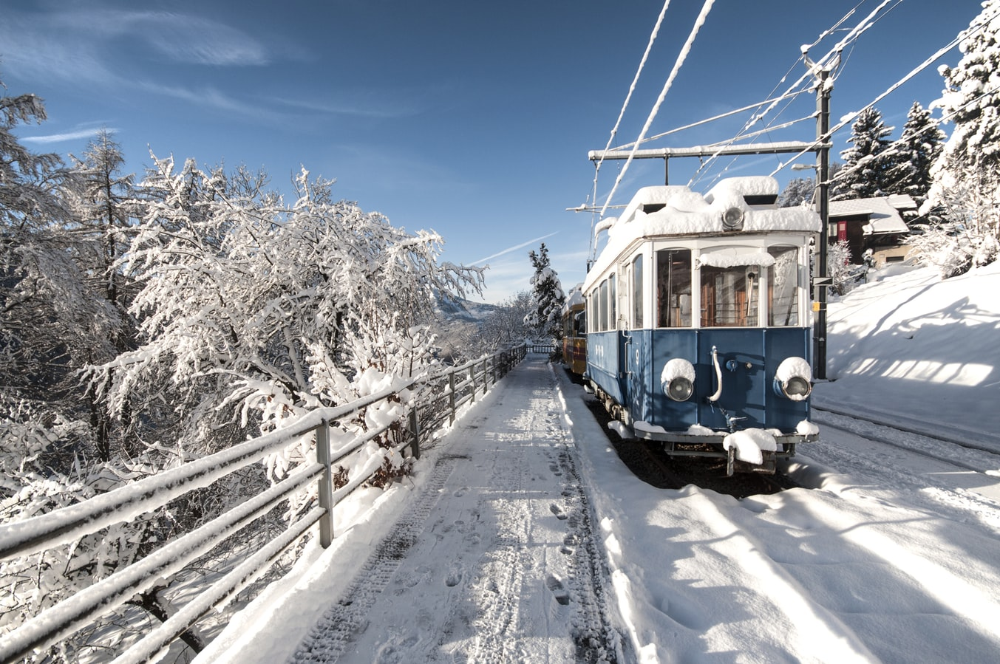

import LinksTelegram from '@site/src/components/_linksTelegram.mdx';
import LinksSocial from '@site/src/components/_linksSocialNetworks.mdx';
import AndroidStore from '@site/src/components/buttons/AndroidStore.mdx';
import AppleStore from '@site/src/components/buttons/AppleStore.mdx';

Hello!

Is it snowing in Your city? Even if not, Christmas spirit is coming to town.

Oh, You know what I mean, buildings and streets have already been decorated with lights and Christmas trees.

<!--truncate-->

What should I buy for my partner, friend or relative? This question pops up in our heads more frequently as the Christmas Day is approaching.

And You know what? Holidays,even though, busy from time to time, bring us joy and comfort. We all start planning our holidays, some of us will spend these snowy or at least cold days at home, while others would set out for a new adventure!

And today we will get a great opportunity to hear about Enric and his traveling experience.

_“Whenever possible I like to take a train to my destination. I love sitting back and gazing through the window, admiring the landscape, and seeing passengers leave and enter the train as we get to the next station. Planes are the second option since they let you wake up on the other side of the world. A car would be my least favorite means of traveling, although it might be the only way to move around in certain places.”_

Not only are trains the safest transport of all, but You can also use <a href="https://osmand.net/">OsmAnd</a> for this particular type of traveling.
The first trip Enric remembers was in his childhood when he went to Disneyland in Paris and to Brussels. He has family all over Europe and used to pay them a visit from time to time, which, in a way, made traveling into a habit.

_“I started using <a href="https://osmand.net/">OsmAnd</a> four years ago. I use it for when I'm abroad, and use Google Maps when I'm at home. I have always downloaded the maps for the regions I am planning to visit in advance. Having them separated by country, state or even city (like in the case of San Francisco) is very convenient. I normally mark the places I know I'll be visiting and save them under <a href="https://test.osmand.net/features/favourites">  Favorites</a>. Usually I classify them in categories for each leg of the trip.”_

The most vital function of the app for Enric is <a href="https://test.osmand.net/features/find-something-on-map"> search</a>, which help him quickly spot next destinations. These locations will appear on the first positions of the search results.

_“If I am changing plans I want to be able to find where I will be going, and doing so completely in OsmAnd, without having to open another application, is the most efficient way. As for other functions, editing is a feature I use a lot for simple edits, like adding POIs. For anything that is more convoluted, I prefer Vespucci.”_

Travelers always help each other during their trips. Enric is not an exception, once he helped fellow tourists by showing them <a href="https://osmand.net/">OsmAnd</a>!

_“When I was in Cuba I met other travelers who were inadvertently using OpenStreetMap data (with MAPS.me) to travel around. They didn't know of <a href="https://osmand.net/">OsmAnd</a> and they were amazed when I showed them the opening times of shops or museums, quickly finding telephone numbers, and showed them the "Nearby Wikipedia Articles" functions. My casa hosts were glad when I <a href="https://test.osmand.net/features/osm-editing-plugin"> edited or added their place on the OSM database</a> and were very happy to learn about the app and the OSM project. Unfortunately, the task of editing was too daunting to them.”_

Enric has a Redmi Note 4 with LineageOS+MicroG 16.0 and FDE.ai. He uses it only for mapping and texting and charges his phone overnight. With the app on he estimates that the battery will last only for four hours.

_“The <a href="https://osmand.net/">OsmAnd</a> project is doing a great job on the app. It's getting more stable every release. It is very helpful while traveling and I am grateful to the team and to all the fellow contributors of the OSM project. As far as suggestions go, I'd like to see the search function improved. For instance, I have already finished my last trip but I still see the results for my saved places when I am using the function 8000 km away. It'd be helpful if nearby places were shown first on the search results page (perhaps as an option or filter). Sometimes I haven't been able to find the place I’ve been looking for; even though I have input the exactly same name. These are the kinds of problems that deserve filing an issue to the repository. Unfortunately, when they happen it is not always convenient to notify the issue.”_

We would like to thank You all! Have a snowy December.
_________________________________________________

<LinksSocial/>
<LinksTelegram/>

<AndroidStore/>
<AppleStore/>