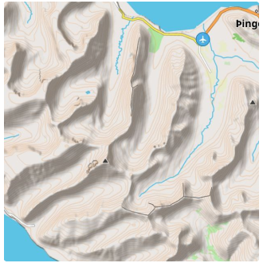
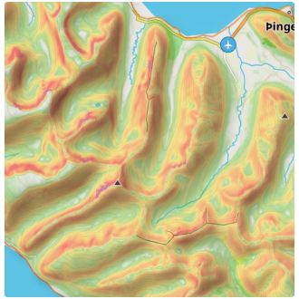
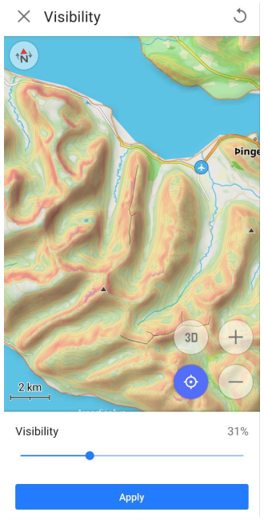

import Tabs from '@theme/Tabs';
import TabItem from '@theme/TabItem';
import AndroidStore from '@site/src/components/buttons/AndroidStore.mdx';
import AppleStore from '@site/src/components/buttons/AppleStore.mdx';
import LinksTelegram from '@site/src/components/_linksTelegram.mdx';
import LinksSocial from '@site/src/components/_linksSocialNetworks.mdx';
import Translate from '@site/src/components/Translate.js';
import InfoIncompleteArticle from '@site/src/components/_infoIncompleteArticle.mdx';
import ProFeature from '@site/src/components/buttons/ProFeature.mdx';
import InfoAndroidOnly from '@site/src/components/_infoAndroidOnly.mdx';

## Aperçu {#overview}

:::info Fonctionnalité payante
Le plugin Topographie est une [fonctionnalité payante](../purchases/index.md) de l'application OsmAnd.
:::

La topographie est une caractéristique importante de la cartographie qui fournit des informations pour évaluer visuellement le relief du terrain.
Les informations topographiques comme les [Lignes de niveau](#contour-lines), le [Terrain](#terrain) (*Estompage* et *Pente*), et le [Relief 3D](#3d-relief) aident à évaluer visuellement la configuration du terrain en visualisant l'altitude, le relief, les extrêmes, l'inclinaison ou les points de même hauteur.

Chaque fonctionnalité fournie par ce plugin est une couche de carte indépendante qui, lorsqu'elle est activée, peut être affichée au-dessus ou en dessous de la source de carte principale en fonction des [paramètres](../map/raster-maps.md#overlay-layer).

Le plugin Topographie donne accès aux types de cartes suivants :

- [Lignes de niveau](#contour-lines). Il s'agit d'une [carte vectorielle](../map/vector-maps.md) représentée en [**mètres** ou **pieds**](#contour-lines-meters-or-feet). Les lignes de niveau indiquent les niveaux d'altitude et aident à visualiser le terrain.
- [Estompage](#hillshade-slope-and-altitude-layers). Types de cartes avec ombrage des collines et des pentes qui rendent le relief plus visible et aident à interpréter visuellement le terrain.
- [Pente](#hillshade-slope-and-altitude-layers). Couche [raster](../map/raster-maps.md) qui fournit des informations sur l'inclinaison des pentes, ce qui peut être important pour la planification d'itinéraires et la sécurité.
- [Relief 3D](#3d-relief). Il s'agit d'une [carte vectorielle](../map/vector-maps.md) qui fournit une représentation tridimensionnelle du terrain, disponible uniquement avec l'abonnement [OsmAnd Pro](../purchases/index.md).

<Tabs groupId="operating-systems" queryString="current-os">

<TabItem value="android" label="Android">

| Lignes de niveau | Estompage | Pente |
|:---|:---|:---|
|  |  |  |

</TabItem>

<TabItem value="ios" label="iOS">

| Lignes de niveau | Estompage | Pente |
|:---|:---|:---|
|  |  |  |

</TabItem>

</Tabs>

### Licence pour les données MNE utilisées par OsmAnd pour la détection du terrain {#license-for-dem-data-used-by-osmand-for-terrain-detection}

Les données d'altitude sur la carte (entre 70 degrés de latitude nord et 70 degrés de latitude sud) ont été obtenues à partir de mesures effectuées dans le cadre de la *Shuttle Radar Topography Mission (SRTM)*. Elle a utilisé l'instrument *Advanced Spaceborne Thermal Emission and Reflection Radiometer (ASTER)*, l'outil d'imagerie principal du *Système d'Observation de la Terre de la NASA*.
Pour des informations complètes, consultez la [Licence](https://github.com/osmandapp/OsmAnd/blob/master/LICENSE#L146).

Données MNE (MNS)

   - <a href="https://www.eorc.jaxa.jp/ALOS/en/index_e.htm">ALOS DEM</a>. Les données originales utilisées pour ce produit ont été fournies par AW3D de la JAXA. 
	- <a href="http://hydro.iis.u-tokyo.ac.jp/~yamadai/MERIT_DEM">MERIT DEM.</a> 
	- <a href="https://doi.org/10.7910/DVN/OHHUKH">ArcticDEM</a>: Porter, Claire; Morin, Paul; Howat, Ian; Noh, Myoung-Jon; Bates, Brian; Peterman, Kenneth; Keesey, Scott; Schlenk, Matthew; Gardiner, Judith; Tomko, Karen; Willis, Michael; Kelleher, Cole; Cloutier, Michael; Husby, Eric; Foga, Steven; Nakamura, Hitomi; Platson, Melisa; Wethington, Michael, Jr.; Williamson, Cathleen; Bauer, Gregory; Enos, Jeremy; Arnold, Galen; Kramer, William; Becker, Peter; Doshi, Abhijit; D’Souza, Cristelle; Cummins, Pat; Laurier, Fabien; Bojesen, Mikkel, 2018, “ArcticDEM”, Harvard Dataverse, V1. 
	- <a href="https://sonny.4lima.de">Sonny's LiDAR Digital Terrain Models of Europe</a> (DTM).

## Paramètres de configuration requis {#required-setup-parameters}

Pour afficher les données de **Lignes de niveau** et de **Terrain (Estompage, Pente)** sur la carte :

1. **Achat** : [Plan d'achat OsmAnd+, OsmAnd Maps+ ou OsmAnd Pro](../plugins/index.md#purchase)
2. [Activer](../plugins/index.md#enable--disable) le plugin Topographie dans la section Plugins du *Menu principal*.
3. [Télécharger](#download-maps) : Cartes de lignes de niveau, d'estompage, de pente ou de terrain (3D).
4. **Activer et ajuster** : Lignes de niveau, Estompage ou Pente pour la vue de la carte.
5. Vous pouvez également regarder le [tutoriel YouTube](https://www.youtube.com/watch?v=z8kp_M3FKoc&feature=emb_logo&ab_channel=BartEisenberg).

Pour afficher le [**Relief 3D**](#3d-relief), vous devez acheter le plan *OsmAnd Pro*, qui inclut l'accès au plugin Topographie.

## Télécharger des cartes {#download-maps}

Pour commencer à utiliser les fonctionnalités du plugin, vous devez télécharger les cartes qui vous intéressent. Certaines cartes, comme les Lignes de niveau pour les régions montagneuses, peuvent être assez volumineuses, dépassant 2 Go, et peuvent ne pas être prises en charge sur des appareils obsolètes.

Pour un fonctionnement stable et pour économiser les ressources, vous pouvez télécharger une carte non pas du pays entier, mais de ses régions spécifiques, si de telles régions sont proposées dans l'application. Les informations sur la taille de chaque type de carte sont indiquées sous leur nom.

### Cartes de relief 3D {#3d-relief-maps}

<Tabs groupId="operating-systems" queryString="current-os">

<TabItem value="android" label="Android">

Aller à : *<Translate android="true" ids="shared_string_menu,maps_and_resources,regions"/>*

  

</TabItem>  

<TabItem value="ios" label="iOS">

Aller à : *<Translate ios="true" ids="shared_string_menu,res_mapsres,res_worldwide"/>*

 

</TabItem>

</Tabs>

Vous devez télécharger les cartes **Carte de terrain (3D)** pour afficher l'Estompage, la Pente et le Relief 3D. Après avoir téléchargé les cartes, vous pouvez afficher les **Lignes de niveau** et le **Terrain** en utilisant la section [Configurer la carte](../map/configure-map-menu.md) du *Menu principal*.

Si la carte affichée à l'écran n'est pas téléchargée, alors dans *Menu → Configurer la carte → section Topographie → Terrain*, en bas de la liste des fonctionnalités, la section *Télécharger des cartes* avec des cartes supplémentaires suggérées sera affichée.

### Lignes de niveau (Mètres ou Pieds) {#contour-lines-meters-or-feet}

<Tabs groupId="operating-systems" queryString="current-os">

<TabItem value="android" label="Android">

</TabItem>

<TabItem value="ios" label="iOS">  

</TabItem>

</Tabs>  

Pour les [**Lignes de niveau**](#contour-lines), vous devez déterminer dans quelles [unités](../personal/profiles.md#units--formats) (mètres ou pieds) elles seront affichées sur la carte et télécharger la version appropriée de la carte sur votre appareil.

**Les options d'unités ne sont pas interchangeables**, donc si vous devez passer des mètres aux pieds ou inversement, vous devez désinstaller la version précédente de la carte des Lignes de niveau pour télécharger la nouvelle version.

## Lignes de niveau {#contour-lines}

<Tabs groupId="operating-systems" queryString="current-os">

<TabItem value="android" label="Android">

Aller à : *<Translate android="true" ids="shared_string_menu,configure_map,srtm_plugin_name,download_srtm_maps"/>*

</TabItem>

<TabItem value="ios" label="iOS">

Aller à : *<Translate ios="true" ids="shared_string_menu,configure_map,srtm_plugin_name"/> → Lignes de niveau*

</TabItem>

</Tabs>  

[Les lignes de niveau](../map/vector-maps.md#-contour-lines) sont une représentation graphique des altitudes sur une carte et sont disponibles sous forme de cartes vectorielles. Elles forment des lignes correspondant à des points de même altitude, qui créent des contours permettant de déterminer dans quelle direction et avec quelle inclinaison la surface penche.

Lors de l'utilisation du [Moteur de rendu de la carte](../personal/global-settings.md#map-rendering-engine) :

- **Version 2 (OpenGL)**. Les lignes de niveau sont prises en charge en vue 3D et en mode relief 3D.
- **Version 1**. Les lignes de niveau ne sont pas prises en charge lors de l'utilisation de cartes en tuiles provenant d'Internet.

**Paramètres d'apparence** :

- *<Translate android="true" ids="download_srtm_maps"/>*. Activer ou désactiver les lignes de niveau.
- *<Translate android="true" ids="show_from_zoom_level"/>*. Définir les [niveaux de zoom](../map/interact-with-map.md#my-location-and-zoom) auxquels les lignes de niveau sont visibles.
- *<Translate android="true" ids="srtm_color_scheme"/>*. Choisir la couleur d'affichage des lignes de niveau.
- *<Translate android="true" ids="rendering_attr_contourWidth_name"/>*. Ajuster la largeur des lignes de niveau.
- *<Translate android="true" ids="rendering_attr_contourDensity_name"/>*. Sélectionner la densité des lignes de niveau (Faible, Moyenne, Élevée). Des densités plus élevées peuvent affecter la vitesse de chargement.
- *<Translate android="true" ids="maps_and_resources"/>*. Afficher et télécharger les cartes de lignes de niveau pour la région actuelle et les zones voisines.

## Terrain {#terrain}

<Tabs groupId="operating-systems" queryString="current-os">

<TabItem value="android" label="Android">

Aller à : *<Translate android="true" ids="shared_string_menu,configure_map,srtm_plugin_name,shared_string_terrain"/>*

  

</TabItem>

<TabItem value="ios" label="iOS">  

Aller à : *<Translate ios="true" ids="shared_string_menu,configure_map,srtm_plugin_name,shared_string_terrain"/>*

   

</TabItem>

</Tabs>  

L'option **Terrain** active et permet de personnaliser trois fonctionnalités telles que l' *Estompage*, la *Pente* et l' *Altitude*.
Fonctionnalités spécifiques :

- Une seule option peut être activée à la fois, soit l'Estompage, la Pente ou l'Altitude.
- Si vous ne voyez aucun changement après avoir téléchargé et activé la carte correspondante, il est recommandé de redémarrer l'application.

Le menu **Terrain** inclut la sélection du [jeu de couleurs](#default-color-scheme) avec l'option de le [modifier](#modify-color-scheme) (pour les [abonnés Pro](../../user/purchases/index.md)), la possibilité de changer la transparence de la couche sur la carte ([visibilité](#visibility)), et de sélectionner le [niveau de zoom](#zoom-levels) pour son affichage, des informations sur la taille des [données en cache](#cache-size), et une liste des [cartes](../../user/personal/maps-resources.md) nécessaires pour afficher la couche.

## Couches d'estompage, de pente et d'altitude {#hillshade-slope-and-altitude-layers}

| Estompage | Pente | Altitude |
| ------ | ------- | ------- |
|  |  |  |

**L'estompage** est basé sur la simulation de l'éclairage de la surface à l'aide de données de terrain. Cette méthode consiste à créer des ombres et des rehauts en fonction de l'angle de la surface par rapport à la source de lumière. En conséquence, vous voyez des collines, des vallées et d'autres détails du terrain naturels sur la carte.

**La pente** détermine l'angle d'inclinaison de la surface en fonction des données d'altitude des points sur la carte. Les calculs de l'angle de pente sont effectués en tenant compte des changements d'altitude et des distances entre les points, et en représentant ce changement comme un angle de pente.

**L'altitude** représente l'élévation des points sur la carte par rapport au niveau de la mer. Elle vous aide à comprendre comment le terrain change en hauteur. Cette fonctionnalité est particulièrement utile pour des activités comme la randonnée ou le VTT, où la connaissance de l'altitude peut aider à planifier les itinéraires et à gérer l'effort physique. Les données d'altitude sont dérivées de modèles d'élévation et fournissent une vue claire des points hauts et bas, ce qui facilite l'évaluation de la difficulté d'un itinéraire ou l'identification des sommets et des vallées le long de votre parcours.

Les cartes raster d'**Estompage**, de **Pente** et d'**Altitude** sont créées à partir de données de terrain raster telles que les Modèles Numériques d'Élévation (MNE).

**Utilisation** :

- *Navigation.* Aide à identifier les pentes raides, en descente comme en montée, ce qui peut être crucial pour une navigation sûre.
- *Planifier des itinéraires.* Aide à choisir les itinéraires les plus appropriés, en tenant compte du terrain.
- *Estimation du terrain.* C'est pratique pour visualiser le paysage, surtout si vous marchez ou faites du vélo.

### Jeu de couleurs par défaut {#default-color-scheme}

| Estompage | Pente | Altitude |
| ------ | ------- | ------- |
|||  |

- L'*Estompage* utilise des teintes sombres pour montrer les pentes, les sommets et les basses terres. Le soleil virtuel a un azimut (direction) fixe de 315 degrés.

- La *Pente* utilise la couleur pour visualiser l'inclinaison du terrain. Vous pouvez en savoir plus à ce sujet [ici](https://fr.wikipedia.org/wiki/Pente_(topographie)). Chaque couleur correspond à un angle de déviation par rapport à l'horizontale. Un jeu de couleurs supplémentaire pour la *Pente*, ***Avalanche***, est disponible dans le menu **Modifier**.

- *Altitude*. La carte d'altitude colore chaque pixel en fonction de la hauteur calculée de la carte en utilisant le dégradé d'un jeu de couleurs défini. Habituellement, les jeux de couleurs d'altitude dépendent fortement de l'emplacement. Dans les zones montagneuses, vous préférerez répartir les couleurs sur une plage d'altitude plus large et dans les zones plates, vous sélectionnerez un jeu de couleurs avec une petite plage entre l'altitude min/max.

> *Veuillez lire l'article [Jeu de couleurs](../personal/color-palette-schemes.md) pour plus d'informations.*

### Modifier le jeu de couleurs {#modify-color-scheme}

:::info Fonctionnalité payante
*Modifier le jeu de couleurs* est une fonctionnalité payante d'**OsmAnd Pro** pour [iOS](../purchases/ios.md#pro-features) et [Android](../purchases/android.md#pro-features) <ProFeature />.
:::

<Tabs groupId="operating-systems" queryString="current-os">

<TabItem value="android" label="Android">

   

</TabItem>

<TabItem value="ios" label="iOS">  

   

</TabItem>

</Tabs>

La fonctionnalité *Modifier le jeu de couleurs* vous permet de sélectionner un jeu de couleurs :

- À partir d'une [liste prédéfinie](#default-color-scheme).
- À partir de fichiers de palette de couleurs que vous avez créés sur votre ordinateur. Les fichiers personnalisés peuvent être ajoutés à OsmAnd en utilisant l'[outil d'import/export](../personal/import-export.md).

Vous pouvez [modifier ces palettes](../personal/color-palette-schemes.md#edit-palette-file) pour personnaliser l'apparence des cartes et des itinéraires.

### Visibilité {#visibility}

| Visibilité 31% | Visibilité 74% |
| ------ | ------- |
|  |  |

La fonction *Visibilité* est utilisée pour ajuster la transparence des ombres pour l'Estompage et des couleurs utilisées pour représenter l'angle dans le paramètre Pente.

### Niveaux de zoom {#zoom-levels}

  

La fonction *Niveaux d'échelle* vous permet de définir les valeurs minimales et maximales des niveaux de zoom de la carte, allant de 4 à 19, auxquels les couches de carte Estompage ou Pente seront affichées.

### Taille du cache {#cache-size}

**La taille du cache** est une section d'information qui affiche la quantité de mémoire de votre appareil actuellement utilisée pour les données de *Terrain*. Chaque fois que vous consultez des informations d'*Estompage* ou de *Pente* sur une carte, toutes ces données sont temporairement stockées dans le cache pour un accès rapide et une utilisation ultérieure, évitant ainsi une charge supplémentaire sur le processeur de votre appareil.

**Vider le cache** est parfois nécessaire pour libérer de l'espace sur votre appareil ou pour résoudre d'éventuels problèmes de performance. Pour vider le cache, vous devez vous rendre dans les *Paramètres système* de l'appareil, puis le chemin peut être le suivant : *Applications → OsmAnd → Stockage → Vider le cache*.

### Moteur de rendu (Android) {#rendering-engine-android}

L'**Estompage** et la **Pente** sont affichés et ajustés dans n'importe quel [Moteur de rendu de la carte](../personal/global-settings.md#map-rendering-engine) sélectionné.

1. Si vous utilisez le **Moteur de rendu de la carte Version 1**, vous devez utiliser le [téléchargement](../start-with/download-maps.md) normal des cartes raster d'Estompage et de Pente.

2. Si vous utilisez le **Moteur de rendu de la carte Version 2 (OpenGL)** :
    - Vous pouvez continuer à utiliser le type de téléchargement normal des cartes raster d'Estompage et de Pente. Cependant, pour ce faire, vous devrez activer le [plugin de développement OsmAnd](../plugins/development.md) et activer le paramètre [Utiliser le format SQLite raster pour l'estompage et la pente](../plugins/development.md#terrain).

    - Alternativement, vous pouvez utiliser le téléchargement de la [Carte de terrain (3D)](../personal/maps-resources.md#paid-features-for-the-selected-location). Cela économise de l'espace mémoire sur votre appareil, et les effets d'Estompage, de Pente et de Relief 3D seront générés à partir de celles-ci en utilisant votre appareil.

### Actions rapides {#quick-actions}

Vous pouvez utiliser les boutons *Action rapide* sur l'écran de la carte pour basculer la visibilité des couches de [Lignes de niveau](#contour-lines), de [Terrain](#terrain) et du [jeu de couleurs du Terrain](#default-color-scheme). Selon la couche sélectionnée dans le menu Configurer la carte, l'attribution d'une action *Terrain* au bouton affichera *Estompage*, *Pente* ou *Altitude*.

Les principaux paramètres pour *Afficher ou Masquer les types de carte* se trouvent dans la section Topographie du menu Configurer la carte. Dans l'article [Action rapide](../widgets/quick-action.md#configure-map), vous trouverez une liste des couches disponibles pour l'affichage. Si vous avez besoin d'un accès rapide à cette configuration de carte, utilisez l'outil *Bouton personnalisé*.

- Allez à [Ajouter une action](../widgets/quick-action.md#custom-buttons) : *Menu → Configurer l'écran → Boutons personnalisés → Action rapide → Ajouter une action → Configurer la carte*.
- Ajoutez un ou plusieurs boutons d'action rapide pour changer la visibilité d'une couche topographique particulière.

## Relief 3D {#3d-relief}

:::info Fonctionnalité Pro
Le Relief 3D est une fonctionnalité payante d'[**OsmAnd Pro**](../purchases/index.md) <ProFeature />.
:::

<Tabs groupId="operating-systems" queryString="current-os">

<TabItem value="android" label="Android">

Aller à : *<Translate android="true" ids="shared_string_menu,configure_map,srtm_plugin_name,relief_3d"/>*

</TabItem>

<TabItem value="ios" label="iOS">  

Aller à : *<Translate ios="true" ids="shared_string_menu,configure_map,srtm_plugin_name,shared_string_terrain,shared_string_relief_3d"/>*

</TabItem>

</Tabs>  

La fonction Relief 3D produit un relief surélevé et fournit une représentation tridimensionnelle du paysage. Le Relief 3D fonctionne hors ligne et peut être utilisé avec les [cartes vectorielles OsmAnd](../map/vector-maps.md) ou n'importe quelles [cartes raster](../map/raster-maps.md#select-raster-maps) comme [Source de carte](../map/raster-maps.md#main) ou comme [Sous-couche/Sur-couche](../map/raster-maps.md#overlay-layer).

***Comment afficher le Relief 3D sur la carte.***

- Achetez un abonnement **OsmAnd Pro** pour [iOS](../purchases/ios.md#pro-features) ou [Android](../purchases/android.md#pro-features).

- Allez à [*<Translate Android="true" ids="shared_string_menu,configure_map"/>*](../map/configure-map-menu.md) :
    - **Android** : faites défiler jusqu'à la section *<Translate android="true" ids="srtm_plugin_name"/> → <Translate android="true" ids="relief_3d"/>*.
    - **iOS** : faites défiler jusqu'à la section *<Translate ios="true" ids="srtm_plugin_name"/> → <Translate ios="true" ids="shared_string_terrain,shared_string_relief_3d"/>*.

- Téléchargez la [Carte de terrain (3D)](#3d-relief-maps) des régions, si nécessaire.

<Tabs groupId="operating-systems" queryString="current-os">

<TabItem value="android" label="Android">

| Couche de carte vectorielle | Couche de carte raster |
| ------ | ------- |
|  |  |

</TabItem>  

<TabItem value="ios" label="iOS">

| Couche de carte vectorielle | Couche de carte raster |
| ------ | ------- |
|   |  |

</TabItem>

</Tabs>

### Exagération verticale {#vertical-exaggeration}

<Tabs groupId="operating-systems" queryString="current-os">

<TabItem value="android" label="Android">

Aller à : *<Translate android="true" ids="shared_string_menu,configure_map,srtm_plugin_name,relief_3d"/> → Exagération verticale*

</TabItem>  

<TabItem value="ios" label="iOS">

Aller à : *<Translate ios="true" ids="shared_string_menu,configure_map,srtm_plugin_name,shared_string_terrain,shared_string_relief_3d"/> → Exagération verticale*

</TabItem>

</Tabs>

L'*Exagération verticale* est un coefficient spécial pour le *Relief 3D*. Vous pouvez changer l'échelle (*Exagération verticale*) de x1 à x3. Cette fonction vous permet de visualiser des contours de terrain plus lisses avec des détails accrus.

### Estompage et Relief 3D {#hillshade-and-3d-relief}

| Estompage | Relief 3D |
|--------|---------|
|  |  |

L'**Estompage** est un type de carte qui affiche le terrain en utilisant des ombres, créant une représentation visuelle de la pente et de la forme de la surface terrestre.
Le **Relief 3D** est une fonctionnalité qui ajoute des effets tridimensionnels à la carte.

Si vous **désactivez** l'*Estompage* et **activez** le *Relief 3D*, les ombres du relief seront toujours visibles car l'*Estompage* et le *Relief 3D* sont deux manières différentes de visualiser une carte. L'*Estompage* crée des ombres basées sur le terrain et les ajoute à la carte, tandis que le *Relief 3D* modélise des éléments 3D pour montrer la profondeur et la forme du terrain, et les ombres font partie de la visualisation. Ces fonctionnalités peuvent fonctionner en parallèle, et la désactivation de l'*Estompage* n'affecte pas la manière dont les effets 3D sont affichés.

Lorsque l'**Estompage** est **activé**, une image avec des ombres de relief apparaît plus détaillée, plus sombre et plus étagée qu'une image de *Relief 3D*. L'explication est que l'*Estompage* accentue les gradients et les contrastes du terrain, créant une image plus nette et plus détaillée. La fonction *Relief 3D* donne à la carte une apparence plus fluide et lissée, adoucissant le terrain et réduisant potentiellement la visibilité de certains détails plus fins.

## Combiner les types de couches {#combine-layer-types}

<Tabs groupId="operating-systems" queryString="current-os">

<TabItem value="android" label="Android">

 

</TabItem>  

<TabItem value="ios" label="iOS">

 

</TabItem>

</Tabs>

OsmAnd vous permet de combiner plusieurs types de couches de carte pour un affichage plus visuel.

- La combinaison des **Lignes de niveau** et de l'**Estompage** est optimale pour estimer visuellement et numériquement la raideur des pentes montagneuses.
- La combinaison des couches **Lignes de niveau** et **Pente** est la meilleure pour estimer la raideur de la pente et trouver des points de même hauteur.
- La combinaison des couches **Relief 3D** et **Estompage** vous permet d'obtenir une représentation plus réaliste et visuelle du terrain, du relief et des détails du paysage. Cette combinaison est particulièrement adaptée aux terrains montagneux et vallonnés.

## Articles connexes {#related-articles}

- [Interagir avec la carte](../../user/map/interact-with-map.md)
- [Paramètres généraux](../../user/personal/global-settings.md)
- [Cartes vectorielles (Styles de carte)](../../user/map/vector-maps.md)

### Problèmes courants et solutions {#common-issues-and-solutions}

<!-- Troubleshooting Steps-->

1. Comment restaurer l'achat du plugin Topographie (anciennement Lignes de niveau). [(vérifier)](../troubleshooting/purchases_payments.md#how-to-restore-the-topography-formerly-contour-lines-plugin-purchase).
2. Les lignes de niveau, les données d'altitude ou le relief 3D ne s'affichent pas. [(vérifier)](../troubleshooting/maps-data#contour-lines-elevation-data-or-3d-relief-are-not-displayed)
3. La carte passe automatiquement en mode 3D pendant la navigation :
    - Assurez-vous que le bouton **Mode 3D** est désactivé dans **Menu → Configurer l'écran → Boutons → Boutons par défaut**.
    - Vérifiez si des fonctionnalités de Terrain sont activées dans **Menu → Configurer la carte → Topographie** qui pourraient déclencher un effet 3D.