import Tabs from '@theme/Tabs';
import TabItem from '@theme/TabItem';
import AndroidStore from '@site/src/components/buttons/AndroidStore.mdx';
import AppleStore from '@site/src/components/buttons/AppleStore.mdx';
import LinksTelegram from '@site/src/components/_linksTelegram.mdx';
import LinksSocial from '@site/src/components/_linksSocialNetworks.mdx';
import Translate from '@site/src/components/Translate.js';
import InfoIncompleteArticle from '@site/src/components/_infoIncompleteArticle.mdx';
import ProFeature from '@site/src/components/buttons/ProFeature.mdx';
import InfoAndroidOnly from '@site/src/components/_infoAndroidOnly.mdx';  

# Android 5.0 (bêta)

Android 5.0 est la dernière version qui introduit de nombreuses nouvelles fonctionnalités et améliorations dans l'application OsmAnd. Cet article décrit toutes les mises à jour clés qui représentent des changements significatifs pour nos utilisateurs.

# Rejoindre la version bêta

OsmAnd publie quotidiennement plusieurs versions prêtes à l'emploi, vous permettant de suivre les nouvelles fonctionnalités et de participer au processus de traduction d'OsmAnd. Vous pouvez participer aux tests de la version bêta d'OsmAnd via Google Play.

  <a class="button button--active" href="https://play.google.com/apps/testing/net.osmand.plus">OsmAnd+</a>
  <a class="button button--active" href="https://play.google.com/apps/testing/net.osmand">OsmAnd</a>

  

 

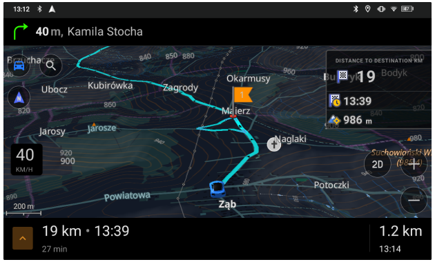

## Nouveautés

- [Le nouveau widget de navigation principal](#route-maneuvers-widgets-set) combine les flèches de virage et les instructions de navigation.
- [Nouveau widget d'informations sur l'itinéraire actuel](#new-route-information-widget) : affiche l'heure d'arrivée estimée, l'heure d'arrivée et la distance.
- [Refonte de l'écran de configuration des widgets.](#redesigned-configure-screen)
- [Nouvelle option pour sélectionner la taille du widget](#resizable-widgets-for-side-panels) pour les panneaux gauche et droit.
- [Action de réinitialisation pour le widget Vitesse moyenne.](#reset-option-for-the-average-speed-widget)
- [Découvrez les POI les mieux notés](#explore-mode-discover-popular-places) avec le nouveau mode Exploration.
- [Intégration de Wikidata](#popular-places-wikipedia) dans les données cartographiques (Lieux populaires - Wikipedia).
- [Amélioration de la recherche d'itinéraires OSM](#all-osm-routes--now-searchable) et de la sélection pour la navigation.
- [Informations détaillées](#ski-slopes-and-mtb-trails-information) sur les pistes de ski et les sentiers VTT.
- [Ajout d'une grille de coordonnées](#coordinates-grid-overlay) avec des coordonnées géographiques.
- [Zones d'escalade et falaises](#climbing-areas-and-crags) sur la carte.
- [Informations détaillées pour les objets linéaires.](#detailed-information-for-linear-objects)
- [Altitudes des sommets en pieds.](#mountain-peak-heights-in-feet)
- [Les sommets proéminents](#prominent-peaks-now-discoverable) sont désormais découvrables sur la carte et via la recherche.
- [Recherche d'adresses aux États-Unis](#usa-address-search-with-tiger-data) à l'aide des données TIGER.
- [Modification de l'interface utilisateur](#interactions-with-intermediate-destinations) pour les destinations intermédiaires dans les points de passage.
- [Ajout de la possibilité de modifier et de définir](#flexible-appearance-settings-for-favorite-groups) l'apparence par défaut des groupes de favoris.
- [Améliorations pour Android Auto.](#android-auto-improvements)
- [Plugin de suivi des navires AIS (navigation nautique).](#ais-vessel-tracking-plugin)

- [Mises à jour facultatives](#optional-updates). Mises à jour et améliorations supplémentaires pour la version.

## Ensemble de widgets de guidage d'itinéraire

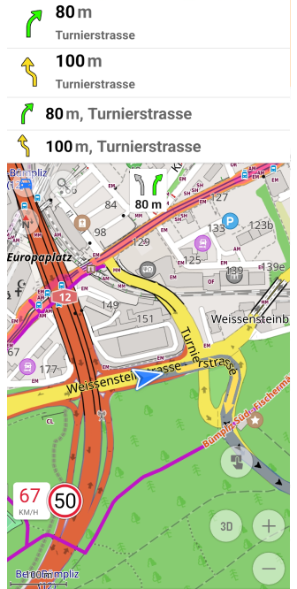

Le nouveau **widget de guidage d'itinéraire** combine les détails de navigation essentiels en un seul affichage compact, fournissant des **instructions de navigation en temps réel**, vous aidant à rester sur la bonne voie tout au long de votre voyage. Ces widgets sont **actifs pendant la navigation**, vous assurant de ne jamais manquer un virage.

Améliorations clés :

- **Vue de navigation tout-en-un** — Intègre la *distance jusqu'au premier et au prochain virage, la flèche de virage, le nom de la route, le numéro de la route avec un bouclier, le nom de la rue actuelle, le numéro de sortie* et les *informations sur la voie* dans un seul widget.
- **Disponible pour les panneaux de widgets supérieur et inférieur.**

Trouvez-les dans :
*Menu → Configurer l'écran → **Panneau supérieur / Panneau inférieur** → Guidage d'itinéraire : Prochain virage, Deuxième prochain virage, Voies*

En savoir plus :
[Widget de guidage d'itinéraire](https://osmand.net/docs/user/widgets/nav-widgets#route-guidance)

## Nouveau widget d'informations sur l'itinéraire

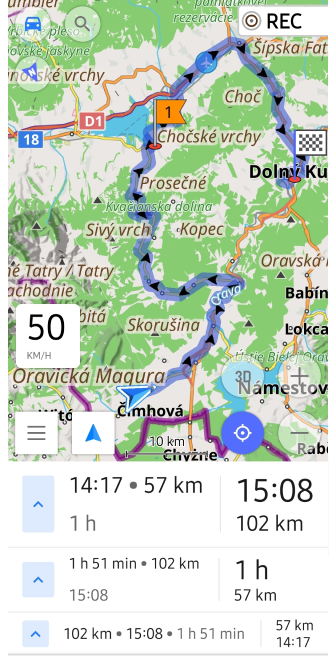

Le **widget d'informations sur l'itinéraire** offre un aperçu clair de votre voyage en affichant l'*heure d'arrivée estimée (ETA), le temps de trajet restant et la distance jusqu'à la destination* dans un format compact. Conçu pour la navigation en temps réel, il vous assure d'avoir les détails de voyage les plus pertinents en un coup d'œil.

Fonctionnalités clés :

- **Paramètres de priorité d'affichage** — Choisissez entre *Destination d'abord (par défaut)* ou *Intermédiaire d'abord* pour prioriser les informations d'itinéraire les plus pertinentes.
- **Disponible pour les panneaux de widgets supérieur et inférieur** pour un placement flexible.
- **Accès rapide au panneau Démarrer/Arrêter la navigation** — Appuyez sur le *bouton flèche* pour ouvrir les commandes de navigation.

Trouvez-le dans :
*Menu → Configurer l'écran → **Panneau supérieur / Panneau inférieur** → Informations sur l'itinéraire*

En savoir plus :
[Widget Points de navigation](https://osmand.net/docs/user/widgets/nav-widgets#navigation-points)
[Panneau Démarrer/Arrêter la navigation](https://osmand.net/docs/user/navigation/setup/route-navigation#start--stop-navigation)

## Écran de configuration repensé

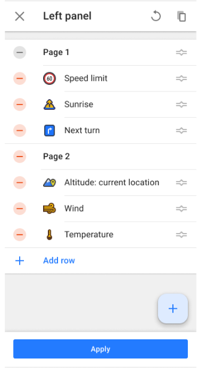  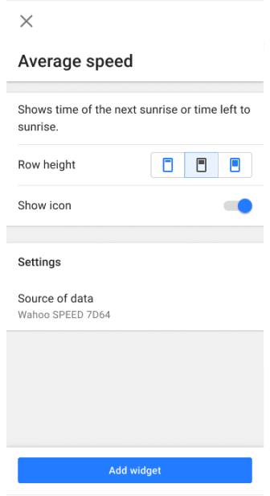  

L'**écran de configuration** des widgets a fait l'objet d'une refonte majeure pour améliorer la convivialité et simplifier le processus d'ajout, de personnalisation et d'organisation des widgets.

Principaux changements :

- **Écran Ajouter un widget** :
   - Les widgets et les groupes de widgets sont **triés par ordre alphabétique** (A-Z).
   - La fonctionnalité de **recherche** fonctionne pour les noms de widgets et les groupes.
- **Panneaux** — Suppression des groupes *Widgets disponibles* et *Actions* pour une interface plus claire.
- **Groupes de widgets** - Suppression de l'icône de groupe et du bouton Ajouter, les widgets sont ajoutés séparément, liste de widgets améliorée.
- **Paramètres de widget** - Tous les paramètres de widget sont désormais regroupés pour une gestion plus facile.

Cette refonte garantit une **expérience cohérente** sur Android et iOS, permettant une configuration et une gestion transparentes des widgets.

En savoir plus :
[Écran de configuration des widgets](https://osmand.net/docs/user/widgets/configure-screen)

## Widgets redimensionnables pour les panneaux latéraux

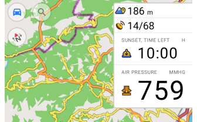

Vous pouvez désormais personnaliser la **taille des widgets** dans les **panneaux gauche et droit**, tout comme dans les panneaux supérieur et inférieur. Cette mise à jour offre une plus grande flexibilité dans la *configuration de l'écran de la carte*. Choisissez parmi les tailles *petite, moyenne* ou *grande* pour personnaliser la disposition de votre écran.

Améliorations clés :

- **Redimensionnement indépendant** pour les panneaux gauche et droit.
- **Mise à l'échelle cohérente des widgets** sur toutes les positions des panneaux.
- **Espace d'écran optimisé** pour la navigation et les statistiques.

Ces options sont accessibles via le menu *Configurer l'écran* pour la gestion des widgets ou en effectuant un *appui long* sur le widget directement sur l'écran de la carte.

En savoir plus :
[Paramètres de widget](https://osmand.net/docs/user/widgets/configure-screen#widget-settings)

## Option de réinitialisation pour le widget Vitesse moyenne

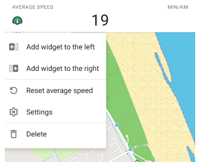

Vous pouvez désormais **réinitialiser la vitesse moyenne** directement depuis le *menu contextuel du widget*. Cette mise à jour ajoute une action **Réinitialiser**, vous permettant de recommencer les mesures sans redémarrer la navigation.

Nouveautés :

- **Option de menu contextuel** pour réinitialiser la vitesse moyenne via un *appui long* sur le widget sur l'écran de la carte.
- **Action de réinitialisation ajoutée aux paramètres du widget** dans le menu *Configurer l'écran* pour un accès rapide.

En savoir plus :
[Widget Vitesse moyenne](https://osmand.net/docs/user/widgets/info-widgets/#average-speed)
[Configurer l'écran](https://osmand.net/docs/user/widgets/configure-screen#widget-settings)

## Mode Exploration : Découvrez les lieux populaires

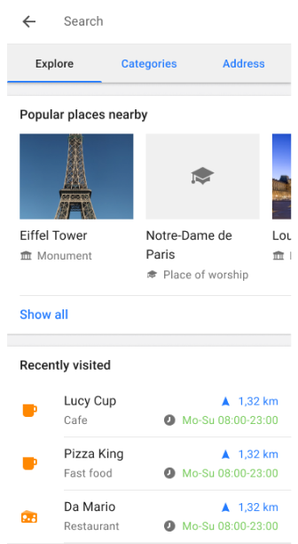

Le mode **Exploration** a été introduit, remplaçant l'onglet *Historique*, ce qui facilite plus que jamais la découverte des *points d'intérêt (POI) les mieux notés*. Vous pouvez désormais explorer les POI à proximité, afficher leurs *photos* sur la carte et accéder facilement à vos lieux *récemment visités* — le tout dans le nouvel onglet **Exploration**. Cette mise à jour rend la recherche de lieux intéressants plus rapide et plus pratique.

Fonctionnalités clés :

- **Explorer les POI à proximité** — Découvrez les *lieux populaires* et les *POI les mieux notés* en fonction de leur *popularité*, avec des *photos* utiles affichées sur la carte et dans les résultats de recherche.
- **Récemment visités** - Accédez à vos *lieux récemment visités (historique)* dans l'onglet **Exploration** pour une navigation rapide vers les lieux précédemment explorés.
- **Intégration de Wikipedia** - Les *entrées Wikipedia* sont combinées avec les détails des POI, vous permettant d'afficher des informations détaillées, y compris des photos et des descriptions pour chaque lieu.

Comment utiliser :
Allez dans *Menu → Rechercher → Explorer* pour commencer à découvrir les POI à proximité et afficher vos lieux récemment visités.

En savoir plus :
[Rechercher tous les lieux](https://osmand.net/docs/user/search/search-all)

## Lieux populaires (Wikipedia)

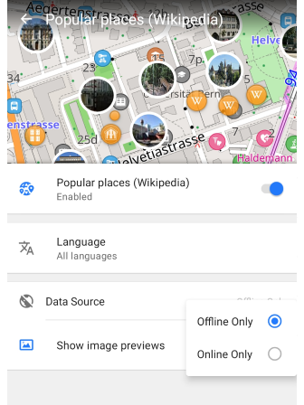

La fonctionnalité **POI Wikipedia** est intégrée sous le nouveau paramètre **Lieux populaires (Wikipedia)** dans le menu Configurer la carte. Cette mise à jour offre des paramètres étendus pour le contenu Wikipedia, vous donnant plus de contrôle sur votre expérience.

Fonctionnalités clés :

- **Aperçus d'images** - Vous pouvez désormais *afficher des photos* pour les POI directement sur la carte avec le paramètre *Afficher les aperçus d'images*.
- **Mode hors ligne et en ligne** - Affichez les *POI Wikipedia* sans télécharger les données cartographiques en utilisant le mode en ligne.

Comment utiliser :

- Activez le **plugin Wikipedia** pour accéder aux données wikidata sur la carte et à ses paramètres dans le menu Configurer la carte.
- Allez dans *Menu → Configurer la carte → Lieux populaires (Wikipedia)* pour ajuster les paramètres des aperçus d'images, des préférences linguistiques et des sources de données.

En savoir plus :
[Plugin Wikipedia](https://osmand.net/docs/user/plugins/wikipedia)

## Tous les itinéraires OSM – Désormais recherchables

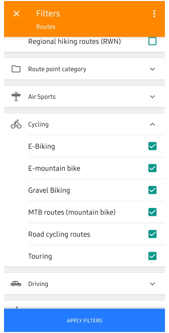  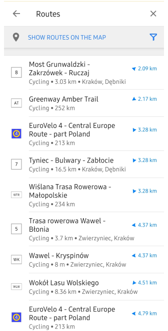  

Vous pouvez désormais **rechercher et naviguer sur tous les itinéraires OSM** directement dans OsmAnd — y compris les itinéraires de **randonnée, de cyclisme, de VTT** et d'autres types d'itinéraires récréatifs. Cette mise à jour améliore considérablement la *découverte d'itinéraires*, vous permettant de trouver et de suivre facilement les chemins existants cartographiés dans OpenStreetMap.

Fonctionnalités clés :

- **Rechercher par type et nom d'itinéraire** — Trouvez des itinéraires par nom ou utilisez le filtre par catégories telles que *Randonnée, Cyclisme, VTT*, et plus encore.
- **Aperçu de l'itinéraire dans le résultat de recherche** — Voir le *nom de l'itinéraire, l'icône, la distance totale* et la *distance jusqu'au point le plus proche* avant de le sélectionner.
- **Démarrer la navigation ou télécharger le GPX** — Appuyez sur un itinéraire pour l'ouvrir et soit démarrer la navigation, soit le *télécharger en tant que fichier GPX*.

Comment utiliser :

- Allez dans *Menu → Rechercher → Catégories → Itinéraires*
- Utilisez les filtres pour affiner les résultats par type d'activité
- Sélectionnez un itinéraire *→* appuyez sur **Naviguer** ou **Télécharger**

Pour plus de détails, visitez :
[Comment utiliser la recherche globale](https://osmand.net/docs/user/search/search-all#how-to-use)
[Aperçu des itinéraires OSM](https://osmand.net/docs/user/map/routes)
[Recherche de POI par catégories](https://osmand.net/docs/user/search/search-poi#poi-search-by-categories)
[Navigation GPX](https://osmand.net/docs/user/navigation/setup/gpx-navigation)

<!--
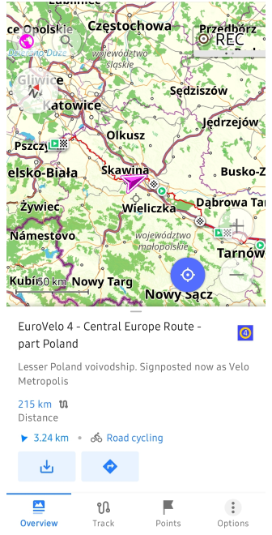 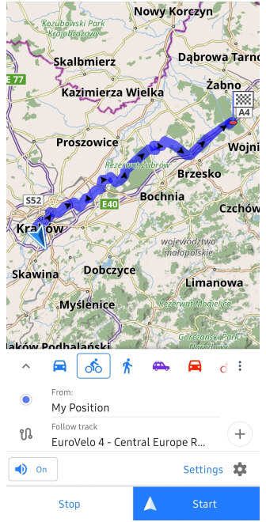
-->

## Informations sur les pistes de ski et les sentiers VTT

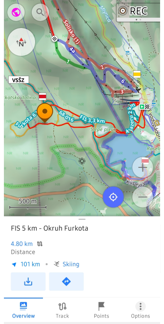  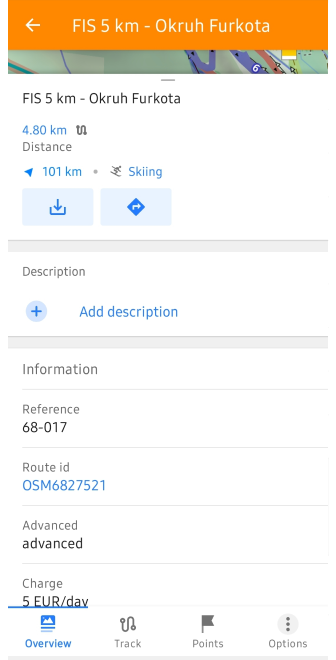

Vous pouvez désormais **sélectionner les pistes de ski et les sentiers VTT directement sur la carte** pour accéder à des informations plus détaillées. Cette fonctionnalité enrichit le menu contextuel avec des données clés telles que le *niveau de difficulté, la longueur du sentier, le type de terrain*, et plus encore, ce qui facilite la planification de vos activités de plein air.

Il suffit d'appuyer sur les *pistes de ski* ou les *itinéraires VTT* pour afficher rapidement les informations et commencer votre aventure.

En savoir plus :
[Menu contextuel de la carte](https://osmand.net/docs/user/map/map-context-menu)

## Superposition de la grille de coordonnées

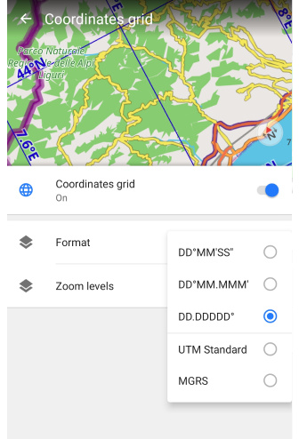

La fonctionnalité **Grille de coordonnées** vous permet de superposer une grille avec des **coordonnées géographiques** sur la carte, fournissant une référence de localisation précise pour la navigation géospatiale.

Fonctionnalités clés :

- **Plusieurs formats de coordonnées** — Choisissez parmi DD°MM′SS″, DD.DDDDD°, DD°MM.MMM′, ou `UTM`.
- **Niveaux de zoom réglables** — Les lignes de la grille apparaissent dynamiquement entre les *niveaux de zoom 2 et 22*, s'adaptant à l'échelle de la carte.
- Utilise les paramètres de coordonnées par défaut de *Menu → Paramètres → Profils d'application → Paramètres généraux → Unités et formats*.

Trouvez-le dans : *Menu → Configurer la carte → Afficher → Grille de coordonnées*

En savoir plus :
[Grille de coordonnées](https://osmand.net/docs/user/map/vector-maps#coordinates-grid)

## Zones d'escalade et falaises

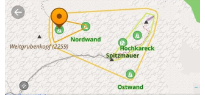

Vous pouvez désormais explorer les **zones d'escalade et les falaises** directement sur la carte. Ces lieux fournissent des détails essentiels tels que l'altitude, le type de roche et le nombre de voies d'escalade.

Utilisez *Rechercher → POI → Escalade* pour trouver rapidement des spots d'escalade et planifier votre approche avec les outils de navigation d'OsmAnd.

Pour plus de détails, visitez :
[Voies d'escalade sur la carte](https://osmand.net/docs/user/map/routes/#climbing-routes)
[Détails de la zone d'escalade et de la falaise](https://osmand.net/docs/user/map/map-context-menu/#climbing-area-and-crag-details)

## Informations détaillées pour les objets linéaires

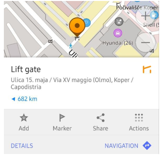

Vous pouvez désormais interagir avec les **barrières, les marches, les portails, les bancs et autres icônes liées à l'accès** directement sur la carte. Un simple appui sur ces objets ouvre un *menu contextuel* avec des informations détaillées, telles que le type d'objet, le nom (si disponible) et l'adresse.

Cette amélioration offre un *accès rapide aux données pertinentes pour la navigation*, vous aidant à mieux comprendre les restrictions de chemin et les attributs de route en un coup d'œil.

Explorez davantage :
[Détails des objets linéaires dans le menu contextuel de la carte](https://osmand.net/docs/user/map/map-context-menu/#linear-object)

## Altitudes des sommets en pieds

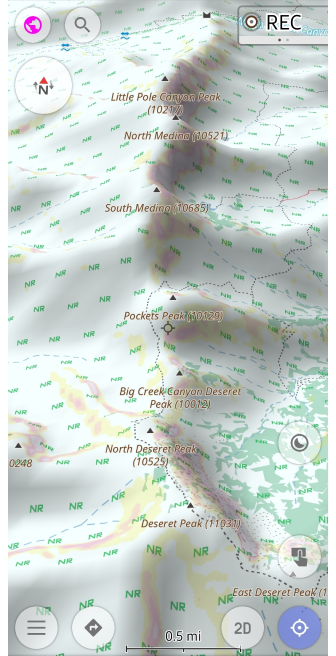

Dans cette mise à jour, les **altitudes des sommets** sont désormais affichées en **pieds** pour les utilisateurs qui préfèrent les *unités impériales*. Cette amélioration garantit que les marqueurs d'altitude sur la carte s'alignent sur votre paramètre d'*unités de longueur* choisi.

Améliorations clés :

- **Affichage de l'altitude en pieds** — Les altitudes des sommets sont désormais également affichées en pieds.
- **Unités dépendantes du profil** — L'affichage des altitudes en *mètres ou en pieds* dépend des paramètres du profil Unités et formats sélectionné.

Cette fonctionnalité permet une vue plus claire et plus précise des altitudes lors de la navigation dans les zones montagneuses, garantissant que les utilisateurs des pays qui utilisent les unités impériales peuvent facilement comprendre les altitudes des sommets.

En savoir plus :
[Menu contextuel de la carte](https://osmand.net/docs/user/map/map-context-menu)

## Les sommets proéminents sont désormais découvrables

Vous pouvez désormais **découvrir les sommets proéminents** directement sur la carte et via la recherche. Cette mise à jour ajoute des [sommets notables](https://en.wikipedia.org/wiki/Ultra-prominent_peak) à la carte de base, vous permettant de trouver facilement leurs noms, altitudes et détails supplémentaires via le menu contextuel de la carte ou la fonctionnalité de recherche.

Il suffit d'appuyer sur les *icônes de sommet* sur la carte, ou d'utiliser *Rechercher → Sommets* pour localiser et explorer rapidement les principaux sommets.

En savoir plus :
[Menu contextuel de la carte](https://osmand.net/docs/user/map/map-context-menu)

## Recherche d'adresses aux États-Unis avec les données TIGER

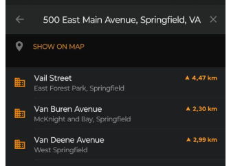

Les données **TIGER** (Topologically Integrated Geographic Encoding and Referencing) pour la recherche d'adresses aux États-Unis sont désormais intégrées dans OsmAnd. Cette mise à jour améliore la précision des *noms de rue, des numéros de maison* et du *formatage des adresses*, et améliore les algorithmes de *géocodage* pour une meilleure reconnaissance des noms de route, des abréviations et des structures postales.

Améliorations clés :

- **Couverture étendue** des adresses rurales et urbaines.
- **Placement plus précis des numéros de maison** pour un meilleur routage.
- **Meilleure gestion des noms de rue alternatifs et des abréviations**.

En savoir plus :
[Recherche d'adresses aux États-Unis et données TIGER – détails techniques](https://docs.osmand.net/docs/technical/algorithms/trace-address-search-issues/#us-address-search-and-tiger-data)
[Recherche d'adresses aux États-Unis – guide de l'utilisateur](https://docs.osmand.net/docs/user/search/search-address/#us-address-search-and-tiger-data)

## Interactions avec les destinations intermédiaires

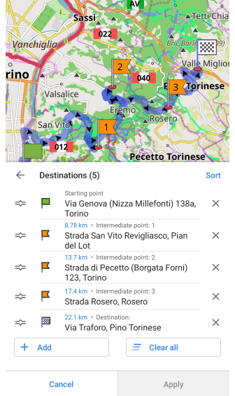

La gestion des **destinations intermédiaires** dans les points de passage est désormais plus pratique. La mise à jour affine le processus de **sélection et de modification**, rendant les ajustements plus rapides et plus intuitifs.

Principaux changements :

- **Sélection simplifiée des points de passage** lors de la modification d'un itinéraire.
- **Comportement cohérent de l'interface utilisateur** pour une meilleure convivialité.
- **Réactivité améliorée** lors de l'interaction avec les points de passage.

En savoir plus :
[Destinations intermédiaires – guide de l'utilisateur](https://osmand.net/docs/user/navigation/setup/route-navigation#intermediate-destinations)

## Paramètres d'apparence flexibles pour les groupes de favoris

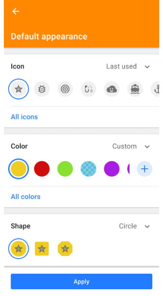

Vous pouvez désormais **personnaliser séparément** l'*icône, la couleur* et la *forme* de chaque groupe de favoris sans réinitialiser tous les attributs. Et ensuite remplacer les paramètres pour les points existants dans le dossier, uniquement les nouveaux favoris, ou appliquer à tous. Cela vous permet d'organiser visuellement vos lieux enregistrés plus précisément.

En savoir plus :
[Modifier l'apparence du groupe](https://osmand.net/docs/user/personal/favorites/#change-group-appearance)

## Améliorations d'Android Auto

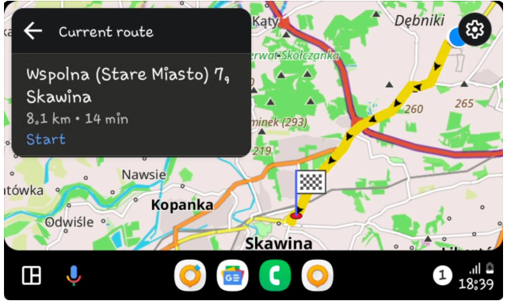

La navigation avec **Android Auto** est désormais plus informative et plus consciente de l'itinéraire, grâce à deux améliorations clés.

Nouveautés :

- **ETA et distance jusqu'au prochain point de passage** — Pendant la navigation active, l'*heure d'arrivée estimée* et la *distance sont désormais affichées pour la prochaine destination intermédiaire*, et pas seulement la destination finale. Cela vous aide à mieux suivre la progression sur les itinéraires à plusieurs arrêts.
- **Nom complet de la destination sur le champ d'aperçu** — Lorsque vous examinez votre itinéraire avant de commencer, le *nom complet de la destination* est désormais visible sur le champ d'aperçu de l'itinéraire, garantissant la clarté lors de la sélection parmi les lieux enregistrés ou recherchés.

Ces mises à jour améliorent la *conscience de la situation et la transparence de l'itinéraire* lors de l'utilisation d'OsmAnd avec Android Auto.

En savoir plus :
[ETA jusqu'au prochain arrêt](https://osmand.net/docs/user/navigation/auto-car#eta-next-stop)
[Démarrer la navigation avec Android Auto](https://osmand.net/docs/user/navigation/auto-car#start-navigation)

## Plugin de suivi des navires AIS

Le plugin **AIS Vessel Tracker** vous permet d'afficher les **positions des navires AIS (Automatic Identification System) en temps réel** sur la carte. Cette fonctionnalité est essentielle pour la navigation maritime, fournissant des détails sur les navires à proximité, y compris leur type, leur vitesse et leur itinéraire.

Fonctionnalités clés :

- **Suivi des navires en direct** — Les navires se mettent à jour en fonction de la *vitesse et du cap en temps réel*.
- **Informations détaillées sur les navires** — Appuyez sur un navire pour voir le *nom du navire, le MMSI, le numéro IMO, le type, les dimensions, le cap, la vitesse et l'ETA*.
- **Sources de données AIS configurables** — Connectez-vous via des *récepteurs AIS externes* ou des *serveurs AIS basés sur le réseau*.
- **Symboles et alertes AIS** — Prend en charge les *icônes de navires AIS standard, les messages de sécurité et les indicateurs de manœuvre*.

Trouvez-le dans :
*Menu → Plugins → AIS Vessel Tracker*

En savoir plus :
[Plugin AIS Vessel Tracker](https://osmand.net/docs/user/plugins/ais-tracker)

## Mises à jour facultatives

- Ajout de la [synthèse vocale hébraïque](https://osmand.net/docs/user/navigation/guidance/voice-navigation#voice-prompt-language) pour la navigation.
- Problèmes corrigés :
  - Les langues [serbe latin](https://github.com/osmandapp/OsmAnd/issues/21480) (latin pour la Serbie, la Bosnie-Herzégovine et le Monténégro) fonctionnent désormais.
  - Lors de l'utilisation de [Tout télécharger](https://github.com/osmandapp/OsmAnd/issues/21741) dans OsmAnd Cloud, la progression ne se terminait pas à 100 %.
  - OsmAnd Cloud - Les pistes [Synchroniser maintenant](https://github.com/osmandapp/OsmAnd/issues/22017) ne fonctionnaient pas.
  - Les boutons de niveau de zoom et de ma position [étaient masqués](https://github.com/osmandapp/OsmAnd/issues/21369) une fois le menu contextuel ouvert.
  - Action rapide : l'option [Ajouter un point de passage](https://github.com/osmandapp/OsmAnd/issues/20102) ne permettait pas la sélection de la position.
  - [Plantages](https://github.com/osmandapp/OsmAnd/issues/22033) lors de l'appui sur un POI avec une image.
  - [Comportement incorrect d'Éviter les routes](https://github.com/osmandapp/OsmAnd/issues/21828) après la mise à jour de la carte.
  - Dossier intelligent : corrections de bugs et améliorations de l'interface utilisateur.
  - Bug avec la [projection directe vers un point](https://github.com/osmandapp/OsmAnd/issues/21588).

