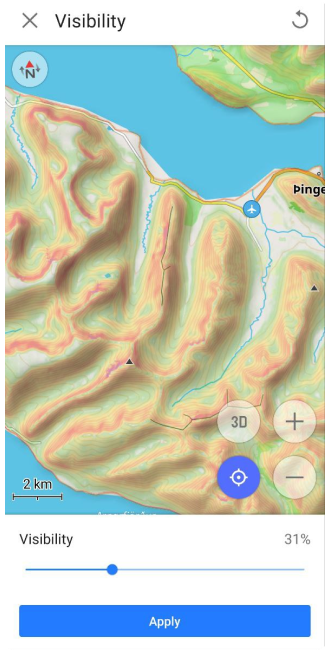
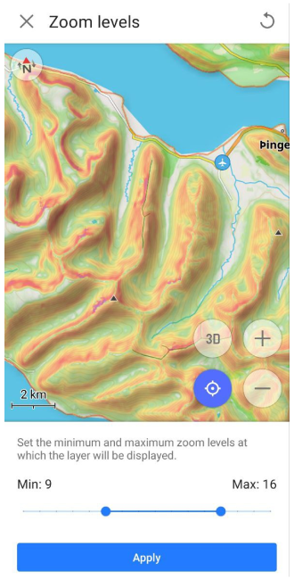

import Tabs from '@theme/Tabs';
import TabItem from '@theme/TabItem';
import AndroidStore from '@site/src/components/buttons/AndroidStore.mdx';
import AppleStore from '@site/src/components/buttons/AppleStore.mdx';
import LinksTelegram from '@site/src/components/_linksTelegram.mdx';
import LinksSocial from '@site/src/components/_linksSocialNetworks.mdx';
import Translate from '@site/src/components/Translate.js';
import InfoIncompleteArticle from '@site/src/components/_infoIncompleteArticle.mdx';
import ProFeature from '@site/src/components/buttons/ProFeature.mdx';
import InfoAndroidOnly from '@site/src/components/_infoAndroidOnly.mdx';

## Visão geral {#overview}

:::tip Compra
O plugin Topografia é um [recurso pago](../purchases/index.md).  
:::

A topografia é uma característica importante da cartografia que fornece informações para avaliar visualmente o relevo do terreno.
Informações topográficas como [Curvas de nível](#contour-lines), [Terreno](#terrain) (*Hillshade* e *Declive*), e [Relevo 3D](#3d-relief) ajudam a fazer uma avaliação visual da configuração do terreno, observando elevação, relevo, extremos, inclinação ou pontos de igual altura.

Cada recurso fornecido por este plugin é uma camada de mapa independente que, quando ativada, pode ser exibida acima ou abaixo da fonte principal do mapa, dependendo das [configurações](../map/raster-maps.md#overlay).  

O plugin Topografia fornece acesso aos seguintes tipos de mapa:  

- [Curvas de nível](#contour-lines). Este é um [mapa vetorial](../map/vector-maps.md) representado em [**metros** ou **pés**](#contour-lines-meters-or-feet). As curvas de nível mostram os níveis de elevação e ajudam a visualizar o terreno.
- [Hillshade](#hillshade-slope-and-altitude-layers). Tipos de mapas com sombreamento de colinas e declives tornam o relevo mais visível e ajudam a interpretar visualmente o terreno.
- [Declive](#hillshade-slope-and-altitude-layers). Camada [Raster](../map/raster-maps.md) que fornece informações sobre a inclinação dos declives, o que pode ser importante para o planejamento de rotas e segurança.
- [Relevo 3D](#3d-relief). É um [mapa vetorial](../map/vector-maps.md) que fornece uma representação tridimensional do terreno, disponível apenas com a [assinatura OsmAnd Pro](../purchases/index.md).

<Tabs groupId="operating-systems" queryString="current-os">

<TabItem value="android" label="Android">

| Curvas de Nível | Hillshade | Declive |
|:---|:---|:---|
|  |  |  |

</TabItem>

<TabItem value="ios" label="iOS">

| Curvas de Nível | Hillshade | Declive |
|:---|:---|:---|
|  |  |  |

</TabItem>

</Tabs>

### Licença para dados DEM usados pelo OsmAnd para detecção de terreno {#license-for-dem-data-used-by-osmand-for-terrain-detection}

Os dados de altitude no mapa (entre 70 graus de latitude norte e 70 graus de latitude sul) foram obtidos de medições realizadas como parte da *Shuttle Radar Topography Mission (SRTM)*. Ele utilizou o *Advanced Spaceborne Thermal Emission and Reflection Radiometer (ASTER)*, a principal ferramenta de imagem no *Earth Observation System da NASA*.  
Para informações completas, consulte a [Licença](https://github.com/osmandapp/OsmAnd/blob/master/LICENSE#L146).

DEM (DSM) data

   - <a href="https://www.eorc.jaxa.jp/ALOS/en/index_e.htm">ALOS DEM</a>. Os dados originais usados para este produto foram fornecidos pela AW3D da JAXA. 
	- <a href="http://hydro.iis.u-tokyo.ac.jp/~yamadai/MERIT_DEM">MERIT DEM.</a> 
	- <a href="https://doi.org/10.7910/DVN/OHHUKH">ArcticDEM</a>: Porter, Claire; Morin, Paul; Howat, Ian; Noh, Myoung-Jon; Bates, Brian; Peterman, Kenneth; Keesey, Scott; Schlenk, Matthew; Gardiner, Judith; Tomko, Karen; Willis, Michael; Kelleher, Cole; Cloutier, Michael; Husby, Eric; Foga, Steven; Nakamura, Hitomi; Platson, Melisa; Wethington, Michael, Jr.; Williamson, Cathleen; Bauer, Gregory; Enos, Jeremy; Arnold, Galen; Kramer, William; Becker, Peter; Doshi, Abhijit; D’Souza, Cristelle; Cummins, Pat; Laurier, Fabien; Bojesen, Mikkel, 2018, “ArcticDEM”, Harvard Dataverse, V1. 
	- <a href="https://sonny.4lima.de">Sonny's LiDAR Digital Terrain Models of Europe</a> (DTM).

## Parâmetros de Configuração Necessários {#required-setup-parameters}

Para exibir dados de **Curvas de Nível** e **Terreno (Hillshade, Declive)** no mapa:

1. **Compra**: [Plano de compra OsmAnd+, OsmAnd Maps+ ou OsmAnd Pro](../plugins/index.md#purchase)
2. [Ative](../plugins/index.md#enable--disable) o plugin Topografia na seção Plugins do *Menu Principal*.
3. [Baixe](#download-maps): Curvas de nível, Hillshade, Declive ou mapa de Terreno (3D).
4. **Ative e ajuste**: Curvas de nível, Hillshade ou Declive para a visualização do mapa.
5. Você também pode assistir ao [tutorial do YouTube](https://www.youtube.com/watch?v=z8kp_M3FKoc&feature=emb_logo&ab_channel=BartEisenberg).  

Para exibir [**Relevo 3D**](#3d-relief) você precisa adquirir o plano *OsmAnd Pro*, incluindo acesso ao plugin Topografia.

## Baixar Mapas {#download-maps}

Para começar a trabalhar com a funcionalidade do plugin, você precisa baixar os mapas de seu interesse. Alguns mapas, como as Curvas de Nível para regiões montanhosas, podem ser bastante grandes, excedendo 2 GB, e podem não ser suportados em dispositivos desatualizados.

Para um trabalho estável e para economizar recursos, você pode baixar um mapa não do país inteiro, mas de suas regiões específicas, se tais regiões forem oferecidas no aplicativo. As informações sobre o tamanho de cada tipo de mapa são listadas sob seu nome.

### Mapas de Relevo 3D {#3d-relief-maps}

<Tabs groupId="operating-systems" queryString="current-os">

<TabItem value="android" label="Android">

Vá para: *<Translate android="true" ids="shared_string_menu,maps_and_resources,regions"/>*

  

</TabItem>  

<TabItem value="ios" label="iOS">

Vá para: *<Translate ios="true" ids="shared_string_menu,res_mapsres,res_worldwide"/>*

 

</TabItem>

</Tabs>

Você precisa baixar mapas de **Terreno (3D)** para exibir Hillshade, Declive e Relevo 3D. Depois de baixar os mapas, você pode exibir **Curvas de Nível** e **Terreno** usando a seção [Configurar mapa](../map/configure-map-menu.md) do *Menu Principal*.

Se o mapa exibido na tela não for baixado, então em *Menu → Configurar mapa → Seção Topografia → Terreno* na parte inferior da lista de recursos, a seção *Baixar mapas* com mapas adicionais sugeridos será exibida.

### Curvas de Nível (Metros ou Pés) {#contour-lines-meters-or-feet}

<Tabs groupId="operating-systems" queryString="current-os">

<TabItem value="android" label="Android">

</TabItem>

<TabItem value="ios" label="iOS">  

</TabItem>

</Tabs>  

Para [**Curvas de Nível**](#contour-lines), você precisa determinar em quais [unidades](../personal/profiles.md#units--formats) (metros ou pés) elas serão exibidas no mapa e baixar a versão apropriada do mapa para o seu dispositivo.

**As opções de unidade não são intercambiáveis**, portanto, se você precisar mudar de metros para pés ou vice-versa, será necessário desinstalar a versão anterior do mapa de Curvas de Nível para baixar a nova versão.

## Curvas de Nível {#contour-lines}

:::tip Compra
Curvas de nível é um [recurso pago](../purchases/index.md).  
:::

<Tabs groupId="operating-systems" queryString="current-os">

<TabItem value="android" label="Android">

Vá para: *<Translate android="true" ids="shared_string_menu,configure_map,srtm_plugin_name,download_srtm_maps"/>*

</TabItem>

<TabItem value="ios" label="iOS">

Vá para: *<Translate ios="true" ids="shared_string_menu,configure_map,srtm_plugin_name"/> → Curvas de Nível*

</TabItem>

</Tabs>  

[Curvas de nível](../map/vector-maps.md#-contour-lines) são uma representação gráfica de elevações em um mapa e estão disponíveis como mapas vetoriais. Elas formam linhas correspondentes a pontos com a mesma altitude, que formam contornos que permitem determinar em qual direção e quanto a superfície se inclina.

Ao usar o [motor de renderização de mapas](../personal/global-settings.md#map-rendering-engine):

- **Versão 2 (OpenGL)**. As curvas de nível são suportadas tanto na visualização 3D quanto no modo de relevo 3D.
- **Versão 1**. As curvas de nível não são suportadas ao usar mapas de mosaico obtidos da Internet.

**Configurações de aparência**:

- *<Translate android="true" ids="download_srtm_maps"/>*. Ativa ou desativa as curvas de nível.
- *<Translate android="true" ids="show_from_zoom_level"/>*. Define os [níveis de zoom](../map/interact-with-map.md#my-position-and-zoom) nos quais as curvas de nível são visíveis.
- *<Translate android="true" ids="srtm_color_scheme"/>*. Escolha a cor para exibir as curvas de nível.
- *<Translate android="true" ids="rendering_attr_contourWidth_name"/>*. Ajusta a largura das curvas de nível.
- *<Translate android="true" ids="rendering_attr_contourDensity_name"/>*. Seleciona a densidade das curvas de nível (Baixa, Média, Alta). Densidades mais altas podem afetar a velocidade de carregamento.
- *<Translate android="true" ids="maps_and_resources"/>*. Visualize e baixe mapas de curvas de nível para a região atual e áreas próximas.

## Terreno {#terrain}

:::tip Compra
Terreno é um [recurso pago](../purchases/index.md).  
:::

<Tabs groupId="operating-systems" queryString="current-os">

<TabItem value="android" label="Android">

Vá para: *<Translate android="true" ids="shared_string_menu,configure_map,srtm_plugin_name,shared_string_terrain"/>*

  

</TabItem>

<TabItem value="ios" label="iOS">  

Vá para: *<Translate ios="true" ids="shared_string_menu,configure_map,srtm_plugin_name,shared_string_terrain"/>*

   

</TabItem>

</Tabs>  

A opção **Terreno** ativa e permite personalizar três recursos, como *Hillshade*, *Declive* e *Altitude*.  
Recursos específicos:  

- Apenas uma opção pode ser ativada ao mesmo tempo, seja Hillshade, Declive ou Altitude.
- Se você não vir nenhuma alteração após baixar e ativar o mapa correspondente, é recomendável reiniciar o aplicativo.

O menu **Terreno** inclui a seleção de [esquema de cores](#default-color-scheme) com a opção de [modificá-lo](#modify-color-scheme) (para [assinantes Pro](../../user/purchases/index.md)), a capacidade de alterar a transparência da camada no mapa ([visibilidade](#visibility)) e selecionar o [nível de zoom](#zoom-levels) para sua exibição, informações sobre o tamanho dos [dados em cache](#cache-size) e uma lista de [mapas](../../user/personal/maps-resources.md) necessários para exibir a camada.

## Camadas de Hillshade, Declive e Altitude {#hillshade-slope-and-altitude-layers}

| Hillshade | Declive | Altitude |
| ------ | ------- | ------- |
|  |  |  |

**Hillshade** é baseado na simulação da iluminação da superfície usando dados de terreno. Este método envolve a criação de sombras e realces com base no ângulo da superfície em relação à fonte de luz. Como resultado, você vê colinas, vales e outros detalhes naturais do terreno no mapa.  

**Declive** determina o ângulo de inclinação da superfície com base nos dados de elevação dos pontos no mapa. Os cálculos do ângulo de inclinação são realizados considerando as mudanças na elevação e as distâncias entre os pontos, e representando essa mudança como um ângulo de inclinação.  

**Altitude** representa a elevação dos pontos no mapa em relação ao nível do mar. Ajuda a entender como o terreno muda em altura. Este recurso é particularmente útil para atividades como caminhadas ou ciclismo de montanha, onde conhecer a altitude pode ajudar no planejamento de rotas e no gerenciamento do esforço físico. Os dados de altitude são derivados de modelos de elevação e fornecem uma visão clara dos pontos altos e baixos, tornando mais fácil avaliar a dificuldade de uma rota ou identificar picos e vales ao longo de sua jornada.

Os mapas raster de **Hillshade**, **Declive** e **Altitude** são criados com base em dados de terreno raster, como Modelos Digitais de Elevação (DEM).

**Uso:**

- *Navegação.* Ajuda a identificar declives acentuados, tanto em descida quanto em subida, o que pode ser crucial para uma navegação segura.
- *Planejar rotas.* Ajuda a escolher as rotas mais adequadas, considerando o terreno.
- *Estimativa de terreno.* É conveniente para visualizar a paisagem, especialmente se você estiver caminhando ou andando de bicicleta.

### Esquema de Cores Padrão {#default-color-scheme}

| Hillshade | Declive | Altitude |
| ------ | ------- | ------- |
|||  |

- *Hillshade* usa tons escuros para mostrar declives, picos e terras baixas. O Sol Virtual tem um azimute (direção) fixo de 315 graus.

- *Declive* usa cores para visualizar a inclinação do terreno. Você pode ler mais sobre isso [aqui](https://en.wikipedia.org/wiki/Grade_(slope)). Cada cor corresponde a um ângulo de desvio da horizontal. Um esquema de cores adicional para *Declive*, ***Avalanche***, está disponível no menu **Modificar**.

- *Altitude*. O mapa de altitude colore cada pixel de acordo com a altura do mapa calculada usando o gradiente de um esquema de cores definido. Geralmente, os esquemas de altitude são muito dependentes da localização. Em áreas montanhosas, você preferiria distribuir as cores para uma faixa de altitude mais ampla e em áreas planas, você selecionaria um esquema de cores com uma pequena faixa entre a altitude mínima/máxima.

### Modificar Esquema de Cores {#modify-color-scheme}

:::info Recurso Pro
*[Modificar Esquema de Cores](../../user/personal/color-palette-schemes.md#terrain)* é um recurso pago do [**OsmAnd Pro**](../purchases/index.md) <ProFeature />.
:::

<Tabs groupId="operating-systems" queryString="current-os">

<TabItem value="android" label="Android">

   

O recurso *Modificar Esquema de Cores* permite selecionar um esquema de cores:

- De uma [lista predefinida](#default-color-scheme).
- De arquivos de paleta de cores que você criou em seu computador. Arquivos personalizados podem ser adicionados ao OsmAnd usando a [ferramenta de importação/exportação](../personal/import-export.md).
- De paletas criadas ou editadas diretamente no aplicativo.

Paletas personalizadas são baseadas em escalas de cores, onde cada cor corresponde a um valor específico de dados de terreno como *Altitude* ou *Declive*. 
Você pode:

- definir passos de valor (níveis de altitude ou porcentagens de declive);
- atribuir cores a cada passo;
- adicionar ou remover passos para ajustar as escalas de cores.

**Nota:** Hillshade usa um algoritmo de sombreamento fixo e não suporta paletas de cores personalizadas.

Para personalização avançada de paleta usando arquivos de paleta, consulte o artigo [Esquemas de Cores](../personal/color-palette-schemes.md#palette-modify).

</TabItem>

<TabItem value="ios" label="iOS">  

   

O recurso *Modificar Esquema de Cores* permite selecionar um esquema de cores:

- De uma [lista predefinida](#default-color-scheme).
- De arquivos de paleta de cores que você criou em seu computador. Arquivos personalizados podem ser adicionados ao OsmAnd usando a [ferramenta de importação/exportação](../personal/import-export.md).

Você pode [editar essas paletas](../personal/color-palette-schemes.md#palette-modify) para personalizar a aparência de mapas e rotas.

</TabItem>

</Tabs>

### Visibilidade {#visibility}

| Visibilidade 31% | Visibilidade 74% |
| ------ | ------- |
|  |  |

A função *Visibilidade* é usada para ajustar a transparência das sombras para Hillshade e as cores usadas para representar o ângulo no parâmetro Declive.

### Níveis de Zoom {#zoom-levels}

  

A função *Níveis de Zoom* permite definir os valores mínimo e máximo dos níveis de zoom do mapa, variando de 4 a 19, nos quais as camadas do mapa Hillshade ou Declive serão exibidas.

### Tamanho do Cache {#cache-size}

**Tamanho do cache** é uma seção informativa que exibe a quantidade de memória em seu dispositivo atualmente usada para dados de *Terreno*. Cada vez que você visualiza informações de *Hillshade* ou *Declive* em um mapa, todos esses dados são temporariamente armazenados em cache para acesso rápido e uso posterior, evitando carga adicional no processador do seu dispositivo.  

**Limpar o cache** às vezes é necessário para liberar espaço em seu dispositivo ou para resolver possíveis problemas de desempenho. Para limpar o cache, você precisa ir para as *Configurações do Sistema* do dispositivo, então o caminho pode ser o seguinte: *Aplicativos → OsmAnd → Armazenamento → Limpar cache*.

### Motor de Renderização (Android) {#rendering-engine-android}

**Hillshade** e **Declive** são exibidos e ajustados em qualquer [motor de renderização de mapas](../personal/global-settings.md#map-rendering-engine) selecionado.

1. Se você usa o **motor de renderização de mapas Versão 1**, você precisa usar o [download](../start-with/download-maps.md) normal de mapas raster Hillshade e Declive.

2. Se você usa o **motor de renderização de mapas Versão 2 (OpenGL)**:
    - Você pode continuar a usar o tipo de download normal de mapas raster Hillshade e Declive. No entanto, para fazer isso, você precisará ativar o [plugin de desenvolvimento OsmAnd](../plugins/development.md) e habilitar a configuração [Usar formato SQLite raster para hillshade e declive](../plugins/development.md#terrain).

    - Alternativamente, você pode usar o download do [Mapa de Terreno (3D)](../personal/maps-resources.md#paid-map-content). Isso economiza espaço de memória em seu dispositivo, e os efeitos Hillshade, Declive e Relevo 3D serão gerados a partir deles usando seu dispositivo.

### Ações Rápidas {#quick-actions}

Você pode usar os botões de *Ação Rápida* na tela do mapa para alternar a visibilidade das camadas de [Curvas de Nível](#contour-lines), [Terreno](#terrain) e o [esquema de cores do Terreno](../../user/personal/color-palette-schemes.md#quick-actions). Dependendo da camada selecionada no menu Configurar mapa, atribuir uma ação de *Terreno* ao botão exibirá *Hillshade*, *Declive* ou *Altitude*.  

As principais configurações para *Mostrar ou Ocultar tipos de mapa* estão na seção Topografia do menu Configurar Mapa. No artigo [Ação Rápida](../widgets/quick-action.md#configure-map), você pode encontrar uma lista de camadas disponíveis para exibição. Se você precisar de acesso rápido a esta configuração de mapa, use a ferramenta *Botão Personalizado*.

- Vá para [Adicionar ação](../widgets/quick-action.md#custom-buttons): *Menu → Configurar tela → Botões personalizados → Ação rápida → Adicionar ação → Configurar mapa*.
- Adicione um ou mais botões QA para alterar a visibilidade de uma camada topográfica específica.

## Edifícios 3D {#3d-buildings}

<InfoAndroidOnly/> 

Vá para: *<Translate android="true" ids="shared_string_menu,configure_map,srtm_plugin_name"/> → Edifícios 3D* 

  

O recurso **Edifícios 3D** exibe edifícios como modelos 3D volumétricos em vez de formas planas. Os edifícios são gerados a partir de [dados OpenStreetMap](https://wiki.openstreetmap.org/wiki/Simple_3D_Buildings), usando informações de altura de tags como `height` e `building:levels` quando disponíveis. Edifícios 3D são exibidos apenas em níveis de zoom mais altos (visão da cidade/rua), onde edifícios individuais podem ser exibidos.  

Use o alternador principal para ativar ou desativar a renderização 3D de edifícios. Quando ativado, a configuração também exibe o [Nível de detalhe](#performance) atual (Baixo ou Alto) sob o alternador principal. Para visualizar edifícios em 3D, incline o mapa colocando dois dedos na tela e deslizando para cima. Nesta visão, os edifícios podem cobrir parcialmente estradas ou rótulos do mapa dependendo da configuração de visibilidade.

Esta opção está disponível apenas quando o plugin Topografia está ativado.  
Vá para: *<Translate android="true" ids="shared_string_menu,plugin_settings,srtm_plugin_name"/>*

As configurações de edifícios 3D incluem controles que afetam a aparência, o desempenho e a iluminação dos edifícios 3D.

### Aparência {#appearance}

Os controles de **Aparência** determinam como os edifícios 3D aparecem no mapa. Inclui duas configurações: Cor e Visibilidade. 

**Cor** permite alterar a cor do edifício. Quando você toca em Cor, o OsmAnd abre uma tela de visualização separada onde você pode ver o mapa enquanto ajusta a configuração. A tela de visualização mostra um mapa ao vivo para que você possa ver imediatamente como a cor selecionada afeta os edifícios.
- **Estilo do mapa** — usa a cor padrão do edifício do estilo de mapa atualmente selecionado.
- **Personalizado** — permite definir uma cor de edifício personalizada separadamente para o modo Dia / Noite.

:::tip Compra
Personalização de Cor de Edifícios 3D é um [recurso pago](../purchases/index.md).  
:::

Se as cores personalizadas não forem compradas, você verá um estado vazio com uma descrição curta e um botão Obter. Se Personalizado estiver disponível, você pode alternar entre Dia e Noite, escolher uma cor da paleta (ou abrir Todas as cores), depois tocar em Aplicar.

**Visibilidade** controla a opacidade (transparência) dos edifícios 3D. Use o controle deslizante para definir a visibilidade como uma porcentagem. O controle deslizante permite valores de 10% a 100%, com 50% usado por padrão. Valores mais baixos tornam os edifícios mais transparentes e ajudam as estradas/rótulos a permanecerem legíveis. Valores mais altos tornam os edifícios mais sólidos e visualmente dominantes. Tocar em Visibilidade também abre uma tela de visualização separada com o controle deslizante.

Nas telas de visualização (Cor / Visibilidade), você pode usar Redefinir para o padrão na barra do aplicativo para restaurar o valor padrão.

### Desempenho {#performance}

Os controles de **Desempenho** determinam como os edifícios 3D são renderizados. Inclui duas configurações: Nível de detalhe e Distância de visualização.

**Nível de detalhe** determina a complexidade da geometria do edifício 3D:
- Baixo (padrão) — geometria mais simples.
- Alto — geometria mais detalhada.

**Distância de visualização** controla quão longe da câmera os edifícios 3D são renderizados:
- Próximo (padrão) — renderiza edifícios mais próximos de você.
- Longe — renderiza edifícios de uma distância maior.

Ambas as opções de desempenho usam um alternador de duas posições diretamente na tela de configurações de edifícios 3D.

**Nota:** Usar *Alto detalhe* e *Distância de visualização longe* melhora a aparência visual, mas pode impactar o desempenho e aumentar o uso da bateria.

### Sol {#sun}

A configuração **Sol** controla a direção da iluminação usada para renderizar edifícios 3D. Afeta como a luz e as sombras aparecem nos edifícios na visão 3D. Quando você toca em Sol, o OsmAnd abre uma tela de visualização onde você pode ajustar a iluminação usando dois controles deslizantes:

- Azimute — controla a direção horizontal da fonte de luz (a direção do compasso do sol).
- Altitude — controla a altura do sol acima do horizonte.

Alterar esses parâmetros modifica como as sombras caem nos edifícios e pode melhorar a percepção visual das formas dos edifícios na visão 3D. Toque em Aplicar para confirmar os parâmetros de iluminação selecionados.

## Relevo 3D {#3d-relief}

:::info Recurso Pro
Relevo 3D é um recurso pago do [**OsmAnd Pro**](../purchases/index.md) <ProFeature />.
:::

<Tabs groupId="operating-systems" queryString="current-os">

<TabItem value="android" label="Android">

Vá para: *<Translate android="true" ids="shared_string_menu,configure_map,srtm_plugin_name,relief_3d"/>*

</TabItem>

<TabItem value="ios" label="iOS">  

Vá para: *<Translate ios="true" ids="shared_string_menu,configure_map,srtm_plugin_name,shared_string_terrain,shared_string_relief_3d"/>*

</TabItem>

</Tabs>  

O recurso Relevo 3D produz um relevo elevado e fornece uma representação tridimensional da paisagem. O Relevo 3D funciona offline e pode ser usado com [mapas vetoriais OsmAnd](../map/vector-maps.md) ou quaisquer [mapas raster](../map/raster-maps.md#layers) como [Fonte do Mapa](../map/raster-maps.md#main) ou como [Camada de Sobreposição/Subjacência](../map/raster-maps.md#overlay).

***Como exibir o Relevo 3D no mapa.***

- Adquira a assinatura **OsmAnd Pro** para [iOS](../purchases/ios.md#pro-features) ou [Android](../purchases/android.md#pro-features).

- Vá para [*<Translate Android="true" ids="shared_string_menu,configure_map"/>*](../map/configure-map-menu.md):
    - **Android**: role até a seção *<Translate android="true" ids="srtm_plugin_name"/> → <Translate android="true" ids="relief_3d"/>*.
    - **iOS**: role até a seção *<Translate ios="true" ids="srtm_plugin_name"/> → <Translate ios="true" ids="shared_string_terrain,shared_string_relief_3d"/>*.

- Baixe o [mapa de Terreno (3D)](#3d-relief-maps) das regiões, se necessário.

<Tabs groupId="operating-systems" queryString="current-os">

<TabItem value="android" label="Android">

| Camada de mapa vetorial | Camada de mapa raster |
| ------ | ------- |
|  |  |

</TabItem>  

<TabItem value="ios" label="iOS">

| Camada de mapa vetorial | Camada de mapa raster |
| ------ | ------- |
|   |  |

</TabItem>

</Tabs>

### Exagero Vertical {#vertical-exaggeration}

<Tabs groupId="operating-systems" queryString="current-os">

<TabItem value="android" label="Android">

Vá para: *<Translate android="true" ids="shared_string_menu,configure_map,srtm_plugin_name,relief_3d"/> → Exagero vertical*

</TabItem>  

<TabItem value="ios" label="iOS">

Vá para: *<Translate ios="true" ids="shared_string_menu,configure_map,srtm_plugin_name,shared_string_terrain,shared_string_relief_3d"/> → Exagero vertical*

</TabItem>

</Tabs>

*Exagero vertical* é um coeficiente especial para *relevo 3D*. Você pode alterar a escala (*Exagero vertical*) de x1 para x3. Este recurso permite visualizar contornos de terreno mais suaves com detalhes aumentados.

### Hillshade e Relevo 3D {#hillshade-and-3d-relief}

| Hillshade | Relevo 3D |
|--------|---------|
|  |  |

**Hillshade** é um tipo de mapa que exibe o terreno usando sombras, criando uma representação visual da inclinação e forma da superfície da terra.  
**Relevo 3D** é um recurso que adiciona efeitos tridimensionais ao mapa.  

Se você **desativar** *Hillshade* e **ativar** *Relevo 3D*, as sombras do relevo ainda serão visíveis porque *Hillshade* e *Relevo 3D* são duas maneiras diferentes de visualizar um mapa. *Hillshade* cria sombras com base no terreno e as adiciona ao mapa, enquanto *Relevo 3D* modela elementos 3D para mostrar a profundidade e a forma do terreno, e as sombras fazem parte da visualização. Esses recursos podem funcionar em paralelo, e desativar *Hillshade* não afeta como os efeitos 3D são exibidos.  

Quando **Hillshade** está **ativado**, uma imagem com sombras de relevo aparece mais detalhada, escura e escalonada do que uma imagem de *Relevo 3D*. A explicação é que *Hillshade* enfatiza os gradientes e contrastes do terreno, criando uma imagem mais nítida e detalhada. O recurso *Relevo 3D* confere ao mapa uma aparência mais fluida e suavizada, suavizando o terreno e potencialmente reduzindo a visibilidade de alguns detalhes mais finos.

## Combinar Tipos de Camada {#combine-layer-types}

<Tabs groupId="operating-systems" queryString="current-os">

<TabItem value="android" label="Android">

 

</TabItem>  

<TabItem value="ios" label="iOS">

 

</TabItem>

</Tabs>

O OsmAnd permite combinar vários tipos de camadas de mapa para uma exibição mais visual.

- A combinação de **Curvas de Nível** e **Hillshade** é ideal para estimar visualmente e numericamente a inclinação das encostas das montanhas.
- A combinação das camadas de **Curvas de Nível** e **Declive** é melhor para estimar a inclinação e encontrar pontos com a mesma altura.
- A combinação das camadas de **Relevo 3D** e **Hillshade** permite obter uma representação mais realista e visual do terreno, relevo e detalhes da paisagem. Esta combinação é especialmente adequada para terrenos montanhosos e ondulados.

## Artigos Relacionados {#related-articles}

- [Interagir com o Mapa](../../user/map/interact-with-map.md)
- [Configurações Globais](../../user/personal/global-settings.md)
- [Mapas Vetoriais (Estilos de Mapa)](../../user/map/vector-maps.md)

### Problemas Comuns e Soluções {#common-issues-and-solutions}

<!-- Troubleshooting Steps-->

1. Como restaurar a compra do plugin Topografia (anteriormente Curvas de Nível). [(verificar)](../troubleshooting/purchases_payments.md#how-to-restore-the-topography-formerly-contour-lines-plugin-purchase).
2. Curvas de Nível, dados de Elevação ou Relevo 3D não são exibidos. [(verificar)](../troubleshooting/maps-data#contour-lines-elevation-data-or-3d-relief-are-not-displayed)
3. O mapa muda automaticamente para o modo 3D durante a navegação:  
    - Certifique-se de que o botão **Modo 3D** esteja desativado em **Menu → Configurar Tela → Botões → Botões Padrão**.  
    - Verifique se algum recurso de Terreno está ativado em **Menu → Configurar Mapa → Topografia** que possa acionar um efeito 3D.