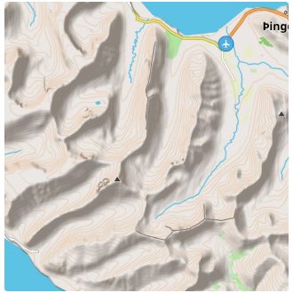
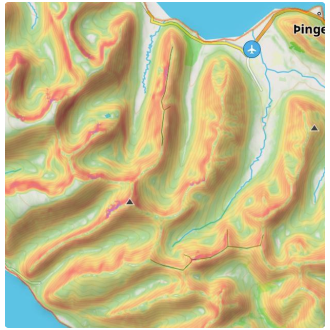

import Tabs from '@theme/Tabs';
import TabItem from '@theme/TabItem';
import AndroidStore from '@site/src/components/buttons/AndroidStore.mdx';
import AppleStore from '@site/src/components/buttons/AppleStore.mdx';
import LinksTelegram from '@site/src/components/_linksTelegram.mdx';
import LinksSocial from '@site/src/components/_linksSocialNetworks.mdx';
import Translate from '@site/src/components/Translate.js';
import InfoIncompleteArticle from '@site/src/components/_infoIncompleteArticle.mdx';
import ProFeature from '@site/src/components/buttons/ProFeature.mdx';
import InfoAndroidOnly from '@site/src/components/_infoAndroidOnly.mdx';

## Огляд {#overview}

:::tip Придбання
Плагін "Топографія" — це [платна функція](../purchases/index.md).  
:::

Топографія — це важлива функція картографії, яка надає інформацію для візуальної оцінки рельєфу місцевості.
Топографічна інформація, така як [лінії контуру](#contour-lines), [рельєф](#terrain) (*Відтінення пагорбів* та *Ухил*), а також [3D-рельєф](#3d-relief), допомагає візуально оцінити рельєф місцевості, бачачи висоту, рельєф, екстремуми, крутизну або точки однакової висоти.

Кожна функція, що надається цим плагіном, є незалежним шаром карти, який, коли увімкнено, може відображатися над або під основним джерелом карти залежно від [налаштувань](../map/raster-maps.md#overlay).  

Плагін "Топографія" надає доступ до наступних типів карт:  

- [Лінії контуру](#contour-lines). Це [векторна карта](../map/vector-maps.md), представлена в [**метрах** або **футах**](#contour-lines-meters-or-feet). Лінії контуру показують рівні висот і допомагають візуалізувати рельєф.
- [Відтінення пагорбів](#hillshade-slope-and-altitude-layers). Типи карт із затіненням пагорбів та схилів роблять рельєф більш видимим і допомагають візуально інтерпретувати місцевість.
- [Ухил](#hillshade-slope-and-altitude-layers). [Растровий](../map/raster-maps.md) шар, що надає інформацію про крутизну схилів, яка може бути важливою для планування маршруту та безпеки.
- [3D-рельєф](#3d-relief). Це [векторна карта](../map/vector-maps.md), яка забезпечує тривимірне представлення місцевості, доступне лише з [підпискою OsmAnd Pro](../purchases/index.md).

<Tabs groupId="operating-systems" queryString="current-os">

<TabItem value="android" label="Android">

| Лінії контуру | Відтінення пагорбів | Ухил |
|:---|:---|:---|
|  |  |  |

</TabItem>

<TabItem value="ios" label="iOS">

| Лінії контуру | Відтінення пагорбів | Ухил |
|:---|:---|:---|
|  |  |  |

</TabItem>

</Tabs>

### Ліцензія на дані DEM, що використовуються OsmAnd для визначення рельєфу {#license-for-dem-data-used-by-osmand-for-terrain-detection}

Дані про висоту на карті (між 70 градусами північної широти та 70 градусами південної широти) були отримані з вимірювань, зроблених у рамках *Shuttle Radar Topography Mission (SRTM)*. Вона використовувала *Advanced Spaceborne Thermal Emission and Reflection Radiometer (ASTER)*, основний інструмент для отримання зображень у *NASA's Earth Observation System*.  
Для отримання повної інформації дивіться [Ліцензію](https://github.com/osmandapp/OsmAnd/blob/master/LICENSE#L146).

DEM (DSM) data

   - <a href="https://www.eorc.jaxa.jp/ALOS/en/index_e.htm">ALOS DEM</a>. Оригінальні дані, використані для цього продукту, були надані JAXA AW3D. 
	- <a href="http://hydro.iis.u-tokyo.ac.jp/~yamadai/MERIT_DEM">MERIT DEM.</a> 
	- <a href="https://doi.org/10.7910/DVN/OHHUKH">ArcticDEM</a>: Porter, Claire; Morin, Paul; Howat, Ian; Noh, Myoung-Jon; Bates, Brian; Peterman, Kenneth; Keesey, Scott; Schlenk, Matthew; Gardiner, Judith; Tomko, Karen; Willis, Michael; Kelleher, Cole; Cloutier, Michael; Husby, Eric; Foga, Steven; Nakamura, Hitomi; Platson, Melisa; Wethington, Michael, Jr.; Williamson, Cathleen; Bauer, Gregory; Enos, Jeremy; Arnold, Galen; Kramer, William; Becker, Peter; Doshi, Abhijit; D’Souza, Cristelle; Cummins, Pat; Laurier, Fabien; Bojesen, Mikkel, 2018, “ArcticDEM”, Harvard Dataverse, V1. 
	- <a href="https://sonny.4lima.de">Sonny's LiDAR Digital Terrain Models of Europe</a> (DTM).

## Необхідні параметри налаштування {#required-setup-parameters}

Щоб відобразити дані **ліній контуру** та **рельєфу (відтінення пагорбів, ухил)** на карті:

1. **Придбання**: [План придбання OsmAnd+, OsmAnd Maps+ або OsmAnd Pro](../plugins/index.md#purchase)
2. [Увімкніть](../plugins/index.md#enable--disable) плагін "Топографія" у розділі "Плагіни" *Головного меню*.
3. [Завантажте](#download-maps): "Лінії контуру", "Відтінення пагорбів", "Ухил" або карти "Рельєф (3D)".
4. **Увімкніть та налаштуйте**: "Лінії контуру", "Відтінення пагорбів" або "Ухил" для перегляду карти.
5. Ви також можете переглянути [навчальне відео на YouTube](https://www.youtube.com/watch?v=z8kp_M3FKoc&feature=emb_logo&ab_channel=BartEisenberg).  

Щоб відобразити [**3D-рельєф**](#3d-relief), вам потрібно придбати план *OsmAnd Pro*, що включає доступ до плагіна "Топографія".

## Завантаження карт {#download-maps}

Щоб почати працювати з функціоналом плагіна, вам потрібно завантажити карти, які вас цікавлять. Деякі карти, наприклад, "Лінії контуру" для гірських регіонів, можуть бути досить великими, перевищуючи 2 ГБ, і можуть не підтримуватися на застарілих пристроях.

Для стабільної роботи та економії ресурсів ви можете завантажити карту не всієї країни, а її окремих регіонів, якщо такі регіони пропонуються в застосунку. Інформація про розмір кожного типу карти вказана під їх назвою.

### Карти 3D-рельєфу {#3d-relief-maps}

<Tabs groupId="operating-systems" queryString="current-os">

<TabItem value="android" label="Android">

Перейдіть до: *<Translate android="true" ids="shared_string_menu,maps_and_resources,regions"/>*

  

</TabItem>  

<TabItem value="ios" label="iOS">

Перейдіть до: *<Translate ios="true" ids="shared_string_menu,res_mapsres,res_worldwide"/>*

 

</TabItem>

</Tabs>

Вам потрібно завантажити карти **Рельєф (3D)** для відображення "Відтінення пагорбів", "Ухилу" та "3D-рельєфу". Після завантаження карт ви можете відобразити **Лінії контуру** та **Рельєф** за допомогою розділу [Налаштувати карту](../map/configure-map-menu.md) *Головного меню*.

Якщо карта, що відображається на екрані, не завантажена, то в *Меню → Налаштувати карту → розділ Топографія → Рельєф* внизу списку функцій буде відображено розділ *Завантажити карти* із запропонованими додатковими картами.

### Лінії контуру (метри або фути) {#contour-lines-meters-or-feet}

<Tabs groupId="operating-systems" queryString="current-os">

<TabItem value="android" label="Android">

</TabItem>

<TabItem value="ios" label="iOS">  

</TabItem>

</Tabs>  

Для [**ліній контуру**](#contour-lines) вам потрібно визначити, в яких [одиницях](../personal/profiles.md#units--formats) (метрах або футах) вони будуть відображатися на карті, і завантажити відповідну версію карти на ваш пристрій.

**Варіанти одиниць не є взаємозамінними**, тому якщо вам потрібно перейти з метрів на фути або навпаки, вам доведеться видалити попередню версію карти ліній контуру, щоб завантажити нову версію.

## Лінії контуру {#contour-lines}

:::tip Придбання
Лінії контуру — це [платна функція](../purchases/index.md).  
:::

<Tabs groupId="operating-systems" queryString="current-os">

<TabItem value="android" label="Android">

Перейдіть до: *<Translate android="true" ids="shared_string_menu,configure_map,srtm_plugin_name,download_srtm_maps"/>*

</TabItem>

<TabItem value="ios" label="iOS">

Перейдіть до: *<Translate ios="true" ids="shared_string_menu,configure_map,srtm_plugin_name"/> → Лінії контуру*

</TabItem>

</Tabs>  

[Лінії контуру](../map/vector-maps.md#-contour-lines) — це графічне представлення висот на карті, доступне у вигляді векторних карт. Вони утворюють лінії, що відповідають точкам з однаковою висотою, які формують контури, що дозволяють визначити, в якому напрямку і наскільки нахилена поверхня.

При використанні [рушія візуалізації карти](../personal/global-settings.md#map-rendering-engine):

- **Версія 2 (OpenGL)**. Лінії контуру підтримуються як у 3D-вигляді, так і в режимі 3D-рельєфу.
- **Версія 1**. Лінії контуру не підтримуються при використанні тайлових карт з Інтернету.

**Налаштування вигляду**:

- *<Translate android="true" ids="download_srtm_maps"/>*. Увімкнути або вимкнути лінії контуру.
- *<Translate android="true" ids="show_from_zoom_level"/>*. Визначте [рівні масштабування](../map/interact-with-map.md#my-position-and-zoom), на яких видно лінії контуру.
- *<Translate android="true" ids="srtm_color_scheme"/>*. Виберіть колір для відображення ліній контуру.
- *<Translate android="true" ids="rendering_attr_contourWidth_name"/>*. Налаштуйте ширину ліній контуру.
- *<Translate android="true" ids="rendering_attr_contourDensity_name"/>*. Виберіть щільність ліній контуру (Низька, Середня, Висока). Вища щільність може вплинути на швидкість завантаження.
- *<Translate android="true" ids="maps_and_resources"/>*. Переглядайте та завантажуйте карти ліній контуру для поточного регіону та прилеглих територій.

## Рельєф {#terrain}

:::tip Придбання
Рельєф — це [платна функція](../purchases/index.md).  
:::

<Tabs groupId="operating-systems" queryString="current-os">

<TabItem value="android" label="Android">

Перейдіть до: *<Translate android="true" ids="shared_string_menu,configure_map,srtm_plugin_name,shared_string_terrain"/>*

  

</TabItem>

<TabItem value="ios" label="iOS">  

Перейдіть до: *<Translate ios="true" ids="shared_string_menu,configure_map,srtm_plugin_name,shared_string_terrain"/>*

   

</TabItem>

</Tabs>  

Опція **Рельєф** вмикає та дозволяє налаштовувати три функції, такі як *Відтінення пагорбів*, *Ухил* та *Висота*.  
Особливості:  

- Одночасно можна увімкнути лише одну опцію: "Відтінення пагорбів", "Ухил" або "Висота".
- Якщо ви не бачите жодних змін після завантаження та увімкнення відповідної карти, рекомендується перезапустити застосунок.

Меню **Рельєф** включає вибір [колірної схеми](#default-color-scheme) з можливістю її [зміни](#modify-color-scheme) (для [підписників Pro](../../user/purchases/index.md)), можливість змінювати прозорість шару на карті ([видимість](#visibility)) та вибирати [рівень масштабування](#zoom-levels) для його відображення, інформацію про розмір [кешованих даних](#cache-size) та список [карт](../../user/personal/maps-resources.md), необхідних для відображення шару.

## Шари відтінення пагорбів, ухилу та висоти {#hillshade-slope-and-altitude-layers}

| Відтінення пагорбів | Ухил | Висота |
| ------ | ------- | ------- |
|  |  |  |

**Відтінення пагорбів** базується на симуляції освітлення поверхні з використанням даних про рельєф. Цей метод передбачає створення тіней та відблисків на основі кута нахилу поверхні відносно джерела світла. В результаті ви бачите на карті природні пагорби, долини та інші деталі рельєфу.  

**Ухил** визначає кут нахилу поверхні на основі даних про висоту точок на карті. Розрахунки кута нахилу виконуються з урахуванням змін висоти та відстаней між точками, і представляють цю зміну як кут нахилу.  

**Висота** представляє висоту точок на карті відносно рівня моря. Це допомагає зрозуміти, як змінюється висота місцевості. Ця функція особливо корисна для таких видів діяльності, як піші прогулянки або катання на гірських велосипедах, де знання висоти може допомогти у плануванні маршрутів та управлінні фізичними навантаженнями. Дані про висоту отримуються з моделей висот і забезпечують чітке уявлення про високі та низькі точки, що полегшує оцінку складності маршруту або визначення вершин і долин на вашому шляху.

Растрові карти **Відтінення пагорбів**, **Ухил** та **Висота** створюються на основі растрових даних рельєфу, таких як цифрові моделі висот (DEM).

**Використання:**

- *Навігація.* Допомагає визначити круті схили, як спуски, так і підйоми, що може бути критично важливим для безпечної навігації.
- *Планування маршрутів.* Допомагає обирати найбільш підходящі маршрути, враховуючи рельєф.
- *Оцінка місцевості.* Зручно для візуалізації ландшафту, особливо якщо ви йдете пішки або їдете на велосипеді.

### Колірна схема за замовчуванням {#default-color-scheme}

| Відтінення пагорбів | Ухил | Висота |
| ------ | ------- | ------- |
|||  |

- *Відтінення пагорбів* використовує темні відтінки для показу схилів, вершин та низин. Віртуальне Сонце має фіксований азимут (напрямок) 315 градусів.

- *Ухил* використовує колір для візуалізації крутизни місцевості. Ви можете прочитати більше про це [тут](https://en.wikipedia.org/wiki/Grade_(slope)). Кожен колір відповідає куту відхилення від горизонталі. Додаткова колірна схема *Ухилу*, ***Avalanche***, доступна в меню **Змінити**.

- *Висота*. Карта висот забарвлює кожен піксель відповідно до розрахованої висоти карти, використовуючи градієнт із визначеної колірної схеми. Зазвичай схеми висот дуже залежать від місцевості. У гірських районах ви б віддали перевагу розподілу кольорів на ширший діапазон висот, а на рівнинних ділянках ви б обрали колірну схему з невеликим діапазоном між мінімальною/максимальною висотою.

### Змінити колірну схему {#modify-color-scheme}

:::info Функція Pro
*[Змінити колірну схему](../../user/personal/color-palette-schemes.md#terrain)* — це платна функція [**OsmAnd Pro**](../purchases/index.md) <ProFeature />.
:::

<Tabs groupId="operating-systems" queryString="current-os">

<TabItem value="android" label="Android">

   

Функція *Змінити колірну схему* дозволяє вибрати колірну схему:

- З [попередньо визначеного списку](#default-color-scheme).
- З файлів колірних палітр, які ви створили на своєму комп'ютері. Користувацькі файли можна додати до OsmAnd за допомогою інструменту [імпорту/експорту](../personal/import-export.md).
- З палітр, створених або відредагованих безпосередньо в застосунку.

Користувацькі палітри базуються на колірних шкалах, де кожен колір відповідає конкретному значенню даних рельєфу, такому як *Висота* або *Ухил*. 
Ви можете:

- визначати кроки значень (рівні висот або відсотки ухилу);
- призначати кольори кожному кроку;
- додавати або видаляти кроки для налаштування колірних шкал.

**Примітка:** Відтінення пагорбів використовує фіксований алгоритм затінення і не підтримує користувацькі колірні палітри.

</TabItem>

</Tabs>