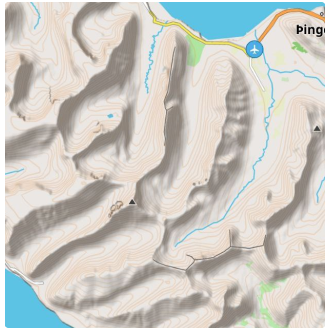
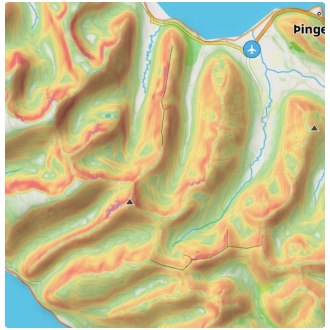
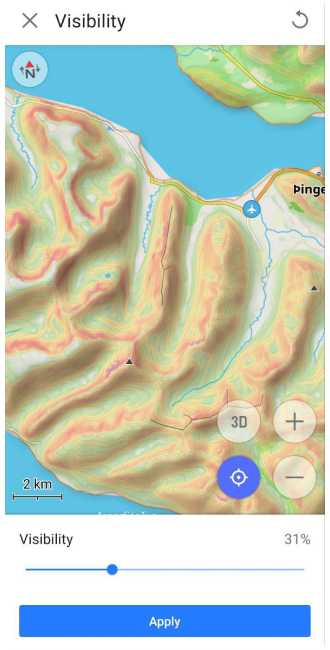
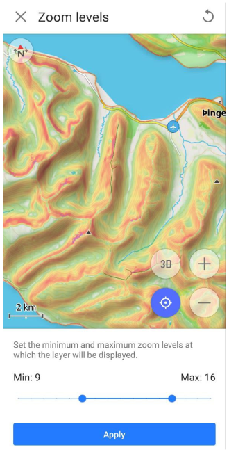

import Tabs from '@theme/Tabs';
import TabItem from '@theme/TabItem';
import AndroidStore from '@site/src/components/buttons/AndroidStore.mdx';
import AppleStore from '@site/src/components/buttons/AppleStore.mdx';
import LinksTelegram from '@site/src/components/_linksTelegram.mdx';
import LinksSocial from '@site/src/components/_linksSocialNetworks.mdx';
import Translate from '@site/src/components/Translate.js';
import InfoIncompleteArticle from '@site/src/components/_infoIncompleteArticle.mdx';
import ProFeature from '@site/src/components/buttons/ProFeature.mdx';
import InfoAndroidOnly from '@site/src/components/_infoAndroidOnly.mdx';

## Огляд {#overview}

:::tip Придбання
Плагін "Топографія" — це [платна функція](../purchases/index.md).  
:::

Топографія — це важлива функція картографії, яка надає інформацію для візуальної оцінки рельєфу місцевості.
Топографічна інформація, така як [лінії контуру](#contour-lines), [рельєф](#terrain) (*Відтінення пагорбів* та *Ухил*), а також [3D-рельєф](#3d-relief), допомагає візуально оцінити рельєф місцевості, бачачи висоту, рельєф, екстремуми, крутизну або точки однакової висоти.

Кожна функція, що надається цим плагіном, є незалежним шаром карти, який, коли увімкнено, може відображатися над або під основним джерелом карти залежно від [налаштувань](../map/raster-maps.md#overlay).  

Плагін "Топографія" надає доступ до наступних типів карт:  

- [Лінії контуру](#contour-lines). Це [векторна карта](../map/vector-maps.md), представлена в [**метрах** або **футах**](#contour-lines-meters-or-feet). Лінії контуру показують рівні висот і допомагають візуалізувати рельєф.
- [Відтінення пагорбів](#hillshade-slope-and-altitude-layers). Типи карт із затіненням пагорбів та схилів роблять рельєф більш видимим і допомагають візуально інтерпретувати місцевість.
- [Ухил](#hillshade-slope-and-altitude-layers). [Растровий](../map/raster-maps.md) шар, що надає інформацію про крутизну схилів, яка може бути важливою для планування маршруту та безпеки.
- [3D-рельєф](#3d-relief). Це [векторна карта](../map/vector-maps.md), яка забезпечує тривимірне представлення місцевості, доступне лише з [підпискою OsmAnd Pro](../purchases/index.md).

<Tabs groupId="operating-systems" queryString="current-os">

<TabItem value="android" label="Android">

| Лінії контуру | Відтінення пагорбів | Ухил |
|:---|:---|:---|
|  |  |  |

</TabItem>

<TabItem value="ios" label="iOS">

| Лінії контуру | Відтінення пагорбів | Ухил |
|:---|:---|:---|
|  |  |  |

</TabItem>

</Tabs>

### Ліцензія на дані DEM, що використовуються OsmAnd для визначення рельєфу {#license-for-dem-data-used-by-osmand-for-terrain-detection}

Дані про висоту на карті (між 70 градусами північної широти та 70 градусами південної широти) були отримані з вимірювань, зроблених у рамках *Shuttle Radar Topography Mission (SRTM)*. Вона використовувала *Advanced Spaceborne Thermal Emission and Reflection Radiometer (ASTER)*, основний інструмент для отримання зображень у *NASA's Earth Observation System*.  
Для отримання повної інформації дивіться [Ліцензію](https://github.com/osmandapp/OsmAnd/blob/master/LICENSE#L146).

DEM (DSM) data

   - <a href="https://www.eorc.jaxa.jp/ALOS/en/index_e.htm">ALOS DEM</a>. Оригінальні дані, використані для цього продукту, були надані JAXA AW3D. 
	- <a href="http://hydro.iis.u-tokyo.ac.jp/~yamadai/MERIT_DEM">MERIT DEM.</a> 
	- <a href="https://doi.org/10.7910/DVN/OHHUKH">ArcticDEM</a>: Porter, Claire; Morin, Paul; Howat, Ian; Noh, Myoung-Jon; Bates, Brian; Peterman, Kenneth; Keesey, Scott; Schlenk, Matthew; Gardiner, Judith; Tomko, Karen; Willis, Michael; Kelleher, Cole; Cloutier, Michael; Husby, Eric; Foga, Steven; Nakamura, Hitomi; Platson, Melisa; Wethington, Michael, Jr.; Williamson, Cathleen; Bauer, Gregory; Enos, Jeremy; Arnold, Galen; Kramer, William; Becker, Peter; Doshi, Abhijit; D’Souza, Cristelle; Cummins, Pat; Laurier, Fabien; Bojesen, Mikkel, 2018, “ArcticDEM”, Harvard Dataverse, V1. 
	- <a href="https://sonny.4lima.de">Sonny's LiDAR Digital Terrain Models of Europe</a> (DTM).

## Необхідні параметри налаштування {#required-setup-parameters}

Щоб відобразити дані **ліній контуру** та **рельєфу (відтінення пагорбів, ухил)** на карті:

1. **Придбання**: [План придбання OsmAnd+, OsmAnd Maps+ або OsmAnd Pro](../plugins/index.md#purchase)
2. [Увімкніть](../plugins/index.md#enable--disable) плагін "Топографія" у розділі "Плагіни" *Головного меню*.
3. [Завантажте](#download-maps): "Лінії контуру", "Відтінення пагорбів", "Ухил" або карти "Рельєф (3D)".
4. **Увімкніть та налаштуйте**: "Лінії контуру", "Відтінення пагорбів" або "Ухил" для перегляду карти.
5. Ви також можете переглянути [навчальне відео на YouTube](https://www.youtube.com/watch?v=z8kp_M3FKoc&feature=emb_logo&ab_channel=BartEisenberg).  

Щоб відобразити [**3D-рельєф**](#3d-relief), вам потрібно придбати план *OsmAnd Pro*, що включає доступ до плагіна "Топографія".

## Завантаження карт {#download-maps}

Щоб почати працювати з функціоналом плагіна, вам потрібно завантажити карти, які вас цікавлять. Деякі карти, наприклад, "Лінії контуру" для гірських регіонів, можуть бути досить великими, перевищуючи 2 ГБ, і можуть не підтримуватися на застарілих пристроях.

Для стабільної роботи та економії ресурсів ви можете завантажити карту не всієї країни, а її окремих регіонів, якщо такі регіони пропонуються в застосунку. Інформація про розмір кожного типу карти вказана під їх назвою.

### Карти 3D-рельєфу {#3d-relief-maps}

<Tabs groupId="operating-systems" queryString="current-os">

<TabItem value="android" label="Android">

Перейдіть до: *<Translate android="true" ids="shared_string_menu,maps_and_resources,regions"/>*

  

</TabItem>  

<TabItem value="ios" label="iOS">

Перейдіть до: *<Translate ios="true" ids="shared_string_menu,res_mapsres,res_worldwide"/>*

 

</TabItem>

</Tabs>

Вам потрібно завантажити карти **Рельєф (3D)** для відображення "Відтінення пагорбів", "Ухилу" та "3D-рельєфу". Після завантаження карт ви можете відобразити **Лінії контуру** та **Рельєф** за допомогою розділу [Налаштувати карту](../map/configure-map-menu.md) *Головного меню*.

Якщо карта, що відображається на екрані, не завантажена, то в *Меню → Налаштувати карту → розділ Топографія → Рельєф* внизу списку функцій буде відображено розділ *Завантажити карти* із запропонованими додатковими картами.

### Лінії контуру (метри або фути) {#contour-lines-meters-or-feet}

<Tabs groupId="operating-systems" queryString="current-os">

<TabItem value="android" label="Android">

</TabItem>

<TabItem value="ios" label="iOS">  

</TabItem>

</Tabs>  

Для [**ліній контуру**](#contour-lines) вам потрібно визначити, в яких [одиницях](../personal/profiles.md#units--formats) (метрах або футах) вони будуть відображатися на карті, і завантажити відповідну версію карти на ваш пристрій.

**Варіанти одиниць не є взаємозамінними**, тому якщо вам потрібно перейти з метрів на фути або навпаки, вам доведеться видалити попередню версію карти ліній контуру, щоб завантажити нову версію.

## Лінії контуру {#contour-lines}

:::tip Придбання
Лінії контуру — це [платна функція](../purchases/index.md).  
:::

<Tabs groupId="operating-systems" queryString="current-os">

<TabItem value="android" label="Android">

Перейдіть до: *<Translate android="true" ids="shared_string_menu,configure_map,srtm_plugin_name,download_srtm_maps"/>*

</TabItem>

<TabItem value="ios" label="iOS">

Перейдіть до: *<Translate ios="true" ids="shared_string_menu,configure_map,srtm_plugin_name"/> → Лінії контуру*

</TabItem>

</Tabs>  

[Лінії контуру](../map/vector-maps.md#-contour-lines) — це графічне представлення висот на карті, доступне у вигляді векторних карт. Вони утворюють лінії, що відповідають точкам з однаковою висотою, які формують контури, що дозволяють визначити, в якому напрямку і наскільки нахилена поверхня.

При використанні [рушія візуалізації карти](../personal/global-settings.md#map-rendering-engine):

- **Версія 2 (OpenGL)**. Лінії контуру підтримуються як у 3D-вигляді, так і в режимі 3D-рельєфу.
- **Версія 1**. Лінії контуру не підтримуються при використанні тайлових карт з Інтернету.

**Налаштування вигляду**:

- *<Translate android="true" ids="download_srtm_maps"/>*. Увімкнути або вимкнути лінії контуру.
- *<Translate android="true" ids="show_from_zoom_level"/>*. Визначте [рівні масштабування](../map/interact-with-map.md#my-position-and-zoom), на яких видно лінії контуру.
- *<Translate android="true" ids="srtm_color_scheme"/>*. Виберіть колір для відображення ліній контуру.
- *<Translate android="true" ids="rendering_attr_contourWidth_name"/>*. Налаштуйте ширину ліній контуру.
- *<Translate android="true" ids="rendering_attr_contourDensity_name"/>*. Виберіть щільність ліній контуру (Низька, Середня, Висока). Вища щільність може вплинути на швидкість завантаження.
- *<Translate android="true" ids="maps_and_resources"/>*. Переглядайте та завантажуйте карти ліній контуру для поточного регіону та прилеглих територій.

## Рельєф {#terrain}

:::tip Придбання
Рельєф — це [платна функція](../purchases/index.md).  
:::

<Tabs groupId="operating-systems" queryString="current-os">

<TabItem value="android" label="Android">

Перейдіть до: *<Translate android="true" ids="shared_string_menu,configure_map,srtm_plugin_name,shared_string_terrain"/>*

  

</TabItem>

<TabItem value="ios" label="iOS">  

Перейдіть до: *<Translate ios="true" ids="shared_string_menu,configure_map,srtm_plugin_name,shared_string_terrain"/>*

   

</TabItem>

</Tabs>  

Опція **Рельєф** вмикає та дозволяє налаштовувати три функції, такі як *Відтінення пагорбів*, *Ухил* та *Висота*. У iOS меню візуалізації також включає *Тіні рельєфу* — режим затінення рельєфу в реальному часі на основі 3D-рельєфу.  
Особливості:  

- Одночасно можна увімкнути лише одну опцію: "Відтінення пагорбів", "Ухил", "Висота" або "Тіні рельєфу".
- Якщо ви не бачите жодних змін після завантаження та увімкнення відповідної карти, рекомендується перезапустити застосунок.

Меню **Рельєф** включає вибір [колірної схеми](#default-color-scheme) (**візуалізація** на iOS) з можливістю її [зміни](#modify-color-scheme) (для [підписників Pro](../../user/purchases/index.md)), можливість змінювати прозорість шару на карті ([видимість](#visibility)) та вибирати [рівень масштабування](#zoom-levels) для його відображення, інформацію про розмір [кешованих даних](#cache-size) та список [карт](../../user/personal/maps-resources.md), необхідних для відображення шару.

## Шари відтінення пагорбів, ухилу та висоти {#hillshade-slope-and-altitude-layers}

| Відтінення пагорбів | Ухил | Висота |
| ------ | ------- | ------- |
|  |  |  |

**Відтінення пагорбів** базується на симуляції освітлення поверхні з використанням даних про рельєф. Цей метод передбачає створення тіней та відблисків на основі кута нахилу поверхні відносно джерела світла. В результаті ви бачите на карті природні пагорби, долини та інші деталі рельєфу.  

**Ухил** визначає кут нахилу поверхні на основі даних про висоту точок на карті. Розрахунки кута нахилу виконуються з урахуванням змін висоти та відстаней між точками, і представляють цю зміну як кут нахилу.  

**Висота** представляє висоту точок на карті відносно рівня моря. Це допомагає зрозуміти, як змінюється висота місцевості. Ця функція особливо корисна для таких видів діяльності, як піші прогулянки або катання на гірських велосипедах, де знання висоти може допомогти у плануванні маршрутів та управлінні фізичними навантаженнями. Дані про висоту отримуються з моделей висот і забезпечують чітке уявлення про високі та низькі точки, що полегшує оцінку складності маршруту або визначення вершин і долин на вашому шляху.

Растрові карти **Відтінення пагорбів**, **Ухил** та **Висота** створюються на основі растрових даних рельєфу, таких як цифрові моделі висот (DEM).

**Використання:**

- *Навігація.* Допомагає визначити круті схили, як спуски, так і підйоми, що може бути критично важливим для безпечної навігації.
- *Планування маршрутів.* Допомагає обирати найбільш підходящі маршрути, враховуючи рельєф.
- *Оцінка місцевості.* Зручно для візуалізації ландшафту, особливо якщо ви йдете пішки або їдете на велосипеді.

### Тіні рельєфу (iOS) {#terrain-shadows}

**Тіні рельєфу** забезпечують динамічне затінення в реальному часі на основі 3D-геометрії рельєфу. На відміну від растрових карт відтінення пагорбів, ефект затінення генерується безпосередньо на пристрої з використанням даних рельєфу та автоматично відповідає поточній перспективі карти.

Тіні рельєфу потребують 3D-рельєфу та автоматично вмикають його при виборі. Функція призначена для покращення читабельності рельєфу при низькому впливі на продуктивність.

### Колірна схема за замовчуванням {#default-color-scheme}

| Відтінення пагорбів | Ухил | Висота |
| ------ | ------- | ------- |
|||  |

- *Відтінення пагорбів* використовує темні відтінки для показу схилів, вершин та низин. Віртуальне Сонце має фіксований азимут (напрямок) 315 градусів.

- *Ухил* використовує колір для візуалізації крутизни місцевості. Ви можете прочитати більше про це [тут](https://en.wikipedia.org/wiki/Grade_(slope)). Кожен колір відповідає куту відхилення від горизонталі. Додаткова колірна схема *Ухилу*, ***Avalanche***, доступна в меню **Змінити**.

- *Висота*. Карта висот забарвлює кожен піксель відповідно до розрахованої висоти карти, використовуючи градієнт із визначеної колірної схеми. Зазвичай схеми висот дуже залежать від місцевості. У гірських районах ви б віддали перевагу розподілу кольорів на ширший діапазон висот, а на рівнинних ділянках ви б обрали колірну схему з невеликим діапазоном між мінімальною/максимальною висотою.

### Змінити колірну схему {#modify-color-scheme}

:::info Функція Pro
*[Змінити колірну схему](../../user/personal/color-palette-schemes.md#terrain)* — це платна функція [**OsmAnd Pro**](../purchases/index.md) <ProFeature />.
:::

<Tabs groupId="operating-systems" queryString="current-os">

<TabItem value="android" label="Android">

   

</TabItem>

<TabItem value="ios" label="iOS">  

   

</TabItem>

</Tabs>

Функція *Змінити колірну схему* дозволяє вибрати колірну схему:

- З [попередньо визначеного списку](#default-color-scheme).
- З файлів колірних палітр, які ви створили на своєму комп'ютері. Користувацькі файли можна додати до OsmAnd за допомогою інструменту [імпорту/експорту](../personal/import-export.md).
- З палітр, створених або відредагованих безпосередньо в застосунку.

Користувацькі палітри базуються на колірних шкалах, де кожен колір відповідає конкретному значенню даних рельєфу, такому як *Висота* або *Ухил*. 
Ви можете:

- визначати кроки значень (рівні висот або відсотки ухилу);
- призначати кольори кожному кроку;
- додавати або видаляти кроки для налаштування колірних шкал.

**Примітка:** Відтінення пагорбів використовує фіксований алгоритм затінення і не підтримує користувацькі колірні палітри.

Для розширеного налаштування палітр за допомогою файлів палітр дивіться статтю [Кольорові схеми](../personal/color-palette-schemes.md#palette-modify).

### Видимість {#visibility}

| Видимість 31% | Видимість 74% |
| ------ | ------- |
|  |  |

Функція *Видимість* використовується для регулювання прозорості тіней для Відтінення пагорбів та кольорів, що використовуються для представлення кута в параметрі Ухил. Для Тіней рельєфу видимість контролює силу ефекту затінення рельєфу.

### Рівні масштабування {#zoom-levels}

  

Функція *Рівні масштабування* дозволяє встановити мінімальне та максимальне значення рівнів масштабування карти, від 4 до 19, на яких відображатимуться шари карт Відтінення пагорбів або Ухил.

Рівні масштабування недоступні для Тіней рельєфу, оскільки ця візуалізація рендериться динамічно і не залежить від діапазонів видимості растрового шару.

### Розмір кешу {#cache-size}

**Розмір кешу** — це інформаційний розділ, який показує обсяг пам'яті на вашому пристрої, що зараз використовується для даних *Рельєфу*. Кожного разу, коли ви переглядаєте інформацію *Відтінення пагорбів* або *Ухил* на карті, всі ці дані тимчасово зберігаються в кеші для швидкого доступу та подальшого використання, уникаючи додаткового навантаження на процесор вашого пристрою.  

**Очищення кешу** іноді необхідне, щоб звільнити місце на пристрої або вирішити потенційні проблеми з продуктивністю. Щоб очистити кеш, потрібно перейти до *Системних налаштувань* пристрою, потім шлях може бути таким: *Програми → OsmAnd → Сховище → Очистити кеш*.

### Рушій візуалізації (Android) {#rendering-engine-android}

**Відтінення пагорбів** та **Ухил** відображаються та налаштовуються в будь-якому вибраному [рушії візуалізації карти](../personal/global-settings.md#map-rendering-engine).

1. Якщо ви використовуєте **Рушій візуалізації карти Версія 1**, вам потрібно використовувати звичайне [завантаження](../start-with/download-maps.md) растрових карт Відтінення пагорбів та Ухил.

2. Якщо ви використовуєте **Рушій візуалізації карти Версія 2 (OpenGL)**:
    - Ви можете продовжувати використовувати звичайний тип завантаження растрових карт Відтінення пагорбів та Ухил. Однак для цього вам потрібно активувати [плагін розробки OsmAnd](../plugins/development.md) та увімкнути налаштування [Використовувати растровий формат SQLite для відтінення пагорбів та ухилу](../plugins/development.md#terrain).

    - Або ви можете використовувати завантаження [Карти рельєфу (3D)](../personal/maps-resources.md#paid-map-content). Це заощаджує місце в пам'яті вашого пристрою, а ефекти Відтінення пагорбів, Ухилу та 3D-рельєфу будуть генеруватися з них за допомогою вашого пристрою.

### Швидкі дії {#quick-actions}

Ви можете використовувати кнопки *Швидка дія* на екрані карті для перемикання видимості шарів [Лінії контуру](#contour-lines), [Рельєф](#terrain) та [Кольорової схеми рельєфу](../../user/personal/color-palette-schemes.md#quick-actions). Залежно від шару, вибраного в меню Налаштувати карту, призначення дії *Рельєф* кнопці відображатиме *Відтінення пагорбів*, *Ухил* або *Висоту*.  

Основні налаштування для *Показати або приховати типи карт* знаходяться в розділі Топографія меню Налаштувати карту. У статті [Швидка дія](../widgets/quick-action.md#configure-map) ви можете знайти список шарів, доступних для відображення. Якщо вам потрібен швидкий доступ до цієї конфігурації карти, використовуйте інструмент *Користувацька кнопка*.

- Перейдіть до [Додати дію](../widgets/quick-action.md#custom-buttons): *Меню → Налаштувати екран → Користувацькі кнопки → Швидка дія → Додати дію → Налаштувати карту*.
- Додайте одну або кілька кнопок QA, щоб змінити видимість певного шару топографії.

## 3D-будівлі {#3d-buildings}

<Tabs groupId="operating-systems" queryString="current-os">

<TabItem value="android" label="Android">  

Перейдіть до: *<Translate android="true" ids="shared_string_menu,configure_map,srtm_plugin_name,enable_3d_objects"/>* 

 

</TabItem>

<TabItem value="ios" label="iOS">  

Перейдіть до: *<Translate ios="true" ids="shared_string_menu,configure_map,srtm_plugin_name,enable_3d_objects"/>*

 

</TabItem>

</Tabs>

Функція **3D-будівлі** відображає будівлі як об'ємні 3D-моделі замість плоских форм. Будівлі генеруються з даних [OpenStreetMap](https://wiki.openstreetmap.org/wiki/Simple_3D_Buildings), використовуючи інформацію про висоту з тегів, таких як `height` та `building:levels`, коли вони доступні. Якщо дані [OpenStreetMap](https://wiki.openstreetmap.org/wiki/Tag:tunnel%3Dbuilding_passage) включають проходи через будівлі, позначені тегом `tunnel=building_passage`, OsmAnd рендерить видимі отвори в 3D-моделі будівлі, щоб дороги або пішохідні шляхи, що проходять через будівлю, відображалися правильно. 

3D-будівлі показуються лише на вищих рівнях масштабування (вигляд міста/вулиці), де окремі будівлі можуть бути відображені. При масштабуванні та панорамуванні карти 3D-будівлі з'являються та зникають з плавною анімацією згасання. Коли POI або вибране місце (наприклад, мітка карти або пункт призначення навігації) знаходиться всередині будівлі, OsmAnd підсвічує відповідну будівлю, щоб полегшити її ідентифікацію на карті.

Використовуйте головний перемикач, щоб увімкнути або вимкнути 3D-рендеринг будівель. Коли увімкнено, налаштування також показує поточний [Рівень деталізації](#performance) (Низький або Високий) під головним перемикачем (*тільки Android*). Щоб переглянути будівлі в 3D, нахиліть карту, поклавши два пальці на екран і провівши вгору. У цьому режимі будівлі можуть частково закривати дороги або мітки карти залежно від налаштування видимості.

На Android ця опція доступна лише коли увімкнено плагін Топографія.  
Перейдіть до: *<Translate android="true" ids="shared_string_menu,plugin_settings,srtm_plugin_name"/>*

Налаштування 3D-будівель поділяються на дві групи: **Зовнішній вигляд** та **Продуктивність**.

### Зовнішній вигляд {#appearance}

<Tabs groupId="operating-systems" queryString="current-os">

<TabItem value="android" label="Android">  

</TabItem>

<TabItem value="ios" label="iOS">  

</TabItem>

</Tabs>

**<Translate android="true" ids="shared_string_appearance"/>** керує тим, як 3D-будівлі виглядають на карті. Він включає два налаштування: Колір та Видимість. 

**<Translate android="true" ids="shared_string_color"/>** дозволяє змінити колір будівлі. Коли ви натискаєте Колір, OsmAnd відкриває окремий екран попереднього перегляду, де ви можете бачити карту під час налаштування. На екрані попереднього перегляду відображається жива карта, тому ви можете одразу побачити, як вибраний колір впливає на будівлі.
- **Стиль карті** — використовує колір будівлі за замовчуванням з поточного вибраного стилю карти.
- **Користувацький** — дозволяє встановити користувацький колір будівлі окремо для режиму День / Ніч.

:::tip Придбання
Налаштування кольору 3D-будівель — це [платна функція](../purchases/index.md).  
:::

Якщо Користувацькі кольори не придбано, ви побачите порожній стан з коротким описом та кнопкою Отримати. Якщо Користувацький доступний, ви можете перемикатися між День і Ніч, вибрати колір з палітри (або відкрити Всі кольори), потім натиснути Застосувати.

**<Translate android="true" ids="gpx_visibility_txt"/>** керує непрозорістю (прозорістю) 3D-будівель. Використовуйте повзунок, щоб встановити видимість у відсотках. Повзунок дозволяє значення від 10% до 100%, за замовчуванням використовується 50%. Нижчі значення роблять будівлі більш прозорими та допомагають дорогам/міткам залишатися читабельними. Вищі значення роблять будівлі більш солідними та візуально домінуючими. Натискання Видимість також відкриває окремий екран попереднього перегляду з повзунком.

На екранах попереднього перегляду (Колір / Видимість) ви можете використовувати Скинути до стандартного з панелі додатка, щоб відновити стандартне значення.

### Продуктивність {#performance}

**<Translate android="true" ids="performance"/>** керує тим, як рендеряться 3D-будівлі. Він включає два налаштування: Рівень деталізації та Відстань перегляду.

**<Translate android="true" ids="level_of_details"/>** визначає складність геометрії 3D-будівлі:
- Низький (за замовчуванням) — простіша геометрія.
- Високий — детальніша геометрія. Анімація згасання для 3D-будівель доступна лише з цим налаштуванням.

**<Translate android="true" ids="view_distance"/>** керує тим, наскільки далеко від камери рендеряться 3D-будівлі:
- Близько (за замовчуванням) — рендерить будівлі ближче до вас.
- Далеко — рендерить будівлі з більшої відстані.

Обидві опції продуктивності використовують двопозиційний перемикач безпосередньо на екрані налаштувань 3D-будівель.

**Примітка:** Використання *Високої деталізації* та *Далекої відстані перегляду* покращує візуальний вигляд, але може вплинути на продуктивність та збільшити використання батареї.

<!--
### Сонце {#sun}

Налаштування **Сонце** керує напрямком освітлення, що використовується для рендерингу 3D-будівель. Воно впливає на те, як світло та тіні з'являються на будівлях у 3D-вигляді. Коли ви натискаєте Сонце, OsmAnd відкриває екран попереднього перегляду, де ви можете налаштувати освітлення за допомогою двох повзунків:

- Азимут — керує горизонтальним напрямком джерела світла (напрямок компаса сонця).
- Висота — керує висотою сонця над горизонтом.

Зміна цих параметрів змінює те, як тіні падають на будівлі, і може покращити візуальне сприйняття форм будівель у 3D-вигляді. Натисніть Застосувати, щоб підтвердити вибрані параметри освітлення.
-->

## 3D-рельєф {#3d-relief}

:::info Функція Pro
3D-рельєф — це платна функція [**OsmAnd Pro**](../purchases/index.md) <ProFeature />.
:::

<Tabs groupId="operating-systems" queryString="current-os">

<TabItem value="android" label="Android">

Перейдіть до: *<Translate android="true" ids="shared_string_menu,configure_map,srtm_plugin_name,relief_3d"/>*

</TabItem>

<TabItem value="ios" label="iOS">  

Перейдіть до: *<Translate ios="true" ids="shared_string_menu,configure_map,srtm_plugin_name,shared_string_terrain,shared_string_relief_3d"/>*

</TabItem>

</Tabs>  

Функція 3D-рельєф створює рельєфний рельєф і забезпечує тривимірне представлення ландшафту. 3D-рельєф працює офлайн і може використовуватися з [векторними картами OsmAnd](../map/vector-maps.md) або будь-якими [растровими картами](../map/raster-maps.md#layers) як [Джерело карти](../map/raster-maps.md#main) або як [Підкладка/Накладка](../map/raster-maps.md#overlay).

***Як відобразити 3D-рельєф на карті.***

- Придбайте підписку **OsmAnd Pro** для [iOS](../purchases/ios.md#pro-features) або [Android](../purchases/android.md#pro-features).

- Перейдіть до [*<Translate Android="true" ids="shared_string_menu,configure_map"/>*](../map/configure-map-menu.md):
    - **Android**: прокрутіть до розділу *<Translate android="true" ids="srtm_plugin_name"/> → <Translate android="true" ids="relief_3d"/>*.
    - **iOS**: прокрутіть до розділу *<Translate ios="true" ids="srtm_plugin_name"/> → <Translate ios="true" ids="shared_string_terrain,shared_string_relief_3d"/>*.

- Завантажте [Карту рельєфу (3D)](#3d-relief-maps) регіонів, якщо необхідно.

<Tabs groupId="operating-systems" queryString="current-os">

<TabItem value="android" label="Android">

| Шар векторної карти | Шар растрової карти |
| ------ | ------- |
|  |  |

</TabItem>  

<TabItem value="ios" label="iOS">

| Шар векторної карти | Шар растрової карти |
| ------ | ------- |
|   |  |

</TabItem>

</Tabs>

### Вертикальне перебільшення {#vertical-exaggeration}

<Tabs groupId="operating-systems" queryString="current-os">

<TabItem value="android" label="Android">

Перейдіть до: *<Translate android="true" ids="shared_string_menu,configure_map,srtm_plugin_name,relief_3d"/> → Vertical exaggeration*

</TabItem>  

<TabItem value="ios" label="iOS">

Перейдіть до: *<Translate ios="true" ids="shared_string_menu,configure_map,srtm_plugin_name,shared_string_terrain,shared_string_relief_3d"/> → Vertical exaggeration*

</TabItem>

</Tabs>

*Вертикальне перебільшення* — це спеціальний коефіцієнт для *3D-рельєфу*. Ви можете змінити масштаб (*Вертикальне перебільшення*) від x1 до x3. Ця функція дозволяє переглядати більш плавні контури рельєфу з підвищеною деталізацією.

### Відтінення пагорбів та 3D-рельєф {#hillshade-and-3d-relief}

| Відтінення пагорбів | 3D-рельєф |
|--------|---------|
|  |  |

**Відтінення пагорбів** — це тип карти, що відображає рельєф за допомогою тіней, створюючи візуальне представлення нахилу та форми земної поверхні.  
**3D-рельєф** — це функція, яка додає тривимірні ефекти до карті.  

Якщо ви **вимкнете** *Відтінення пагорбів* і **увімкнете** *3D-рельєф*, тіні рельєфу все одно будуть видимі, оскільки *Відтінення пагорбів* та *3D-рельєф* — це два різні способи візуалізації карти. *Відтінення пагорбів* створює тіні на основі рельєфу та додає їх до карти, тоді як *3D-рельєф* моделює 3D-елементи, щоб показати глибину та форму рельєфу, а тіні є частиною візуалізації. Ці функції можуть працювати паралельно, і вимкнення *Відтінення пагорбів* не впливає на відображення 3D-ефектів.  

Коли **Відтінення пагорбів** **увімкнено**, зображення з тінями рельєфу виглядає детальнішим, темнішим і більш ступінчастим, ніж зображення *3D-рельєфу*. Пояснення полягає в тому, що *Відтінення пагорбів* підкреслює градієнти та контрасти рельєфу, створюючи чіткіше та детальніше зображення. Функція *3D-рельєф* надає карті більш плавний та згладжений вигляд, пом'якшуючи рельєф і потенційно зменшуючи видимість деяких дрібніших деталей.

## Поєднання типів шарів {#combine-layer-types}

<Tabs groupId="operating-systems" queryString="current-os">

<TabItem value="android" label="Android">

 

</TabItem>  

<TabItem value="ios" label="iOS">

 

</TabItem>

</Tabs>

OsmAnd дозволяє поєднувати кілька типів шарів карти для більш наочної візуалізації.

- Поєднання **Ліній контуру** та **Відтінення пагорбів** оптимальне для візуальної та числової оцінки крутизни гірських схилів.
- Поєднання **Ліній контуру** та шарів **Ухил** найкраще підходить для оцінки крутизни схилів та пошуку точок з однаковою висотою.
- Поєднання шарів **3D-рельєф** та **Відтінення пагорбів** дозволяє отримати більш реалістичне та наочне представлення рельєфу, рельєфу та деталей ландшафту. Це поєднання особливо підходить для гірської та горбистої місцевості.

## Пов'язані статті {#related-articles}

- [Взаємодія з картою](../../user/map/interact-with-map.md)
- [Глобальні налаштування](../../user/personal/global-settings.md)
- [Векторні карти (стилі карт)](../../user/map/vector-maps.md)

### Поширені проблеми та рішення {#common-issues-and-solutions}

<!-- Troubleshooting Steps-->

1. Як відновити покупку плагіна Топографія (раніше Лінії контуру). [(перевірити)](../troubleshooting/purchases_payments.md#how-to-restore-the-topography-formerly-contour-lines-plugin-purchase).
2. Лінії контуру, дані висоти або 3D-рельєф не відображаються. [(перевірити)](../troubleshooting/maps-data#contour-lines-elevation-data-or-3d-relief-are-not-displayed)
3. Карта автоматично перемикається в 3D-режим під час навігації:  
    - Переконайтеся, що кнопка **3D-режим** вимкнена в **Меню → Налаштувати екран → Кнопки → Кнопки за замовчуванням**.  
    - Перевірте, чи ввімкнено будь-які функції Рельєфу в **Меню → Налаштувати карту → Топографія**, які можуть викликати 3D-ефект.
